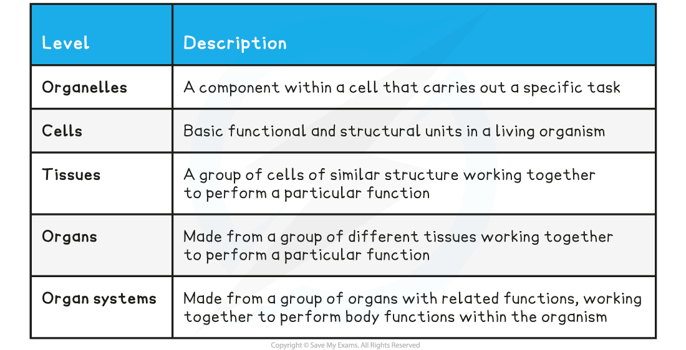

## Organisation of Cells

* Cell theory states that cells are the basic functional unit of all living organisms
* Cells can become **specialised** for **specific functions,**e.g.

  + Epithelial cells in the small intestine are specialised to absorb food efficiently
  + Red blood cells are specialised to transport oxygen
  + Xylem cells in plants are specialised to allow the transport of water around a plant
* In multicellular organisms specialised cells of the **same type** group **together** to form **tissues**

  + A tissue is **a group of cells that work together to perform a** **particular function**, e.g.

    - Epithelial cells group together to form epithelial tissue the function of which, in the small intestine, is to absorb food
    - Muscle cells group together to form muscle tissue, the function of which is to contract in order to move parts of the body
* Different tissues can **group together**to form **organs**

  + An organ is **a group of tissues working together to perform a particular function**, e.g.

    - Many different tissues, including cardiac muscle tissue, blood vessel tissues and connective tissue, group together to form the **heart**, enabling it to function to pump blood around the body
    - Tissues including palisade mesophyll, spongy mesophyll, and vascular tissue, group together in plants to form **leaves**, enabling them to perform photosynthesis effectively
* Different organs **work together** to form **organ systems**

  + An organ system is **a group of organs working together to perform a particular function**, e.g.

    - The heart and blood vessels work together to form the **circulatory system**, the job of which is to allow blood to circulate around the body
    - The stomach, pancreas, small intestine, and large intestine work together to form the **digestive system**, the job of which is to digest food and absorb nutrients

**Levels of Organisation Table**

**Examples of Specialised Cells and their Associated Tissues, Organs and Organ Systems Table**

