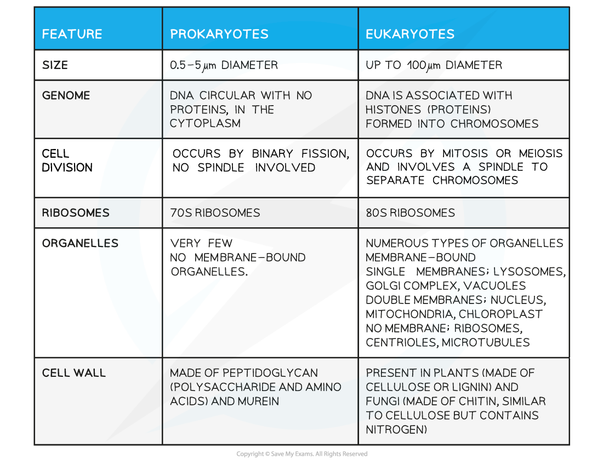

## Prokaryotic Cells: Structure

* Animal and plant cells are types of eukaryotic **cells**, whereas bacteria are a type of **prokaryote**
* Prokaryotic cells are much **smaller** than eukaryotic cells
* They also differ from eukaryotic cells in having

  + A **cytoplasm** that **lacks membrane-bound organelles**
  + **Ribosomes** that are smaller (70 S) than those found in eukaryotic cells (80 S)
  + **No nucleus,**instead having a **single circular bacterial chromosome** that is free in the cytoplasm and is **not associated with proteins**
  + A cell wall that contains the glycoprotein **murein**

    - Murein is sometimes known as **peptidoglycan**
* In addition, many prokaryotic cells also have the following structures

  + Loops of DNA known as**plasmids**
  + **Capsules**
  + Flagella (singular flagellum)
  + Pili (singular pilus)
  + A cell membrane that contains folds known as **mesosomes**

**Additional Prokaryotic Structures Table**

***Bacteria are prokaryotic cells***

#### Prokaryotes vs eukaryotes

* There are a number of important structural and physiological differences between prokaryotic and eukaryotic cells
* These differences affect their metabolic processes and how they reproduce

**Comparison of Prokaryotic and Eukaryotic Cells Table**

#### Examiner Tips and Tricks

You will need to know all the **differences** between prokaryotic and eukaryotic cells; remember that not all of the structures mentioned here are present in **all** prokaryotic cells

Remember that **size is not a structural feature** so if you are asked for a structural difference between a prokaryotic and eukaryotic cell don't include size in your answer.