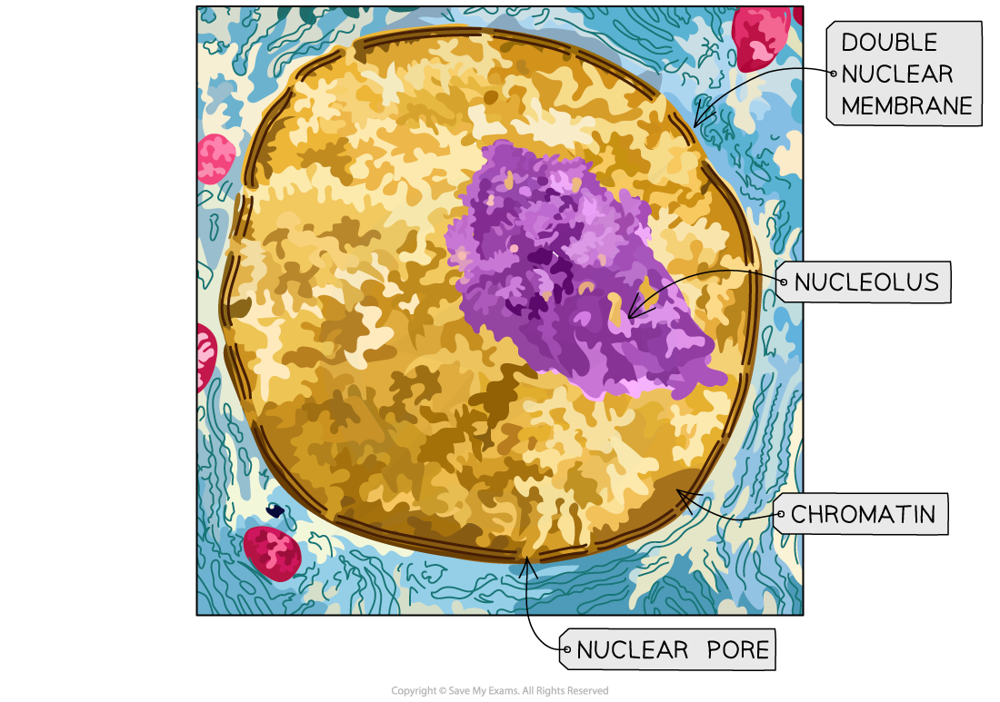
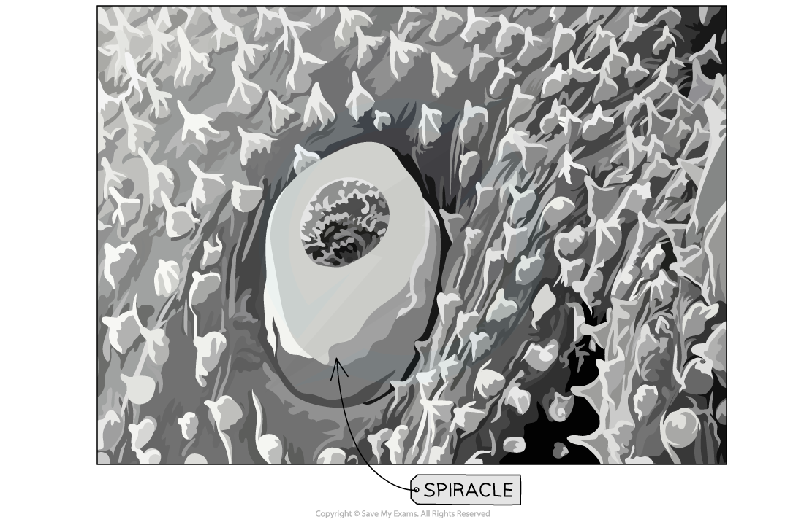
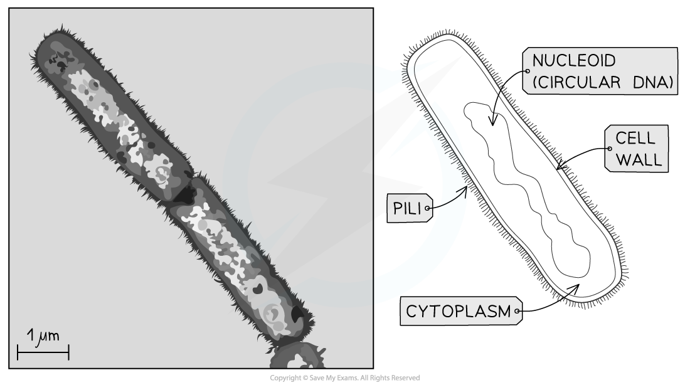
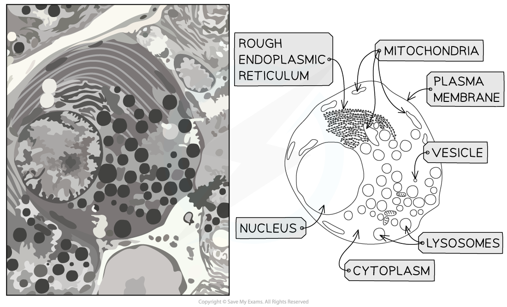

## Recognising Organelles from Electron Microscope Images

* Electron microscopes can produce highly detailed images of animal and plant cells
* This is because they have a higher **resolution**, or **resolving power**, than a light microscope

  + **Resolution** is the ability to distinguish between two separate points
  + If two separate points cannot be resolved they will be observed as one point, producing an unclear image
  + Magnification is limited by the resolution of a microscope; there is no point in magnifying an image many times if the resulting image is unclear
* The resolution of a light microscope is **limited by the wavelength of light**

  + The wavelength of light is too long to provide a high resolution
* **Electron microscopes** have a much higher resolution than a light microscope as electrons have a much smaller wavelength than visible light

  + This means that electron microscopes can distinguish between two separate points that are much closer together than the points that can be distinguished by a light microscope
* Electron microscopes are therefore capable of **higher magnification** before the image becomes unclear
* Some of the key cellular structures within animal and plant cells are visible within electron micrographs

  + Electron micrographs are the images produced by electron microscopes
* **Electron microscopes**, both scanning and transmission, are used for specimens **larger than 0.5 nm**

  + Electron microscopes fire a **beam of electrons** at or through a specimen
  + The electrons are picked up by an electromagnetic lens which then generates an image
  + Electron microscopes are useful for looking at **organelles, viruses,** and **DNA,**as well as looking at whole cells in more detail
  + Electron microscopy requires the specimen to be **dead** which can provide a **snapshot** in time of what is occurring in a cell, e.g. DNA can be seen replicating and chromosome position within the stages of mitosis are visible

**Electron Microscopes Compared with Light Microscopes Table**

#### Organelles under the electron microscope

* There are two types of electron microscope

  + **Transmission** electron microscopes (TEMs)
  + **Scanning** electron microscopes (SEMs)
* **Transmission Electron Microscopes**

  + TEMs use electromagnets to focus a **beam of electrons**
  + This beam of electrons is **transmitted through** a thin specimen
  + Denser parts of the specimen absorb more electrons
  + Denser parts appear darker on the final image, producing contrast between different parts of the object being observed
  + The **internal structures** within cells, or even within organelles, can be seen as an **2D image**
  + The resolution of these images are very high
* **Scanning Electron Microscopes**

  + SEMs scan a beam of electrons across the specimen
  + This beam **bounces off the surface of the specimen** and the electrons are detected, forming an image

    - This means SEMs can produce **3D images** that show the **surface** of specimens
    - Since they scan the outside surface it means that the specimens viewed does not have to be thin
  + The images they form are of a lower resolution than TEMs

***A stained TEM microscope of the nucleus. It is clear this is a TEM micrograph as the image is 2D and in high resolution***

***A stained TEM micrograph of a mitochondrion. It is clear this is a TEM micrograph as the image is 2D and in high resolution***

***A SEM of a spiracle (part of an insect). You can tell this is a SEM micrograph as the image is 3D***

***A TEM of a prokaryote cell and its associated drawing***

***A TEM of a eukaryotic cell and its associated drawing***

#### Examiner Tips and Tricks

You need to be able to recognise organelles from electron microscope images; cells in real life are not always as easy to observe as cells in diagrams, so be sure to get practice at looking at electron micrographs of cells

Generally, if you can see internal structures the image would have been taken with a TEM and if the image appears 3D then an SEM would have been used.