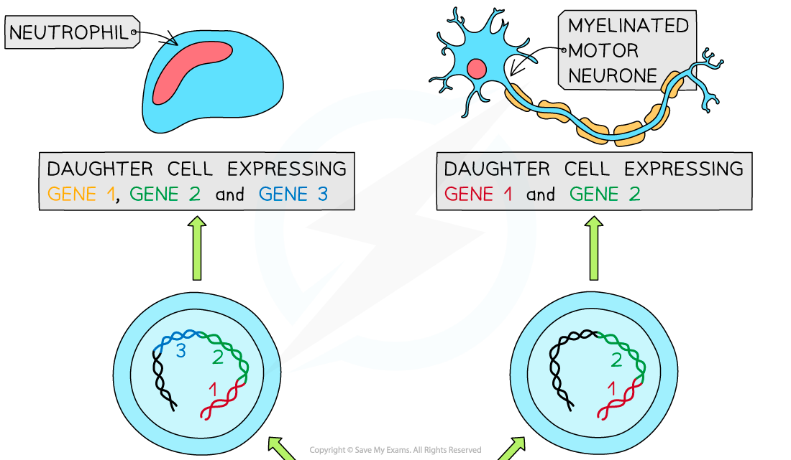

## Cell Differentiation

* **Stem cells** become **specialised** through **differential gene expression**

  + This means that only certain genes in the DNA of the stem cell are **activated** and get **expressed**
* Every nucleus within the stem cells of a multicellular organism contains the **same genes**, that is, all stem cells within an organism have an **identical genome**
* Despite the stem cells having the same genome, they are able to specialise into a diverse range of cell types because during **differentiation** certain genes are expressed (**'switched' on**)
* Controlling gene expression is the key to development as stem cells differentiate due to the different genes being expressed
* This differentiation occurs via the following basic steps:

  + Under certain conditions, some genes in a stem cell are **activated**, whilst others are **inactivated**
  + **mRNA** is **transcribed** from **active genes** only
  + This mRNA is then **translated** to form **proteins**
  + These proteins are responsible for **modifying the cell** (e.g. they help to determine the **structure** of the cell and the **processes** that occur within the cell)
  + As these proteins continue to modify the cell, the cell becomes **increasingly** **specialised**
  + The process of specialisation is **irreversible** (once differentiation has occurred, the cell remains in its specialised form)

***Differential gene expression results in the differentiation of stem cells***

#### Transcription factors control the expression of genes

* Eukaryotes use **transcription factors** to control gene expression
* A transcription factor is a **protein** that controls the transcription of genes by **binding to a specific region of DNA**
* They ensure that genes are being expressed in the correct cells, at the correct time and to the right level
* It is estimated that ~10% of human genes code for transcription factors

  + There are several types of transcription factors that have varying effects on gene expression
  + This is still a relatively young area of research and scientists are working hard to understand how all the different transcription factors function
  + Transcription factors allow organisms to respond to their environment
  + Some hormones achieve their effect via transcription factors
* Transcription factors that **increase** the rate of transcription are known as **activators**

  + Activators work by **helping RNA polymerase to bind** to the DNA at the start of a gene and to begin transcription of that gene
* Transcription factors that **decrease** the rate of transcription are known as **repressors**

  + Repressors work by **stopping RNA polymerase from binding** to the DNA at the start of a gene, inhibiting transcription of that gene
* Some transcription factors bind to the **promoter region** of a gene

  + This binding can either allow or prevent the transcription of the gene from taking place
  + Transcription factors interact with RNA polymerase, either by assisting RNA polymerase binding to the gene (to stimulate expression of the gene) or by preventing it from binding (to inhibit gene expression)
  + Therefore, the presence of a transcription factor will either **increase** or **decrease** the rate of transcription of a gene

***In the example above, the transcription factor is an activator as it stimulates the transcription of the gene. Transcription factors, known as repressors, can also inhibit the transcription of genes***

#### Operons

* In **prokaryotes**, control of gene expression often requires the binding of transcription factors to **operons**
* An operon is a section of DNA that includes:

  + A cluster of **structural genes** that are **transcribed together** (these code for **useful proteins** e.g. enzymes)
  + **Control elements**, including a **promoter** region (a DNA sequence that RNA polymerase initially binds to) and an **operator** region (where transcription factors bind)
  + Some operons may include **regulatory genes** that code for **activators** or **repressors**

#### The lac operon

* Structural genes in prokaryotes can form an operon: a group or a cluster of genes that are **controlled by the same promoter**
* The ***lac*** **operon** found in some bacteria is one of the most well-known of these
* The *lac* operon controls the production of the enzyme **lactase** (also called β-galactosidase) and two other structural proteins
* Lactase **breaks down** the substrate **lactose** so that it can be used as an **energy source** in the bacterial cell
* It is known as an inducible enzyme (this means it is only synthesized when lactose is present)
* This helps the bacteria avoid wasting energy and materials

#### Structure of the lac operon

* The components of the *lac* operon are found in the following order:

  + **Promoter** for structural genes
  + **Operator**
  + Structural gene ***lacZ*** that codes for lactase
  + Structural gene ***lacY*** that codes for permease (allows lactose into the cell)
  + Structural gene ***lacA*** that codes for transacetylase
* Located to the left (upstream) of the *lac* operon on the bacterium's DNA there is also the:

  + Promoter for regulatory gene
  + Regulatory gene ***lacI*** that codes for the ***lac*** **repressor protein**
* The *lac* repressor protein has **two binding sites** that allow it to bind to the **operator** in the lac operon and **also to lactose** (the effector molecule)

  + When it binds to the operator it **prevents the transcription of the structural genes as RNA polymerase cannot attach to the promoter**
  + When it binds to lactose the shape of the repressor protein **distorts** and the repressor protein can **no longer bind to the operator**

***The components of the lac operon along with the upstream regulatory gene and its associated promoter***

#### When lactose is absent

* The following processes take place when lactose is **absent** in the medium that the bacterium is growing in:

  + The **regulatory gene** is **transcribed** and **translated** to produce***lac*** **repressor protein**
  + The *lac* repressor protein **binds to the operator** region upstream of *lacZ*
  + Due to the presence of the repressor protein **RNA polymerase is unable to bind** to the promoter region
  + **Transcription** of the structural genes **does not take place**
  + **No lactase enzyme is synthesized**

***The repressor protein binds to the operator region of the lac operon and prevents transcription of the structural gene***

#### When lactose is present

* The following processes take place when lactose is **present** in the medium that the bacterium is growing in:

  + There is an **uptake of lactose** by the bacterium
  + The lactose **binds to the second binding site on the repressor protein**, distorting its shape so that the repressor protein **cannot bind to the operator** region
  + **RNA polymerase is then able to bind to the promoter** region and **transcription** takes place
  + The **mRNA** from all three structural genes is **translated**
  + The enzyme **lactase is produced** and lactose can be **broken down** and **used for energy** by the bacterium

***The binding of lactose to the repressor protein frees up the operator region of the lac operon so RNA polymerase can bind and begin transcription of the structural genes***