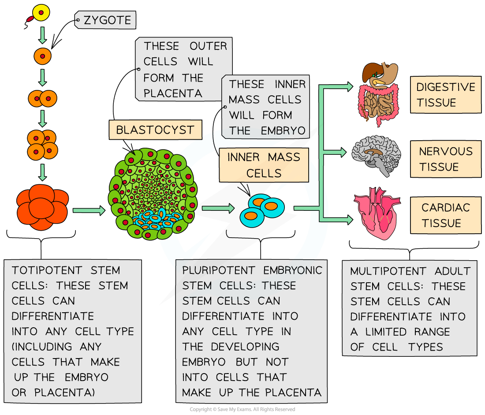

## Stem Cells

* A **stem cell** is a cell that can divide (by mitosis) an unlimited number of times
* Each new cell (produced when a stem cell divides) has the potential to remain a stem cell or to develop into a **specialised cell** such as a blood cell or a muscle cell (by a process known as **differentiation**)
* This ability of stem cells to differentiate into more specialised cell types is known as **potency**
* There are two main types of potency:

  + **Totipotency** – totipotent stem cells are stem cells that can differentiate into **any cell type found in an embryo**, as well as **extra-embryonic cells** (the cells that make up the **placenta** and **umbilical cord**). The **zygote** formed when a sperm cell fertilises an egg cell is totipotent, as are the embryonic cells **up to the 16-cell stage** of human embryo development
  + **Pluripotency** – pluripotent stem cells are embryonic stem cells that can differentiate into any cell type found in an embryo but are **not able** to differentiate into cells forming the placenta and umbilical cord
* Stem cells are also found in **some adult tissues** but they are **much less potent** than embryonic stem cells (i.e. they can only specialise into **certain types of cells**)

  + For example, intestinal stem cells specialise into intestinal epithelial cells to replace those that are constantly being lost
* This form of potency is known as **multipotency** – multipotent stem cells are adult stem cells that have lost some of the potency associated with embryonic stem cells and are **no longer pluripotent**
* Plants also contain stem cell in areas of growth, such as their shoots and roots

***Stem cells can be totipotent, pluripotent or multipotent***