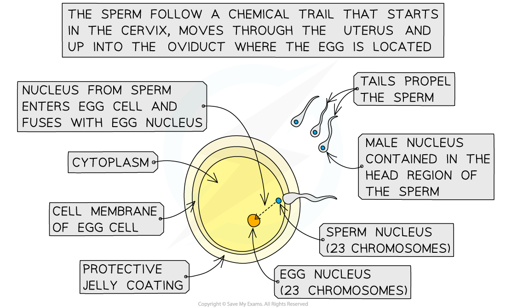

## Fertilisation in Mammals

* During sexual intercourse, semen is ejaculated high up into the **vagina** of the female, **near the cervix**
* The sperm cells then follow a **chemical trail released by the egg cell** and travel up through the cervix to reach the **uterus** (the womb)
* The sperm cells then travel into the **oviduct** containing the egg cell
* If a sperm cell meets the egg cell in the oviduct, **fertilisation can occur**

  + This is most likely to occur 1-2 days after the female has ovulated (i.e. released an egg cell from one of her ovaries into an oviduct)
* Fertilisation is the **fusion of the nuclei** from a **male gamete** (sperm cell) and a **female gamete** (egg cell)

  + During fertilisation, the head of a sperm cell releases **enzymes** that **digest** a path through the protective outer layer of the egg cell (the **zona pellucida**), allowing the sperm to pass through the egg cell membrane

    - This process is known as the **acrosome reaction**
  + Once this occurs, the egg cell immediately releases the contents of **vesicles** known as **cortical granules** into the space between the egg cell membrane and the zona pellucida
  + The chemicals contained within the cortical granules cause the **zona pellucida** to **rapidly thicken and harden**, preventing any more sperm cells from entering, **ensuring only one sperm cell can fertilise the egg cell**

    - This process is known as the **cortical reaction**
* The **nucleus** of the sperm cell then enters the egg and fuses with the nucleus of the egg cell
* When the male and female gamete nuclei fuse, they become a **zygote** (fertilised egg cell)
* This zygote contains the full 46 chromosomes (23 pairs of chromosomes), half of which came from the father and half from the mother
* The zygote divides by **mitosis** to form two new cells, which then continue to divide like this until an **embryo** is formed after a few days
* Cell division continues and eventually many of the new cells produced become **specialised** to perform particular functions and form all the body tissues of the offspring

***The process of fertilisation in mammals***