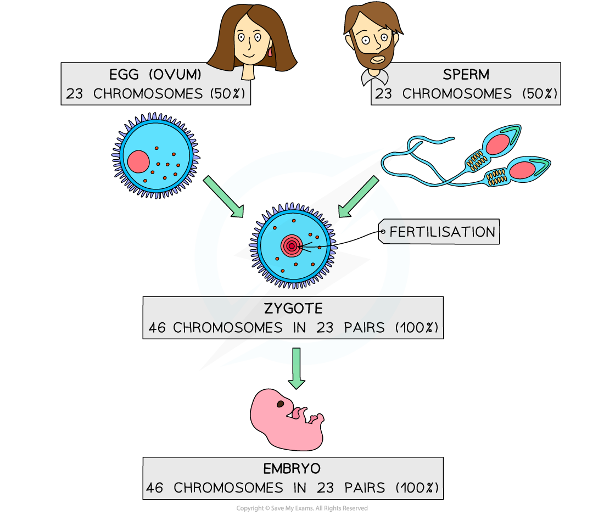
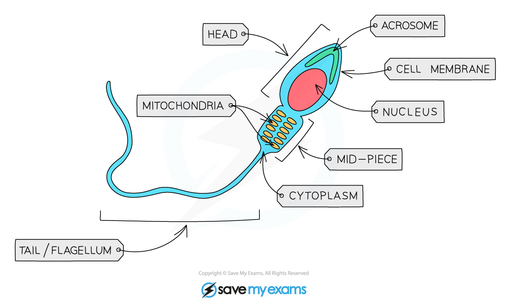

## Mammalian Gametes

#### Gametes

* Gametes are the **sex cells** of an organism

  + For example, the **sperm** and **egg** (ovum) cells in humans
* Gametes fuse during fertilisation to form a **zygote**

  + Fertilisation is the **fusion of the nuclei** from a **male gamete** (sperm cell) and a **female gamete** (egg cell)
* These sex cells are formed during **meiosis** and only have **one copy of each chromosome**, so they are **haploid** cells

  + For humans, that means the sperm and egg cells contain 23 single chromosomes in their nucleus

***Sexual reproduction involves the fusing of two gametes to form a zygote that contains DNA from both parents***

#### Mammalian gametes are specialised for their functions

* Mammalian gametes have **adaptations** to **increase the chances of fertilisation** and **successful development of an embryo**
* Sperm cells:

  + Have a **flagellum** (tail) that allows them to **swim** towards the egg cell
  + Contain **many mitochondria** that **provide energy for movement** of the flagellum (swimming)
  + An **acrosome** that contains **digestive enzymes** to break down the protective glycoprotein layer (a jelly-like coating known as the **zona pellucida**) surrounding the egg cell - sperm cells must penetrate this layer in order to fertilise the egg
* Egg cells:

  + Are **much larger** than sperm cells as most of their internal space contains **food to nourish a growing embryo**
  + Have follicle cells that form a protective coating
  + Have a jelly-like glycoprotein layer, known as the **zona pellucida**, that **forms an impenetrable barrier after fertilisation** by a sperm cell has occurred, to **prevent other sperm nuclei from entering the egg**
* These features are summarised in the diagrams and tables below

***Structure of a mammalian sperm cell***

***Structure of a mammalian egg cell***

**Adaptations of Mammalian Gametes Table**

