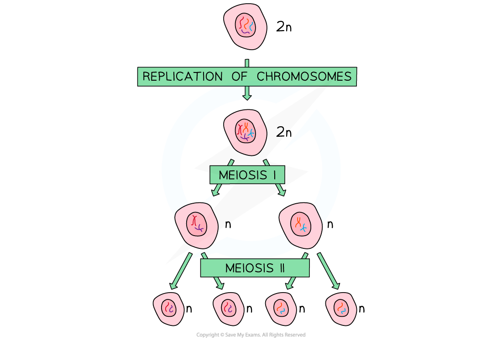
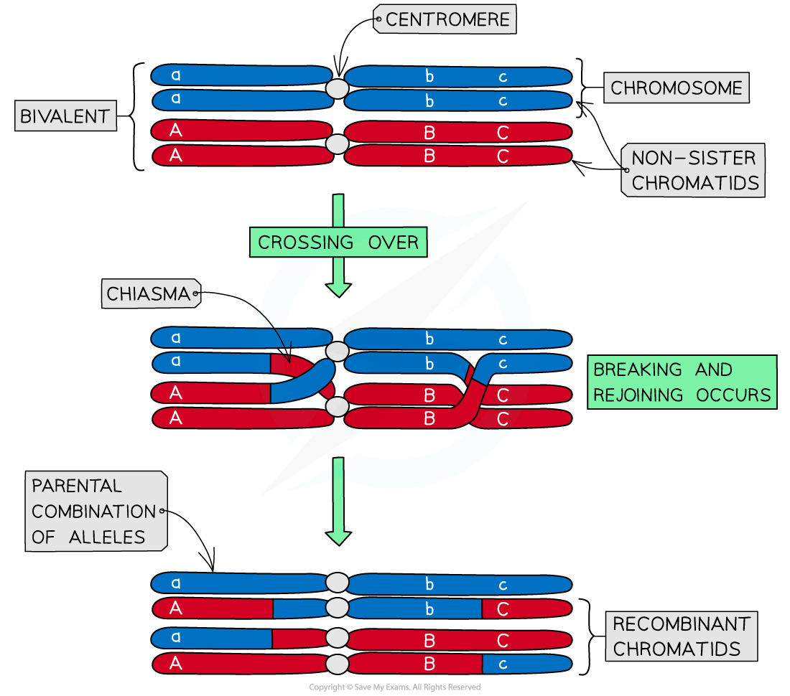
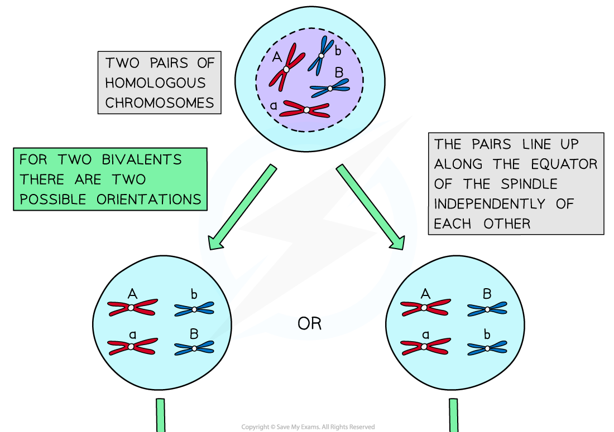
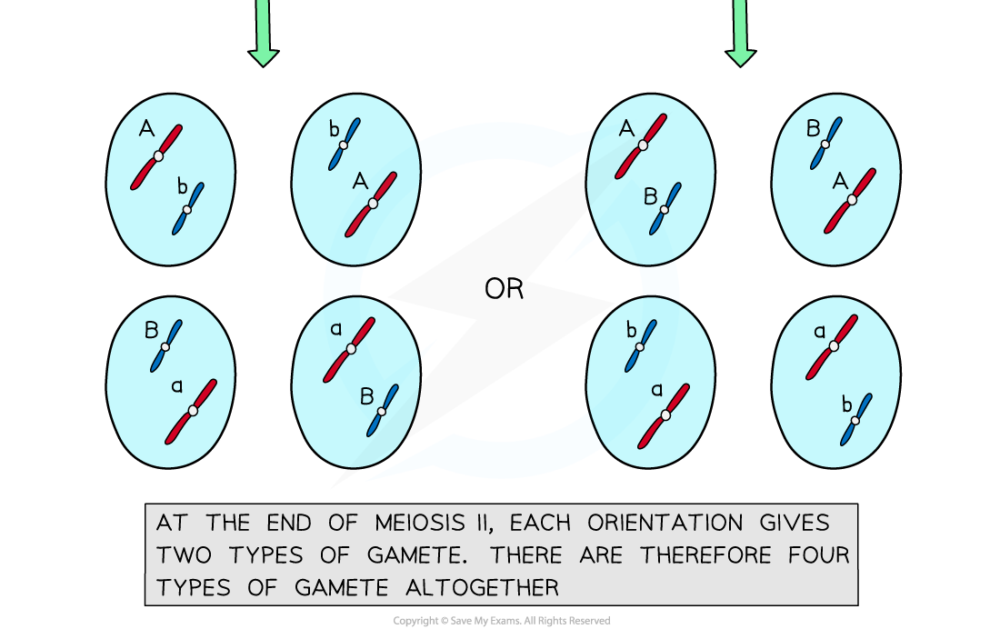

## Meiosis: Source of Genetic Variation

* Meiosis gives rise to cells that are **genetically different** from each other and is the type of cell division used to produce **gametes** (sex cells)
* During meiosis, the nucleus of the original 'parent' cell undergoes **two rounds of division**. These are:

  + **Meiosis I**
  + **Meiosis II**

**Meiosis I**

* The nucleus of the original 'parent' cell is **diploid** (2n) i.e. it contains **two sets of chromosomes**
* Before meiosis I, these chromosomes **replicate**
* During meiosis I, the homologous pairs of chromosomes are split up, to produce two **haploid** (n) nuclei

  + At this point, each chromosome still consists of **two chromatids**
* Note that the chromosome number halves (from 2n to n) in the **first division** of meiosis (**meiosis I**), not the second division (meiosis II)

#### Meiosis II

* During meiosis II, the chromatids that make up each chromosome separate to produce **four** **haploid** (n) nuclei

  + At this point, each chromosome now consists of a **single chromatid**

***During meiosis, one diploid nucleus divides by meiosis to produce four haploid nuclei***

* Having **genetically different offspring** can be **advantageous** for **natural selection**
* Meiosis has several mechanisms that **increase the genetic diversity of gametes** produced
* Both **crossing over** and **independent assortment** result in **different combinations of alleles** in gametes

#### Crossing over

* Crossing over is the process by which **non-sister chromatids exchange alleles**
* Process:

  + During **meiosis I** homologous chromosomes pair up and are in very close proximity to each other
  + The paired chromosomes are known as **bivalents**
  + The non-sister chromatids can **cross over** and get entangled
  + These crossing points are called **chiasmata**
  + The entanglement places stress on the DNA molecules
  + As a result of this, a section of chromatid from one chromosome may **break** and **rejoin** with the chromatid from the **other chromosome**
* This **swapping of alleles** is significant as it can result in a **new combination of alleles on the two chromosomes**
* There is usually at least one, if not more, chiasmata present in each **bivalent** during meiosis
* Crossing over is more likely to occur further down the chromosome away from the centromere

***Crossing over of non-sister chromatids leads to the exchange of genetic material***

#### Independent assortment

* Independent assortment is the production of **different combinations of alleles** in daughter cells due to the **random alignment of homologous pairs** along the equator of the spindle during **meiosis I**
* The different combinations of chromosomes in daughter cells increases genetic variation between gametes
* In meiosis I, homologous chromosomes pair up and are pulled towards the equator of the spindle

  + Each pair can be arranged with either chromosome on top, this is **completely random**
  + The orientation of one homologous pair is **independent/unaffected** by the orientation of any other pair
* The homologous chromosomes are then separated and pulled apart to different poles
* The combination of alleles that end up in each daughter cell depends on **how the pairs of homologous chromosomes were lined up**
* To work out the number of different possible chromosome combinations the formula 2n can be used, where n corresponds to the number of chromosomes in a haploid cell
* For humans, this is 223 which calculates as 8,324,608 different combinations

***Independent assortment of homologous chromosomes leads to different genetic combinations in daughter cells***

#### Examiner Tips and Tricks

Several sources of genetic variation have been outlined above. It is also worth remembering that genetic variation can occur on an even smaller scale than chromosomes. **Mutations** can occur within genes. A random mutation that takes place during DNA replication can lead to the production of new alleles and increased genetic variation.