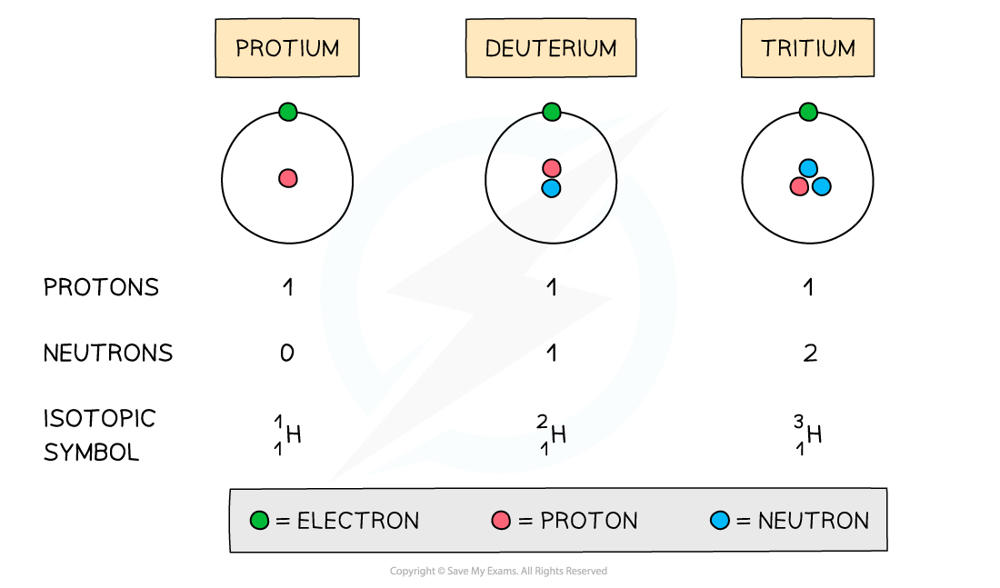

## Atomic Structure Calculations

* An atom is **neutral** and has no overall charge
* Ions on the other hand are formed when atoms either **gain** or **lose** electrons, causing them to become **charged**
* The number of **subatomic particles** in atoms and ions can be determined given their atomic (proton) number, mass (nucleon) number and charge

#### Properties

* Isotopes have **similar chemical properties**but **different physical properties**

#### Chemical properties

* Isotopes of the same element display the**same chemical characteristics**
* This is because they have the same number of electrons in their **outer** **shells**
* Electrons take part in **chemical reactions**and therefore determine the **chemistry**of an atom

#### Physical properties

* The only difference between isotopes is the number of **neutrons**
* Since these are neutral subatomic particles, they only add **mass** to the atom
* As a result of this, isotopes have different **physical properties**such as small differences in their **mass**, **density**, **melting point** and **boiling point**

  + For example samples of uranium hexafluoride gas, UF6, can undergo uranium enrichment by using a gas centrifuge cylinder
  + This is because nuclear reactors require higher amounts of the lighter U235 isotope
  + UF6 gas is placed in a gas centrifuge cylinder and rotated at a high speed
  + This rotation creates a strong centrifugal force so that the heavier gas molecules (UF6 containing the heavier U238 isotope) move towards the outside of the cylinder
  + The lighter gas molecules (containing the U235 isotope) collect closer to the centre

#### Protons

* The atomic number of an atom and ion determines which element it is
* Therefore, all atoms and ions of the **same element** have the same number of protons (atomic number) in the nucleus

  + E.g. lithium has an atomic number of 3 (three protons) whereas beryllium has atomic number of 4 (4 protons)
* The number of protons equals the **atomic (proton) number**
* The number of protons of an **unknown** element can be calculated by using its mass number and number of neutrons:

***Mass number = number of protons + number of neutrons***

***Number of protons = mass number - number of neutrons***

#### Worked Example

Determine the number of protons of the following ions and atoms:

1. Mg2+ ion
2. Carbon atom
3. An unknown atom of element X with mass number 63 and 34 neutrons

**Answers**

**Answer 1:** The atomic number of a magnesium atom is 12 indicating that the number of protons in the magnesium    element is 12

* Therefore the number of protons in a **Mg****2+** **ion** is also 12

**Answer 2:** The atomic number of a carbon atom is 6 indicating that a **carbon atom** has 6 protons in its nucleus

**Answer 3:** Use the formula to calculate the number of protons

***Number of protons = mass number - number of neutrons***

***Number of protons = 63 - 34***

***Number of protons = 29***

* **Element X** is therefore copper

#### Electrons

* An atom is **neutral** and therefore has the **same** number of **protons** and **electrons**
* Ions have a different number of electrons to their atomic number depending on their charge

  + A positively charged ion has **lost** electrons and therefore has **fewer** electrons than protons
  + A negatively charged ion has **gained** electrons and therefore has **more** electrons than protons

#### Worked Example

Determine the number of electrons of the following ions and atoms:

1. Mg2+ ion
2. Carbon atom
3. An unknown atom of element X with mass number 63 and 34 neutrons

**Answers**

**Answer 1:** The atomic number of a magnesium atom is 12 suggesting that the number of protons in the **neutral** magnesium **atom** is 12

* However, the 2+ charge in Mg2+ ion suggests it has **lost** two electrons

  + It only has 10 electrons left now

**Answer 2:** The atomic number of a carbon atom is 6 suggesting that the **neutral** carbon **atom** has 6 electrons orbiting    around the nucleus

**Answer 3:** The number of protons of element **X** can be calculated by:

***Number of protons = mass number - number of neutrons***

***Number of protons = 63 - 34***

***Number of protons = 29***

* The **neutral atom** of element **X**  therefore also has 29 electrons

#### Neutrons

* The **mass** and **atomic** **numbers** can be used to find the number of **neutrons** in **ions** and **atoms:**

***Number of neutrons = mass number (A) - number of protons (Z)***

#### Worked Example

Determine the number of neutrons of the following ions and atoms:

1. Mg2+ ion
2. Carbon atom
3. An unknown atom of element X with mass number 63 and 29 protons

**Answers**

**Answer 1:** The atomic number of a magnesium atom is 12 and its mass number is 24

***Number of neutrons = mass number (A) - number of protons (Z)***

***Number of neutrons = 24 - 12***

***Number of neutrons = 12***

* The **Mg****2+** **ion** has 12 neutrons in its nucleus

**Answer 2:** The atomic number of a carbon atom is 6 and its mass number is 12

***Number of neutrons = mass number (A) - number of protons (Z)***

***Number of neutrons = 12 - 6***

***Number of neutrons = 6***

* The **carbon atom** has 6 neutrons in its nucleus

**Answer 3:** The atomic number of an element **X** atom is 29 and its mass number is 63

***Number of neutrons = mass number (A) - number of protons (Z)***

***Number of neutrons = 63 - 29***

***Number of neutrons = 34***

* The **neutral atom** of element **X** has 34 neutrons in its nucleus

## Defining & Calculating Isotopes

* The symbol for an isotope is the **chemical** **symbol** (or **word**) followed by a **dash** and then the **mass** **number**

  + E.g. carbon-12 and carbon-14 are isotopes of carbon containing 6 and 8 neutrons respectively
* Isotopes are atoms of the **same** **element** that contain the same number of **protons** and electrons but a different number of **neutrons**

  + For example, three isotopes of hydrogen are protium, deuterium and tritium

***The atomic structure and symbols of the three isotopes of hydrogen***