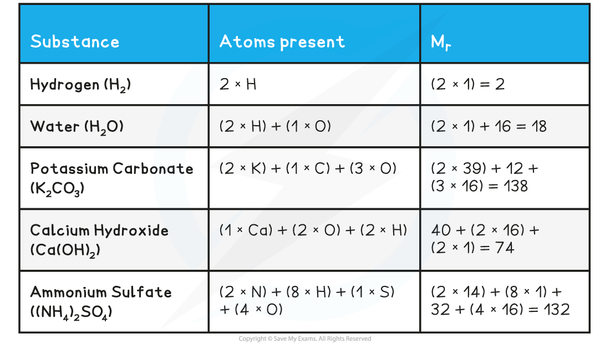

Isotopic & Atomic Mass
----------------------

* The relative mass of an atom uses the carbon-12 isotope as the international standard
* One atom of carbon-12 has an accepted mass of 1.992646538 x 10-26 kg
* It is not realistic to work with this value so the mass of a carbon-12 atom is fixed as exactly 12 atomic mass units / 12υ
* The standard mass for atomic mass is 1υ

  + Therefore, the standard mass for comparison is the mass of  of a carbon-12 atom

#### Relative isotopic mass

* Relative isotopic mass is defined as the mass of an isotope relative to  of a carbon-12 atom
* For A Level Chemistry it is common to work with mass values rounded to one decimal place, for example:
* The accurate relative isotopic mass of nitrogen is 14.00307401 but this is rounded to 14.0
* The accurate relative isotopic mass of oxygen is 15.99491464 but this is rounded to 16.0

#### Relative atomic mass

* Most elements on the Periodic Table represent a mixture of different isotopes, which is shown as their relative atomic mass (*A*r)
* The relative atomic mass is the weighted mean / average mass of an atom relative to  of the mass of a carbon-12 atom

Molecular & Formula Mass
------------------------

* We have seen previously that the symbol for the relative atomic mass is *A**r*
* This is calculated from the <b>mass number</b> and <b>relative abundances</b> of all the <b>isotopes</b> of a particular element
* The symbol for the <b>relative formula mass</b> is *<b>M</b>**<b>r</b>*<b> </b>and it refers to the<b> total mass</b> of the substance

  + The term relative formula mass should be used for compounds with giant structures e.g. ionic compounds such as sodium chloride
  + If the substance is molecular you can use the term <b>relative molecular mass</b>
* To calculate the *M**r* of a substance, you have to add up the <b>relative atomic masses</b> of all the atoms present in the formula

<b>Relative Formula Mass Calculations Table</b>

#### Examiner Tips and Tricks

It is expected that you will use relative atomic mass values from the Periodic Table

* This means that your values will be more accurate
* e.g. potassium carbonate = (2 x 39.1) + 12.0 + (3 x 16.0) = 138.2

If you are in any doubt whether to use relative molecular mass or relative formula mass, use the latter because it applies to all compounds whether they are ionic or covalent.