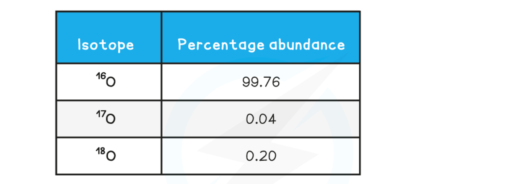
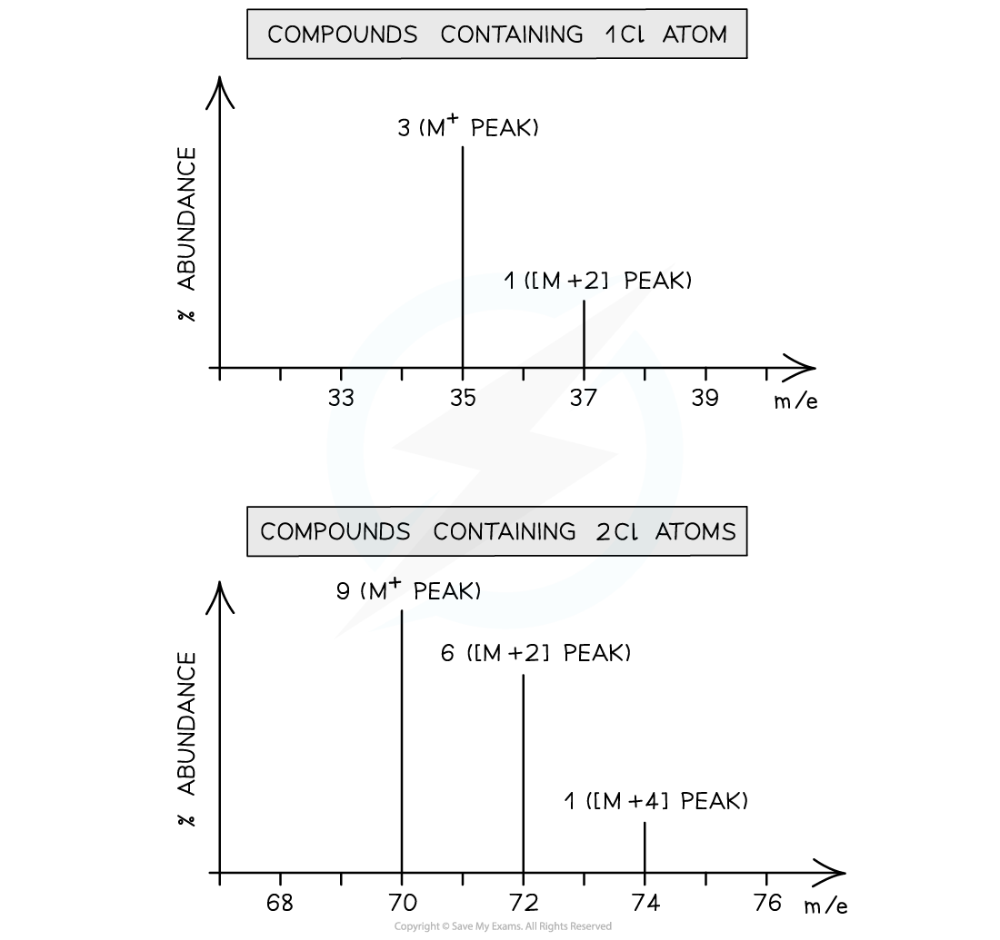
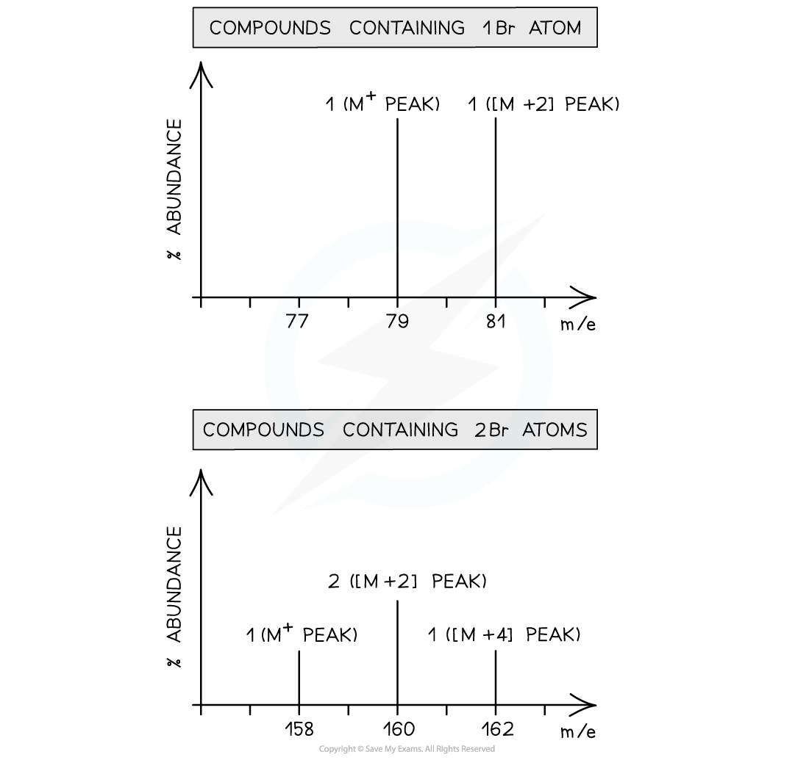

Interpreting Mass Spectra
-------------------------

* Isotopes are different atoms of the same element that contain the same number of protons and electrons but a different number of neutrons

  + These are atoms of the same elements but with different mass numbers
* Therefore, the mass of an element is given as relative atomic mass (Ar) by using the average mass of the isotopes

  + The relative atomic mass of an element can be calculated by using the relative abundance values

Ar = ![fraction numerator open parentheses r e l a t i v e space a b u n d a n c e subscript i s o t o p e space 1 end subscript space cross times m a s s subscript i s o t o p e space 1 end subscript close parentheses space plus open parentheses r e l a t i v e space a b u n d a n c e subscript i s o t o p e space 2 end subscript space cross times m a s s subscript i s o t o p e space 2 end subscript close parentheses space e t c over denominator 100 end fraction](data:image/svg+xml;charset=utf8,%3Csvg%20xmlns%3D%22http%3A%2F%2Fwww.w3.org%2F2000%2Fsvg%22%20xmlns%3Awrs%3D%22http%3A%2F%2Fwww.wiris.com%2Fxml%2Fmathml-extension%22%20height%3D%2253%22%20width%3D%22674%22%20wrs%3Abaseline%3D%2236%22%3E%3C!--MathML%3A%20%3Cmath%20xmlns%3D%22http%3A%2F%2Fwww.w3.org%2F1998%2FMath%2FMathML%22%3E%3Cmfrac%3E%3Cmrow%3E%3Cmfenced%3E%3Cmrow%3E%3Cmi%3Er%3C%2Fmi%3E%3Cmi%3Ee%3C%2Fmi%3E%3Cmi%3El%3C%2Fmi%3E%3Cmi%3Ea%3C%2Fmi%3E%3Cmi%3Et%3C%2Fmi%3E%3Cmi%3Ei%3C%2Fmi%3E%3Cmi%3Ev%3C%2Fmi%3E%3Cmi%3Ee%3C%2Fmi%3E%3Cmo%3E%26%23xA0%3B%3C%2Fmo%3E%3Cmi%3Ea%3C%2Fmi%3E%3Cmi%3Eb%3C%2Fmi%3E%3Cmi%3Eu%3C%2Fmi%3E%3Cmi%3En%3C%2Fmi%3E%3Cmi%3Ed%3C%2Fmi%3E%3Cmi%3Ea%3C%2Fmi%3E%3Cmi%3En%3C%2Fmi%3E%3Cmi%3Ec%3C%2Fmi%3E%3Cmsub%3E%3Cmi%3Ee%3C%2Fmi%3E%3Cmrow%3E%3Cmi%3Ei%3C%2Fmi%3E%3Cmi%3Es%3C%2Fmi%3E%3Cmi%3Eo%3C%2Fmi%3E%3Cmi%3Et%3C%2Fmi%3E%3Cmi%3Eo%3C%2Fmi%3E%3Cmi%3Ep%3C%2Fmi%3E%3Cmi%3Ee%3C%2Fmi%3E%3Cmo%3E%26%23xA0%3B%3C%2Fmo%3E%3Cmn%3E1%3C%2Fmn%3E%3C%2Fmrow%3E%3C%2Fmsub%3E%3Cmo%3E%26%23xA0%3B%3C%2Fmo%3E%3Cmo%3E%26%23xD7%3B%3C%2Fmo%3E%3Cmi%3Em%3C%2Fmi%3E%3Cmi%3Ea%3C%2Fmi%3E%3Cmi%3Es%3C%2Fmi%3E%3Cmsub%3E%3Cmi%3Es%3C%2Fmi%3E%3Cmrow%3E%3Cmi%3Ei%3C%2Fmi%3E%3Cmi%3Es%3C%2Fmi%3E%3Cmi%3Eo%3C%2Fmi%3E%3Cmi%3Et%3C%2Fmi%3E%3Cmi%3Eo%3C%2Fmi%3E%3Cmi%3Ep%3C%2Fmi%3E%3Cmi%3Ee%3C%2Fmi%3E%3Cmo%3E%26%23xA0%3B%3C%2Fmo%3E%3Cmn%3E1%3C%2Fmn%3E%3C%2Fmrow%3E%3C%2Fmsub%3E%3C%2Fmrow%3E%3C%2Fmfenced%3E%3Cmo%3E%26%23xA0%3B%3C%2Fmo%3E%3Cmo%3E%2B%3C%2Fmo%3E%3Cmfenced%3E%3Cmrow%3E%3Cmi%3Er%3C%2Fmi%3E%3Cmi%3Ee%3C%2Fmi%3E%3Cmi%3El%3C%2Fmi%3E%3Cmi%3Ea%3C%2Fmi%3E%3Cmi%3Et%3C%2Fmi%3E%3Cmi%3Ei%3C%2Fmi%3E%3Cmi%3Ev%3C%2Fmi%3E%3Cmi%3Ee%3C%2Fmi%3E%3Cmo%3E%26%23xA0%3B%3C%2Fmo%3E%3Cmi%3Ea%3C%2Fmi%3E%3Cmi%3Eb%3C%2Fmi%3E%3Cmi%3Eu%3C%2Fmi%3E%3Cmi%3En%3C%2Fmi%3E%3Cmi%3Ed%3C%2Fmi%3E%3Cmi%3Ea%3C%2Fmi%3E%3Cmi%3En%3C%2Fmi%3E%3Cmi%3Ec%3C%2Fmi%3E%3Cmsub%3E%3Cmi%3Ee%3C%2Fmi%3E%3Cmrow%3E%3Cmi%3Ei%3C%2Fmi%3E%3Cmi%3Es%3C%2Fmi%3E%3Cmi%3Eo%3C%2Fmi%3E%3Cmi%3Et%3C%2Fmi%3E%3Cmi%3Eo%3C%2Fmi%3E%3Cmi%3Ep%3C%2Fmi%3E%3Cmi%3Ee%3C%2Fmi%3E%3Cmo%3E%26%23xA0%3B%3C%2Fmo%3E%3Cmn%3E2%3C%2Fmn%3E%3C%2Fmrow%3E%3C%2Fmsub%3E%3Cmo%3E%26%23xA0%3B%3C%2Fmo%3E%3Cmo%3E%26%23xD7%3B%3C%2Fmo%3E%3Cmi%3Em%3C%2Fmi%3E%3Cmi%3Ea%3C%2Fmi%3E%3Cmi%3Es%3C%2Fmi%3E%3Cmsub%3E%3Cmi%3Es%3C%2Fmi%3E%3Cmrow%3E%3Cmi%3Ei%3C%2Fmi%3E%3Cmi%3Es%3C%2Fmi%3E%3Cmi%3Eo%3C%2Fmi%3E%3Cmi%3Et%3C%2Fmi%3E%3Cmi%3Eo%3C%2Fmi%3E%3Cmi%3Ep%3C%2Fmi%3E%3Cmi%3Ee%3C%2Fmi%3E%3Cmo%3E%26%23xA0%3B%3C%2Fmo%3E%3Cmn%3E2%3C%2Fmn%3E%3C%2Fmrow%3E%3C%2Fmsub%3E%3C%2Fmrow%3E%3C%2Fmfenced%3E%3Cmo%3E%26%23xA0%3B%3C%2Fmo%3E%3Cmi%3Ee%3C%2Fmi%3E%3Cmi%3Et%3C%2Fmi%3E%3Cmi%3Ec%3C%2Fmi%3E%3C%2Fmrow%3E%3Cmn%3E100%3C%2Fmn%3E%3C%2Fmfrac%3E%3C%2Fmath%3E--%3E%3Cdefs%3E%3Cstyle%20type%3D%22text%2Fcss%22%3E%40font-face%7Bfont-family%3A'math18b36de76996a9c7d682490ecc5'%3Bsrc%3Aurl(data%3Afont%2Ftruetype%3Bcharset%3Dutf-8%3Bbase64%2CAAEAAAAMAIAAAwBAT1MvMi7iBBMAAADMAAAATmNtYXDEvmKUAAABHAAAADxjdnQgDVUNBwAAAVgAAAA6Z2x5ZoPi2VsAAAGUAAABEGhlYWQQC2qxAAACpAAAADZoaGVhCGsXSAAAAtwAAAAkaG10eE2rRkcAAAMAAAAADGxvY2EAHTwYAAADDAAAABBtYXhwBT0FPgAAAxwAAAAgbmFtZaBxlY4AAAM8AAABn3Bvc3QB9wD6AAAE3AAAACBwcmVwa1uragAABPwAAAAUAAADSwGQAAUAAAQABAAAAAAABAAEAAAAAAAAAQEAAAAAAAAAAAAAAAAAAAAAAAAAAAAAAAAAAAAAACAgICAAAAAg1UADev96AAAD6ACWAAAAAAACAAEAAQAAABQAAwABAAAAFAAEACgAAAAGAAQAAQACACsA1%2F%2F%2FAAAAKwDX%2F%2F%2F%2F1v8rAAEAAAAAAAAAAAFUAywAgAEAAFYAKgJYAh4BDgEsAiwAWgGAAoAAoADUAIAAAAAAAAAAKwBVAIAAqwDVAQABKwAHAAAAAgBVAAADAAOrAAMABwAAMxEhESUhESFVAqv9qwIA%2FgADq%2FxVVQMAAAEAgABVAtUCqwALAEkBGLIMAQEUExCxAAP2sQEE9bAKPLEDBfWwCDyxBQT1sAY8sQ0D5gCxAAATELEBBuSxAQETELAFPLEDBOWxCwX1sAc8sQkE5TEwEyERMxEhFSERIxEhgAEAVQEA%2FwBV%2FwABqwEA%2FwBW%2FwABAAACAIAAVQLVAoAAAwAHAEYYsAEUALEAABMQsQAJ5LEAARMQsAQ8sQYI9LACPDABsQgBExCxAAP2sAc8sQEF9bAGPLIFBwAQ9LACPLEJA%2BaxBAX1sAM8EzMBIxEzASOAVQIAVVX%2BAFUCgP3VAiv91QABAAAAAQAA1XjOQV8PPPUAAwQA%2F%2F%2F%2F%2F9Y6E3P%2F%2F%2F%2F%2F1joTcwAA%2FyAEgAOrAAAACgACAAEAAAAAAAEAAAPo%2F2oAABdwAAD%2FtgSAAAEAAAAAAAAAAAAAAAAAAAADA1IAVQNWAIADVgCAAAAAAAAAACgAAAChAAABEAABAAAAAwBeAAUAAAAAAAIAgAQAAAAAAAQAAN4AAAAAAAAAFQECAAAAAAAAAAEAEgAAAAAAAAAAAAIADgASAAAAAAAAAAMAMAAgAAAAAAAAAAQAEgBQAAAAAAAAAAUAFgBiAAAAAAAAAAYACQB4AAAAAAAAAAgAHACBAAEAAAAAAAEAEgAAAAEAAAAAAAIADgASAAEAAAAAAAMAMAAgAAEAAAAAAAQAEgBQAAEAAAAAAAUAFgBiAAEAAAAAAAYACQB4AAEAAAAAAAgAHACBAAMAAQQJAAEAEgAAAAMAAQQJAAIADgASAAMAAQQJAAMAMAAgAAMAAQQJAAQAEgBQAAMAAQQJAAUAFgBiAAMAAQQJAAYACQB4AAMAAQQJAAgAHACBAE0AYQB0AGgAIABGAG8AbgB0AFIAZQBnAHUAbABhAHIATQBhAHQAaABzACAARgBvAHIAIABNAG8AcgBlACAATQBhAHQAaAAgAEYAbwBuAHQATQBhAHQAaAAgAEYAbwBuAHQAVgBlAHIAcwBpAG8AbgAgADEALgAwTWF0aF9Gb250AE0AYQB0AGgAcwAgAEYAbwByACAATQBvAHIAZQAAAwAAAAAAAAH0APoAAAAAAAAAAAAAAAAAAAAAAAAAALkHEQAAjYUYALIAAAAVFBOxAAE%2F)format('truetype')%3Bfont-weight%3Anormal%3Bfont-style%3Anormal%3B%7D%40font-face%7Bfont-family%3A'round_brackets22549f92a457f2409'%3Bsrc%3Aurl(data%3Afont%2Ftruetype%3Bcharset%3Dutf-8%3Bbase64%2CAAEAAAAMAIAAAwBAT1MvMjxkLiAAAADMAAAATmNtYXDf7xCrAAABHAAAADxjdnQgBAkDLgAAAVgAAAASZ2x5Zr5a4R4AAAFsAAABKWhlYWQO9ymoAAACmAAAADZoaGVhDVUVZQAAAtAAAAAkaG10eCFnAAIAAAL0AAAADGxvY2EAAARdAAADAAAAABBtYXhwBIgEWQAAAxAAAAAgbmFtZXHO2TgAAAMwAAACOXBvc3QEagIzAAAFbAAAACBwcmVwupWEAAAABYwAAAAHAAAGrgGQAAUAAAgACAAAAAAACAAIAAAAAAAAAQIAAAAAAAAAAAAAAAAAAAAAAAAAAAAAAAAAAAAAACAgICAAAAAo8AMGe%2F57AAAIzgIPAAAAAAACAAEAAQAAABQAAwABAAAAFAAEACgAAAAGAAQAAQACACgAKf%2F%2FAAAAKAAp%2F%2F%2F%2F2f%2FZAAEAAAAAAAAAAAFUAFYBAAAsAKgDgAAyAAcAAAACAAAAKgDVA1UAAwAHAAA1MxEjEyMRM9XVq4CAKgMr%2FQAC1QABAAD%2BYAJQCGAACQBNGAGwChCwA9SwAxCwAtSwChCwBdSwBRCwANSwAxCwBzywAhCwCDwAsAoQsAPUsAMQsAfUsAoQsAXUsAoQsADUsAMQsAI8sAcQsAg8MTATAgEzABMQASMABAQBwJD%2BPAQBwJD%2BRANg%2FHD%2BkAFwA5ADoAFg%2FqAAAQAA%2FmACUAhgAAkATRgBsAoQsAPUsAMQsALUsAoQsAXUsAUQsADUsAMQsAc8sAIQsAg8ALAKELAD1LADELAH1LAKELAF1LAKELAA1LADELACPLAHELAIPDEwARIBIwADEAEzAAJMBP5AkAHEBP5AkAG8A2D8cP6QAXADkAOgAWD%2BoAAAAAABAAAAAQAALiwXwl8PPPUAAwgA%2F%2F%2F%2F%2F9Wt7vT%2F%2F%2F%2F%2F1a3u9AAA%2FmAEhAhgAAAACgACAAEAAAAAAAEAAAjO%2FfEAABdwAAD%2F%2FgSEAAEAAAAAAAAAAAAAAAAAAAADANUAAAJQAAACUAAAAAAAAAAAACQAAACmAAABKQABAAAAAwAKAAIAAAAAAAIAgAQAAAAAAAQAAE0AAAAAAAAAFQECAAAAAAAAAAEAPgAAAAAAAAAAAAIADgA%2BAAAAAAAAAAMAXABMAAAAAAAAAAQAPgCoAAAAAAAAAAUAFgDmAAAAAAAAAAYAHwD8AAAAAAAAAAgAHAEbAAEAAAAAAAEAPgAAAAEAAAAAAAIADgA%2BAAEAAAAAAAMAXABMAAEAAAAAAAQAPgCoAAEAAAAAAAUAFgDmAAEAAAAAAAYAHwD8AAEAAAAAAAgAHAEbAAMAAQQJAAEAPgAAAAMAAQQJAAIADgA%2BAAMAAQQJAAMAXABMAAMAAQQJAAQAPgCoAAMAAQQJAAUAFgDmAAMAAQQJAAYAHwD8AAMAAQQJAAgAHAEbAFIAbwB1AG4AZAAgAGIAcgBhAGMAawBlAHQAcwAgAHcAaQB0AGgAIABhAHMAYwBlAG4AdAAgADIAMgA1ADQAUgBlAGcAdQBsAGEAcgBNAGEAdABoAHMAIABGAG8AcgAgAE0AbwByAGUAIABSAG8AdQBuAGQAIABiAHIAYQBjAGsAZQB0AHMAIAB3AGkAdABoACAAYQBzAGMAZQBuAHQAIAAyADIANQA0AFIAbwB1AG4AZAAgAGIAcgBhAGMAawBlAHQAcwAgAHcAaQB0AGgAIABhAHMAYwBlAG4AdAAgADIAMgA1ADQAVgBlAHIAcwBpAG8AbgAgADIALgAwUm91bmRfYnJhY2tldHNfd2l0aF9hc2NlbnRfMjI1NABNAGEAdABoAHMAIABGAG8AcgAgAE0AbwByAGUAAAAAAwAAAAAAAARnAjMAAAAAAAAAAAAAAAAAAAAAAAAAALkH%2FwABjYUA)format('truetype')%3Bfont-weight%3Anormal%3Bfont-style%3Anormal%3B%7D%3C%2Fstyle%3E%3C%2Fdefs%3E%3Cline%20stroke%3D%22%23000%22%20stroke-linecap%3D%22square%22%20stroke-width%3D%221%22%20x1%3D%222.5%22%20x2%3D%22670.5%22%20y1%3D%2229.5%22%20y2%3D%2229.5%22%2F%3E%3Ctext%20font-family%3D%22round_brackets22549f92a457f2409%22%20font-size%3D%2218%22%20text-anchor%3D%22middle%22%20x%3D%227.5%22%20y%3D%2221%22%3E(%3C%2Ftext%3E%3Ctext%20font-family%3D%22round_brackets22549f92a457f2409%22%20font-size%3D%2218%22%20text-anchor%3D%22middle%22%20x%3D%22309.5%22%20y%3D%2221%22%3E)%3C%2Ftext%3E%3Ctext%20font-family%3D%22Times%20New%20Roman%22%20font-size%3D%2218%22%20font-style%3D%22italic%22%20text-anchor%3D%22middle%22%20x%3D%2213.5%22%20y%3D%2216%22%3Er%3C%2Ftext%3E%3Ctext%20font-family%3D%22Times%20New%20Roman%22%20font-size%3D%2218%22%20font-style%3D%22italic%22%20text-anchor%3D%22middle%22%20x%3D%2220.5%22%20y%3D%2216%22%3Ee%3C%2Ftext%3E%3Ctext%20font-family%3D%22Times%20New%20Roman%22%20font-size%3D%2218%22%20font-style%3D%22italic%22%20text-anchor%3D%22middle%22%20x%3D%2226.5%22%20y%3D%2216%22%3El%3C%2Ftext%3E%3Ctext%20font-family%3D%22Times%20New%20Roman%22%20font-size%3D%2218%22%20font-style%3D%22italic%22%20text-anchor%3D%22middle%22%20x%3D%2233.5%22%20y%3D%2216%22%3Ea%3C%2Ftext%3E%3Ctext%20font-family%3D%22Times%20New%20Roman%22%20font-size%3D%2218%22%20font-style%3D%22italic%22%20text-anchor%3D%22middle%22%20x%3D%2239.5%22%20y%3D%2216%22%3Et%3C%2Ftext%3E%3Ctext%20font-family%3D%22Times%20New%20Roman%22%20font-size%3D%2218%22%20font-style%3D%22italic%22%20text-anchor%3D%22middle%22%20x%3D%2244.5%22%20y%3D%2216%22%3Ei%3C%2Ftext%3E%3Ctext%20font-family%3D%22Times%20New%20Roman%22%20font-size%3D%2218%22%20font-style%3D%22italic%22%20text-anchor%3D%22middle%22%20x%3D%2251.5%22%20y%3D%2216%22%3Ev%3C%2Ftext%3E%3Ctext%20font-family%3D%22Times%20New%20Roman%22%20font-size%3D%2218%22%20font-style%3D%22italic%22%20text-anchor%3D%22middle%22%20x%3D%2260.5%22%20y%3D%2216%22%3Ee%3C%2Ftext%3E%3Ctext%20font-family%3D%22Times%20New%20Roman%22%20font-size%3D%2218%22%20font-style%3D%22italic%22%20text-anchor%3D%22middle%22%20x%3D%2273.5%22%20y%3D%2216%22%3Ea%3C%2Ftext%3E%3Ctext%20font-family%3D%22Times%20New%20Roman%22%20font-size%3D%2218%22%20font-style%3D%22italic%22%20text-anchor%3D%22middle%22%20x%3D%2281.5%22%20y%3D%2216%22%3Eb%3C%2Ftext%3E%3Ctext%20font-family%3D%22Times%20New%20Roman%22%20font-size%3D%2218%22%20font-style%3D%22italic%22%20text-anchor%3D%22middle%22%20x%3D%2290.5%22%20y%3D%2216%22%3Eu%3C%2Ftext%3E%3Ctext%20font-family%3D%22Times%20New%20Roman%22%20font-size%3D%2218%22%20font-style%3D%22italic%22%20text-anchor%3D%22middle%22%20x%3D%2299.5%22%20y%3D%2216%22%3En%3C%2Ftext%3E%3Ctext%20font-family%3D%22Times%20New%20Roman%22%20font-size%3D%2218%22%20font-style%3D%22italic%22%20text-anchor%3D%22middle%22%20x%3D%22108.5%22%20y%3D%2216%22%3Ed%3C%2Ftext%3E%3Ctext%20font-family%3D%22Times%20New%20Roman%22%20font-size%3D%2218%22%20font-style%3D%22italic%22%20text-anchor%3D%22middle%22%20x%3D%22117.5%22%20y%3D%2216%22%3Ea%3C%2Ftext%3E%3Ctext%20font-family%3D%22Times%20New%20Roman%22%20font-size%3D%2218%22%20font-style%3D%22italic%22%20text-anchor%3D%22middle%22%20x%3D%22125.5%22%20y%3D%2216%22%3En%3C%2Ftext%3E%3Ctext%20font-family%3D%22Times%20New%20Roman%22%20font-size%3D%2218%22%20font-style%3D%22italic%22%20text-anchor%3D%22middle%22%20x%3D%22134.5%22%20y%3D%2216%22%3Ec%3C%2Ftext%3E%3Ctext%20font-family%3D%22Times%20New%20Roman%22%20font-size%3D%2218%22%20font-style%3D%22italic%22%20text-anchor%3D%22middle%22%20x%3D%22142.5%22%20y%3D%2216%22%3Ee%3C%2Ftext%3E%3Ctext%20font-family%3D%22Times%20New%20Roman%22%20font-size%3D%2213%22%20font-style%3D%22italic%22%20text-anchor%3D%22middle%22%20x%3D%22149.5%22%20y%3D%2224%22%3Ei%3C%2Ftext%3E%3Ctext%20font-family%3D%22Times%20New%20Roman%22%20font-size%3D%2213%22%20font-style%3D%22italic%22%20text-anchor%3D%22middle%22%20x%3D%22153.5%22%20y%3D%2224%22%3Es%3C%2Ftext%3E%3Ctext%20font-family%3D%22Times%20New%20Roman%22%20font-size%3D%2213%22%20font-style%3D%22italic%22%20text-anchor%3D%22middle%22%20x%3D%22159.5%22%20y%3D%2224%22%3Eo%3C%2Ftext%3E%3Ctext%20font-family%3D%22Times%20New%20Roman%22%20font-size%3D%2213%22%20font-style%3D%22italic%22%20text-anchor%3D%22middle%22%20x%3D%22165.5%22%20y%3D%2224%22%3Et%3C%2Ftext%3E%3Ctext%20font-family%3D%22Times%20New%20Roman%22%20font-size%3D%2213%22%20font-style%3D%22italic%22%20text-anchor%3D%22middle%22%20x%3D%22170.5%22%20y%3D%2224%22%3Eo%3C%2Ftext%3E%3Ctext%20font-family%3D%22Times%20New%20Roman%22%20font-size%3D%2213%22%20font-style%3D%22italic%22%20text-anchor%3D%22middle%22%20x%3D%22177.5%22%20y%3D%2224%22%3Ep%3C%2Ftext%3E%3Ctext%20font-family%3D%22Times%20New%20Roman%22%20font-size%3D%2213%22%20font-style%3D%22italic%22%20text-anchor%3D%22middle%22%20x%3D%22184.5%22%20y%3D%2224%22%3Ee%3C%2Ftext%3E%3Ctext%20font-family%3D%22Times%20New%20Roman%22%20font-size%3D%2213%22%20text-anchor%3D%22middle%22%20x%3D%22194.5%22%20y%3D%2224%22%3E1%3C%2Ftext%3E%3Ctext%20font-family%3D%22math18b36de76996a9c7d682490ecc5%22%20font-size%3D%2216%22%20text-anchor%3D%22middle%22%20x%3D%22210.5%22%20y%3D%2216%22%3E%26%23xD7%3B%3C%2Ftext%3E%3Ctext%20font-family%3D%22Times%20New%20Roman%22%20font-size%3D%2218%22%20font-style%3D%22italic%22%20text-anchor%3D%22middle%22%20x%3D%22226.5%22%20y%3D%2216%22%3Em%3C%2Ftext%3E%3Ctext%20font-family%3D%22Times%20New%20Roman%22%20font-size%3D%2218%22%20font-style%3D%22italic%22%20text-anchor%3D%22middle%22%20x%3D%22237.5%22%20y%3D%2216%22%3Ea%3C%2Ftext%3E%3Ctext%20font-family%3D%22Times%20New%20Roman%22%20font-size%3D%2218%22%20font-style%3D%22italic%22%20text-anchor%3D%22middle%22%20x%3D%22244.5%22%20y%3D%2216%22%3Es%3C%2Ftext%3E%3Ctext%20font-family%3D%22Times%20New%20Roman%22%20font-size%3D%2218%22%20font-style%3D%22italic%22%20text-anchor%3D%22middle%22%20x%3D%22251.5%22%20y%3D%2216%22%3Es%3C%2Ftext%3E%3Ctext%20font-family%3D%22Times%20New%20Roman%22%20font-size%3D%2213%22%20font-style%3D%22italic%22%20text-anchor%3D%22middle%22%20x%3D%22258.5%22%20y%3D%2224%22%3Ei%3C%2Ftext%3E%3Ctext%20font-family%3D%22Times%20New%20Roman%22%20font-size%3D%2213%22%20font-style%3D%22italic%22%20text-anchor%3D%22middle%22%20x%3D%22262.5%22%20y%3D%2224%22%3Es%3C%2Ftext%3E%3Ctext%20font-family%3D%22Times%20New%20Roman%22%20font-size%3D%2213%22%20font-style%3D%22italic%22%20text-anchor%3D%22middle%22%20x%3D%22268.5%22%20y%3D%2224%22%3Eo%3C%2Ftext%3E%3Ctext%20font-family%3D%22Times%20New%20Roman%22%20font-size%3D%2213%22%20font-style%3D%22italic%22%20text-anchor%3D%22middle%22%20x%3D%22274.5%22%20y%3D%2224%22%3Et%3C%2Ftext%3E%3Ctext%20font-family%3D%22Times%20New%20Roman%22%20font-size%3D%2213%22%20font-style%3D%22italic%22%20text-anchor%3D%22middle%22%20x%3D%22279.5%22%20y%3D%2224%22%3Eo%3C%2Ftext%3E%3Ctext%20font-family%3D%22Times%20New%20Roman%22%20font-size%3D%2213%22%20font-style%3D%22italic%22%20text-anchor%3D%22middle%22%20x%3D%22286.5%22%20y%3D%2224%22%3Ep%3C%2Ftext%3E%3Ctext%20font-family%3D%22Times%20New%20Roman%22%20font-size%3D%2213%22%20font-style%3D%22italic%22%20text-anchor%3D%22middle%22%20x%3D%22293.5%22%20y%3D%2224%22%3Ee%3C%2Ftext%3E%3Ctext%20font-family%3D%22Times%20New%20Roman%22%20font-size%3D%2213%22%20text-anchor%3D%22middle%22%20x%3D%22303.5%22%20y%3D%2224%22%3E1%3C%2Ftext%3E%3Ctext%20font-family%3D%22math18b36de76996a9c7d682490ecc5%22%20font-size%3D%2216%22%20text-anchor%3D%22middle%22%20x%3D%22325.5%22%20y%3D%2216%22%3E%2B%3C%2Ftext%3E%3Ctext%20font-family%3D%22round_brackets22549f92a457f2409%22%20font-size%3D%2218%22%20text-anchor%3D%22middle%22%20x%3D%22337.5%22%20y%3D%2221%22%3E(%3C%2Ftext%3E%3Ctext%20font-family%3D%22round_brackets22549f92a457f2409%22%20font-size%3D%2218%22%20text-anchor%3D%22middle%22%20x%3D%22639.5%22%20y%3D%2221%22%3E)%3C%2Ftext%3E%3Ctext%20font-family%3D%22Times%20New%20Roman%22%20font-size%3D%2218%22%20font-style%3D%22italic%22%20text-anchor%3D%22middle%22%20x%3D%22343.5%22%20y%3D%2216%22%3Er%3C%2Ftext%3E%3Ctext%20font-family%3D%22Times%20New%20Roman%22%20font-size%3D%2218%22%20font-style%3D%22italic%22%20text-anchor%3D%22middle%22%20x%3D%22350.5%22%20y%3D%2216%22%3Ee%3C%2Ftext%3E%3Ctext%20font-family%3D%22Times%20New%20Roman%22%20font-size%3D%2218%22%20font-style%3D%22italic%22%20text-anchor%3D%22middle%22%20x%3D%22356.5%22%20y%3D%2216%22%3El%3C%2Ftext%3E%3Ctext%20font-family%3D%22Times%20New%20Roman%22%20font-size%3D%2218%22%20font-style%3D%22italic%22%20text-anchor%3D%22middle%22%20x%3D%22363.5%22%20y%3D%2216%22%3Ea%3C%2Ftext%3E%3Ctext%20font-family%3D%22Times%20New%20Roman%22%20font-size%3D%2218%22%20font-style%3D%22italic%22%20text-anchor%3D%22middle%22%20x%3D%22369.5%22%20y%3D%2216%22%3Et%3C%2Ftext%3E%3Ctext%20font-family%3D%22Times%20New%20Roman%22%20font-size%3D%2218%22%20font-style%3D%22italic%22%20text-anchor%3D%22middle%22%20x%3D%22374.5%22%20y%3D%2216%22%3Ei%3C%2Ftext%3E%3Ctext%20font-family%3D%22Times%20New%20Roman%22%20font-size%3D%2218%22%20font-style%3D%22italic%22%20text-anchor%3D%22middle%22%20x%3D%22381.5%22%20y%3D%2216%22%3Ev%3C%2Ftext%3E%3Ctext%20font-family%3D%22Times%20New%20Roman%22%20font-size%3D%2218%22%20font-style%3D%22italic%22%20text-anchor%3D%22middle%22%20x%3D%22390.5%22%20y%3D%2216%22%3Ee%3C%2Ftext%3E%3Ctext%20font-family%3D%22Times%20New%20Roman%22%20font-size%3D%2218%22%20font-style%3D%22italic%22%20text-anchor%3D%22middle%22%20x%3D%22403.5%22%20y%3D%2216%22%3Ea%3C%2Ftext%3E%3Ctext%20font-family%3D%22Times%20New%20Roman%22%20font-size%3D%2218%22%20font-style%3D%22italic%22%20text-anchor%3D%22middle%22%20x%3D%22411.5%22%20y%3D%2216%22%3Eb%3C%2Ftext%3E%3Ctext%20font-family%3D%22Times%20New%20Roman%22%20font-size%3D%2218%22%20font-style%3D%22italic%22%20text-anchor%3D%22middle%22%20x%3D%22420.5%22%20y%3D%2216%22%3Eu%3C%2Ftext%3E%3Ctext%20font-family%3D%22Times%20New%20Roman%22%20font-size%3D%2218%22%20font-style%3D%22italic%22%20text-anchor%3D%22middle%22%20x%3D%22429.5%22%20y%3D%2216%22%3En%3C%2Ftext%3E%3Ctext%20font-family%3D%22Times%20New%20Roman%22%20font-size%3D%2218%22%20font-style%3D%22italic%22%20text-anchor%3D%22middle%22%20x%3D%22438.5%22%20y%3D%2216%22%3Ed%3C%2Ftext%3E%3Ctext%20font-family%3D%22Times%20New%20Roman%22%20font-size%3D%2218%22%20font-style%3D%22italic%22%20text-anchor%3D%22middle%22%20x%3D%22447.5%22%20y%3D%2216%22%3Ea%3C%2Ftext%3E%3Ctext%20font-family%3D%22Times%20New%20Roman%22%20font-size%3D%2218%22%20font-style%3D%22italic%22%20text-anchor%3D%22middle%22%20x%3D%22455.5%22%20y%3D%2216%22%3En%3C%2Ftext%3E%3Ctext%20font-family%3D%22Times%20New%20Roman%22%20font-size%3D%2218%22%20font-style%3D%22italic%22%20text-anchor%3D%22middle%22%20x%3D%22464.5%22%20y%3D%2216%22%3Ec%3C%2Ftext%3E%3Ctext%20font-family%3D%22Times%20New%20Roman%22%20font-size%3D%2218%22%20font-style%3D%22italic%22%20text-anchor%3D%22middle%22%20x%3D%22472.5%22%20y%3D%2216%22%3Ee%3C%2Ftext%3E%3Ctext%20font-family%3D%22Times%20New%20Roman%22%20font-size%3D%2213%22%20font-style%3D%22italic%22%20text-anchor%3D%22middle%22%20x%3D%22479.5%22%20y%3D%2224%22%3Ei%3C%2Ftext%3E%3Ctext%20font-family%3D%22Times%20New%20Roman%22%20font-size%3D%2213%22%20font-style%3D%22italic%22%20text-anchor%3D%22middle%22%20x%3D%22483.5%22%20y%3D%2224%22%3Es%3C%2Ftext%3E%3Ctext%20font-family%3D%22Times%20New%20Roman%22%20font-size%3D%2213%22%20font-style%3D%22italic%22%20text-anchor%3D%22middle%22%20x%3D%22489.5%22%20y%3D%2224%22%3Eo%3C%2Ftext%3E%3Ctext%20font-family%3D%22Times%20New%20Roman%22%20font-size%3D%2213%22%20font-style%3D%22italic%22%20text-anchor%3D%22middle%22%20x%3D%22495.5%22%20y%3D%2224%22%3Et%3C%2Ftext%3E%3Ctext%20font-family%3D%22Times%20New%20Roman%22%20font-size%3D%2213%22%20font-style%3D%22italic%22%20text-anchor%3D%22middle%22%20x%3D%22500.5%22%20y%3D%2224%22%3Eo%3C%2Ftext%3E%3Ctext%20font-family%3D%22Times%20New%20Roman%22%20font-size%3D%2213%22%20font-style%3D%22italic%22%20text-anchor%3D%22middle%22%20x%3D%22507.5%22%20y%3D%2224%22%3Ep%3C%2Ftext%3E%3Ctext%20font-family%3D%22Times%20New%20Roman%22%20font-size%3D%2213%22%20font-style%3D%22italic%22%20text-anchor%3D%22middle%22%20x%3D%22514.5%22%20y%3D%2224%22%3Ee%3C%2Ftext%3E%3Ctext%20font-family%3D%22Times%20New%20Roman%22%20font-size%3D%2213%22%20text-anchor%3D%22middle%22%20x%3D%22524.5%22%20y%3D%2224%22%3E2%3C%2Ftext%3E%3Ctext%20font-family%3D%22math18b36de76996a9c7d682490ecc5%22%20font-size%3D%2216%22%20text-anchor%3D%22middle%22%20x%3D%22540.5%22%20y%3D%2216%22%3E%26%23xD7%3B%3C%2Ftext%3E%3Ctext%20font-family%3D%22Times%20New%20Roman%22%20font-size%3D%2218%22%20font-style%3D%22italic%22%20text-anchor%3D%22middle%22%20x%3D%22556.5%22%20y%3D%2216%22%3Em%3C%2Ftext%3E%3Ctext%20font-family%3D%22Times%20New%20Roman%22%20font-size%3D%2218%22%20font-style%3D%22italic%22%20text-anchor%3D%22middle%22%20x%3D%22567.5%22%20y%3D%2216%22%3Ea%3C%2Ftext%3E%3Ctext%20font-family%3D%22Times%20New%20Roman%22%20font-size%3D%2218%22%20font-style%3D%22italic%22%20text-anchor%3D%22middle%22%20x%3D%22574.5%22%20y%3D%2216%22%3Es%3C%2Ftext%3E%3Ctext%20font-family%3D%22Times%20New%20Roman%22%20font-size%3D%2218%22%20font-style%3D%22italic%22%20text-anchor%3D%22middle%22%20x%3D%22581.5%22%20y%3D%2216%22%3Es%3C%2Ftext%3E%3Ctext%20font-family%3D%22Times%20New%20Roman%22%20font-size%3D%2213%22%20font-style%3D%22italic%22%20text-anchor%3D%22middle%22%20x%3D%22588.5%22%20y%3D%2224%22%3Ei%3C%2Ftext%3E%3Ctext%20font-family%3D%22Times%20New%20Roman%22%20font-size%3D%2213%22%20font-style%3D%22italic%22%20text-anchor%3D%22middle%22%20x%3D%22592.5%22%20y%3D%2224%22%3Es%3C%2Ftext%3E%3Ctext%20font-family%3D%22Times%20New%20Roman%22%20font-size%3D%2213%22%20font-style%3D%22italic%22%20text-anchor%3D%22middle%22%20x%3D%22598.5%22%20y%3D%2224%22%3Eo%3C%2Ftext%3E%3Ctext%20font-family%3D%22Times%20New%20Roman%22%20font-size%3D%2213%22%20font-style%3D%22italic%22%20text-anchor%3D%22middle%22%20x%3D%22604.5%22%20y%3D%2224%22%3Et%3C%2Ftext%3E%3Ctext%20font-family%3D%22Times%20New%20Roman%22%20font-size%3D%2213%22%20font-style%3D%22italic%22%20text-anchor%3D%22middle%22%20x%3D%22609.5%22%20y%3D%2224%22%3Eo%3C%2Ftext%3E%3Ctext%20font-family%3D%22Times%20New%20Roman%22%20font-size%3D%2213%22%20font-style%3D%22italic%22%20text-anchor%3D%22middle%22%20x%3D%22616.5%22%20y%3D%2224%22%3Ep%3C%2Ftext%3E%3Ctext%20font-family%3D%22Times%20New%20Roman%22%20font-size%3D%2213%22%20font-style%3D%22italic%22%20text-anchor%3D%22middle%22%20x%3D%22623.5%22%20y%3D%2224%22%3Ee%3C%2Ftext%3E%3Ctext%20font-family%3D%22Times%20New%20Roman%22%20font-size%3D%2213%22%20text-anchor%3D%22middle%22%20x%3D%22633.5%22%20y%3D%2224%22%3E2%3C%2Ftext%3E%3Ctext%20font-family%3D%22Times%20New%20Roman%22%20font-size%3D%2218%22%20font-style%3D%22italic%22%20text-anchor%3D%22middle%22%20x%3D%22651.5%22%20y%3D%2216%22%3Ee%3C%2Ftext%3E%3Ctext%20font-family%3D%22Times%20New%20Roman%22%20font-size%3D%2218%22%20font-style%3D%22italic%22%20text-anchor%3D%22middle%22%20x%3D%22657.5%22%20y%3D%2216%22%3Et%3C%2Ftext%3E%3Ctext%20font-family%3D%22Times%20New%20Roman%22%20font-size%3D%2218%22%20font-style%3D%22italic%22%20text-anchor%3D%22middle%22%20x%3D%22664.5%22%20y%3D%2216%22%3Ec%3C%2Ftext%3E%3Ctext%20font-family%3D%22Times%20New%20Roman%22%20font-size%3D%2218%22%20text-anchor%3D%22middle%22%20x%3D%22336.5%22%20y%3D%2247%22%3E100%3C%2Ftext%3E%3C%2Fsvg%3E)

* The relative abundance of an isotope is either given or can be read off the mass spectrum

#### Worked Example

<b>Calculating relative atomic mass of oxygen </b>A sample of oxygen contains the following isotopes:

What is the relative atomic mass, *A*r, of oxygen in this sample, to 2dp?

<b>Answer</b>

* *A*r = ![fraction numerator open parentheses 99.76 space cross times space 16 close parentheses space plus open parentheses 0.04 space cross times space 17 close parentheses space plus open parentheses 0.20 space cross times 18 close parentheses over denominator 100 end fraction](data:image/svg+xml;charset=utf8,%3Csvg%20xmlns%3D%22http%3A%2F%2Fwww.w3.org%2F2000%2Fsvg%22%20xmlns%3Awrs%3D%22http%3A%2F%2Fwww.wiris.com%2Fxml%2Fmathml-extension%22%20height%3D%2247%22%20width%3D%22317%22%20wrs%3Abaseline%3D%2230%22%3E%3C!--MathML%3A%20%3Cmath%20xmlns%3D%22http%3A%2F%2Fwww.w3.org%2F1998%2FMath%2FMathML%22%3E%3Cmfrac%3E%3Cmrow%3E%3Cmfenced%3E%3Cmrow%3E%3Cmn%3E99%3C%2Fmn%3E%3Cmo%3E.%3C%2Fmo%3E%3Cmn%3E76%3C%2Fmn%3E%3Cmo%3E%26%23xA0%3B%3C%2Fmo%3E%3Cmo%3E%26%23xD7%3B%3C%2Fmo%3E%3Cmo%3E%26%23xA0%3B%3C%2Fmo%3E%3Cmn%3E16%3C%2Fmn%3E%3C%2Fmrow%3E%3C%2Fmfenced%3E%3Cmo%3E%26%23xA0%3B%3C%2Fmo%3E%3Cmo%3E%2B%3C%2Fmo%3E%3Cmfenced%3E%3Cmrow%3E%3Cmn%3E0%3C%2Fmn%3E%3Cmo%3E.%3C%2Fmo%3E%3Cmn%3E04%3C%2Fmn%3E%3Cmo%3E%26%23xA0%3B%3C%2Fmo%3E%3Cmo%3E%26%23xD7%3B%3C%2Fmo%3E%3Cmo%3E%26%23xA0%3B%3C%2Fmo%3E%3Cmn%3E17%3C%2Fmn%3E%3C%2Fmrow%3E%3C%2Fmfenced%3E%3Cmo%3E%26%23xA0%3B%3C%2Fmo%3E%3Cmo%3E%2B%3C%2Fmo%3E%3Cmfenced%3E%3Cmrow%3E%3Cmn%3E0%3C%2Fmn%3E%3Cmo%3E.%3C%2Fmo%3E%3Cmn%3E20%3C%2Fmn%3E%3Cmo%3E%26%23xA0%3B%3C%2Fmo%3E%3Cmo%3E%26%23xD7%3B%3C%2Fmo%3E%3Cmn%3E18%3C%2Fmn%3E%3C%2Fmrow%3E%3C%2Fmfenced%3E%3C%2Fmrow%3E%3Cmn%3E100%3C%2Fmn%3E%3C%2Fmfrac%3E%3C%2Fmath%3E--%3E%3Cdefs%3E%3Cstyle%20type%3D%22text%2Fcss%22%3E%40font-face%7Bfont-family%3A'math1d79191da1ead620883d45160f8'%3Bsrc%3Aurl(data%3Afont%2Ftruetype%3Bcharset%3Dutf-8%3Bbase64%2CAAEAAAAMAIAAAwBAT1MvMi7iBBMAAADMAAAATmNtYXDEvmKUAAABHAAAAERjdnQgDVUNBwAAAWAAAAA6Z2x5ZoPi2VsAAAGcAAABVmhlYWQQC2qxAAAC9AAAADZoaGVhCGsXSAAAAywAAAAkaG10eE2rRkcAAANQAAAAEGxvY2EAHTwYAAADYAAAABRtYXhwBT0FPgAAA3QAAAAgbmFtZaBxlY4AAAOUAAABn3Bvc3QB9wD6AAAFNAAAACBwcmVwa1uragAABVQAAAAUAAADSwGQAAUAAAQABAAAAAAABAAEAAAAAAAAAQEAAAAAAAAAAAAAAAAAAAAAAAAAAAAAAAAAAAAAACAgICAAAAAg1UADev96AAAD6ACWAAAAAAACAAEAAQAAABQAAwABAAAAFAAEADAAAAAIAAgAAgAAACsALgDX%2F%2F8AAAArAC4A1%2F%2F%2F%2F9b%2F1P8sAAEAAAAAAAAAAAAAAVQDLACAAQAAVgAqAlgCHgEOASwCLABaAYACgACgANQAgAAAAAAAAAArAFUAgACrANUBAAErAAcAAAACAFUAAAMAA6sAAwAHAAAzESERJSERIVUCq%2F2rAgD%2BAAOr%2FFVVAwAAAQCAAFUC1QKrAAsASQEYsgwBARQTELEAA%2FaxAQT1sAo8sQMF9bAIPLEFBPWwBjyxDQPmALEAABMQsQEG5LEBARMQsAU8sQME5bELBfWwBzyxCQTlMTATIREzESEVIREjESGAAQBVAQD%2FAFX%2FAAGrAQD%2FAFb%2FAAEAAAEAIAAAAKAAgAADAC8YAbAEELAD1LADELAC1LADELAAPLACELABPACwBBCwA9SwAxCwAjywABCwATwwMTczFSMggICAgAACAIAAVQLVAoAAAwAHAEYYsAEUALEAABMQsQAJ5LEAARMQsAQ8sQYI9LACPDABsQgBExCxAAP2sAc8sQEF9bAGPLIFBwAQ9LACPLEJA%2BaxBAX1sAM8EzMBIxEzASOAVQIAVVX%2BAFUCgP3VAiv91QAAAAEAAAABAADVeM5BXw889QADBAD%2F%2F%2F%2F%2F1joTc%2F%2F%2F%2F%2F%2FWOhNzAAD%2FIASAA6sAAAAKAAIAAQAAAAAAAQAAA%2Bj%2FagAAF3AAAP%2B2BIAAAQAAAAAAAAAAAAAAAAAAAAQDUgBVA1YAgADIACADVgCAAAAAAAAAACgAAAChAAAA5wAAAVYAAQAAAAQAXgAFAAAAAAACAIAEAAAAAAAEAADeAAAAAAAAABUBAgAAAAAAAAABABIAAAAAAAAAAAACAA4AEgAAAAAAAAADADAAIAAAAAAAAAAEABIAUAAAAAAAAAAFABYAYgAAAAAAAAAGAAkAeAAAAAAAAAAIABwAgQABAAAAAAABABIAAAABAAAAAAACAA4AEgABAAAAAAADADAAIAABAAAAAAAEABIAUAABAAAAAAAFABYAYgABAAAAAAAGAAkAeAABAAAAAAAIABwAgQADAAEECQABABIAAAADAAEECQACAA4AEgADAAEECQADADAAIAADAAEECQAEABIAUAADAAEECQAFABYAYgADAAEECQAGAAkAeAADAAEECQAIABwAgQBNAGEAdABoACAARgBvAG4AdABSAGUAZwB1AGwAYQByAE0AYQB0AGgAcwAgAEYAbwByACAATQBvAHIAZQAgAE0AYQB0AGgAIABGAG8AbgB0AE0AYQB0AGgAIABGAG8AbgB0AFYAZQByAHMAaQBvAG4AIAAxAC4AME1hdGhfRm9udABNAGEAdABoAHMAIABGAG8AcgAgAE0AbwByAGUAAAMAAAAAAAAB9AD6AAAAAAAAAAAAAAAAAAAAAAAAAAC5BxEAAI2FGACyAAAAFRQTsQABPw%3D%3D)format('truetype')%3Bfont-weight%3Anormal%3Bfont-style%3Anormal%3B%7D%40font-face%7Bfont-family%3A'round_brackets18549f92a457f2409'%3Bsrc%3Aurl(data%3Afont%2Ftruetype%3Bcharset%3Dutf-8%3Bbase64%2CAAEAAAAMAIAAAwBAT1MvMjwHLFQAAADMAAAATmNtYXDf7xCrAAABHAAAADxjdnQgBAkDLgAAAVgAAAASZ2x5ZmAOz2cAAAFsAAABJGhlYWQOKih8AAACkAAAADZoaGVhCvgVwgAAAsgAAAAkaG10eCA6AAIAAALsAAAADGxvY2EAAARLAAAC%2BAAAABBtYXhwBIgEWQAAAwgAAAAgbmFtZXHR30MAAAMoAAACOXBvc3QDogHPAAAFZAAAACBwcmVwupWEAAAABYQAAAAHAAAGcgGQAAUAAAgACAAAAAAACAAIAAAAAAAAAQIAAAAAAAAAAAAAAAAAAAAAAAAAAAAAAAAAAAAAACAgICAAAAAo8AMGe%2F57AAAHPgGyAAAAAAACAAEAAQAAABQAAwABAAAAFAAEACgAAAAGAAQAAQACACgAKf%2F%2FAAAAKAAp%2F%2F%2F%2F2f%2FZAAEAAAAAAAAAAAFUAFYBAAAsAKgDgAAyAAcAAAACAAAAKgDVA1UAAwAHAAA1MxEjEyMRM9XVq4CAKgMr%2FQAC1QABAAD%2B0AIgBtAACQBNGAGwChCwA9SwAxCwAtSwChCwBdSwBRCwANSwAxCwBzywAhCwCDwAsAoQsAPUsAMQsAfUsAoQsAXUsAoQsADUsAMQsAI8sAcQsAg8MTAREAEzABEQASMAAZCQ%2FnABkJD%2BcALQ%2FZD%2BcAGQAnACcAGQ%2FnAAAQAA%2FtACIAbQAAkATRgBsAoQsAPUsAMQsALUsAoQsAXUsAUQsADUsAMQsAc8sAIQsAg8ALAKELAD1LADELAH1LAKELAF1LAKELAA1LADELACPLAHELAIPDEwARABIwAREAEzAAIg%2FnCQAZD%2BcJABkALQ%2FZD%2BcAGQAnACcAGQ%2FnAAAQAAAAEAAPW2NYFfDzz1AAMIAP%2F%2F%2F%2F%2FVre7u%2F%2F%2F%2F%2F9Wt7u4AAP7QA7cG0AAAAAoAAgABAAAAAAABAAAHPv5OAAAXcAAA%2F%2F4DtwABAAAAAAAAAAAAAAAAAAAAAwDVAAACIAAAAiAAAAAAAAAAAAAkAAAAowAAASQAAQAAAAMACgACAAAAAAACAIAEAAAAAAAEAABNAAAAAAAAABUBAgAAAAAAAAABAD4AAAAAAAAAAAACAA4APgAAAAAAAAADAFwATAAAAAAAAAAEAD4AqAAAAAAAAAAFABYA5gAAAAAAAAAGAB8A%2FAAAAAAAAAAIABwBGwABAAAAAAABAD4AAAABAAAAAAACAA4APgABAAAAAAADAFwATAABAAAAAAAEAD4AqAABAAAAAAAFABYA5gABAAAAAAAGAB8A%2FAABAAAAAAAIABwBGwADAAEECQABAD4AAAADAAEECQACAA4APgADAAEECQADAFwATAADAAEECQAEAD4AqAADAAEECQAFABYA5gADAAEECQAGAB8A%2FAADAAEECQAIABwBGwBSAG8AdQBuAGQAIABiAHIAYQBjAGsAZQB0AHMAIAB3AGkAdABoACAAYQBzAGMAZQBuAHQAIAAxADgANQA0AFIAZQBnAHUAbABhAHIATQBhAHQAaABzACAARgBvAHIAIABNAG8AcgBlACAAUgBvAHUAbgBkACAAYgByAGEAYwBrAGUAdABzACAAdwBpAHQAaAAgAGEAcwBjAGUAbgB0ACAAMQA4ADUANABSAG8AdQBuAGQAIABiAHIAYQBjAGsAZQB0AHMAIAB3AGkAdABoACAAYQBzAGMAZQBuAHQAIAAxADgANQA0AFYAZQByAHMAaQBvAG4AIAAyAC4AMFJvdW5kX2JyYWNrZXRzX3dpdGhfYXNjZW50XzE4NTQATQBhAHQAaABzACAARgBvAHIAIABNAG8AcgBlAAAAAAMAAAAAAAADnwHPAAAAAAAAAAAAAAAAAAAAAAAAAAC5B%2F8AAY2FAA%3D%3D)format('truetype')%3Bfont-weight%3Anormal%3Bfont-style%3Anormal%3B%7D%3C%2Fstyle%3E%3C%2Fdefs%3E%3Cline%20stroke%3D%22%23000%22%20stroke-linecap%3D%22square%22%20stroke-width%3D%221%22%20x1%3D%222.5%22%20x2%3D%22313.5%22%20y1%3D%2223.5%22%20y2%3D%2223.5%22%2F%3E%3Ctext%20font-family%3D%22round_brackets18549f92a457f2409%22%20font-size%3D%2218%22%20text-anchor%3D%22middle%22%20x%3D%227.5%22%20y%3D%2216%22%3E(%3C%2Ftext%3E%3Ctext%20font-family%3D%22round_brackets18549f92a457f2409%22%20font-size%3D%2218%22%20text-anchor%3D%22middle%22%20x%3D%2296.5%22%20y%3D%2216%22%3E)%3C%2Ftext%3E%3Ctext%20font-family%3D%22Times%20New%20Roman%22%20font-size%3D%2218%22%20text-anchor%3D%22middle%22%20x%3D%2219.5%22%20y%3D%2216%22%3E99%3C%2Ftext%3E%3Ctext%20font-family%3D%22math1d79191da1ead620883d45160f8%22%20font-size%3D%2216%22%20text-anchor%3D%22middle%22%20x%3D%2230.5%22%20y%3D%2216%22%3E.%3C%2Ftext%3E%3Ctext%20font-family%3D%22Times%20New%20Roman%22%20font-size%3D%2218%22%20text-anchor%3D%22middle%22%20x%3D%2242.5%22%20y%3D%2216%22%3E76%3C%2Ftext%3E%3Ctext%20font-family%3D%22math1d79191da1ead620883d45160f8%22%20font-size%3D%2216%22%20text-anchor%3D%22middle%22%20x%3D%2263.5%22%20y%3D%2216%22%3E%26%23xD7%3B%3C%2Ftext%3E%3Ctext%20font-family%3D%22Times%20New%20Roman%22%20font-size%3D%2218%22%20text-anchor%3D%22middle%22%20x%3D%2285.5%22%20y%3D%2216%22%3E16%3C%2Ftext%3E%3Ctext%20font-family%3D%22math1d79191da1ead620883d45160f8%22%20font-size%3D%2216%22%20text-anchor%3D%22middle%22%20x%3D%22112.5%22%20y%3D%2216%22%3E%2B%3C%2Ftext%3E%3Ctext%20font-family%3D%22round_brackets18549f92a457f2409%22%20font-size%3D%2218%22%20text-anchor%3D%22middle%22%20x%3D%22124.5%22%20y%3D%2216%22%3E(%3C%2Ftext%3E%3Ctext%20font-family%3D%22round_brackets18549f92a457f2409%22%20font-size%3D%2218%22%20text-anchor%3D%22middle%22%20x%3D%22204.5%22%20y%3D%2216%22%3E)%3C%2Ftext%3E%3Ctext%20font-family%3D%22Times%20New%20Roman%22%20font-size%3D%2218%22%20text-anchor%3D%22middle%22%20x%3D%22131.5%22%20y%3D%2216%22%3E0%3C%2Ftext%3E%3Ctext%20font-family%3D%22math1d79191da1ead620883d45160f8%22%20font-size%3D%2216%22%20text-anchor%3D%22middle%22%20x%3D%22138.5%22%20y%3D%2216%22%3E.%3C%2Ftext%3E%3Ctext%20font-family%3D%22Times%20New%20Roman%22%20font-size%3D%2218%22%20text-anchor%3D%22middle%22%20x%3D%22150.5%22%20y%3D%2216%22%3E04%3C%2Ftext%3E%3Ctext%20font-family%3D%22math1d79191da1ead620883d45160f8%22%20font-size%3D%2216%22%20text-anchor%3D%22middle%22%20x%3D%22171.5%22%20y%3D%2216%22%3E%26%23xD7%3B%3C%2Ftext%3E%3Ctext%20font-family%3D%22Times%20New%20Roman%22%20font-size%3D%2218%22%20text-anchor%3D%22middle%22%20x%3D%22193.5%22%20y%3D%2216%22%3E17%3C%2Ftext%3E%3Ctext%20font-family%3D%22math1d79191da1ead620883d45160f8%22%20font-size%3D%2216%22%20text-anchor%3D%22middle%22%20x%3D%22220.5%22%20y%3D%2216%22%3E%2B%3C%2Ftext%3E%3Ctext%20font-family%3D%22round_brackets18549f92a457f2409%22%20font-size%3D%2218%22%20text-anchor%3D%22middle%22%20x%3D%22232.5%22%20y%3D%2216%22%3E(%3C%2Ftext%3E%3Ctext%20font-family%3D%22round_brackets18549f92a457f2409%22%20font-size%3D%2218%22%20text-anchor%3D%22middle%22%20x%3D%22308.5%22%20y%3D%2216%22%3E)%3C%2Ftext%3E%3Ctext%20font-family%3D%22Times%20New%20Roman%22%20font-size%3D%2218%22%20text-anchor%3D%22middle%22%20x%3D%22239.5%22%20y%3D%2216%22%3E0%3C%2Ftext%3E%3Ctext%20font-family%3D%22math1d79191da1ead620883d45160f8%22%20font-size%3D%2216%22%20text-anchor%3D%22middle%22%20x%3D%22246.5%22%20y%3D%2216%22%3E.%3C%2Ftext%3E%3Ctext%20font-family%3D%22Times%20New%20Roman%22%20font-size%3D%2218%22%20text-anchor%3D%22middle%22%20x%3D%22258.5%22%20y%3D%2216%22%3E20%3C%2Ftext%3E%3Ctext%20font-family%3D%22math1d79191da1ead620883d45160f8%22%20font-size%3D%2216%22%20text-anchor%3D%22middle%22%20x%3D%22279.5%22%20y%3D%2216%22%3E%26%23xD7%3B%3C%2Ftext%3E%3Ctext%20font-family%3D%22Times%20New%20Roman%22%20font-size%3D%2218%22%20text-anchor%3D%22middle%22%20x%3D%22297.5%22%20y%3D%2216%22%3E18%3C%2Ftext%3E%3Ctext%20font-family%3D%22Times%20New%20Roman%22%20font-size%3D%2218%22%20text-anchor%3D%22middle%22%20x%3D%22158.5%22%20y%3D%2241%22%3E100%3C%2Ftext%3E%3C%2Fsvg%3E)

  + *A*r = 16.0044
  + *A*r = 16.00

#### Worked Example

<b>Calculating relative atomic mass of boron </b>Calculate the relative atomic mass of boron using its mass spectrum, to 1dp:

<b>Answer</b>

* *A*r = %3C%2Fmo%3E%3Cmo%3E%26%23xA0%3B%3C%2Fmo%3E%3Cmo%3E%2B%3C%2Fmo%3E%3Cmo%3E%26%23xA0%3B%3C%2Fmo%3E%3Cmo%3E(%3C%2Fmo%3E%3Cmn%3E80%3C%2Fmn%3E%3Cmo%3E.%3C%2Fmo%3E%3Cmn%3E1%3C%2Fmn%3E%3Cmo%3E%26%23xA0%3B%3C%2Fmo%3E%3Cmo%3E%26%23xD7%3B%3C%2Fmo%3E%3Cmn%3E11%3C%2Fmn%3E%3Cmo%3E)%3C%2Fmo%3E%3C%2Fmrow%3E%3Cmn%3E100%3C%2Fmn%3E%3C%2Fmfrac%3E%3Cmo%3E%26%23xA0%3B%3C%2Fmo%3E%3Cmo%3E%3D%3C%2Fmo%3E%3Cmo%3E%26%23xA0%3B%3C%2Fmo%3E%3Cmn%3E10%3C%2Fmn%3E%3Cmo%3E.%3C%2Fmo%3E%3Cmn%3E801%3C%2Fmn%3E%3Cmo%3E%26%23xA0%3B%3C%2Fmo%3E%3Cmo%3E%3D%3C%2Fmo%3E%3Cmo%3E%26%23xA0%3B%3C%2Fmo%3E%3Cmn%3E10%3C%2Fmn%3E%3Cmo%3E.%3C%2Fmo%3E%3Cmn%3E8%3C%2Fmn%3E%3C%2Fmath%3E--%3E%3Cdefs%3E%3Cstyle%20type%3D%22text%2Fcss%22%3E%40font-face%7Bfont-family%3A'math1ad1467589a131b6b98cec2642c'%3Bsrc%3Aurl(data%3Afont%2Ftruetype%3Bcharset%3Dutf-8%3Bbase64%2CAAEAAAAMAIAAAwBAT1MvMi7iBBMAAADMAAAATmNtYXDEvmKUAAABHAAAAExjdnQgDVUNBwAAAWgAAAA6Z2x5ZoPi2VsAAAGkAAAB4GhlYWQQC2qxAAADhAAAADZoaGVhCGsXSAAAA7wAAAAkaG10eE2rRkcAAAPgAAAAFGxvY2EAHTwYAAAD9AAAABhtYXhwBT0FPgAABAwAAAAgbmFtZaBxlY4AAAQsAAABn3Bvc3QB9wD6AAAFzAAAACBwcmVwa1uragAABewAAAAUAAADSwGQAAUAAAQABAAAAAAABAAEAAAAAAAAAQEAAAAAAAAAAAAAAAAAAAAAAAAAAAAAAAAAAAAAACAgICAAAAAg1UADev96AAAD6ACWAAAAAAACAAEAAQAAABQAAwABAAAAFAAEADgAAAAKAAgAAgACACsALgA9ANf%2F%2FwAAACsALgA9ANf%2F%2F%2F%2FW%2F9T%2Fxv8tAAEAAAAAAAAAAAAAAAABVAMsAIABAABWACoCWAIeAQ4BLAIsAFoBgAKAAKAA1ACAAAAAAAAAACsAVQCAAKsA1QEAASsABwAAAAIAVQAAAwADqwADAAcAADMRIRElIREhVQKr%2FasCAP4AA6v8VVUDAAABAIAAVQLVAqsACwBJARiyDAEBFBMQsQAD9rEBBPWwCjyxAwX1sAg8sQUE9bAGPLENA%2BYAsQAAExCxAQbksQEBExCwBTyxAwTlsQsF9bAHPLEJBOUxMBMhETMRIRUhESMRIYABAFUBAP8AVf8AAasBAP8AVv8AAQAAAQAgAAAAoACAAAMALxgBsAQQsAPUsAMQsALUsAMQsAA8sAIQsAE8ALAEELAD1LADELACPLAAELABPDAxNzMVIyCAgICAAAIAgADrAtUCFQADAAcAZRgBsAgQsAbUsAYQsAXUsAgQsAHUsAEQsADUsAYQsAc8sAUQsAQ8sAEQsAI8sAAQsAM8ALAIELAG1LAGELAH1LAHELAB1LABELAC1LAGELAFPLAHELAEPLABELAAPLACELADPDEwEyE1IR0BITWAAlX9qwJVAcBV1VVVAAIAgABVAtUCgAADAAcARhiwARQAsQAAExCxAAnksQABExCwBDyxBgj0sAI8MAGxCAETELEAA%2FawBzyxAQX1sAY8sgUHABD0sAI8sQkD5rEEBfWwAzwTMwEjETMBI4BVAgBVVf4AVQKA%2FdUCK%2F3VAAEAAAABAADVeM5BXw889QADBAD%2F%2F%2F%2F%2F1joTc%2F%2F%2F%2F%2F%2FWOhNzAAD%2FIASAA6sAAAAKAAIAAQAAAAAAAQAAA%2Bj%2FagAAF3AAAP%2B2BIAAAQAAAAAAAAAAAAAAAAAAAAUDUgBVA1YAgADIACADVgCAA1YAgAAAAAAAAAAoAAAAoQAAAOcAAAFxAAAB4AABAAAABQBeAAUAAAAAAAIAgAQAAAAAAAQAAN4AAAAAAAAAFQECAAAAAAAAAAEAEgAAAAAAAAAAAAIADgASAAAAAAAAAAMAMAAgAAAAAAAAAAQAEgBQAAAAAAAAAAUAFgBiAAAAAAAAAAYACQB4AAAAAAAAAAgAHACBAAEAAAAAAAEAEgAAAAEAAAAAAAIADgASAAEAAAAAAAMAMAAgAAEAAAAAAAQAEgBQAAEAAAAAAAUAFgBiAAEAAAAAAAYACQB4AAEAAAAAAAgAHACBAAMAAQQJAAEAEgAAAAMAAQQJAAIADgASAAMAAQQJAAMAMAAgAAMAAQQJAAQAEgBQAAMAAQQJAAUAFgBiAAMAAQQJAAYACQB4AAMAAQQJAAgAHACBAE0AYQB0AGgAIABGAG8AbgB0AFIAZQBnAHUAbABhAHIATQBhAHQAaABzACAARgBvAHIAIABNAG8AcgBlACAATQBhAHQAaAAgAEYAbwBuAHQATQBhAHQAaAAgAEYAbwBuAHQAVgBlAHIAcwBpAG8AbgAgADEALgAwTWF0aF9Gb250AE0AYQB0AGgAcwAgAEYAbwByACAATQBvAHIAZQAAAwAAAAAAAAH0APoAAAAAAAAAAAAAAAAAAAAAAAAAALkHEQAAjYUYALIAAAAVFBOxAAE%2F)format('truetype')%3Bfont-weight%3Anormal%3Bfont-style%3Anormal%3B%7D%40font-face%7Bfont-family%3A'round_brackets18549f92a457f2409'%3Bsrc%3Aurl(data%3Afont%2Ftruetype%3Bcharset%3Dutf-8%3Bbase64%2CAAEAAAAMAIAAAwBAT1MvMjwHLFQAAADMAAAATmNtYXDf7xCrAAABHAAAADxjdnQgBAkDLgAAAVgAAAASZ2x5ZmAOz2cAAAFsAAABJGhlYWQOKih8AAACkAAAADZoaGVhCvgVwgAAAsgAAAAkaG10eCA6AAIAAALsAAAADGxvY2EAAARLAAAC%2BAAAABBtYXhwBIgEWQAAAwgAAAAgbmFtZXHR30MAAAMoAAACOXBvc3QDogHPAAAFZAAAACBwcmVwupWEAAAABYQAAAAHAAAGcgGQAAUAAAgACAAAAAAACAAIAAAAAAAAAQIAAAAAAAAAAAAAAAAAAAAAAAAAAAAAAAAAAAAAACAgICAAAAAo8AMGe%2F57AAAHPgGyAAAAAAACAAEAAQAAABQAAwABAAAAFAAEACgAAAAGAAQAAQACACgAKf%2F%2FAAAAKAAp%2F%2F%2F%2F2f%2FZAAEAAAAAAAAAAAFUAFYBAAAsAKgDgAAyAAcAAAACAAAAKgDVA1UAAwAHAAA1MxEjEyMRM9XVq4CAKgMr%2FQAC1QABAAD%2B0AIgBtAACQBNGAGwChCwA9SwAxCwAtSwChCwBdSwBRCwANSwAxCwBzywAhCwCDwAsAoQsAPUsAMQsAfUsAoQsAXUsAoQsADUsAMQsAI8sAcQsAg8MTAREAEzABEQASMAAZCQ%2FnABkJD%2BcALQ%2FZD%2BcAGQAnACcAGQ%2FnAAAQAA%2FtACIAbQAAkATRgBsAoQsAPUsAMQsALUsAoQsAXUsAUQsADUsAMQsAc8sAIQsAg8ALAKELAD1LADELAH1LAKELAF1LAKELAA1LADELACPLAHELAIPDEwARABIwAREAEzAAIg%2FnCQAZD%2BcJABkALQ%2FZD%2BcAGQAnACcAGQ%2FnAAAQAAAAEAAPW2NYFfDzz1AAMIAP%2F%2F%2F%2F%2FVre7u%2F%2F%2F%2F%2F9Wt7u4AAP7QA7cG0AAAAAoAAgABAAAAAAABAAAHPv5OAAAXcAAA%2F%2F4DtwABAAAAAAAAAAAAAAAAAAAAAwDVAAACIAAAAiAAAAAAAAAAAAAkAAAAowAAASQAAQAAAAMACgACAAAAAAACAIAEAAAAAAAEAABNAAAAAAAAABUBAgAAAAAAAAABAD4AAAAAAAAAAAACAA4APgAAAAAAAAADAFwATAAAAAAAAAAEAD4AqAAAAAAAAAAFABYA5gAAAAAAAAAGAB8A%2FAAAAAAAAAAIABwBGwABAAAAAAABAD4AAAABAAAAAAACAA4APgABAAAAAAADAFwATAABAAAAAAAEAD4AqAABAAAAAAAFABYA5gABAAAAAAAGAB8A%2FAABAAAAAAAIABwBGwADAAEECQABAD4AAAADAAEECQACAA4APgADAAEECQADAFwATAADAAEECQAEAD4AqAADAAEECQAFABYA5gADAAEECQAGAB8A%2FAADAAEECQAIABwBGwBSAG8AdQBuAGQAIABiAHIAYQBjAGsAZQB0AHMAIAB3AGkAdABoACAAYQBzAGMAZQBuAHQAIAAxADgANQA0AFIAZQBnAHUAbABhAHIATQBhAHQAaABzACAARgBvAHIAIABNAG8AcgBlACAAUgBvAHUAbgBkACAAYgByAGEAYwBrAGUAdABzACAAdwBpAHQAaAAgAGEAcwBjAGUAbgB0ACAAMQA4ADUANABSAG8AdQBuAGQAIABiAHIAYQBjAGsAZQB0AHMAIAB3AGkAdABoACAAYQBzAGMAZQBuAHQAIAAxADgANQA0AFYAZQByAHMAaQBvAG4AIAAyAC4AMFJvdW5kX2JyYWNrZXRzX3dpdGhfYXNjZW50XzE4NTQATQBhAHQAaABzACAARgBvAHIAIABNAG8AcgBlAAAAAAMAAAAAAAADnwHPAAAAAAAAAAAAAAAAAAAAAAAAAAC5B%2F8AAY2FAA%3D%3D)format('truetype')%3Bfont-weight%3Anormal%3Bfont-style%3Anormal%3B%7D%3C%2Fstyle%3E%3C%2Fdefs%3E%3Cline%20stroke%3D%22%23000%22%20stroke-linecap%3D%22square%22%20stroke-width%3D%221%22%20x1%3D%222.5%22%20x2%3D%22196.5%22%20y1%3D%2223.5%22%20y2%3D%2223.5%22%2F%3E%3Ctext%20font-family%3D%22round_brackets18549f92a457f2409%22%20font-size%3D%2218%22%20text-anchor%3D%22middle%22%20x%3D%227.5%22%20y%3D%2216%22%3E(%3C%2Ftext%3E%3Ctext%20font-family%3D%22Times%20New%20Roman%22%20font-size%3D%2218%22%20text-anchor%3D%22middle%22%20x%3D%2219.5%22%20y%3D%2216%22%3E19%3C%2Ftext%3E%3Ctext%20font-family%3D%22math1ad1467589a131b6b98cec2642c%22%20font-size%3D%2216%22%20text-anchor%3D%22middle%22%20x%3D%2230.5%22%20y%3D%2216%22%3E.%3C%2Ftext%3E%3Ctext%20font-family%3D%22Times%20New%20Roman%22%20font-size%3D%2218%22%20text-anchor%3D%22middle%22%20x%3D%2237.5%22%20y%3D%2216%22%3E9%3C%2Ftext%3E%3Ctext%20font-family%3D%22math1ad1467589a131b6b98cec2642c%22%20font-size%3D%2216%22%20text-anchor%3D%22middle%22%20x%3D%2254.5%22%20y%3D%2216%22%3E%26%23xD7%3B%3C%2Ftext%3E%3Ctext%20font-family%3D%22Times%20New%20Roman%22%20font-size%3D%2218%22%20text-anchor%3D%22middle%22%20x%3D%2272.5%22%20y%3D%2216%22%3E10%3C%2Ftext%3E%3Ctext%20font-family%3D%22round_brackets18549f92a457f2409%22%20font-size%3D%2218%22%20text-anchor%3D%22middle%22%20x%3D%2283.5%22%20y%3D%2216%22%3E)%3C%2Ftext%3E%3Ctext%20font-family%3D%22math1ad1467589a131b6b98cec2642c%22%20font-size%3D%2216%22%20text-anchor%3D%22middle%22%20x%3D%2299.5%22%20y%3D%2216%22%3E%2B%3C%2Ftext%3E%3Ctext%20font-family%3D%22round_brackets18549f92a457f2409%22%20font-size%3D%2218%22%20text-anchor%3D%22middle%22%20x%3D%22115.5%22%20y%3D%2216%22%3E(%3C%2Ftext%3E%3Ctext%20font-family%3D%22Times%20New%20Roman%22%20font-size%3D%2218%22%20text-anchor%3D%22middle%22%20x%3D%22127.5%22%20y%3D%2216%22%3E80%3C%2Ftext%3E%3Ctext%20font-family%3D%22math1ad1467589a131b6b98cec2642c%22%20font-size%3D%2216%22%20text-anchor%3D%22middle%22%20x%3D%22138.5%22%20y%3D%2216%22%3E.%3C%2Ftext%3E%3Ctext%20font-family%3D%22Times%20New%20Roman%22%20font-size%3D%2218%22%20text-anchor%3D%22middle%22%20x%3D%22145.5%22%20y%3D%2216%22%3E1%3C%2Ftext%3E%3Ctext%20font-family%3D%22math1ad1467589a131b6b98cec2642c%22%20font-size%3D%2216%22%20text-anchor%3D%22middle%22%20x%3D%22162.5%22%20y%3D%2216%22%3E%26%23xD7%3B%3C%2Ftext%3E%3Ctext%20font-family%3D%22Times%20New%20Roman%22%20font-size%3D%2218%22%20text-anchor%3D%22middle%22%20x%3D%22180.5%22%20y%3D%2216%22%3E11%3C%2Ftext%3E%3Ctext%20font-family%3D%22round_brackets18549f92a457f2409%22%20font-size%3D%2218%22%20text-anchor%3D%22middle%22%20x%3D%22191.5%22%20y%3D%2216%22%3E)%3C%2Ftext%3E%3Ctext%20font-family%3D%22Times%20New%20Roman%22%20font-size%3D%2218%22%20text-anchor%3D%22middle%22%20x%3D%2299.5%22%20y%3D%2241%22%3E100%3C%2Ftext%3E%3Ctext%20font-family%3D%22math1ad1467589a131b6b98cec2642c%22%20font-size%3D%2216%22%20text-anchor%3D%22middle%22%20x%3D%22211.5%22%20y%3D%2230%22%3E%3D%3C%2Ftext%3E%3Ctext%20font-family%3D%22Times%20New%20Roman%22%20font-size%3D%2218%22%20text-anchor%3D%22middle%22%20x%3D%22233.5%22%20y%3D%2230%22%3E10%3C%2Ftext%3E%3Ctext%20font-family%3D%22math1ad1467589a131b6b98cec2642c%22%20font-size%3D%2216%22%20text-anchor%3D%22middle%22%20x%3D%22244.5%22%20y%3D%2230%22%3E.%3C%2Ftext%3E%3Ctext%20font-family%3D%22Times%20New%20Roman%22%20font-size%3D%2218%22%20text-anchor%3D%22middle%22%20x%3D%22260.5%22%20y%3D%2230%22%3E801%3C%2Ftext%3E%3Ctext%20font-family%3D%22math1ad1467589a131b6b98cec2642c%22%20font-size%3D%2216%22%20text-anchor%3D%22middle%22%20x%3D%22286.5%22%20y%3D%2230%22%3E%3D%3C%2Ftext%3E%3Ctext%20font-family%3D%22Times%20New%20Roman%22%20font-size%3D%2218%22%20text-anchor%3D%22middle%22%20x%3D%22308.5%22%20y%3D%2230%22%3E10%3C%2Ftext%3E%3Ctext%20font-family%3D%22math1ad1467589a131b6b98cec2642c%22%20font-size%3D%2216%22%20text-anchor%3D%22middle%22%20x%3D%22319.5%22%20y%3D%2230%22%3E.%3C%2Ftext%3E%3Ctext%20font-family%3D%22Times%20New%20Roman%22%20font-size%3D%2218%22%20text-anchor%3D%22middle%22%20x%3D%22326.5%22%20y%3D%2230%22%3E8%3C%2Ftext%3E%3C%2Fsvg%3E)

#### Examiner Tips and Tricks

You can be expected to work with tables or graphs of data to calculate relative atomic mass

You can also be expected to do these calculations backwards to determine the abundance of one isotope given sufficient information

Predicting Mass Spectra
-----------------------

* You can also predict how a mass spectrum might appear for a given compound, e.g. ethanol, CH3CH2OH

  + The methyl, CH3+, fragment has a mass of 15.0
  + The ethyl, CH3CH2+, fragment has a mass of 29.0
  + The base ion, CH2OH+, fragment has a mass of 31.0
  + The whole molecule has a mass of 46.0
* Predicting mass spectra becomes more complex with the inclusion of halogen isotopes such as chlorine and bromine

#### Chlorine

Chlorine exists as two isotopes, 35Cl and 37Cl

* A compound containing <b>one </b>chlorine atom will therefore have two molecular ion peaks due to the two different isotopes it can contain

  + 35Cl = <b>M</b><b>+</b><b> </b>peak
  + 37Cl = [<b>M+2] </b>peak
  + The ratio of the peak heights is 3:1 (as the relative abundance of 35Cl is 3x greater than that of 37Cl)
* A diatomic chlorine molecule or a compound containing <b>two </b>chlorine atoms will have three molecular ion peaks due to the different combinations of chlorine isotopes they can contain

  + 35Cl + 35Cl = <b>M</b><b>+</b><b> </b>peak
  + 35Cl + 37Cl = [<b>M+2] </b>peak

    - There is an alternative of 37Cl + 35Cl doubling the [<b>M+2] </b>peak
  + 37Cl + 37Cl = [<b>M+4]</b> peak
  + The ratio of the peak heights is <b>9:6:1</b>

    - This ratio can be deduced by using the probability of each chlorine atom being 35Cl or 37Cl
    - 35Cl + 35Cl = ![begin mathsize 16px style bevelled 3 over 4 space cross times bevelled 3 over 4 space equals space bevelled 9 over 16 end style](data:image/svg+xml;charset=utf8,%3Csvg%20xmlns%3D%22http%3A%2F%2Fwww.w3.org%2F2000%2Fsvg%22%20xmlns%3Awrs%3D%22http%3A%2F%2Fwww.wiris.com%2Fxml%2Fmathml-extension%22%20height%3D%2224%22%20width%3D%22123%22%20wrs%3Abaseline%3D%2218%22%3E%3C!--MathML%3A%20%3Cmath%20xmlns%3D%22http%3A%2F%2Fwww.w3.org%2F1998%2FMath%2FMathML%22%3E%3Cmstyle%20mathsize%3D%2216px%22%3E%3Cmfrac%20bevelled%3D%22true%22%3E%3Cmn%3E3%3C%2Fmn%3E%3Cmn%3E4%3C%2Fmn%3E%3C%2Fmfrac%3E%3Cmo%3E%26%23xA0%3B%3C%2Fmo%3E%3Cmo%3E%26%23xD7%3B%3C%2Fmo%3E%3Cmfrac%20bevelled%3D%22true%22%3E%3Cmn%3E3%3C%2Fmn%3E%3Cmn%3E4%3C%2Fmn%3E%3C%2Fmfrac%3E%3Cmo%3E%26%23xA0%3B%3C%2Fmo%3E%3Cmo%3E%3D%3C%2Fmo%3E%3Cmo%3E%26%23xA0%3B%3C%2Fmo%3E%3Cmfrac%20bevelled%3D%22true%22%3E%3Cmn%3E9%3C%2Fmn%3E%3Cmn%3E16%3C%2Fmn%3E%3C%2Fmfrac%3E%3C%2Fmstyle%3E%3C%2Fmath%3E--%3E%3Cdefs%3E%3Cstyle%20type%3D%22text%2Fcss%22%3E%40font-face%7Bfont-family%3A'math13d2dc549f508103e95d72be633'%3Bsrc%3Aurl(data%3Afont%2Ftruetype%3Bcharset%3Dutf-8%3Bbase64%2CAAEAAAAMAIAAAwBAT1MvMi7iBBMAAADMAAAATmNtYXDEvmKUAAABHAAAADxjdnQgDVUNBwAAAVgAAAA6Z2x5ZoPi2VsAAAGUAAABIWhlYWQQC2qxAAACuAAAADZoaGVhCGsXSAAAAvAAAAAkaG10eE2rRkcAAAMUAAAADGxvY2EAHTwYAAADIAAAABBtYXhwBT0FPgAAAzAAAAAgbmFtZaBxlY4AAANQAAABn3Bvc3QB9wD6AAAE8AAAACBwcmVwa1uragAABRAAAAAUAAADSwGQAAUAAAQABAAAAAAABAAEAAAAAAAAAQEAAAAAAAAAAAAAAAAAAAAAAAAAAAAAAAAAAAAAACAgICAAAAAg1UADev96AAAD6ACWAAAAAAACAAEAAQAAABQAAwABAAAAFAAEACgAAAAGAAQAAQACAD0A1%2F%2F%2FAAAAPQDX%2F%2F%2F%2FxP8rAAEAAAAAAAAAAAFUAywAgAEAAFYAKgJYAh4BDgEsAiwAWgGAAoAAoADUAIAAAAAAAAAAKwBVAIAAqwDVAQABKwAHAAAAAgBVAAADAAOrAAMABwAAMxEhESUhESFVAqv9qwIA%2FgADq%2FxVVQMAAAIAgADrAtUCFQADAAcAZRgBsAgQsAbUsAYQsAXUsAgQsAHUsAEQsADUsAYQsAc8sAUQsAQ8sAEQsAI8sAAQsAM8ALAIELAG1LAGELAH1LAHELAB1LABELAC1LAGELAFPLAHELAEPLABELAAPLACELADPDEwEyE1IR0BITWAAlX9qwJVAcBV1VVVAAIAgABVAtUCgAADAAcARhiwARQAsQAAExCxAAnksQABExCwBDyxBgj0sAI8MAGxCAETELEAA%2FawBzyxAQX1sAY8sgUHABD0sAI8sQkD5rEEBfWwAzwTMwEjETMBI4BVAgBVVf4AVQKA%2FdUCK%2F3VAAAAAAEAAAABAADVeM5BXw889QADBAD%2F%2F%2F%2F%2F1joTc%2F%2F%2F%2F%2F%2FWOhNzAAD%2FIASAA6sAAAAKAAIAAQAAAAAAAQAAA%2Bj%2FagAAF3AAAP%2B2BIAAAQAAAAAAAAAAAAAAAAAAAAMDUgBVA1YAgANWAIAAAAAAAAAAKAAAALIAAAEhAAEAAAADAF4ABQAAAAAAAgCABAAAAAAABAAA3gAAAAAAAAAVAQIAAAAAAAAAAQASAAAAAAAAAAAAAgAOABIAAAAAAAAAAwAwACAAAAAAAAAABAASAFAAAAAAAAAABQAWAGIAAAAAAAAABgAJAHgAAAAAAAAACAAcAIEAAQAAAAAAAQASAAAAAQAAAAAAAgAOABIAAQAAAAAAAwAwACAAAQAAAAAABAASAFAAAQAAAAAABQAWAGIAAQAAAAAABgAJAHgAAQAAAAAACAAcAIEAAwABBAkAAQASAAAAAwABBAkAAgAOABIAAwABBAkAAwAwACAAAwABBAkABAASAFAAAwABBAkABQAWAGIAAwABBAkABgAJAHgAAwABBAkACAAcAIEATQBhAHQAaAAgAEYAbwBuAHQAUgBlAGcAdQBsAGEAcgBNAGEAdABoAHMAIABGAG8AcgAgAE0AbwByAGUAIABNAGEAdABoACAARgBvAG4AdABNAGEAdABoACAARgBvAG4AdABWAGUAcgBzAGkAbwBuACAAMQAuADBNYXRoX0ZvbnQATQBhAHQAaABzACAARgBvAHIAIABNAG8AcgBlAAADAAAAAAAAAfQA%2BgAAAAAAAAAAAAAAAAAAAAAAAAAAuQcRAACNhRgAsgAAABUUE7EAAT8%3D)format('truetype')%3Bfont-weight%3Anormal%3Bfont-style%3Anormal%3B%7D%3C%2Fstyle%3E%3C%2Fdefs%3E%3Cline%20stroke%3D%22%23000%22%20stroke-linecap%3D%22square%22%20stroke-width%3D%221%22%20x1%3D%227.5%22%20x2%3D%2216.5%22%20y1%3D%2220.5%22%20y2%3D%222.5%22%2F%3E%3Ctext%20font-family%3D%22Times%20New%20Roman%22%20font-size%3D%2216%22%20text-anchor%3D%22middle%22%20x%3D%224.5%22%20y%3D%2215%22%3E3%3C%2Ftext%3E%3Ctext%20font-family%3D%22Times%20New%20Roman%22%20font-size%3D%2216%22%20text-anchor%3D%22middle%22%20x%3D%2220.5%22%20y%3D%2220%22%3E4%3C%2Ftext%3E%3Ctext%20font-family%3D%22math13d2dc549f508103e95d72be633%22%20font-size%3D%2214%22%20text-anchor%3D%22middle%22%20x%3D%2235.5%22%20y%3D%2218%22%3E%26%23xD7%3B%3C%2Ftext%3E%3Cline%20stroke%3D%22%23000%22%20stroke-linecap%3D%22square%22%20stroke-width%3D%221%22%20x1%3D%2249.5%22%20x2%3D%2258.5%22%20y1%3D%2220.5%22%20y2%3D%222.5%22%2F%3E%3Ctext%20font-family%3D%22Times%20New%20Roman%22%20font-size%3D%2216%22%20text-anchor%3D%22middle%22%20x%3D%2246.5%22%20y%3D%2215%22%3E3%3C%2Ftext%3E%3Ctext%20font-family%3D%22Times%20New%20Roman%22%20font-size%3D%2216%22%20text-anchor%3D%22middle%22%20x%3D%2262.5%22%20y%3D%2220%22%3E4%3C%2Ftext%3E%3Ctext%20font-family%3D%22math13d2dc549f508103e95d72be633%22%20font-size%3D%2214%22%20text-anchor%3D%22middle%22%20x%3D%2278.5%22%20y%3D%2218%22%3E%3D%3C%2Ftext%3E%3Cline%20stroke%3D%22%23000%22%20stroke-linecap%3D%22square%22%20stroke-width%3D%221%22%20x1%3D%2297.5%22%20x2%3D%22106.5%22%20y1%3D%2220.5%22%20y2%3D%222.5%22%2F%3E%3Ctext%20font-family%3D%22Times%20New%20Roman%22%20font-size%3D%2216%22%20text-anchor%3D%22middle%22%20x%3D%2294.5%22%20y%3D%2215%22%3E9%3C%2Ftext%3E%3Ctext%20font-family%3D%22Times%20New%20Roman%22%20font-size%3D%2216%22%20text-anchor%3D%22middle%22%20x%3D%22114.5%22%20y%3D%2220%22%3E16%3C%2Ftext%3E%3C%2Fsvg%3E)
    - 35Cl + 37Cl = ![begin mathsize 16px style bevelled 3 over 4 space cross times bevelled 1 fourth space equals space bevelled 3 over 16 end style](data:image/svg+xml;charset=utf8,%3Csvg%20xmlns%3D%22http%3A%2F%2Fwww.w3.org%2F2000%2Fsvg%22%20xmlns%3Awrs%3D%22http%3A%2F%2Fwww.wiris.com%2Fxml%2Fmathml-extension%22%20height%3D%2224%22%20width%3D%22123%22%20wrs%3Abaseline%3D%2218%22%3E%3C!--MathML%3A%20%3Cmath%20xmlns%3D%22http%3A%2F%2Fwww.w3.org%2F1998%2FMath%2FMathML%22%3E%3Cmstyle%20mathsize%3D%2216px%22%3E%3Cmfrac%20bevelled%3D%22true%22%3E%3Cmn%3E3%3C%2Fmn%3E%3Cmn%3E4%3C%2Fmn%3E%3C%2Fmfrac%3E%3Cmo%3E%26%23xA0%3B%3C%2Fmo%3E%3Cmo%3E%26%23xD7%3B%3C%2Fmo%3E%3Cmfrac%20bevelled%3D%22true%22%3E%3Cmn%3E1%3C%2Fmn%3E%3Cmn%3E4%3C%2Fmn%3E%3C%2Fmfrac%3E%3Cmo%3E%26%23xA0%3B%3C%2Fmo%3E%3Cmo%3E%3D%3C%2Fmo%3E%3Cmo%3E%26%23xA0%3B%3C%2Fmo%3E%3Cmfrac%20bevelled%3D%22true%22%3E%3Cmn%3E3%3C%2Fmn%3E%3Cmn%3E16%3C%2Fmn%3E%3C%2Fmfrac%3E%3C%2Fmstyle%3E%3C%2Fmath%3E--%3E%3Cdefs%3E%3Cstyle%20type%3D%22text%2Fcss%22%3E%40font-face%7Bfont-family%3A'math13d2dc549f508103e95d72be633'%3Bsrc%3Aurl(data%3Afont%2Ftruetype%3Bcharset%3Dutf-8%3Bbase64%2CAAEAAAAMAIAAAwBAT1MvMi7iBBMAAADMAAAATmNtYXDEvmKUAAABHAAAADxjdnQgDVUNBwAAAVgAAAA6Z2x5ZoPi2VsAAAGUAAABIWhlYWQQC2qxAAACuAAAADZoaGVhCGsXSAAAAvAAAAAkaG10eE2rRkcAAAMUAAAADGxvY2EAHTwYAAADIAAAABBtYXhwBT0FPgAAAzAAAAAgbmFtZaBxlY4AAANQAAABn3Bvc3QB9wD6AAAE8AAAACBwcmVwa1uragAABRAAAAAUAAADSwGQAAUAAAQABAAAAAAABAAEAAAAAAAAAQEAAAAAAAAAAAAAAAAAAAAAAAAAAAAAAAAAAAAAACAgICAAAAAg1UADev96AAAD6ACWAAAAAAACAAEAAQAAABQAAwABAAAAFAAEACgAAAAGAAQAAQACAD0A1%2F%2F%2FAAAAPQDX%2F%2F%2F%2FxP8rAAEAAAAAAAAAAAFUAywAgAEAAFYAKgJYAh4BDgEsAiwAWgGAAoAAoADUAIAAAAAAAAAAKwBVAIAAqwDVAQABKwAHAAAAAgBVAAADAAOrAAMABwAAMxEhESUhESFVAqv9qwIA%2FgADq%2FxVVQMAAAIAgADrAtUCFQADAAcAZRgBsAgQsAbUsAYQsAXUsAgQsAHUsAEQsADUsAYQsAc8sAUQsAQ8sAEQsAI8sAAQsAM8ALAIELAG1LAGELAH1LAHELAB1LABELAC1LAGELAFPLAHELAEPLABELAAPLACELADPDEwEyE1IR0BITWAAlX9qwJVAcBV1VVVAAIAgABVAtUCgAADAAcARhiwARQAsQAAExCxAAnksQABExCwBDyxBgj0sAI8MAGxCAETELEAA%2FawBzyxAQX1sAY8sgUHABD0sAI8sQkD5rEEBfWwAzwTMwEjETMBI4BVAgBVVf4AVQKA%2FdUCK%2F3VAAAAAAEAAAABAADVeM5BXw889QADBAD%2F%2F%2F%2F%2F1joTc%2F%2F%2F%2F%2F%2FWOhNzAAD%2FIASAA6sAAAAKAAIAAQAAAAAAAQAAA%2Bj%2FagAAF3AAAP%2B2BIAAAQAAAAAAAAAAAAAAAAAAAAMDUgBVA1YAgANWAIAAAAAAAAAAKAAAALIAAAEhAAEAAAADAF4ABQAAAAAAAgCABAAAAAAABAAA3gAAAAAAAAAVAQIAAAAAAAAAAQASAAAAAAAAAAAAAgAOABIAAAAAAAAAAwAwACAAAAAAAAAABAASAFAAAAAAAAAABQAWAGIAAAAAAAAABgAJAHgAAAAAAAAACAAcAIEAAQAAAAAAAQASAAAAAQAAAAAAAgAOABIAAQAAAAAAAwAwACAAAQAAAAAABAASAFAAAQAAAAAABQAWAGIAAQAAAAAABgAJAHgAAQAAAAAACAAcAIEAAwABBAkAAQASAAAAAwABBAkAAgAOABIAAwABBAkAAwAwACAAAwABBAkABAASAFAAAwABBAkABQAWAGIAAwABBAkABgAJAHgAAwABBAkACAAcAIEATQBhAHQAaAAgAEYAbwBuAHQAUgBlAGcAdQBsAGEAcgBNAGEAdABoAHMAIABGAG8AcgAgAE0AbwByAGUAIABNAGEAdABoACAARgBvAG4AdABNAGEAdABoACAARgBvAG4AdABWAGUAcgBzAGkAbwBuACAAMQAuADBNYXRoX0ZvbnQATQBhAHQAaABzACAARgBvAHIAIABNAG8AcgBlAAADAAAAAAAAAfQA%2BgAAAAAAAAAAAAAAAAAAAAAAAAAAuQcRAACNhRgAsgAAABUUE7EAAT8%3D)format('truetype')%3Bfont-weight%3Anormal%3Bfont-style%3Anormal%3B%7D%3C%2Fstyle%3E%3C%2Fdefs%3E%3Cline%20stroke%3D%22%23000%22%20stroke-linecap%3D%22square%22%20stroke-width%3D%221%22%20x1%3D%227.5%22%20x2%3D%2216.5%22%20y1%3D%2220.5%22%20y2%3D%222.5%22%2F%3E%3Ctext%20font-family%3D%22Times%20New%20Roman%22%20font-size%3D%2216%22%20text-anchor%3D%22middle%22%20x%3D%224.5%22%20y%3D%2215%22%3E3%3C%2Ftext%3E%3Ctext%20font-family%3D%22Times%20New%20Roman%22%20font-size%3D%2216%22%20text-anchor%3D%22middle%22%20x%3D%2220.5%22%20y%3D%2220%22%3E4%3C%2Ftext%3E%3Ctext%20font-family%3D%22math13d2dc549f508103e95d72be633%22%20font-size%3D%2214%22%20text-anchor%3D%22middle%22%20x%3D%2235.5%22%20y%3D%2218%22%3E%26%23xD7%3B%3C%2Ftext%3E%3Cline%20stroke%3D%22%23000%22%20stroke-linecap%3D%22square%22%20stroke-width%3D%221%22%20x1%3D%2249.5%22%20x2%3D%2258.5%22%20y1%3D%2220.5%22%20y2%3D%222.5%22%2F%3E%3Ctext%20font-family%3D%22Times%20New%20Roman%22%20font-size%3D%2216%22%20text-anchor%3D%22middle%22%20x%3D%2246.5%22%20y%3D%2215%22%3E1%3C%2Ftext%3E%3Ctext%20font-family%3D%22Times%20New%20Roman%22%20font-size%3D%2216%22%20text-anchor%3D%22middle%22%20x%3D%2262.5%22%20y%3D%2220%22%3E4%3C%2Ftext%3E%3Ctext%20font-family%3D%22math13d2dc549f508103e95d72be633%22%20font-size%3D%2214%22%20text-anchor%3D%22middle%22%20x%3D%2278.5%22%20y%3D%2218%22%3E%3D%3C%2Ftext%3E%3Cline%20stroke%3D%22%23000%22%20stroke-linecap%3D%22square%22%20stroke-width%3D%221%22%20x1%3D%2297.5%22%20x2%3D%22106.5%22%20y1%3D%2220.5%22%20y2%3D%222.5%22%2F%3E%3Ctext%20font-family%3D%22Times%20New%20Roman%22%20font-size%3D%2216%22%20text-anchor%3D%22middle%22%20x%3D%2294.5%22%20y%3D%2215%22%3E3%3C%2Ftext%3E%3Ctext%20font-family%3D%22Times%20New%20Roman%22%20font-size%3D%2216%22%20text-anchor%3D%22middle%22%20x%3D%22114.5%22%20y%3D%2220%22%3E16%3C%2Ftext%3E%3C%2Fsvg%3E) but this doubles for the 37Cl + 35Cl option, therefore, 
    - 37Cl + 37Cl = ![begin mathsize 16px style bevelled 1 fourth space cross times bevelled 1 fourth space equals space bevelled 1 over 16 end style](data:image/svg+xml;charset=utf8,%3Csvg%20xmlns%3D%22http%3A%2F%2Fwww.w3.org%2F2000%2Fsvg%22%20xmlns%3Awrs%3D%22http%3A%2F%2Fwww.wiris.com%2Fxml%2Fmathml-extension%22%20height%3D%2224%22%20width%3D%22123%22%20wrs%3Abaseline%3D%2218%22%3E%3C!--MathML%3A%20%3Cmath%20xmlns%3D%22http%3A%2F%2Fwww.w3.org%2F1998%2FMath%2FMathML%22%3E%3Cmstyle%20mathsize%3D%2216px%22%3E%3Cmfrac%20bevelled%3D%22true%22%3E%3Cmn%3E1%3C%2Fmn%3E%3Cmn%3E4%3C%2Fmn%3E%3C%2Fmfrac%3E%3Cmo%3E%26%23xA0%3B%3C%2Fmo%3E%3Cmo%3E%26%23xD7%3B%3C%2Fmo%3E%3Cmfrac%20bevelled%3D%22true%22%3E%3Cmn%3E1%3C%2Fmn%3E%3Cmn%3E4%3C%2Fmn%3E%3C%2Fmfrac%3E%3Cmo%3E%26%23xA0%3B%3C%2Fmo%3E%3Cmo%3E%3D%3C%2Fmo%3E%3Cmo%3E%26%23xA0%3B%3C%2Fmo%3E%3Cmfrac%20bevelled%3D%22true%22%3E%3Cmn%3E1%3C%2Fmn%3E%3Cmn%3E16%3C%2Fmn%3E%3C%2Fmfrac%3E%3C%2Fmstyle%3E%3C%2Fmath%3E--%3E%3Cdefs%3E%3Cstyle%20type%3D%22text%2Fcss%22%3E%40font-face%7Bfont-family%3A'math13d2dc549f508103e95d72be633'%3Bsrc%3Aurl(data%3Afont%2Ftruetype%3Bcharset%3Dutf-8%3Bbase64%2CAAEAAAAMAIAAAwBAT1MvMi7iBBMAAADMAAAATmNtYXDEvmKUAAABHAAAADxjdnQgDVUNBwAAAVgAAAA6Z2x5ZoPi2VsAAAGUAAABIWhlYWQQC2qxAAACuAAAADZoaGVhCGsXSAAAAvAAAAAkaG10eE2rRkcAAAMUAAAADGxvY2EAHTwYAAADIAAAABBtYXhwBT0FPgAAAzAAAAAgbmFtZaBxlY4AAANQAAABn3Bvc3QB9wD6AAAE8AAAACBwcmVwa1uragAABRAAAAAUAAADSwGQAAUAAAQABAAAAAAABAAEAAAAAAAAAQEAAAAAAAAAAAAAAAAAAAAAAAAAAAAAAAAAAAAAACAgICAAAAAg1UADev96AAAD6ACWAAAAAAACAAEAAQAAABQAAwABAAAAFAAEACgAAAAGAAQAAQACAD0A1%2F%2F%2FAAAAPQDX%2F%2F%2F%2FxP8rAAEAAAAAAAAAAAFUAywAgAEAAFYAKgJYAh4BDgEsAiwAWgGAAoAAoADUAIAAAAAAAAAAKwBVAIAAqwDVAQABKwAHAAAAAgBVAAADAAOrAAMABwAAMxEhESUhESFVAqv9qwIA%2FgADq%2FxVVQMAAAIAgADrAtUCFQADAAcAZRgBsAgQsAbUsAYQsAXUsAgQsAHUsAEQsADUsAYQsAc8sAUQsAQ8sAEQsAI8sAAQsAM8ALAIELAG1LAGELAH1LAHELAB1LABELAC1LAGELAFPLAHELAEPLABELAAPLACELADPDEwEyE1IR0BITWAAlX9qwJVAcBV1VVVAAIAgABVAtUCgAADAAcARhiwARQAsQAAExCxAAnksQABExCwBDyxBgj0sAI8MAGxCAETELEAA%2FawBzyxAQX1sAY8sgUHABD0sAI8sQkD5rEEBfWwAzwTMwEjETMBI4BVAgBVVf4AVQKA%2FdUCK%2F3VAAAAAAEAAAABAADVeM5BXw889QADBAD%2F%2F%2F%2F%2F1joTc%2F%2F%2F%2F%2F%2FWOhNzAAD%2FIASAA6sAAAAKAAIAAQAAAAAAAQAAA%2Bj%2FagAAF3AAAP%2B2BIAAAQAAAAAAAAAAAAAAAAAAAAMDUgBVA1YAgANWAIAAAAAAAAAAKAAAALIAAAEhAAEAAAADAF4ABQAAAAAAAgCABAAAAAAABAAA3gAAAAAAAAAVAQIAAAAAAAAAAQASAAAAAAAAAAAAAgAOABIAAAAAAAAAAwAwACAAAAAAAAAABAASAFAAAAAAAAAABQAWAGIAAAAAAAAABgAJAHgAAAAAAAAACAAcAIEAAQAAAAAAAQASAAAAAQAAAAAAAgAOABIAAQAAAAAAAwAwACAAAQAAAAAABAASAFAAAQAAAAAABQAWAGIAAQAAAAAABgAJAHgAAQAAAAAACAAcAIEAAwABBAkAAQASAAAAAwABBAkAAgAOABIAAwABBAkAAwAwACAAAwABBAkABAASAFAAAwABBAkABQAWAGIAAwABBAkABgAJAHgAAwABBAkACAAcAIEATQBhAHQAaAAgAEYAbwBuAHQAUgBlAGcAdQBsAGEAcgBNAGEAdABoAHMAIABGAG8AcgAgAE0AbwByAGUAIABNAGEAdABoACAARgBvAG4AdABNAGEAdABoACAARgBvAG4AdABWAGUAcgBzAGkAbwBuACAAMQAuADBNYXRoX0ZvbnQATQBhAHQAaABzACAARgBvAHIAIABNAG8AcgBlAAADAAAAAAAAAfQA%2BgAAAAAAAAAAAAAAAAAAAAAAAAAAuQcRAACNhRgAsgAAABUUE7EAAT8%3D)format('truetype')%3Bfont-weight%3Anormal%3Bfont-style%3Anormal%3B%7D%3C%2Fstyle%3E%3C%2Fdefs%3E%3Cline%20stroke%3D%22%23000%22%20stroke-linecap%3D%22square%22%20stroke-width%3D%221%22%20x1%3D%227.5%22%20x2%3D%2216.5%22%20y1%3D%2220.5%22%20y2%3D%222.5%22%2F%3E%3Ctext%20font-family%3D%22Times%20New%20Roman%22%20font-size%3D%2216%22%20text-anchor%3D%22middle%22%20x%3D%224.5%22%20y%3D%2215%22%3E1%3C%2Ftext%3E%3Ctext%20font-family%3D%22Times%20New%20Roman%22%20font-size%3D%2216%22%20text-anchor%3D%22middle%22%20x%3D%2220.5%22%20y%3D%2220%22%3E4%3C%2Ftext%3E%3Ctext%20font-family%3D%22math13d2dc549f508103e95d72be633%22%20font-size%3D%2214%22%20text-anchor%3D%22middle%22%20x%3D%2235.5%22%20y%3D%2218%22%3E%26%23xD7%3B%3C%2Ftext%3E%3Cline%20stroke%3D%22%23000%22%20stroke-linecap%3D%22square%22%20stroke-width%3D%221%22%20x1%3D%2249.5%22%20x2%3D%2258.5%22%20y1%3D%2220.5%22%20y2%3D%222.5%22%2F%3E%3Ctext%20font-family%3D%22Times%20New%20Roman%22%20font-size%3D%2216%22%20text-anchor%3D%22middle%22%20x%3D%2246.5%22%20y%3D%2215%22%3E1%3C%2Ftext%3E%3Ctext%20font-family%3D%22Times%20New%20Roman%22%20font-size%3D%2216%22%20text-anchor%3D%22middle%22%20x%3D%2262.5%22%20y%3D%2220%22%3E4%3C%2Ftext%3E%3Ctext%20font-family%3D%22math13d2dc549f508103e95d72be633%22%20font-size%3D%2214%22%20text-anchor%3D%22middle%22%20x%3D%2278.5%22%20y%3D%2218%22%3E%3D%3C%2Ftext%3E%3Cline%20stroke%3D%22%23000%22%20stroke-linecap%3D%22square%22%20stroke-width%3D%221%22%20x1%3D%2297.5%22%20x2%3D%22106.5%22%20y1%3D%2220.5%22%20y2%3D%222.5%22%2F%3E%3Ctext%20font-family%3D%22Times%20New%20Roman%22%20font-size%3D%2216%22%20text-anchor%3D%22middle%22%20x%3D%2294.5%22%20y%3D%2215%22%3E1%3C%2Ftext%3E%3Ctext%20font-family%3D%22Times%20New%20Roman%22%20font-size%3D%2216%22%20text-anchor%3D%22middle%22%20x%3D%22114.5%22%20y%3D%2220%22%3E16%3C%2Ftext%3E%3C%2Fsvg%3E)

* The presence of bromine or chlorine atoms in a compound gives rise to a [<b>M+2] </b>and possibly<b> [M+4] </b>peak*<b> </b>*

*<b>Mass spectrum of compounds containing one chlorine atom (1) and two chlorine atoms (2)</b>*

#### Bromine

* Bromine too exists as two isotopes, 79Br and 81Br
* A compound containing <b>one </b>bromine atom will have two molecular ion peaks

  + 79Br = <b>M</b><b>+</b><b> </b> peak
  + 81Br = [<b>M+2] </b>peak
  + The ratio of the peak heights is 1:1 (they are of <b>similar </b>heights as their relative abundance is the same!)
* A diatomic molecule of bromine or a compound containing <b>two </b>bromine atoms will have three molecular ion peaks

  + 79Br + 79Br= <b>M</b><b>+</b><b> </b>peak
  + 79Br+ 81Br = [<b>M+2] </b>peak
  + 81Br + 81Br= [<b>M+4]</b> peak
  + The ratio of the peak heights is <b>1:2:1</b>

*<b>Mass spectrum of compounds containing one bromine atom</b>*

Mass Spectra & Mr
-----------------

* When a compound is analysed in a mass spectrometer, vaporised molecules are bombarded with a beam of high-speed electrons
* These knock off an electron from some of the molecules, creating <b>molecular ions:</b>

* The relative abundances of the detected ions form a <b>mass spectrum</b>: a kind of molecular fingerprint that can be identified by computer using a spectral database
* The peak with the highest *<b>m/z</b>*<b> </b>value is the molecular ion (<b>M</b><b>+</b>) peak which gives information about the <b>molecular</b> <b>mass</b> of the compound
* This value of m/z is equal to the <b>relative molecular mass</b> of the compound

#### The M+1 peak

* The [<b>M+1] </b>peak is a smaller peak which is due to the natural abundance of the isotope <b>carbon-13</b>
* The height of the <b>[M+1]</b> peak for a particular ion depends on how many carbon atoms are present in that molecule; The more carbon atoms, the larger the <b>[M+1]</b> peak is

  + For example, the height of the <b>[M+1]</b> peak for an hexane (containing six carbon atoms) ion will be greater than the height of the<b> [M+1]</b> peak of an ethane (containing two carbon atoms) ion

#### Worked Example

Determine whether the following mass spectrum belongs to propanal or butanal

<b>Answer:</b>

* The mass spectrum corresponds to <b>propanal</b> as the molecular ion peak is at *m/z* = 58

  + Propanal arises from the CH3CH2CHO+ ion which has a molecular mass of 58
  + Butanal arises from the CH3CH2CH2CHO+ ion which has a molecular mass of 72

#### Examiner Tips and Tricks

A mass spectrum can give lots of information about fragments of the overall compound being analysed

Your specification states that this is not expected knowledge, you are only required to know the implications of the M+1 peak from a mass spectrum