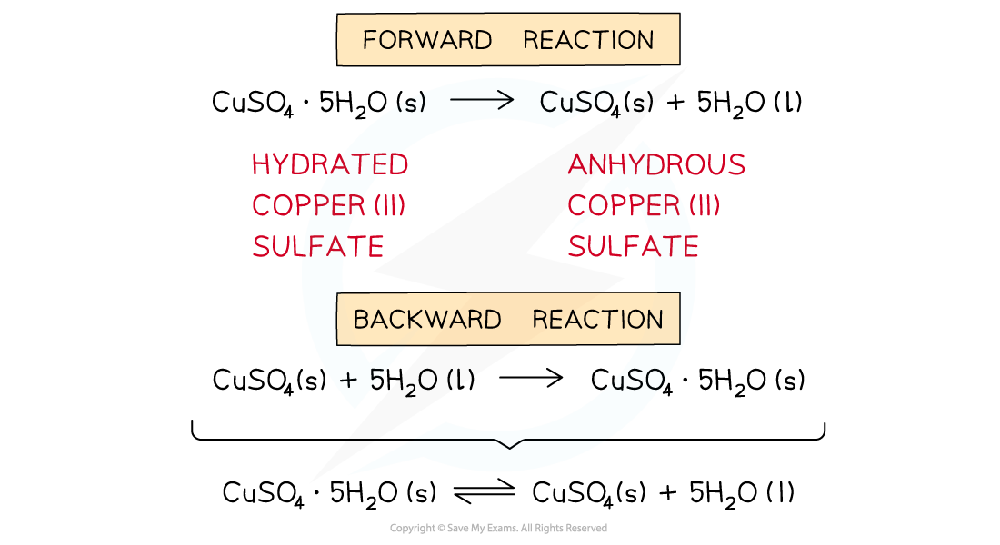
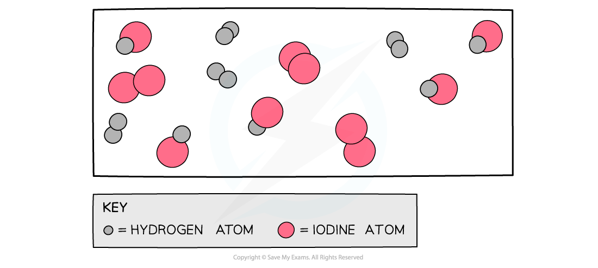
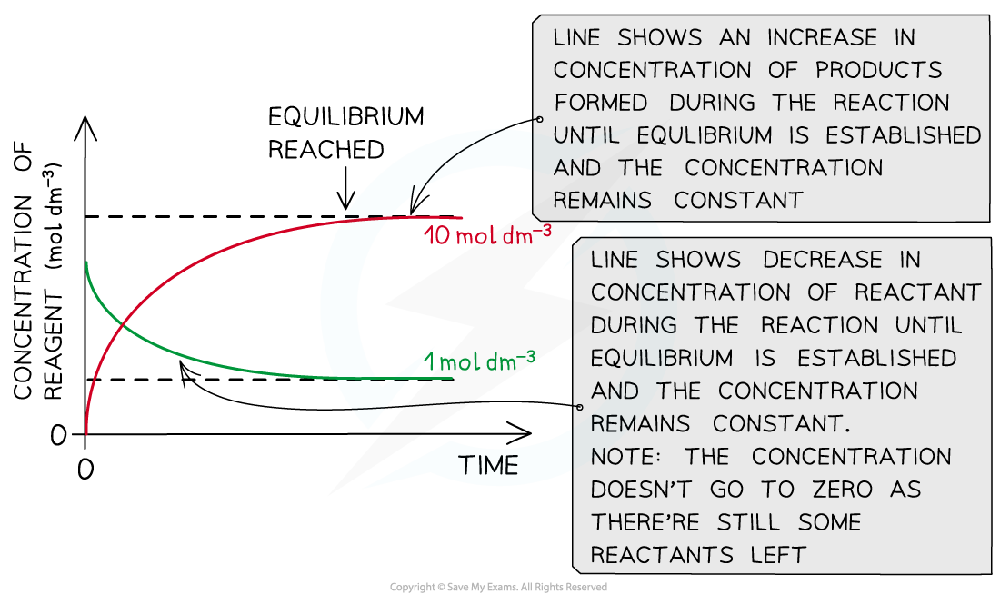
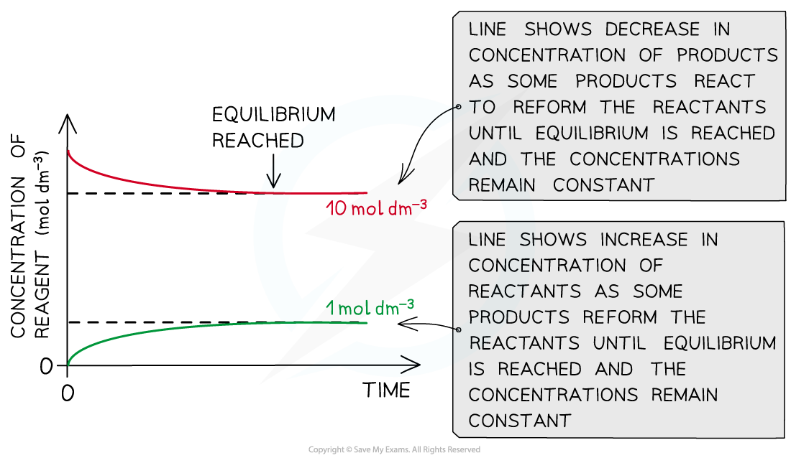
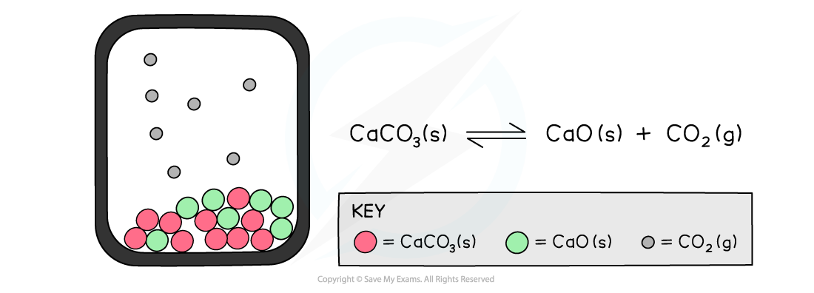
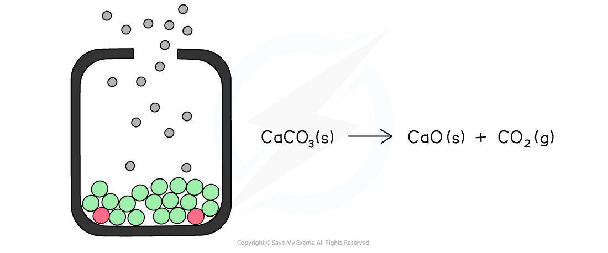

## Dynamic Equilibrium

#### Reversible reaction

* Some reactions go to completion where the reactants are used up to form the products

  + The reaction stops when all of the reactants are used up
* In **reversible reactions**, the products can react to reform the original reactants

  + To show a reversible reaction, two opposing half arrows are used: ⇌

***The diagram shows an example of a forward and backward reaction that can be written as one equation using two half arrows***

#### Dynamic equilibrium

* In a **dynamic equilibrium**, the reactants and products are **dynamic** (they are constantly moving)
* In a dynamic equilibrium, the **rate** of the **forward** reaction is the same as the rate of the **backward** reaction in a **closed system**, and the **concentrations**of the **reactants**and **products**are **constant**

  

***The diagram shows a snapshot of a dynamic equilibrium in which molecules of hydrogen iodide are breaking down to hydrogen and iodine at the same rate as hydrogen and iodine molecules are reacting together to form hydrogen iodide***

***The diagram shows that the concentration of the reactants and products does not change anymore once equilibrium has been reached (equilibrium was approached using reactants)***

***The diagram shows that the concentration of the reactants and products does not change anymore once equilibrium has been reached (equilibrium was approached using products)***

* A **closed system**is one in which none of the reactants or products escape from the reaction mixture
* In an **open system**, matter and energy can be lost to the surroundings
* When a reaction takes place entirely in solution, equilibrium can be reached in open flasks as a negligible amount of material is lost through evaporation
* If the reaction involves gases, equilibrium can only be reached in a closed system

  

***The diagram shows a closed system in which no carbon dioxide gas can escape and the calcium carbonate is in equilibrium with the calcium oxide and carbon dioxide***

***The diagram shows an open system in which the calcium carbonate is continually decomposing as the carbon dioxide is lost causing the reaction to eventually go to completion***

#### Examiner Tips and Tricks

A common misconception is to think that the concentrations of the reactants and products are equal.

They are not equal but they **remain constant** at dynamic equilibrium (i.e. the concentrations are not changing).

The concentrations will change as the reaction progresses, only until the equilibrium is reached.