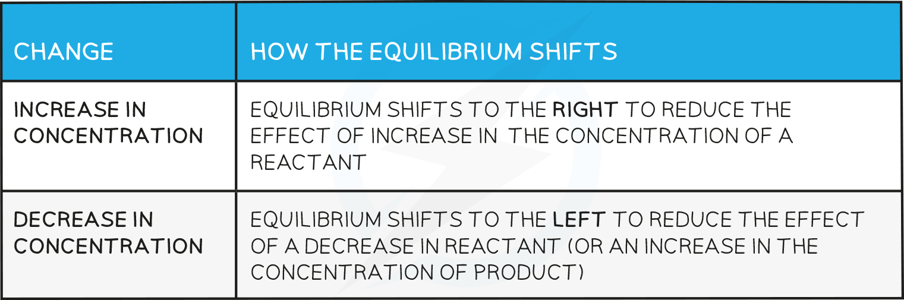
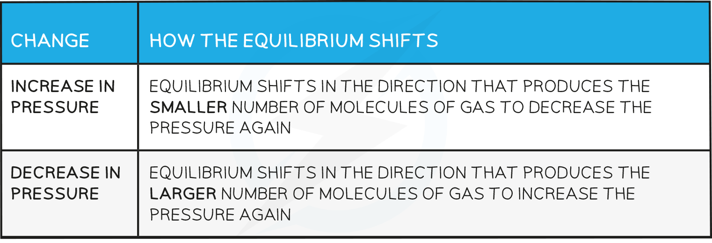

## Le Chatelier's Principle

#### Position of the equilibrium

* The **position of the equilibrium** refers to the relative amounts of products and reactants in an equilibrium mixture
* When the position of equilibrium shifts to the **left**, it means the concentration of **reactants**increases
* When the position of equilibrium shifts to the **right**, it means the concentration of **products**increases

#### Le Chatelier’s principle

* **Le Chatelier’s principle** says that if a change is made to a system in dynamic equilibrium, the position of the equilibrium moves to counteract this change
* The principle is used to predict changes to the position of equilibrium when there are changes in temperature, pressure or concentration

#### Effects of concentration

**How the equilibrium shifts with concentration changes**

#### Worked Example

**Changes in equilibrium position**

Using the reaction below:

CH3COOH (I) + C2H5OH (I)  ⇌  CH3COOC2H5(I) + H2O (I)

Explain what happens to the position of equilibrium when:

**1. More CH****3****COOC****2****H****5****is added**

**2. Some C****2****H****5****OH is removed**

Using the reaction below:

Ce4+(aq) + Fe2+(aq) ⇌ Ce3+(aq) + Fe3+(aq)

Explain what happens to the position of equilibrium when

**3. Water is added to the equilibrium mixture**

**Answer 1:**

* The position of the equilibrium moves to the left and more ethanoic acid and ethanol are formed

  + The reaction moves in this direction to oppose the effect of added ethyl ethanoate, so the ethyl ethanoate decreases in concentration

**Answer 2:**

* The position of the equilibrium moves to the left and more ethanoic acid and ethanol are formed

  + The reaction moves in this direction to oppose the removal of ethanol so more ethanol (and ethanoic acid) are formed from ethyl ethanoate and water

**Answer 3:**

* There is no effect as the water dilutes all the ions equally so there is no change in the ratio of reactants to products

#### Effects of pressure

* Changes in pressure only affect reactions where the reactants or products are gases

**How the equilibrium shifts with pressure changes**

#### Worked Example

**Changes in pressure**

Predict the effect of increasing the pressure on the following reactions:

**1. N****2****O****4****(g) ⇌ 2NO****2****(g)**

**2. CaCO****3****(s) ⇌ CaO (s) + CO****2****(g)**

Predict the effect of decreasing the pressure on the following reaction:

**3. 2NO****2****(g) ⇌ 2NO (g) + O****2****(g)**

**Answer 1:**

* The equilibrium shifts to the left as there are fewer gas molecules on the left

  + This causes a decrease in pressure

**Answer 2:**

* The equilibrium shifts to the left as there are no gas molecules on the left but there is CO2 on the right

  + This causes a decrease in pressure

**Answer 3:**

* The equilibrium shifts to the right as there is a greater number of gas molecules on the right

  + This causes an increase in pressure

#### Effects of temperature

**How the equilibrium shifts with temperature changes**

#### Worked Example

**Changes in temperature**

Using the reaction below:

H2(g) + CO2(g) ⇌  H2O (g) + CO (g)    ΔH = +41.2 kJ mol-1

**1. Predict the effect of increasing the temperature on this reaction**

Using the reaction below:

Ag2CO3(s)  ⇌  Ag2O (s) + CO2(g)

**2. Increasing the temperature increases the amount of CO****2****(g) at constant pressure. Is this reaction exothermic or    endothermic?**

Explain your answer

**Answer 1:**

* The reaction will absorb the excess energy and since the forward reaction is endothermic, the equilibrium will shift to the right

**Answer 2:**

* The reaction will absorb the excess energy and since this causes a shift of the equilibrium towards the right (as more CO2(g) is formed) this means that the reaction is endothermic