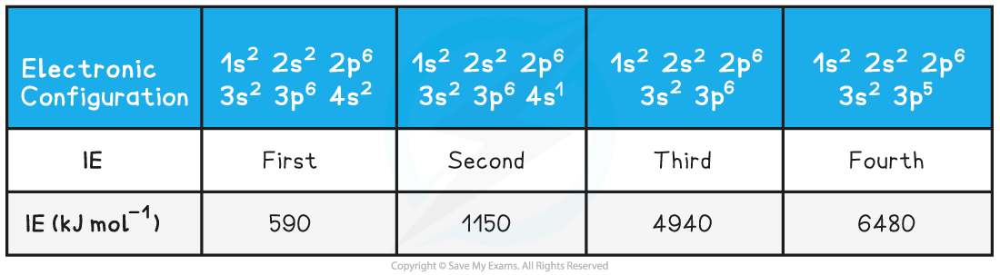
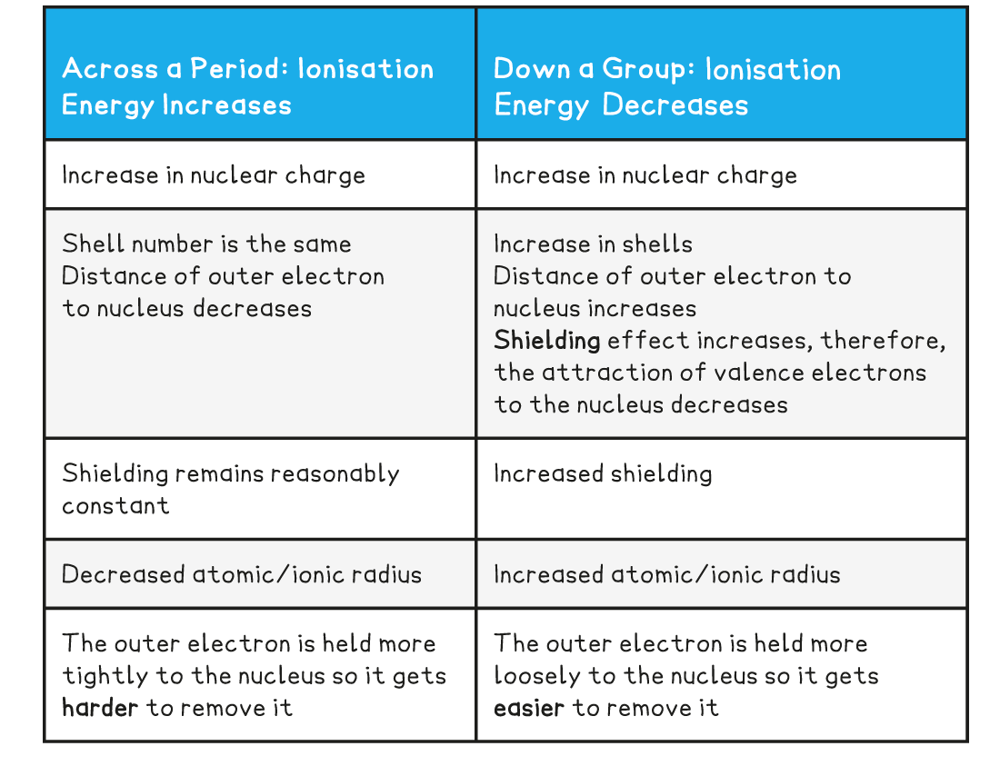

## Factors Affecting Ionisation Energy

#### Ionisation energy

* The **ionisation** **Energy** (***IE***) of an element is the amount of energy required to remove **one mole** of electrons from **one mole** of gaseous atoms of an element to form **one mole** of gaseous ions
* Ionisation energies are measured under **standard conditions** which are 298 K and 101 kPa
* The units of IE are **kilojoules** **per** **mole** (kJ mol-1)
* The **first ionisation energy** (*IE*1) is the energy required to remove **one mole of electrons** from one mole of gaseous atoms of an element to form one mole of gaseous 1+ ions

  + E.g. the first ionisation energy of gaseous calcium:

**Ca (g) → Ca****+** **(g) + e****-*****IE*****1** **= +590 kJ mol****-1**

#### Successive ionisation energies of an element

* More than one electron can be removed form an atom and each time you remove an electron there is a successive ionisation energy
* These are called second, third ionisation energy and so on
* The **second ionisation energy** (*IE*2) is defined as

  + is the energy required to remove **one mole of electrons** from one mole of gaseous 1+ ions to form one mole of gaseous 2+ ions
* And can be represented as can be represented as

**X****+** **(g) → X****2+****(g) + e****-**

**OR (for calcium)**

**Ca****+** **(g) → Ca****2+****(g) + e****-*****IE*****2** **= 1145 kJ mol****-1**

* **The third ionisation energy** (*IE*3) *of* an element can be represented as

**X****2+** **(g) → X****3+****(g) + e****-**

**OR (for calcium)**

**Ca****2+** **(g) → Ca****3+****(g) + e****-*****IE******3*** **= 4912 kJ mol****-1**

* The **successive** ionisation energies of an element **increase**
* This is because once you have removed the outer electron from an atom, you have formed a **positive ion**
* Removing an electron from a positive ion is **more difficult** than from a neutral atom
* As more electrons are removed, the **attractive forces increase** due to decreasing shielding and an increase in the proton to electron ratio
* The increase in ionisation energy, however, is not constant and is dependent on the atom’s electronic configuration
* Taking calcium as an example:

**Ionisation Energies of Calcium Table**

## First Ionisation Energy - Period

#### Trends in Ionisation Energies

* Ionisation energies show**periodicity** - a trend across a period of the Periodic Table
* As could be expected from their electron configuration, the group 1 metals have a relatively low ionisation energy, whereas the noble gases have very high ionisation energies
* The size of the first ionisation energy is affected by four factors:

  + **Size of the nuclear charge**
  + **Distance of outer electrons from the nucleus**
  + **Shielding effect of inner electrons**
  + **Spin-pair repulsion**

#### Ionisation energy across a period

* The ionisation energy across a period generally **increases** due to the following factors:

  + Across a period the **nuclear charge increases**
  + This causes the **atomic radius** of the atoms to **decrease**, as the outer shell is pulled closer to the nucleus, so the distance between the nucleus and the outer electrons **decreases**
  + The **shielding**by inner shell electrons remain reasonably constant as electrons are being added to the same shell
  + It becomes **harder to remove an electron** as you move across a period; **more energy** is needed
  + So, the ionisation energy increases

#### Dips in the trend

* There is a slight **decrease**in IE1 between **beryllium**and **boron** as the fifth electron in boron is in the 2p subshell, which is further away from the nucleus than the 2s subshell of beryllium

  + **Beryllium** has a first ionisation energy of **900 kJ mol****-1** as its electron configuration is **1s****2****2s****2**
  + **Boron** has a first ionisation energy of **800 kJ mol****-1** as its electron configuration is **1s****2****2s****2****2p****x****1**
* There is a slight **decrease**in IE1 between **nitrogen**and**oxygen**due to **spin-pair repulsion** in the 2px orbital of oxygen

  + **Nitrogen** has a first ionisation energy of **1400 kJ mol****-1** as its electron configuration is 1s2 2s2 2px1 2py1 2pz1
  + **Oxygen**has a first ionisation energy of **1310 kJ mol****-1** as its electron configuration is 1s2 2s2 **2p****x****2** 2py1 2pz1
  + In oxygen, there are 2 electrons in the 2pxorbital, so the repulsion between those electrons makes it slightly easier for one of those electrons to be removed

#### From one period to the next

* There is a large **decrease**in ionisation energy between the **last** element in one period, and the **first** element in the next period
* This is because:

  + There is increased **distance** between the nucleus and the outer electrons as you have added a new shell
  + There is increased **shielding** by inner electrons because of the added shell
  + These two factors outweigh the increased **nuclear** **charge**

## First Ionisation Energy - Group

#### Ionisation energy down a group

* The ionisation energy down a group **decreases** due to the following factors:

  + The number of protons in the atom is increased, so the **nuclear charge**increases
  + But, the atomic radius of the atoms increases as you are adding more shells of electrons, making the atoms bigger
  + So, the **distance**between the nucleus and outer electron **increases**as you descend the group
  + The **shielding**by inner shell electrons **increases**as there are more shells of electrons
  + These factors outweigh the increased nuclear charge, meaning it becomes **easier to remove the outer electron** as you descend a group
  + So, the ionisation energy decreases

**Ionisation Energy Trends across a Period & going down a Group Table**

