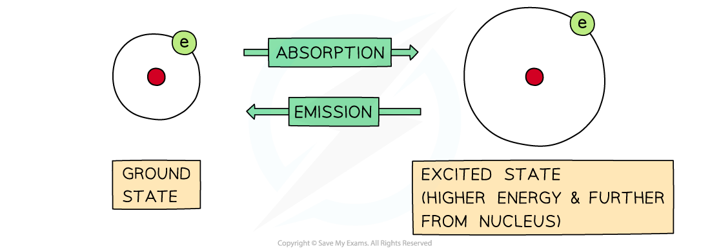
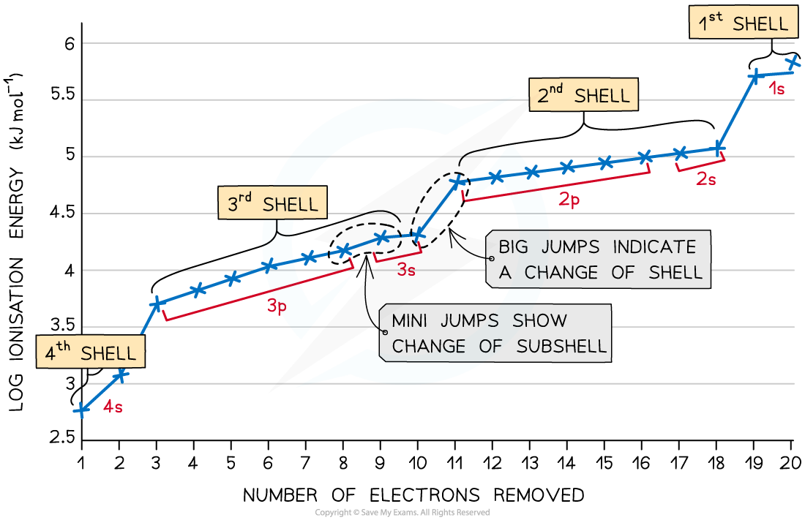

## Developing Electronic Configuration

* Electrons move rapidly around the nucleus in energy shells
* If their energy is increased, then they can jump to a higher energy level
* The process is reversible, so electrons can return to their original energy levels

  + When this happens, they emit energy
* The frequency of energy is exactly the same, it is just being emitted rather than absorbed:

***The difference between absorption and emission depends on whether electrons are jumping from lower to higher energy levels or the other way around***

* The energy they emit is a mixture of different frequencies
* This is thought to correspond to the many possibilities of electron jumps between energy shells
* If the emitted energy is in the visible region, it can be analysed by passing it through a diffraction grating
* The result is a **line emission spectrum**

#### Line emission spectra

***The line emission (visible) spectrum of hydrogen***

* Each line is a specific energy value

  + This suggests that electrons can only possess a limited choice of allowed energies
* These packets of energy are called '**quanta**' (plural **quantum**)
* What you should notice about this spectrum is that the lines get closer together towards the blue end of the spectrum
* This is called **convergence** and the set of lines is **converging** towards the higher energy end, so the electron is reaching a maximum amount of energy
* This maximum corresponds to the **ionisation energy** of the electron
* These lines were first observed by the Swiss school teacher Johannes **Balmer**, and they are named after him
* We now know that these lines correspond to the electron jumping from higher levels down to the **second** or **n = 2** energy level

#### Successive ionisation energies

* The **first** electron removed has a low *IE*1 as it is easily removed from the atom due to the spin-pair repulsion of the electrons in the 4s orbital
* The **second** electron is more difficult to remove than the first electron as there is no **spin-pair repulsion**
* The **third**electron is much more difficult to remove than the second one corresponding to the fact that the third electron is in a **principal quantum** shell which is closer to the nucleus (3p)
* Removal of the **fourth**electron is more difficult as the orbital is no longer full, and there is less **spin-pair repulsion**
* The graph shows there is a large increase in successive ionisation energy as the electrons are being removed from an increasingly positive ion
* The big jumps on the graph show the change of **shell** and the small jumps are the change of **subshell**

***Successive ionisation energies for the element calcium***

## Filling Quantum Shells

#### Shells

* The arrangement of electrons in an atom is called the **electron** **configuration**
* Electrons are arranged around the nucleus in **principal energy levels**or **principal quantum shells**
* **Principal quantum numbers**(**n**) are used to number the energy levels or quantum shells

  + The **lower**the principal quantum number, the closer the shell is to the nucleus

    - So, the first shell which is the closest to the nucleus is n = 1
  + The **higher**the principal quantum number, the greater the energy of the shell and the further away from the nucleus
* Each principal quantum number has a **fixed**number of electrons it can hold, which is equal to 2n2

  + n = 1 : up to 2 electrons
  + n = 2 : up to 8 electrons
  + n = 3 : up to 18 electrons
  + n = 4 : up to 32 electrons