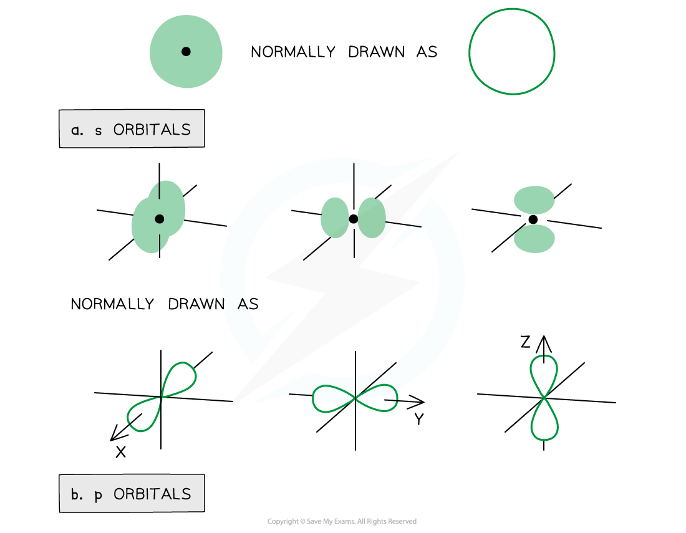
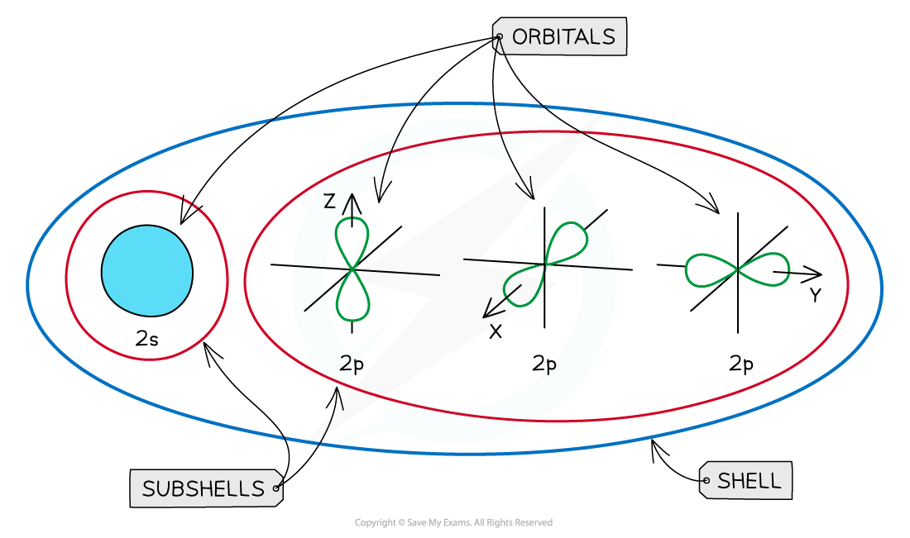
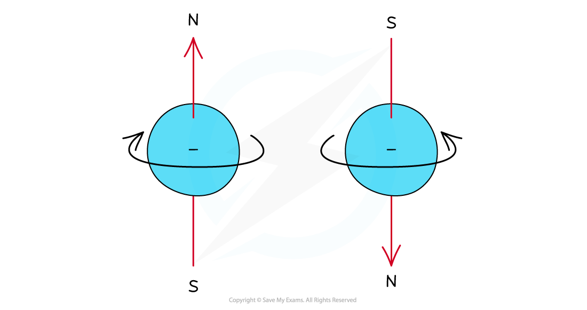

## Orbital Shapes

#### Orbitals

* Subshells contain one or more **atomic orbitals**
* Orbitals exist at **specific** energy levels and electrons can only be found at these specific levels, **not** in between them

  + Each atomic orbital can be occupied by a maximum of two electrons
* This means that the number of orbitals in each subshell is as follows:

  + **s** : one orbital (1 x 2 = total of 2 electrons)
  + **p** : three orbitals ( 3 x 2 = total of 6 electrons)
  + **d** : five orbitals (5 x 2 = total of 10 electrons)
  + **f** : seven orbitals (7 x 2 = total of 14 electrons)
* The orbitals have specific 3-D shapes

#### s orbital shape

* The s orbitals are **spherical** in shape
* The **size** of the s orbitals increases with increasing shell number

  + E.g. the s orbital of the **third**quantum shell (*n* = 3) is bigger than the s orbital of the **first** quantum shell (*n* = 1)

#### p orbital shape

* The p orbitals have a **dumbbell shape**
* Every shell has three p orbitals except for the first one (*n* = 1)
* The p orbitals occupy the x, y and z axes and point at right angles to each other, so are oriented **perpendicular** to one another
* The lobes of the p orbitals become **larger** and **longer** with increasing shell number

***Representation of orbitals (the dot represents the nucleus of the atom) showing spherical s orbitals (a), p orbitals containing ‘lobes’ along the x, y and z axis***

* Note that the shape of the d orbitals is **not** required

***An overview of the shells, subshells and orbitals in an atom***

## Filling Orbitals

* Electrons can be imagined as small **spinning charges**which rotate around their own axis in either a **clockwise** or **anticlockwise direction**

  + The spin of the electron is represented by its direction
  + The spin creates a tiny magnetic field with N-S pole pointing up or down

***Electrons can spin either in a clockwise or anticlockwise direction around their own axis***

* Electrons with the same **spin**repel each other which is also called **spin-pair repulsion**

  + Therefore, electrons will occupy separate orbitals in the same subshell first to minimise this repulsion and have their **spin**in the same direction
  + They will then pair up, with a second electron being added to the first p orbital, with its spin in the **opposite** direction
* This is known as **Hund's Rule**

  + E.g. if there are three electrons in a **p subshell**, one electron will go into each px, py and pz orbital

***Electron configuration: three electrons in a p subshell***

* The principal quantum number indicates the energy level of a particular shell but also indicates the energy of the electrons in that shell

  + A 2p electron is in the second shell and therefore has an energy corresponding to *n*= 2
* Even though there is repulsion between negatively charged electrons, they occupy the same region of space in orbitals
* An orbital can only hold two electrons and they must have opposite spin - the is known as the **Pauli Exclusion Principle**
* This is because the energy required to jump to a higherempty orbital is **greater**than the inter-electron repulsion
* For this reason, they pair up and occupy the lower energy levels first