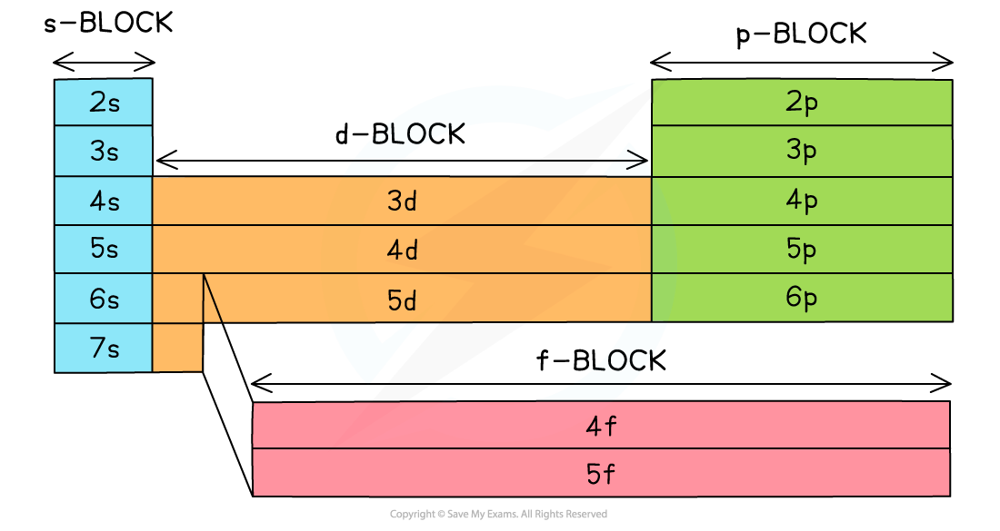

## Electronic Configurations of Atoms & Ions

* The **principal quantum shells**increase in energy with increasing **principal quantum number**

  + E.g. *n* = 4 is higher in energy than *n* = 2
* The **subshells**increase in energy as follows: s ＜ p ＜ d ＜ f

  + The only exception to these rules is the 3d orbital which has slightly higher energy than the 4s orbital
  + Because of this, the 4s orbital is filled before the 3d orbital
* All the orbitals in the **same**subshell have the same energy and are said to be **degenerate**

  + E.g. px, py and pz are all equal in energy

***Relative energies of the shells and subshells***

* The **electron configuration** gives information about the number of electrons in each **shell, subshell**and**orbital** of an atom
* The subshells are filled in order of increasing energy

***The electron configuration shows the number of electrons occupying a subshell in a specific shell***

* Writing out the **electron** **configuration** tells us how the electrons in an atom or ion are arranged in their shells, subshells and orbitals
* This can be done using the**full**electron configuration or the **shorthand** version

  + The **full** electron configuration describes the arrangement of all electrons from the 1s subshell up
  + The **shorthand** electron configuration includes using the symbol of the **nearest preceding** **noble** **gas** to account for however many electrons are in that noble gas
* **Ions**are formed when atoms **lose**or **gain**electrons

  + Negative ions are formed by **adding** electrons to the outer subshell
  + Positive ions are formed by **removing** electrons from the outer subshell
  + The transition metals **fill**the 4s subshell before the 3d subshell but **lose** electrons from the 4s first and not from the 3d subshell (the 4s subshell is lower in energy

#### Full Electron Configurations

* Hydrogen has 1 single electron

  + The electron is in the s orbital of the first shell
  + Its electron configuration is 1s1
* Potassium has 19 electrons

  + The first 2 electrons fill the s orbital of the first shell
  + They then continue to fill subsequent orbitals and subshells in order of increasing energy
  + The 4s orbital is lower in energy than the 3d subshell, so it is therefore filled first
  + The full electron configuration of potassium is **1s****2****2s****2****2p****6****3s****2****3p****6****4s****1**

#### Shorthand Electron Configurations

* Using potassium as an example again:

  + The nearest preceding noble gas to potassium is **argon**
  + This accounts for 18 electrons of the 19 electrons that potassium has
  + The shorthand electron configuration of potassium is **[Ar] 4s****1**

#### Worked Example

Write down the full and shorthand electron configuration of the following elements:

1. Calcium
2. Gallium
3. Ca2+

**Answer**

**Answer 1:**

* Calcium has 20 electrons so the **full** **electronic** **configuration** is:

   1s2 2s2 2p6 3s2 3p6 4s2

* The 4s orbital is lower in energy than the 3d subshell and is therefore filled first

  + The **shorthand** version is [Ar] 4s2since argon is the nearest preceding noble gas to calcium which accounts for 18 electrons

**Answer 2:**

* Gallium has 31 electrons so the **full** **electronic** **configuration** is:

   1s2 2s2 2p6 3s2 3p6 3d104s2 4p1

   [Ar] 3d104s2 4p1

* Even though the 4s is filled first, the full electron configuration is often written in numerical order. So, if there are electrons in the 3d sub-shell, then these will be written before the 4s

**Answer 3:**

* What this means is that if you ionise calcium and remove two of its outer electrons, the electronic configuration of the Ca2+ ion is identical to that of argon

**Ca****2+** is 1s2 2s2 2p6 3s2 3p6      

**Ar** is also 1s2 2s2 2p6 3s2 3p6

#### Exceptions

* Chromium and copper have the following electron configurations, which are different to what you may expect:

  + Cr is [Ar] 3d5 4s1 **not** [Ar] 3d4 4s2
  + Cu is [Ar] 3d10 4s1**not** [Ar] 3d9 4s2
* This is because the [Ar] 3d5 4s1 and [Ar] 3d10 4s1configurations are **energetically stable**

#### Presenting the Electron Configuration

* Electrons can be imagined as small **spinning charges**which rotate around their own axis in either a **clockwise** or **anticlockwise direction**
* The spin of the electron is represented by its direction
* Electrons with similar **spin**repel each other which is also called **spin-pair repulsion**
* Electrons will therefore occupy separate orbitals in the same subshell where possible, to minimize this repulsion and have their **spin**in the same direction

  + E.g. if there are three electrons in a **p subshell**, one electron will go into each px, py and pz orbital

***Electron configuration: three electrons in a p subshell***

* Electrons are only paired when there are no more empty orbitals available within a subshell, in which case the spins are the **opposite**spins to minimize repulsion

  + E.g. if there are four electrons in a p subshell, one p orbital contains 2 electrons with opposite spin and two orbitals contain one electron only
  + The first 3 electrons fill up the empty p orbitals one at a time, and then the 4th one pairs up in the pxorbital

***Electron configuration: four electrons in a p subshell***

#### Box Notation

* The **electron configuration**can be represented using the **electrons in boxes**notation
* Each box represents an **atomic orbital**
* The boxes are arranged in order of **increasing**energy from bottom to top
* The electrons are represented by opposite arrows to show the **spin**of the electrons

  + E.g. the box notation for titanium is shown below
  + Note that since the 3d subshell cannot be either full or half full, the second 4s electron is not promoted to the 3d level and stays in the 4s orbital

***The electrons in titanium are arranged in their orbitals as shown. Electrons occupy the lowest energy levels first before filling those with higher energy***

## Classifying Elements

* The Periodic Table is split up into four main blocks depending on their electron configuration
* Elements can be classified as an s-block element, p-block element and so on, based on the position of the outermost electron:

  + s block elements - Have their valence electron(s) in an s orbital
  + p block elements - Have their valence electron(s) in a p orbital
  + d block elements - Have their valence electron(s) in a d orbital
  + f block elements - Have their valence electron(s) in an f orbital

## Electronic Configuration & Chemical Properties

* The way an element reacts with other elements is determined by an number of factors, but in particular the **electronic configuration** of its atoms
* The Periodic Table is arranged in **periods (horizontal**) and **groups (vertical)**

  + All the elements in the same period have the same number of shells (principle quantum number)
  + All the elements in the same group have the same number of outer electrons
* The elements in each group of period show particular trends and characteristics in their chemical and physical properties that can be explained in terms of their atomic numbers
* This provides valuable information about what is **likely to happen** when particular elements react
* The properties of the elements are a function of their atomic numbers
* Using this information as well as the location of the elements in the different blocks we can predict the properties
* For example:

  + Helium, neon and argon all have electronic structures with full sub shells as well as high ionisation energies

    - This confirms that the electronic arrangement is very stable explaining why they rarely react with other chemicals