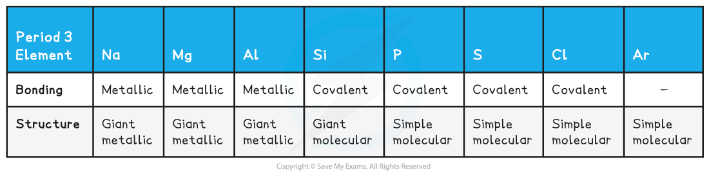
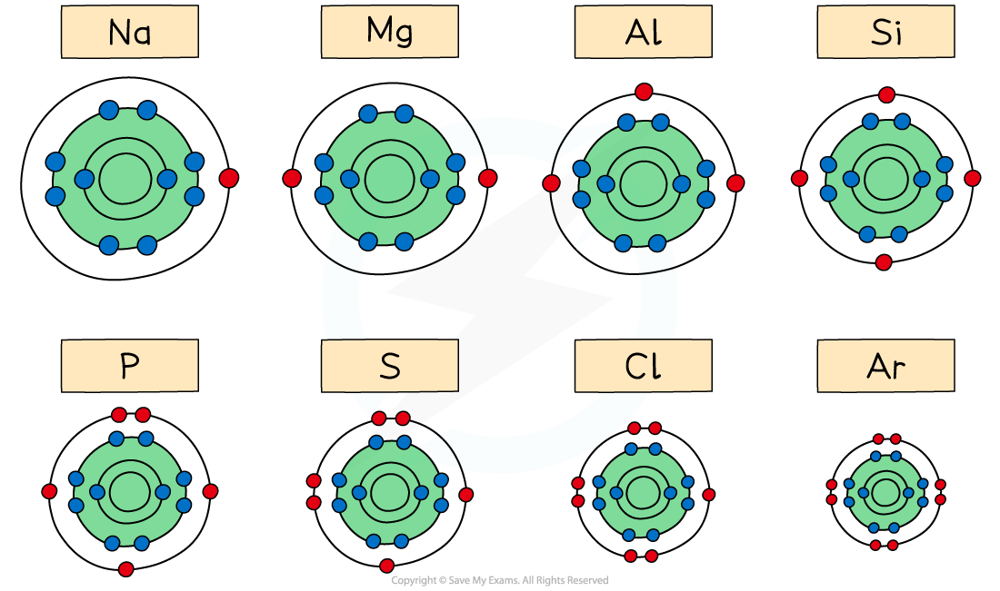

## Melting & Boiling Point Trends

* Elements in the periodic table are arranged in order of increasing atomic number and placed in vertical columns (**groups**) and horizontal rows (**periods)**
* The elements across the periods show **repeating patterns** in chemical and physical properties
* This is called **periodicity**

### The Periodic Table

***All elements are arranged in the order of increasing atomic number from left to right***

#### Melting point

* Period 2 and 3 elements follow the **same pattern** in relation to their melting points

**Melting points of the elements across Period 3 table**

***Ions of Period 3 elements with increasing positive charge (metals) and increasing of number of outer electrons across the period***

* A general increase in **melting point**for the Period 3 elements up to silicon is observed
* **Silicon**has the highest **melting point**
* After the Si element the melting points of the elements **decreases**significantly

* The above trends can be explained by looking at the bonding and structure of the elements

**Bonding & structure of the elements table**

* The table shows that **Na**, **Mg** and **Al** are metallic elements which form positive ions arranged in a **giant** **lattice** in which the ions are held together by a 'sea' of delocalised electrons

***Metal cations form a giant lattice held together by electrons that can freely move around***

* The electrons in the ‘sea’ of delocalised electrons are those from the **valence shell** of the atoms
* **Na** will donate one electron into the ‘sea’ of delocalised electrons, **Mg** will donate two and **Al**three electrons
* As a result of this, the metallic bonding in **Al**is stronger than in **Na**
* This is because the electrostatic forces between a **3+ ion** and the larger number of negatively charged delocalised electrons is much larger compared to a **1+ ion** and the smaller number of delocalised electrons in Na
* Because of this, the **melting points increase**going from **Na**to **Al**
* **Si**has the highest melting point due to its giant molecular structure in which each Si atom is held to its neighbouring Si atoms by **strong covalent bonds**
* **P, S**, **Cl**and **Ar** are non-metallic elements and exist as **simple molecules** (P4, S8, Cl2 and Ar as a single atom)
* The **covalent bonds within** the molecules are strong, however, **between**the molecules, there are only weak **instantaneous dipole-induced dipole forces**
* It doesn’t take much energy to break these **intermolecular** forces
* Therefore, the melting points decrease going from **P**to **Ar**(note that the melting point of S is higher than that of P as sulphur exists as larger S8 molecules compared to the smaller P4 molecule)

#### Atomic radius

* The **atomic radius**is the distance between the nucleus and the outermost electron of an atom
* The atomic radius is measured by taking two atoms of the same element, measuring the distance between their nuclei and then halving this distance
* In **metals**this is also called the **metallic radius**and in **non-metals**, the **covalent radius**

**Atomic radii of period 3 elements**

* You can see a clear trend across the period which also **repeated** in period 2

***The graph shows a decrease in atomic radii of period 3 elements across the period***

* Across the period, the atomic radii decrease
* This is because the number of protons (**the nuclear charge**) and the number of **electrons** increases by one every time you go an element to the right
* The elements in a period all have the same number of shells (so the **shielding effect**is the same)
* This means that as you go across the period the nucleus attracts the electrons more **strongly pulling them closer** to the nucleus
* Because of this, the atomic radius (and thus the size of the atoms) **decreases** across the period

***The diagram shows that across period 3, the elements gain extra electrons in the same principal quantum shell***

## Ionisation Energy Trends

#### Ionisation energy across period 2 and 3

* The ionisation energy across a period generally **increases** due to the following factors:

  + Across a period the **nuclear charge increases**
  + This causes the **atomic radius** of the atoms to **decrease**, as the outer shell is pulled closer to the nucleus, so the distance between the nucleus and the outer electrons **decreases**
  + The **shielding**by inner shell electrons remain reasonably constant as electrons are being added to the same shell
  + It becomes **harder to remove an electron** as you move across a period; **more energy** is needed
  + So, the ionisation energy increases

#### Dips in the trend for period 2

* There is a slight **decrease**in *IE*1 between **beryllium**and **boron** as the fifth electron in boron is in the 2p subshell, which is further away from the nucleus than the 2s subshell of beryllium

  + Beryllium has a first ionisation energy of 900 kJ mol-1 as its electron configuration is 1s2 2s2
  + Boron has a first ionisation energy of 800 kJ mol-1 as its electron configuration is 1s2 2s2 2px1
* There is a slight **decrease**in *IE*1 between **nitrogen**and**oxygen**due to **spin-pair repulsion** in the 3px orbital of oxygen

  + Nitrogen has a first ionisation energy of 1400 kJ mol-1 as its electron configuration is 1s2 2s2 2px1 2py1 2pz1
  + Oxygen has a first ionisation energy of 1310 kJ mol-1 as its electron configuration is 1s2 2s2 2px2 2py1 2pz1
* In oxygen, there are 2 electrons in the 2pxorbital, so the repulsion between those electrons makes it slightly easier for one of those electrons to be removed

#### Dips in the trend for period 3

* There is again a slight decrease between **magnesium** and **aluminium** as the thirteenth electron in aluminium is in the 3p subshell, which is further away from the nucleus than the 3s subshell of magnesium

  + Magnesium has a first ionisation energy of 738 kJ mol-1 as its electron configuration is 1s2 2s2 2p6 3s2
  + Aluminium has a first ionisation energy of 578 kJ mol-1 as its electron configuration is 1s2 2s2 2p6 3s2 3px1
* There is a slight decrease in *IE*1 between **phosphorus** and **sulfur**due to **spin-pair repulsion** in the 3px orbital of sulfur

  + Phosphorus has a first ionisation energy of 1012 kJ mol-1 as its electron configuration is 1s2 2s2 2p6 3s2 3px1 3py1 3pz1
  + Sulfur has a first ionisation energy of 1000 kJ mol-1 as its electron configuration is 1s2 2s2 2p6 3s2 3px2 3py1 3pz1
* In sulfur, there are 2 electrons in the 3pxorbital, so the repulsion between those electrons makes it slightly easier for one of those electrons to be removed