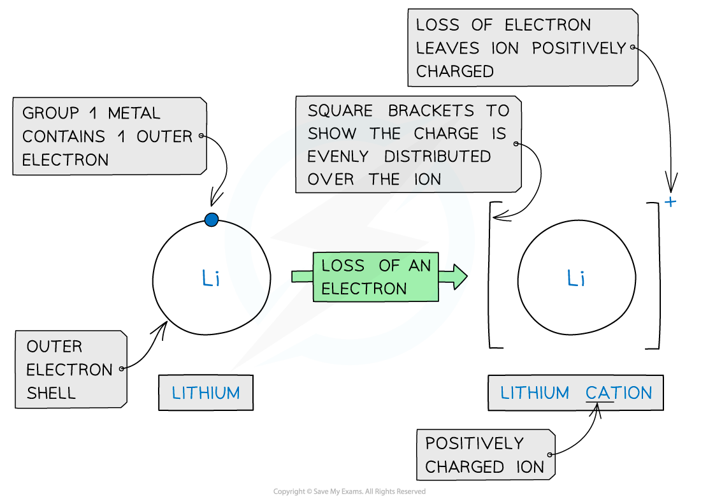
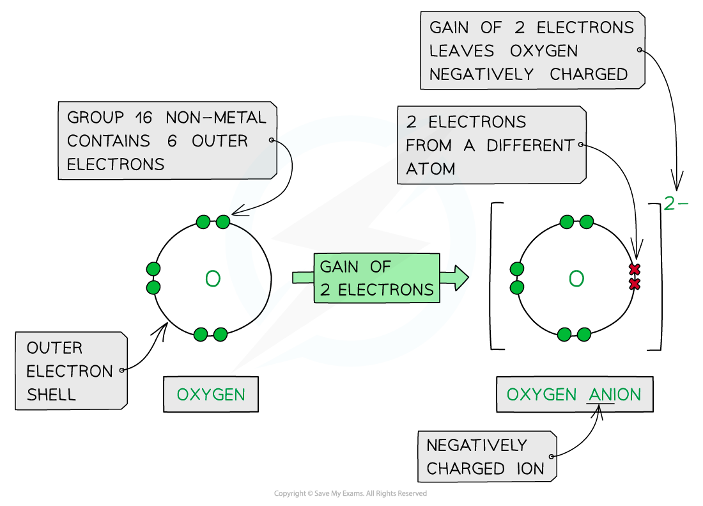
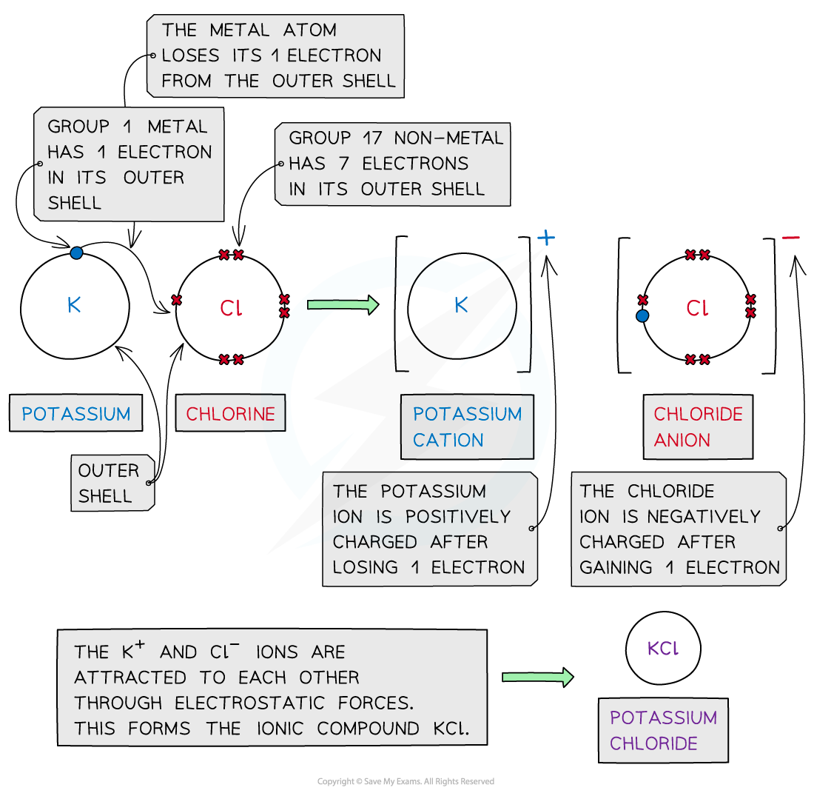
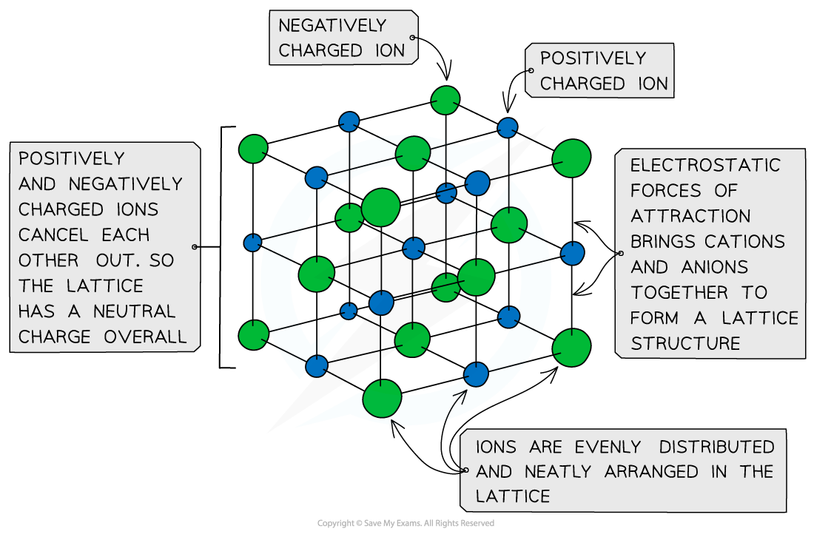

## Ionic Bonds

* As a general rule, **metals** are on the **left** of the periodic table and **nonmetals** are on the **right-hand** side
* **Ionic** **bonding** involves the **transfer** of electrons from a **metallic** element to a **non-metallic** element
* Transferring electrons usually leaves the metal and the non-metal with a **full** **outer** **shell**
* Metals **lose** electrons from their valence shell forming **positively charged cations**
* Non-metal atoms **gain** electrons forming **negatively charged anions**
* Once the atoms become ions, their electronic configurations are the same as a noble gas

  + A potassium ion (K+) has the same electronic configuration as argon: [2,8,8]+
  + A chloride ion (Cl-) also has the same electronic configuration as argon: [2,8,8]-

***Forming cations by the removal of electrons from metals***

***Forming anions by the addition of electrons to nonmetals***

* **Cations** and **anions** are oppositely charged and therefore attracted to each other
* **Electrostatic** **attractions** are formed between the oppositely charged ions to form **ionic** **compounds**
* The **ionic bond** is the **electrostatic attraction** formed **between the oppositely charged ions**, which occurs in all directions ( this called **non-directional bonding**)
* This form of attraction is **very strong** and requires a **lot of energy** to overcome

  + This causes high melting points in ionic compounds

***Cations and anions bond together using strong electrostatic forces, which require a lot of energy to overcome***

* The ions form a **lattice** **structure** which is an evenly distributed **crystalline** structure
* Ions in a lattice are arranged in a **regular** **repeating** **pattern** so that positive charges cancel out negative charges
* The attraction between the cations and anions is occurring in all directions

  + Each ion is attracted to all of the oppositely charged ions around it
* Therefore the final lattice is overall electrically **neutral**

***Ionic solids are arranged in lattice structures***