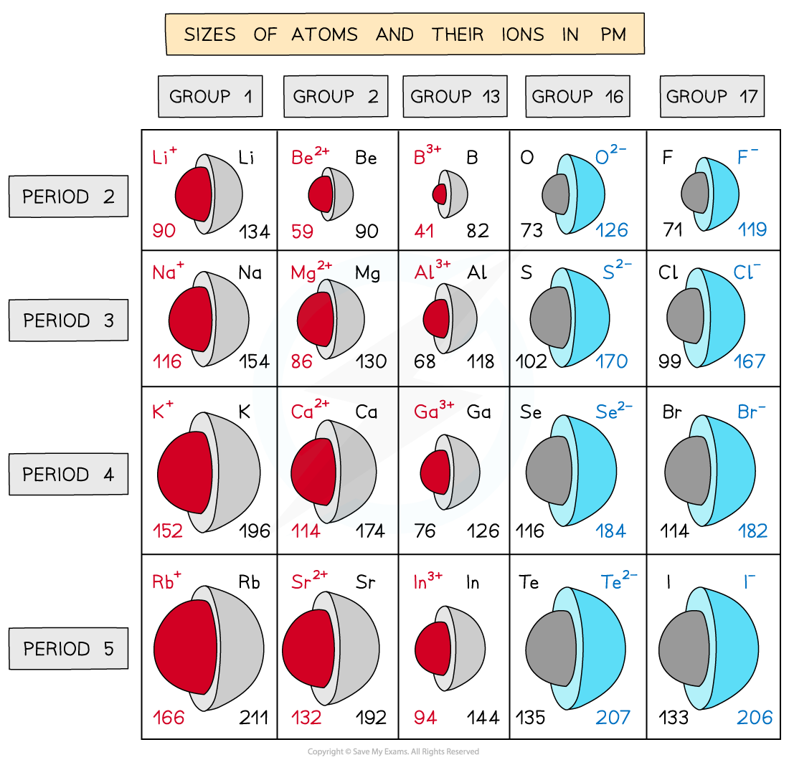

## Ionic Radius

#### Ionic radius

* The **ionic** **radius** of an element is a measure of the size of an ion
* Ionic radii show predictable patterns

  + Ionic radii **increase** with increasing**negative charge**
  + Ionic radii **decrease**with increasing **positive charge**
* For negative ions

  + They are formed by atoms **gaining** electrons
  + The outermost electrons are further away from the positively charged nucleus and are therefore held only weakly to the nucleus which **increases the ionic radius**
  + The greater the negative charge, the larger the ionic radius
* For positive ions

  + Positively charged ions are formed by atoms **losing** electrons
  + The nuclear charge remains the same but there are now fewer electrons which undergo a greater electrostatic force of attraction to the nucleus which **decreases the ionic radius**
  + The greater the positive charger, the smaller the ionic radius

***Trends in the ionic radii across a period and down a group***

#### Isoelectronic Ions

* These are ions that have the **same electronic configuration**
* For example the following ions all have the electronic configuration of **1s****2** **2s****2** **2p****6**
* However, they all have different numbers of protons, therefore will have a different ionic radius

  + N3- (7 protons)
  + O2- (8 protons)
  + F- (9 protons)
  + Na+ (11 protons)
  + Mg2+ (12 protons)
  + Al3+ (13 protons)
* As the number of protons in the nucleus of the ion increases, the electrons get pulled in more closely to the nucleus
* The radii of the isoelectronic ions therefore fall across this series of ions

  + N3- has an ionic radius of 0.171 nm and Al3+ has an ionic radius of 0.054 nm