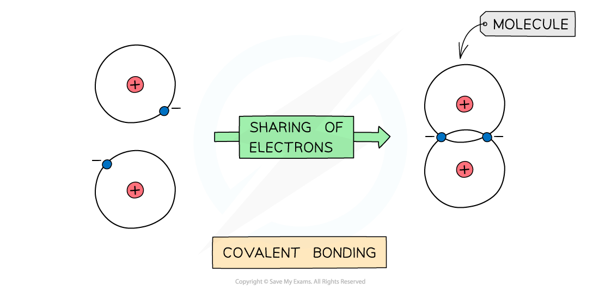
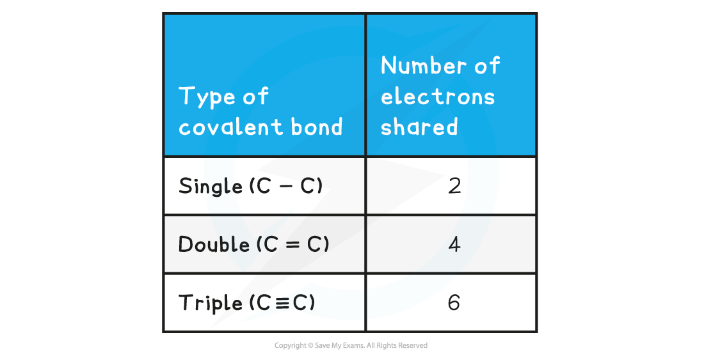

## Covalent Bonding

* **Covalent** bonding occurs between two **non-metals**
* A covalent bond involves the **electrostatic** **attraction** between nuclei of two atoms and the bonding electrons of their outer shells
* **No** **electrons** are **transferred** but only **shared**in this type of bonding

***The positive nucleus of each atom has an attraction for the bonding electrons shared in the covalent bond***

* **Non-metals** are able to **share** pairs of electrons to form different types of covalent bonds
* Sharing electrons in the covalent bond allows each of the 2 atoms to achieve an electron configuration similar to a noble gas

  + This makes each atom more stable

**Covalent Bonds & Shared Electrons Table**

