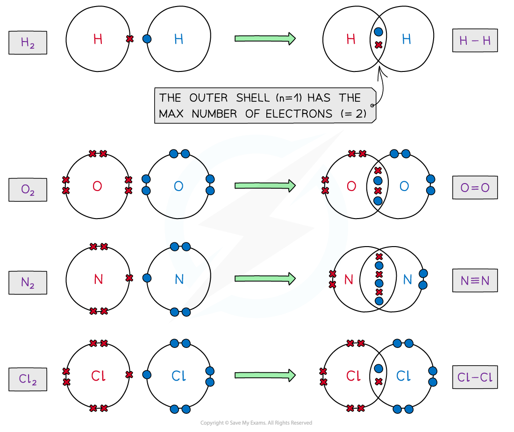
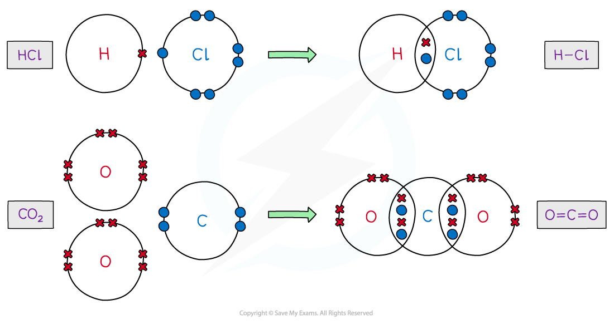
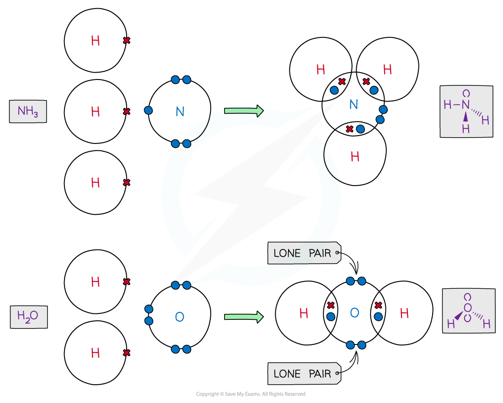
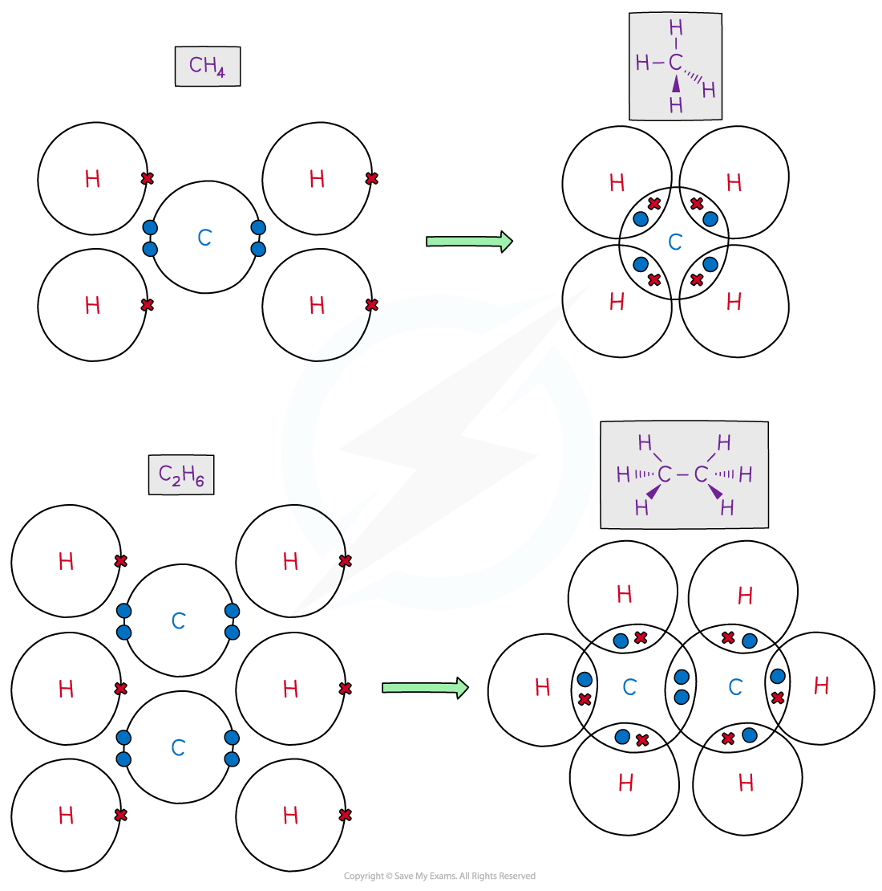
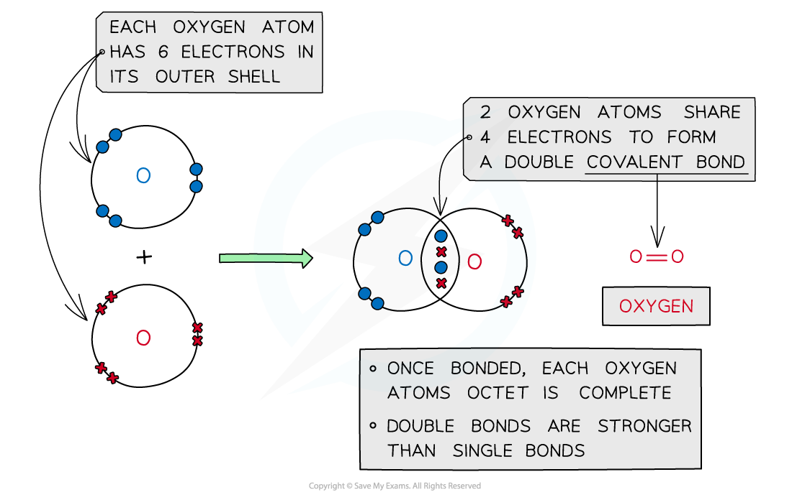
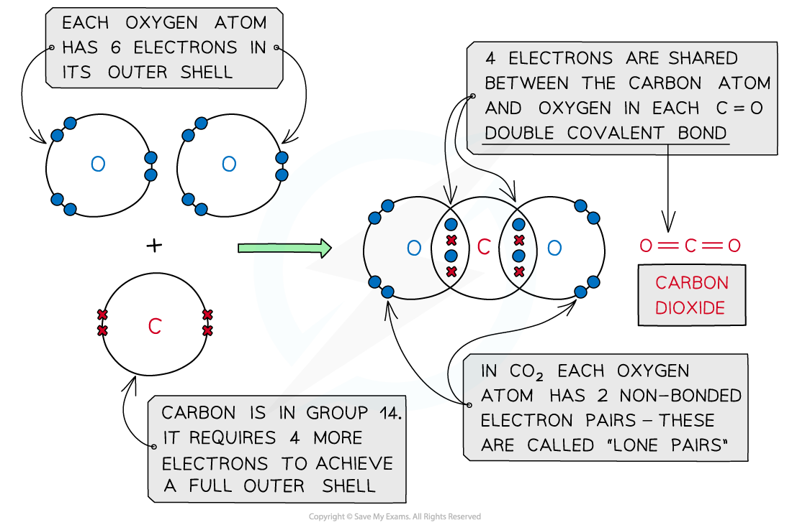
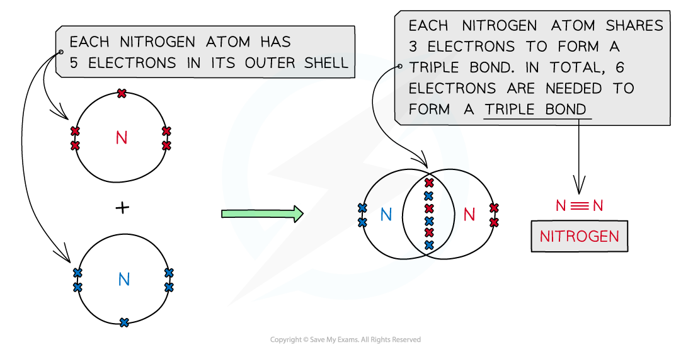
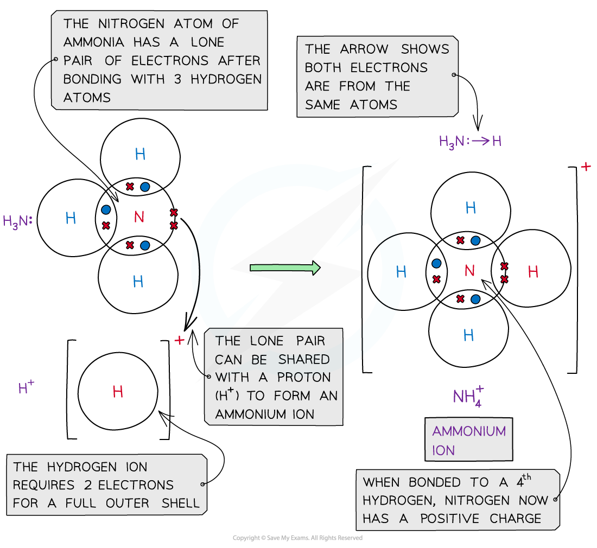
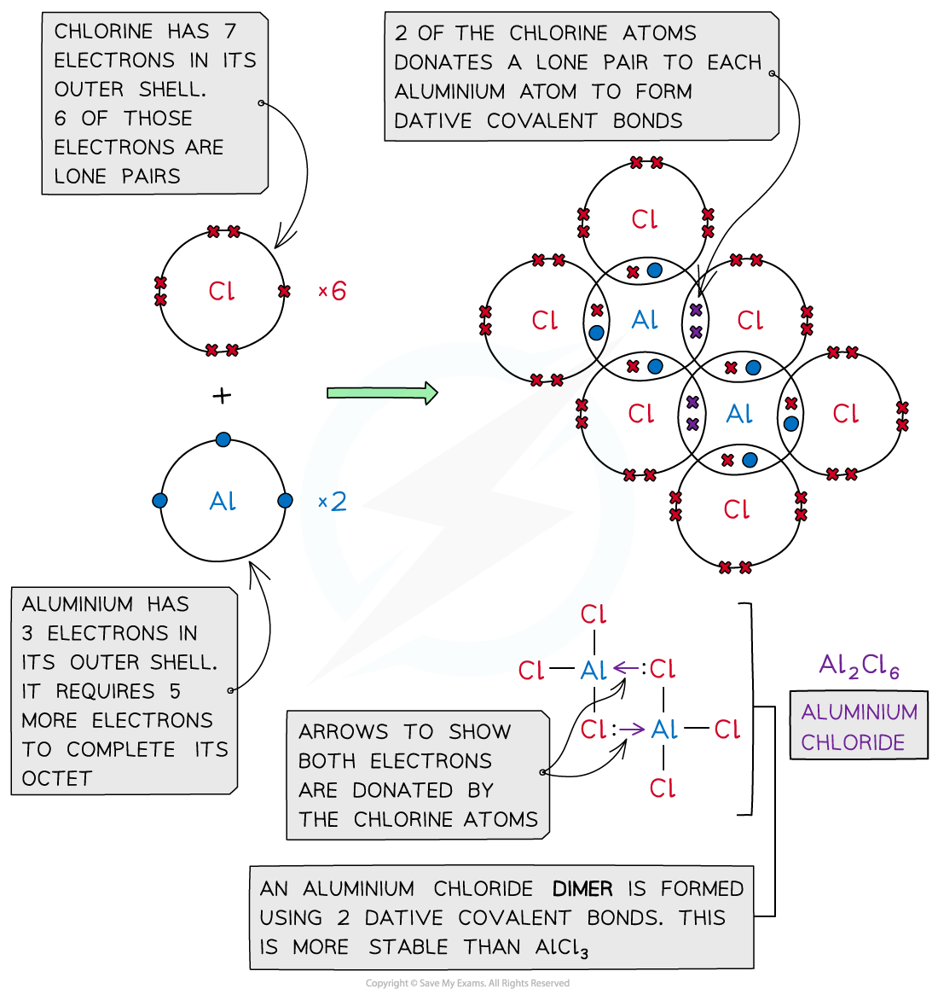

## Covalent Dot-and-Cross Diagrams

#### Covalent compounds

* The atoms in covalent compounds will**share**their outer valence electrons to achieve a **noble gas**configuration

***Dot-and-cross diagrams of covalent compounds in which the atoms share their valence electrons***

#### Double covalent bonding

**Oxygen, O****2**

***Covalent bonding in oxygen***

**Carbon dioxide, CO****2**

***Covalent bonding in carbon dioxide***

**Ethene, C****2****H****4**

***Covalent bonding in ethene***

#### Triple covalent bonding

**Nitrogen, N****2**

***Covalent bonding in nitrogen***

#### Dative covalent bonding

* In **simple** **covalent** **bonds**, the two atoms involved share electrons
* Some molecules have a **lone** pair of electrons that can be donated to form a bond with an **electron-deficient** atom

  + An electron-deficient atom is an atom that has an **unfilled outer orbital**
* So **both electrons** are from the **same atom**
* This type of bonding is called **dative covalent bonding** or **coordinate bonding**
* An example with a dative bond is in an **ammonium ion**

  + The hydrogen ion, H+is **electron-deficient**and has space for two electrons in its shell
  + The nitrogen atom in ammonia has a lone pair of electrons which it can donate to the hydrogen ion to form a dative covalent bond

***Ammonia (NH******3******) can donate a lone pair to an electron-deficient proton (H******+******) to form a charged ammonium ion (NH******4******+******)***

#### Aluminium chloride

* **Aluminium** **chloride** is also formed using dative covalent bonding
* At **high temperatures**aluminium chloride can exist as a **monomer** (AlCl3)

  + The molecule is electron-deficient and needs two electrons to complete the aluminium atom’s outer shell
* At **lower temperatures**the two molecules of AlCl3 join together to form a dimer (Al2Cl6)

  + The molecules combine because lone pairs of electrons on two of the chlorine atoms form **two coordinate bonds**with the aluminium atoms

***Aluminium chloride is also formed with a dative covalent bond in which two of the chlorine atoms donate their lone pairs to each of the aluminium atoms to form a dimer***

#### Examiner Tips and Tricks

Covalent bonding takes place between nonmetal atoms. Remember to use the Periodic Table to decide how many electrons are in the outer shell of a nonmetal atom.