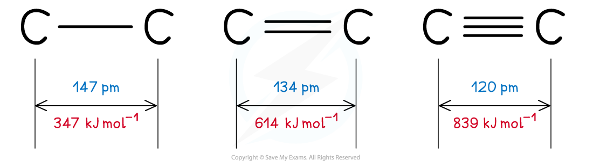

## Bond Length & Bond Strength

#### Bond energy

* The **bond energy** is the energy required to **break** one mole of a particular covalent bond in the gaseous states

  + Bond energy has units of kJ mol-1
* The **larger** the bond energy, the **stronger** the covalent bond is

#### Bond length

* The **bond length** is **internuclear distance of two covalently bonded atoms**

  + It is the distance from the nucleus of one atom to another atom which forms the covalent bond
* The **greater** the forces of attraction between electrons and nuclei, the more the atoms are pulled closer to each other
* This **decreases** the **bond** **length** of a molecule and **increases** the **strength** of the covalent bond
* **Triple bonds** are the **shortest** and **strongest** covalent bonds due to the large electron density between the nuclei of the two atoms
* This increase the forces of attraction between the electrons and nuclei of the atoms
* As a result of this, the atoms are pulled closer together causing a shorter bond length
* The increased forces of attraction also means that the covalent bond is **stronger**

***Triple bonds are the shortest covalent bonds and therefore the strongest ones***