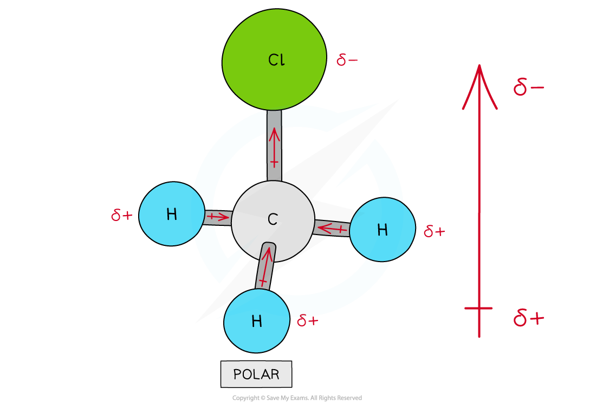

## Defining Electronegativity

* **Electronegativity** is the power of an atom to attract the pair of electrons in a covalent bond towards itself
* The electron distribution in a covalent bond between elements with different electronegativities will be unsymmetrical
* This phenomenon arises from the **positive** nucleus’s ability to attract the **negatively** charged electrons, in the outer shells, towards itself
* The **Pauling** **scale** is used to assign a value of electronegativity for each atom

***First three rows of the periodic table showing electronegativity values***

* Fluorine is the most electronegative atom on the Periodic Table, with a value of 4.0 on the **Pauling Scale**
* It is best at attracting electron density towards itself when covalently bonded to another atom

***Electron distribution in the C-F bond of fluoromethane***

#### Nuclear charge

* **Attraction** exists between the positively charged **protons** in the nucleus and negatively charged **electrons** found in the energy levels of an atom
* An **increase** in the number of **protons** leads to an **increase** in **nuclear** **attraction** for the electrons in the outer shells
* Therefore, an **increased nuclear charge**results in an **increased electronegativity**

#### Atomic radius

* The **atomic** **radius** is the distance between the nucleus and electrons in the **outermost shell**
* Electrons **closer** to the nucleus are more **strongly** attracted towards its positive **nucleus**
* Those electrons **further** **away** from the nucleus are **less strongly**attracted towards the **nucleus**
* Therefore, an **increased atomic radius**results in a **decreased electronegativity**

#### Shielding

* **Filled** energy levels can **shield**(mask) the effect of the nuclear charge causing the outer electrons to be **less attracted**to the nucleus
* Therefore, the addition of extra **shells and subshells**in an atom will cause the outer electrons to experience **less**of the attractive force of the nucleus

  + Sodium (period 3, group 1) has higher **electronegativity**than caesium (period 6, group 1) as it has fewer shells and therefore the outer electrons experience less shielding than in caesium
* Thus, an increased number of **inner shells and subshells**will result in a **decreased electronegativity**

#### Trends in electronegativity

* **Electronegativity** varies across **periods** and down the groups of the periodic table

#### Down a group

* There is a **decrease** in **electronegativity** going down the group
* The **nuclear charge increases** as more protons are being added to the nucleus
* However, each element has an extra filled electron shell, which increases **shielding**
* The addition of the extra shells increases the distance between the nucleus and the outer electrons resulting in **larger** **atomic radii**
* Overall, there is decrease in attraction between the nucleus and outer bonding electrons

***Electronegativity decreases going down the groups of the periodic table***

#### Across a period

* Electronegativity **increases** across a period
* The **nuclear charge increases** with the addition of protons to the nucleus
* **Shielding** remains relatively **constant** across the period as no new shells are being added to the atoms
* The nucleus has an increasingly strong attraction for the bonding pair of electrons of atoms across the period of the periodic table
* This results in **smaller atomic radii**

***Electronegativity increases going across the periods of the Periodic Table***

## Bond Polarity

* When two atoms in a covalent bond have the **same electronegativity**the covalent bond is **nonpolar**

***The two chlorine atoms have the same electronegativities so the bonding electrons are shared equally between the two atoms***

* The difference in electronegativities will dictate the type of bond that is formed
* When the electronegativities are very different (difference of more than 1.7) then ions will be formed and the bond will be ionic
* When two atoms in a covalent bond have a difference in electronegativities of 0.3 to 1.7 a covalent bond is formed and the bond will be polar

  + The electrons will be drawn towards the more electronegative atom
* As a result of this:

  + The negative charge centre and positive charge centre do not **coincide** with each other
  + This means that the **electron distribution** is **asymmetric**
  + The **less** **electronegative** atom gets a partial charge of δ+ (**delta** **positive**)
  + The **more** **electronegative** atom gets a partial charge of δ- (**delta** **negative**)
* The greater the difference in **electronegativity** the more polar the bond becomes

***Cl has a greater electronegativity than H causing the electrons to be more attracted towards the Cl atom which becomes delta negative and the H delta positive***

#### Assigning polarity to molecules

* To determine whether a molecule with **more than two atoms**is polar, the following things have to be taken into consideration:

  + The polarity of each bond
  + How the bonds are arranged in the molecule
* Some molecules have **polar bonds**but are overall not **polar** because the polar bonds in the molecule are arranged in such way that the individual dipole moments **cancel each other out**

***There are four polar covalent bonds in CH******3******Cl which do not cancel each other out causing CH******3******Cl to be a polar molecule; the overall dipole is towards the electronegative chlorine atom***

***Though CCl******4******has four polar covalent bonds, the individual dipole moments cancel each other out causing CCl******4******to be a nonpolar molecule***

* Further examples of molecules with no net dipole:

***Carbon dioxide and boron trifluoride have polar bonds but no net dipole***

#### Worked Example

Which molecule is non-polar?

**A**. NH3

**B**. CO

**C**. SO2

**D**. AlBr3

**Answer:**

The correct option is **D**.

The shapes and polarity of the molecules are as follows:

Although the Al-Br bonds are polar, the trigonal planar molecule is symmetrical so the dipoles cancel out leaving a non-polar molecule

#### Examiner Tips and Tricks

One of the clues about molecular polarity is to look at the symmetry of the molecule

Molecules which are symmetrical are unlikely to be polar