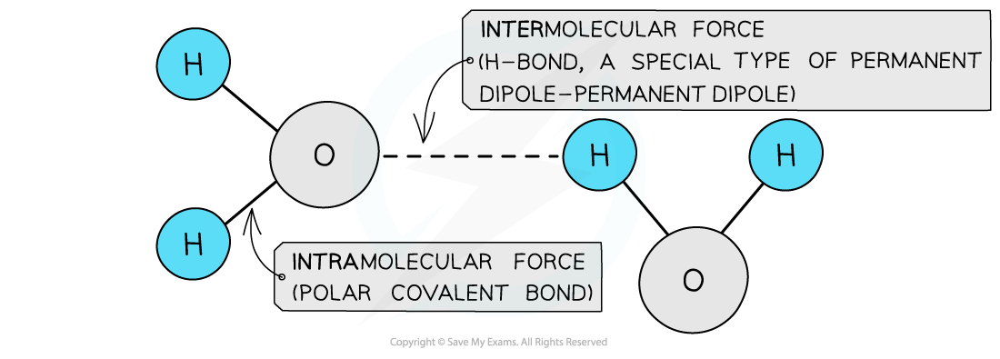
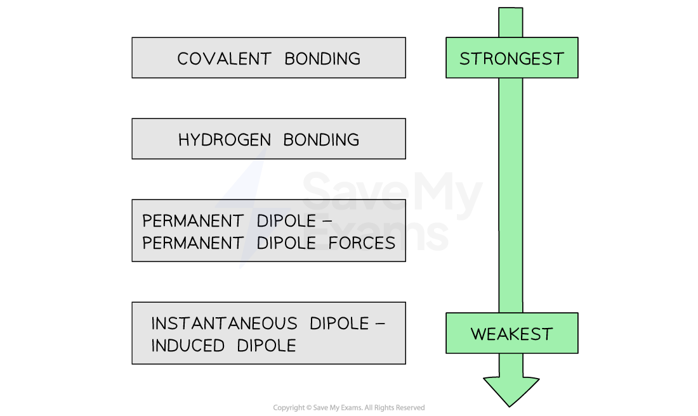

## Intermolecular Forces

#### Intramolecular forces

* **Intramolecular forces** are forces **within** a molecule and are usually covalent bonds
* **Covalent bonds** are formed when the outer electrons of two atoms are **shared**
* Single, double, triple and co-ordinate bonds are all types of intramolecular forces

#### Intermolecular forces

* Molecules also contain weaker **intermolecular forces** which are forces **between** the molecules
* There are three types of intermolecular forces:

  + **Induced** **dipole – dipole forces** also called **van der Waals** or **London dispersion forces**
  + **Permanent dipole – dipole forces** are the attractive forces between two neighbouring molecules with a permanent dipole
  + **Hydrogen Bonding**are a special type of **permanent dipole - permanent dipole**forces
  + **Intramolecular forces** are **stronger** than intermolecular forces

    - For example, a hydrogen bond is about one tenth the strength of a covalent bond
  + The strengths of the types of bond or force are as follows:

***The varying strengths of different types of bonds***

#### Induced dipole-dipole forces:

* **Induced dipole - dipole forces** exist between all atoms or molecules

  + They are also known as**London dispersion forces**

    

* The **electron charge cloud** in non-polar molecules or atoms are constantly moving
* During this movement, the electron charge cloud can be more on one side of the atom or molecule than the other
* This causes a **temporary dipole** to arise
* This **temporary dipole** can **induce** a dipole on neighbouring molecules
* When this happens, the **δ+ end of the dipole** in one molecule and the **δ- end of the dipole** in a neighbouring molecule are **attracted** towards each other
* Because the electron clouds are moving constantly, the dipoles are only **temporary**

#### Relative strength

* For small molecules with **the same number of electrons,** permanent dipoles are **stronger** than induced dipoles

  + Butane and propanone have the same number of electrons
  + Butane is a nonpolar molecule and will have induced dipole forces
  + Propanone is a polar molecule and will have permanent dipole forces
  + Therefore, more energy is required to break the intermolecular forces between propanone molecules than between butane molecules
  + So, propanone has a higher boiling point than butane

***Pd-pd forces are stronger than id-id forces in smaller molecules with an equal number of electrons***

#### Permanent dipole - dipole forces:

* **Polar molecules** have **permanent dipoles**
* The molecule will always have a **negatively** and **positively charged end**

* Forces between two molecules that have permanent dipoles are called **permanent dipole - dipole forces**
* The **δ+ end of the dipole** in one molecule and the **δ- end of the dipole** in a neighbouring molecule are **attracted** towards each other

#### Hydrogen bonding

* **Hydrogen bonding** is the **strongest** form of **intermolecular bonding**

  + Intermolecular bonds are bonds **between** molecules
  + Hydrogen bonding is a type of **permanent dipole – permanent dipole** bonding
* For hydrogen bonding to take place the following is needed:

  + A species which has an **O,** **N or F** (very **electronegative**) atom bonded to a hydrogen

* When hydrogen is covalently bonded to an **O**, **N** or **F**, the bond becomes highly **polarised**
* The H becomes so **δ****+** charged that it can form a bond with the **lone pair** of an **O**, **N or F** atom in another molecule
* For example, in water

  + Water can form two hydrogen bonds, because the O has two lone pairs

***Hydrogen bonding in water***

#### Examiner Tips and Tricks

Make sure to use a **dashed, straight line** when drawing your intermolecular forces! Hydrogen bonds should **start at the lone pair** and go **right up to the delta positive atom** - it must be really clear where your H bond starts and ends.