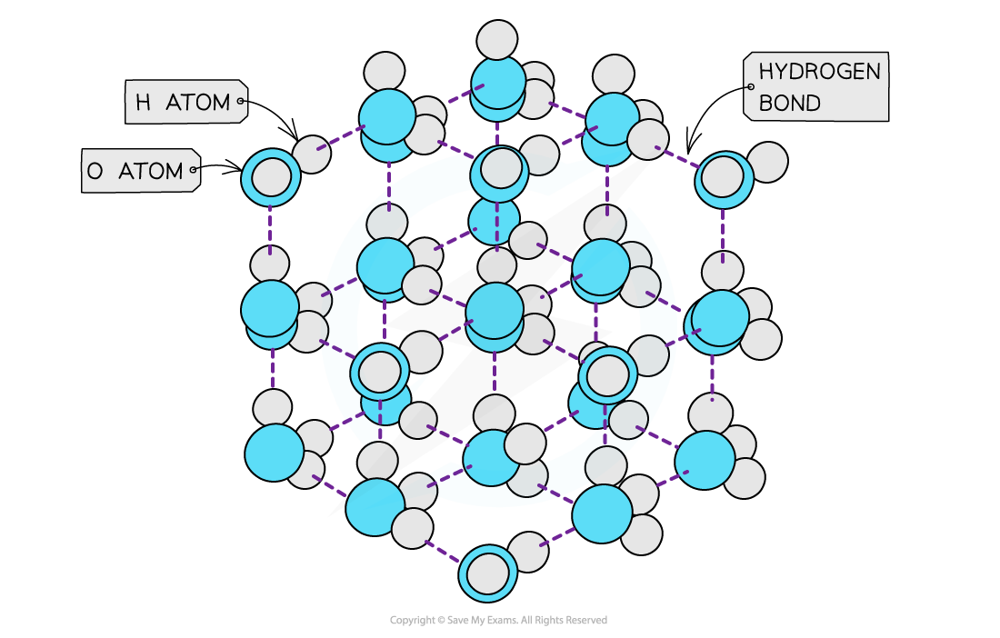

## Hydrogen Bonding Interactions

Examples of compounds that can form hydrogen bonds are:

* Alcohols (contains an O-H bond)
* Ammonia (contains an N-H bond)
* Amines (contains an N-H bond)
* Carboxylic acids (contains an O-H bond)
* Hydrogen fluoride (contains an H-F bond)
* Proteins (contains an N-H bond)

***Ammonia can form a maximum of one hydrogen bond per molecule***

## Anomalous Properties of Water

#### Properties of water

* Hydrogen bonding in water, causes it to have **anomalous properties** such as high melting and boiling points, high surface tension and a higher density in the liquid than the solid

#### High melting & boiling points

* Water has high **melting** and **boiling points** due to the the **strong intermolecular forces** of hydrogen bonding between the molecules in both ice (solid H2O) and water (liquid H2O)
* A lot of energy is therefore required to separate the water molecules and melt or boil them

***Hydrogen bonds are strong intermolecular forces which are harder to break causing water to have a higher melting and boiling point than would be expected for a molecule of such a small size***

* The graph below compares the **enthalpy of vaporisation** (energy required to boil a substance) of different hydrides
* The enthalpy changes **increase** going from H2S to H2Te due to the increased number of electrons in the Group 16 elements
* This causes an increase in the **instantaneous dipole - induced dipole forces (dispersion forces)** as the molecules become larger
* Based on this, H2O should have a much lower enthalpy change (around 17 kJ mol**-1**)
* However, the enthalpy change of vaporisation is almost 3 times **larger** which is caused by the **hydrogen bonds** present in water but not in the other hydrides

***The high enthalpy change of evaporation of water suggests that instantaneous dipole-induced dipole forces are not the only forces present in the molecule – there are also strong hydrogen bonds, which cause the high boiling point***

#### High surface tension

* Water has a **high surface tension**
* **Surface** **tension** is the ability of a **liquid surface** to resist any **external forces** (i.e. to stay unaffected by forces acting on the surface)
* The water molecules at the **surface** of liquid are bonded to other water molecules through **hydrogen bonds**
* These molecules **pull downwards** the **surface molecules** causing the surface of them to become compressed and more tightly together at the surface
* This increases water’s **surface** **tension**

***The surface molecules are pulled downwards due to the hydrogen bonds with other molecules, whereas the inner water molecules are pulled in all directions***

#### Density

* **Solids** are **denser** than their **liquids** as the particles in solids are more **closely packed** together than in their liquid state
* The water molecules are packed into an open lattice
* This way of packing the molecules and the relatively long **bond lengths** of the hydrogen bonds means that the water molecules are slightly further apart than in the liquid form
* Therefore, ice has a lower density than liquid water by about 9%

***The ‘more open’ structure of molecules in ice causes it to have a lower density than liquid water***