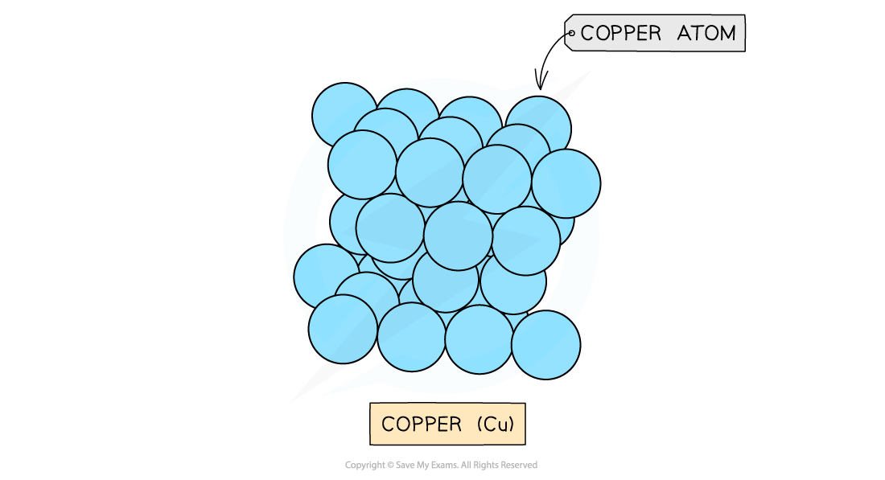
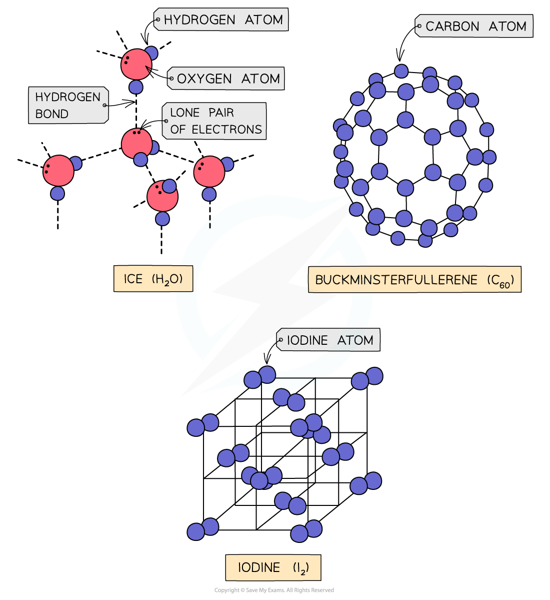

## Giant Lattices

#### Ionic Lattices

* The ions form a **lattice** **structure** which is an evenly distributed **crystalline** structure
* Ions in a lattice are arranged in a **regular** **repeating** **pattern** so that positive charges cancel out negative charges
* The attraction between the cations and anions is occurring in all directions

  + Each ion is attracted to all of the oppositely charged ions around it
* Therefore the final lattice is overall electrically **neutral**

***Ionic solids are arranged in lattice structures***

#### Metallic Lattices

* Metals form **giant metallic lattices** in which the metal ions are surrounded by a ‘sea’ of **delocalised** electrons
* The metal ions are often packed in **hexagonal layers** or in a **cubic arrangement**
* This layered structure with the delocalised electrons gives a metal its key properties

***Layers of copper ions (the delocalised electrons are not shown in the diagram)***

#### Covalent lattices

* **Covalent bonds** are bonds between nonmetals in which electrons are **shared** between the atoms
* Covalent compounds can be arranged in **simple molecular** or **giant molecular** **lattices**

  + Simple molecular lattices: iodine, buckminsterfullerene (C60) and ice
  + Giant molecular: silicon(IV) oxide, graphite and diamond

***Simple molecular lattices***

***Giant molecular lattices***

#### Examiner Tips and Tricks

Graphite, diamond and buckminsterfullerene are all **allotropes** of carbon; they are different **structural forms** of the same element (which is carbon).