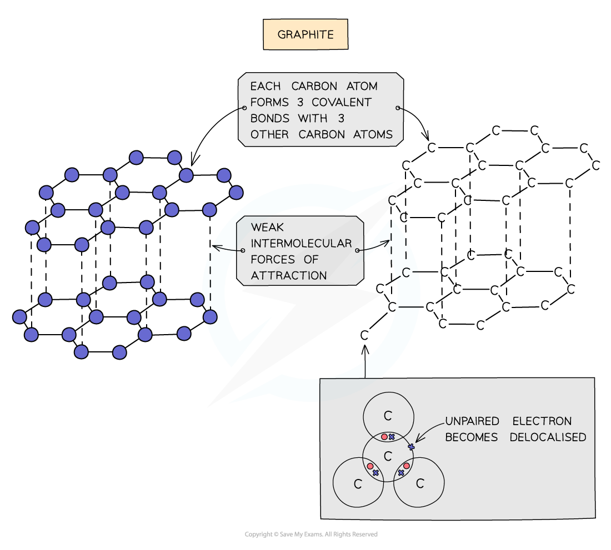
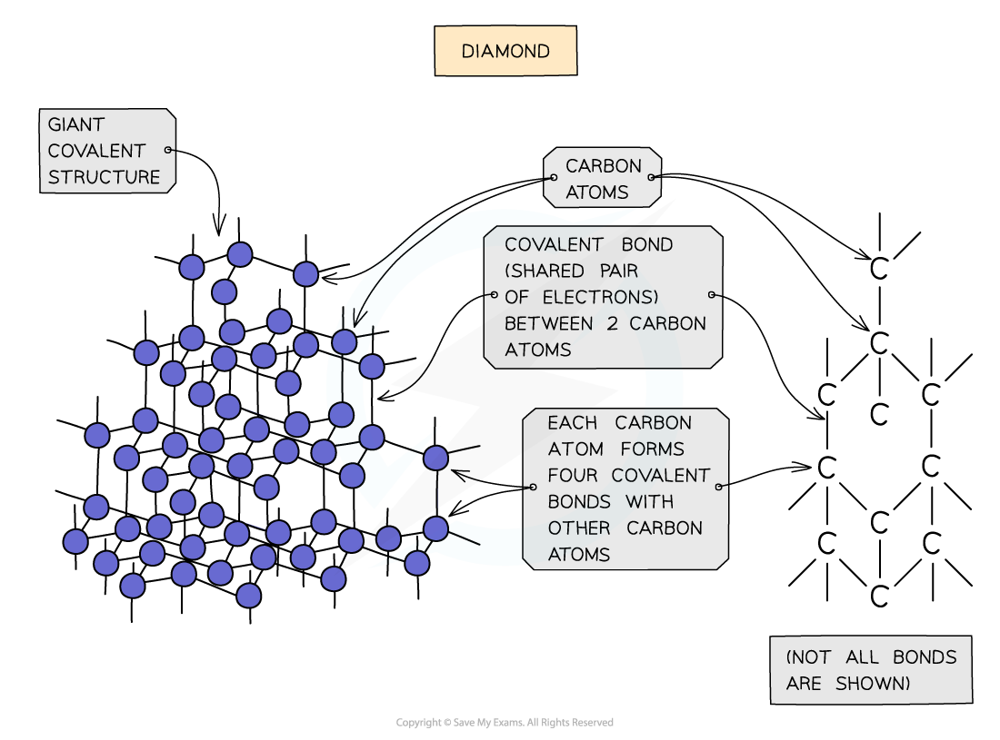
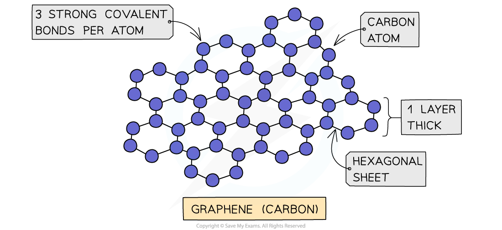

## Simple Molecular Compounds

#### Simple Molecular Compounds

* Covalent substances tend to have small molecular structures, such as Cl2, H2O or CO2
* These small molecules are known as **simple molecules**
* Hydrogen (H2), chlorine (Cl2), oxygen (O2), nitrogen (N2), hydrogen chloride (HCl), water (H2O), ammonia (NH3) and methane (CH4) are also examples of simple molecules
* Iodine is a simple molecule and can be represented but it exists as a crystalline structure involving a regular structure held together by weak London dispersion forces

***Dot cross diagram of an iodine molecule***

## Carbon Allotropes

#### Covalent bonding & giant covalent lattice structures

* **Giant covalent lattices** have **very high** **melting** and **boiling points**

  + These compounds have a large number of **covalent bonds** linking the whole structure
  + A lot of energy is required to break the lattice
* The compounds can be **hard** or **soft**

  + Graphite is **soft** as the forces between the carbon layers are weak
  + Diamond and silicon(IV) oxide are **hard** as it is difficult to break their 3D network of strong covalent bonds
* Most compounds are insoluble with water
* Most compounds do not **conduct electricity** however some do

  + Graphite has **delocalised** electrons between the carbon layers which can move along the layers when a voltage is applied
  + Diamond and silicon(IV) oxide do not conduct electricity as all four outer electrons on every carbon atom are involved in a **covalent bond** so there are no freely moving electrons available

#### Graphite

* Each carbon atom in graphite is bonded to **three** others forming **layers** of **hexagons**, leaving one free electron per carbon atom
* These free electrons migrate along the layers and are free to move and carry charge, hence graphite can **conduct electricity**
* The covalent bonds within the layers are very strong, but the layers are attracted to each other by weak **intermolecular forces**, so the layers can **slide** over each other making graphite **soft** and**slippery**

***Diagram showing the structure and bonding arrangement in graphite***

#### Diamond

* In diamond, each carbon atom bonds with four other carbons, forming a **tetrahedron**
* All the covalent bonds are identical, very strong and there are no **intermolecular forces**

***Diagram showing the structure and bonding arrangement in diamond***

#### Graphene

* Graphene consists of a single layer of graphite which is a sheet of carbon atoms covalently bonded forming a continuous hexagonal layer
* It is essentially a 2D molecule since it is only one atom thick
* It has very unusual properties make it useful in fabricating**composite** materials and in **electronics**

***Graphene is a truly remarkable material that has some unexpected properties***