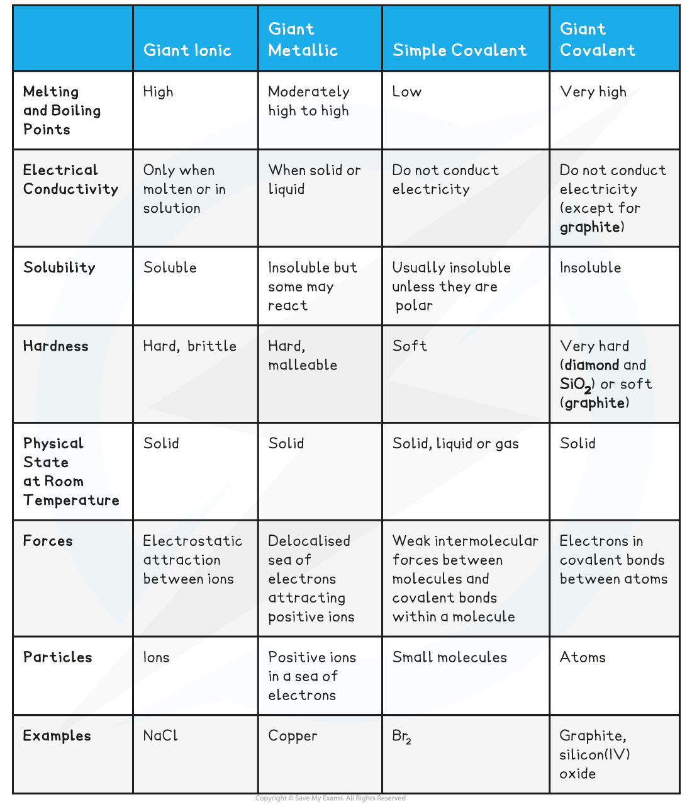

## Predicting Structure & Bonding

* Different types of **structure** and **bonding** have different effects on the **physical properties** of substances such as their **melting** and **boiling points**, **electrical conductivity** and **solubility**

**Characteristics of Different Compound Structure Types Table**

## Predicting Physical Properties

#### Worked Example

**Bonding & structure**

The table below shows the physical properties of substances X, Y and Z

Which one of the following statements about X and Y is completely true?

**Statement 1:** X has a giant ionic structure, Y has a giant molecular structure, Z is a metal

**Statement 2:** X is a metal, Y has a simple molecular structure, Z has a giant molecular structure

**Statement 3:** X is a metal, Y has a simple molecular structure, Z has a giant ionic structure

**Statement 4:** X has a giant ionic structure, Y has a simple molecular structure, Z is a metal

**Answer**

The correct answer is **Statement 4**

* The relatively high melting point, solubility in water and electrical conductivity when molten suggest that **X** is a **giant ionic structure.**

  + The low melting point of **Y** suggests that little energy is needed to break the lattice which corresponds to a **simple molecular structure**. This is further supported by the low electrical conductivity and its being almost insoluble in water.
  + Compound **Z** has a very high melting point which is characteristic of either metallic or giant molecular lattices, however since it conducts electricity, compound Z must be a **giant metallic lattice.**

#### Worked Example

**Bonding & structure**

Compound X has the following properties:

What is the most probable structure of X?

**A**. Network covalent

**B**. Polar covalent molecule

**C**. Ionic lattice

**D**. Metallic lattice

**Answer:**

The correct option is **A**

* A high melting point is characteristic of a giant structure, which could be metallic, ionic or covalent

  + The poor conductivity as a liquid and solid would match a giant covalent or network covalent structure