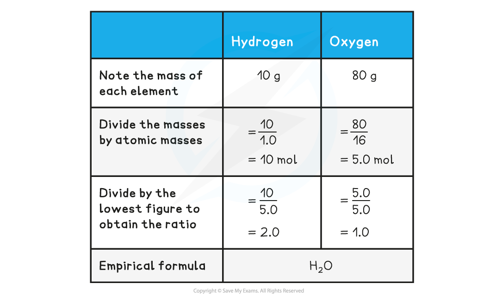
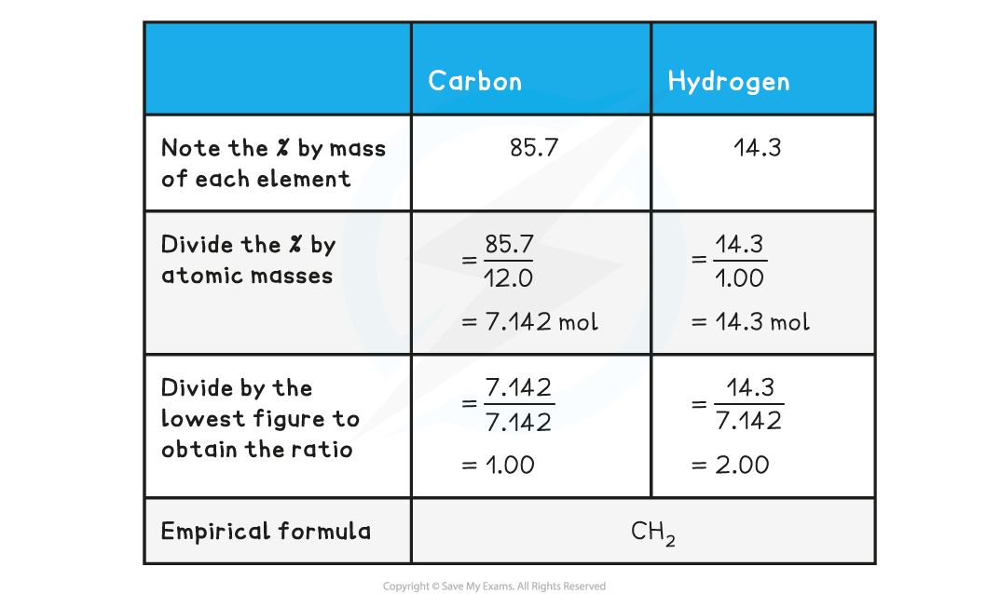
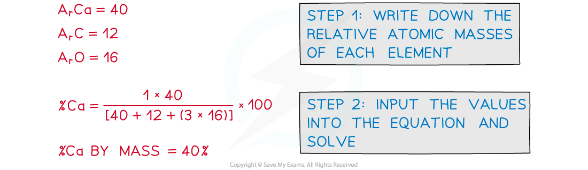

## Empirical & Molecular Formula Definitions

* The **molecular** **formula** is the formula that shows the **number** and **type** of each atom in a molecule

  + E.g. the molecular formula of ethanoic acid is C2H4O2
* The **empirical** **formula** is the simplest whole number ratio of atoms of each element present in one molecule or formula unit of a compound

  + E.g. the empirical formula of ethanoic acid is CH2O

## Empirical & Molecular Formula Calculations

#### Empirical formula

* **Empirical formula** is the **simplest whole number ratio** of the elements present in one molecule or formula unit of the compound
* It is calculated from knowledge of the ratio of masses of each element in the compound
* The empirical formula can be found by determining the **mass** of each element present in a sample of the compound
* It can also be deduced from data that gives the **percentage compositions by mass** of the elements in a compound

#### Worked Example

**Empirical formula from mass** Determine the empirical formula of a compound that contains 10 g of hydrogen and 80 g of oxygen.

**Answer:**

* The above example shows how to calculate empirical formula from the mass of each element present in the compound
* The example below shows how to calculate the empirical formula from percentage composition

#### Worked Example

**Empirical formula from %** Determine the empirical formula of a compound that contains 85.7% carbon and 14.3% hydrogen.

**Answer:**

#### Molecular formula

* The **molecular formula** gives the exact numbers of atoms of each element present in the formula of the compound
* The molecular formula can be found by dividing the **relative** **formula** **mass** of the **molecular formula** by the **relative formula mass** of the **empirical formula**
* **Multiply** the number of each element present in the empirical formula by this number to find the molecular formula

#### Worked Example

**Calculating molecular formula** The empirical formula of X is C4H10S and the relative molecular mass of X is 180.2

What is the molecular formula of X?

(*A*r data: C = 12.0, H = 1.0, S = 32.1 )

**Answer**

**Step 1:** Calculate relative mass of the empirical formula

* Relative empirical mass = (C x 4) + (H x 10) + (S x 1)

  + Relative empirical mass = (12.0 x 4) + (1.0 x 10) + (32.1 x 1)
  + Relative empirical mass = 90.1

**Step 2:** Divide relative formula mass of **X** by relative empirical mass

* Ratio between Mr of X and the Mr of the empirical formula = 180.2 / 90.1

  + Ratio between Mr of X and the Mr of the empirical formula = 2

**Step 3:** Multiply each number of elements by 2

* (C4 x 2) + (H10 x 2) + (S x 2)     =    (C8) + (H20) + (S2)

  + Molecular Formula of **X** is C8H20S2

#### Water of Crystallisation

* **Water of crystallisation** is when some compounds can form **crystals**which have **water**as part of their structure
* A compound that contains water of crystallisation is called a **hydrated compound**
* The water of crystallisation is separated from the main formula by a **dot** when writing the chemical formula of hydrated compounds

  + E.g. hydrated copper(II) sulfate is CuSO4**∙**5H2O
* A compound which doesn’t contain water of crystallisation is called an **anhydrous compound**

  + E.g. anhydrous copper(II) sulfate is CuSO4
* A compound can be hydrated to **different degrees**

  + E.g. cobalt(II) chloride can be hydrated by **six** or **two** water molecules
  + CoCl2 **∙**6H2O or CoCl2 **∙**2H2O

* The conversion of anhydrous compounds to hydrated compounds is reversible by heating the hydrated salt:

Hydrated:        CuSO4•5H2O ⇌ CuSO4 + 5H2O        :Anhydrous

* The degree of hydration can be calculated from experimental results:

  + The mass of the hydrated salt must be measured before heating
  + The salt is then heated until it reaches a constant mass
  + The two mass values can be used to calculate the number of moles of water in the hydrated salt - known as the water of crystallisation

#### Worked Example

**Calculating water of crystallisation** 10.0 g of hydrated copper sulfate are heated to a constant mass of 5.59 g. Calculate the formula of the original hydrated copper sulfate. (*M*r data: CuSO4 = 159.6, H2O = 18.0)

**Answer:**

|  |  |  |
| --- | --- | --- |
| List the components | CuSO4 | H2O |
| Note the mass of each component | 5.59 g | 10 - 5.59 = 4.41 g |
| Divide the component mass by the components *M*r | begin mathsize 14px style fraction numerator 5.59 over denominator 159.6 end fraction end style = 0.035 | begin mathsize 14px style fraction numerator 4.41 over denominator 18.0 end fraction end style = 0.245 |
| Divide by the lowest figure to obtain the ratio | fraction numerator 0.035 over denominator 0.035 end fraction= 1 | fraction numerator 0.245 over denominator 0.035 end fraction= 7 |
| Hydrated salt formula | CuSO4•7H2O |  |

#### Ideal Gas Equation

* The **ideal gas equation** is:

*PV* = *nRT*

* *P* = pressure in pascals (Pa)

  + *V* = volume in cubic metres (m3)
  + *n* = the amount of substance in moles (mol)
  + *R* = the gas constant, which is given in the Data Booklet as 8.31 J mol-1 K-1
  + *T* = temperature in Kelvin (K)

#### Examiner Tips and Tricks

There are several calculations in Chemistry where you need to convert the units to or from SI units

The ideal gas equation has three:

1. Pressure is often quoted in kPa but the calculation needs pressure in Pa

   * kPa to Pa = multiply by 1000 or 103
2. Volume is usually quoted in cm3 or dm3 but the calculation needs volume in m3

   * cm3 to m3 = divide by 1000000 or multiply by 10-6
   * dm3 to m3 = divide by 1000 or multiply by 10-3
3. Temperature can be quoted in Kelvin or Celsius

   * Celsius to Kelvin = + 273

This is why you should always show your working! Examiners can't take all of your marks for one error, if you show your working then they should check through for errors and award marks accordingly

* The ideal gas equation can be used to find the amount of moles in a gaseous substance

  + It can also be used for volatile liquids at temperatures above their boiling point
* If the mass of the substance is known, then the molar mass can be calculated

  + This can then be used with empirical formula data to determine the molecular formula of a compound

#### Worked Example

An unknown compound was analysed and found to contain 66.7% of carbon, 11.1% hydrogen and the remainder was oxygen

0.135 g of the unknown compound had a volume of 56.0 cm3 at a temperature of 90 oC and a pressure of 101 kPa

Determine the molecular formula of the unknown compound

**Answer:**

**Step 1:**Calculate the number of moles of carbon, hydrogen and oxygen

|  |  |  |
| --- | --- | --- |
| Carbon: begin mathsize 16px style fraction numerator 66.7 over denominator 12.0 end fraction space equals space end style5.558 moles | Hydrogen: begin mathsize 16px style fraction numerator 11.1 over denominator 1.00 end fraction space equals end style11.1 moles | Oxygen: begin mathsize 16px style fraction numerator left parenthesis 100 space minus space 66.7 space minus space 11.1 right parenthesis over denominator 16.0 end fraction space equals end style1.3875 moles |

**Step 2:** Divide by the smallest answer to get the ratio

|  |  |  |
| --- | --- | --- |
| Carbon: fraction numerator 5.558 over denominator 1.3875 end fraction space equals4 | Hydrogen: fraction numerator 11.1 over denominator 1.3875 end fraction space equals8 | Oxygen: fraction numerator 1.3875 over denominator 1.3875 end fraction space equals1 |

**Step 3:**State the empirical formula

* The empirical formula is C4H8O

**Step 4:** Calculate the amount in moles, using *PV* = *nRT*

* *n* = %3C%2Fmo%3E%3Cmo%3E%26%23xA0%3B%3C%2Fmo%3E%3Cmo%3E%26%23xD7%3B%3C%2Fmo%3E%3Cmo%3E(%3C%2Fmo%3E%3Cmn%3E56%3C%2Fmn%3E%3Cmo%3E.%3C%2Fmo%3E%3Cmn%3E0%3C%2Fmn%3E%3Cmo%3E%26%23xD7%3B%3C%2Fmo%3E%3Cmsup%3E%3Cmn%3E10%3C%2Fmn%3E%3Cmrow%3E%3Cmo%3E-%3C%2Fmo%3E%3Cmn%3E6%3C%2Fmn%3E%3C%2Fmrow%3E%3C%2Fmsup%3E%3Cmo%3E)%3C%2Fmo%3E%3C%2Fmrow%3E%3Cmrow%3E%3Cmn%3E8%3C%2Fmn%3E%3Cmo%3E.%3C%2Fmo%3E%3Cmn%3E31%3C%2Fmn%3E%3Cmo%3E%26%23xA0%3B%3C%2Fmo%3E%3Cmo%3E%26%23xD7%3B%3C%2Fmo%3E%3Cmo%3E%26%23xA0%3B%3C%2Fmo%3E%3Cmo%3E(%3C%2Fmo%3E%3Cmn%3E90%3C%2Fmn%3E%3Cmo%3E%26%23xA0%3B%3C%2Fmo%3E%3Cmo%3E%2B%3C%2Fmo%3E%3Cmo%3E%26%23xA0%3B%3C%2Fmo%3E%3Cmn%3E273%3C%2Fmn%3E%3Cmo%3E)%3C%2Fmo%3E%3C%2Fmrow%3E%3C%2Fmfrac%3E%3Cmo%3E%3D%3C%2Fmo%3E%3C%2Fmath%3E--%3E%3Cdefs%3E%3Cstyle%20type%3D%22text%2Fcss%22%3E%40font-face%7Bfont-family%3A'math123f7a45a6b7da449a8d1acd385'%3Bsrc%3Aurl(data%3Afont%2Ftruetype%3Bcharset%3Dutf-8%3Bbase64%2CAAEAAAAMAIAAAwBAT1MvMi7iBBMAAADMAAAATmNtYXDEvmKUAAABHAAAAFRjdnQgDVUNBwAAAXAAAAA6Z2x5ZoPi2VsAAAGsAAACKmhlYWQQC2qxAAAD2AAAADZoaGVhCGsXSAAABBAAAAAkaG10eE2rRkcAAAQ0AAAAGGxvY2EAHTwYAAAETAAAABxtYXhwBT0FPgAABGgAAAAgbmFtZaBxlY4AAASIAAABn3Bvc3QB9wD6AAAGKAAAACBwcmVwa1uragAABkgAAAAUAAADSwGQAAUAAAQABAAAAAAABAAEAAAAAAAAAQEAAAAAAAAAAAAAAAAAAAAAAAAAAAAAAAAAAAAAACAgICAAAAAg1UADev96AAAD6ACWAAAAAAACAAEAAQAAABQAAwABAAAAFAAEAEAAAAAMAAgAAgAEACsALgA9ANciEv%2F%2FAAAAKwAuAD0A1yIS%2F%2F%2F%2F1v%2FU%2F8b%2FLd3zAAEAAAAAAAAAAAAAAAAAAAFUAywAgAEAAFYAKgJYAh4BDgEsAiwAWgGAAoAAoADUAIAAAAAAAAAAKwBVAIAAqwDVAQABKwAHAAAAAgBVAAADAAOrAAMABwAAMxEhESUhESFVAqv9qwIA%2FgADq%2FxVVQMAAAEAgABVAtUCqwALAEkBGLIMAQEUExCxAAP2sQEE9bAKPLEDBfWwCDyxBQT1sAY8sQ0D5gCxAAATELEBBuSxAQETELAFPLEDBOWxCwX1sAc8sQkE5TEwEyERMxEhFSERIxEhgAEAVQEA%2FwBV%2FwABqwEA%2FwBW%2FwABAAABACAAAACgAIAAAwAvGAGwBBCwA9SwAxCwAtSwAxCwADywAhCwATwAsAQQsAPUsAMQsAI8sAAQsAE8MDE3MxUjIICAgIAAAgCAAOsC1QIVAAMABwBlGAGwCBCwBtSwBhCwBdSwCBCwAdSwARCwANSwBhCwBzywBRCwBDywARCwAjywABCwAzwAsAgQsAbUsAYQsAfUsAcQsAHUsAEQsALUsAYQsAU8sAcQsAQ8sAEQsAA8sAIQsAM8MTATITUhHQEhNYACVf2rAlUBwFXVVVUAAgCAAFUC1QKAAAMABwBGGLABFACxAAATELEACeSxAAETELAEPLEGCPSwAjwwAbEIARMQsQAD9rAHPLEBBfWwBjyyBQcAEPSwAjyxCQPmsQQF9bADPBMzASMRMwEjgFUCAFVV%2FgBVAoD91QIr%2FdUAAQCAAVUC1QGrAAMAMBgBsAQQsQAD9rADPLECB%2FWwATyxBQPmALEAABMQsQAG5bEAARMQsAE8sQMF9bACPBMhFSGAAlX9qwGrVgAAAAEAAAABAADVeM5BXw889QADBAD%2F%2F%2F%2F%2F1joTc%2F%2F%2F%2F%2F%2FWOhNzAAD%2FIASAA6sAAAAKAAIAAQAAAAAAAQAAA%2Bj%2FagAAF3AAAP%2B2BIAAAQAAAAAAAAAAAAAAAAAAAAYDUgBVA1YAgADIACADVgCAA1YAgANWAIAAAAAAAAAAKAAAAKEAAADnAAABcQAAAeAAAAIqAAEAAAAGAF4ABQAAAAAAAgCABAAAAAAABAAA3gAAAAAAAAAVAQIAAAAAAAAAAQASAAAAAAAAAAAAAgAOABIAAAAAAAAAAwAwACAAAAAAAAAABAASAFAAAAAAAAAABQAWAGIAAAAAAAAABgAJAHgAAAAAAAAACAAcAIEAAQAAAAAAAQASAAAAAQAAAAAAAgAOABIAAQAAAAAAAwAwACAAAQAAAAAABAASAFAAAQAAAAAABQAWAGIAAQAAAAAABgAJAHgAAQAAAAAACAAcAIEAAwABBAkAAQASAAAAAwABBAkAAgAOABIAAwABBAkAAwAwACAAAwABBAkABAASAFAAAwABBAkABQAWAGIAAwABBAkABgAJAHgAAwABBAkACAAcAIEATQBhAHQAaAAgAEYAbwBuAHQAUgBlAGcAdQBsAGEAcgBNAGEAdABoAHMAIABGAG8AcgAgAE0AbwByAGUAIABNAGEAdABoACAARgBvAG4AdABNAGEAdABoACAARgBvAG4AdABWAGUAcgBzAGkAbwBuACAAMQAuADBNYXRoX0ZvbnQATQBhAHQAaABzACAARgBvAHIAIABNAG8AcgBlAAADAAAAAAAAAfQA%2BgAAAAAAAAAAAAAAAAAAAAAAAAAAuQcRAACNhRgAsgAAABUUE7EAAT8%3D)format('truetype')%3Bfont-weight%3Anormal%3Bfont-style%3Anormal%3B%7D%40font-face%7Bfont-family%3A'round_brackets18549f92a457f2409'%3Bsrc%3Aurl(data%3Afont%2Ftruetype%3Bcharset%3Dutf-8%3Bbase64%2CAAEAAAAMAIAAAwBAT1MvMjwHLFQAAADMAAAATmNtYXDf7xCrAAABHAAAADxjdnQgBAkDLgAAAVgAAAASZ2x5ZmAOz2cAAAFsAAABJGhlYWQOKih8AAACkAAAADZoaGVhCvgVwgAAAsgAAAAkaG10eCA6AAIAAALsAAAADGxvY2EAAARLAAAC%2BAAAABBtYXhwBIgEWQAAAwgAAAAgbmFtZXHR30MAAAMoAAACOXBvc3QDogHPAAAFZAAAACBwcmVwupWEAAAABYQAAAAHAAAGcgGQAAUAAAgACAAAAAAACAAIAAAAAAAAAQIAAAAAAAAAAAAAAAAAAAAAAAAAAAAAAAAAAAAAACAgICAAAAAo8AMGe%2F57AAAHPgGyAAAAAAACAAEAAQAAABQAAwABAAAAFAAEACgAAAAGAAQAAQACACgAKf%2F%2FAAAAKAAp%2F%2F%2F%2F2f%2FZAAEAAAAAAAAAAAFUAFYBAAAsAKgDgAAyAAcAAAACAAAAKgDVA1UAAwAHAAA1MxEjEyMRM9XVq4CAKgMr%2FQAC1QABAAD%2B0AIgBtAACQBNGAGwChCwA9SwAxCwAtSwChCwBdSwBRCwANSwAxCwBzywAhCwCDwAsAoQsAPUsAMQsAfUsAoQsAXUsAoQsADUsAMQsAI8sAcQsAg8MTAREAEzABEQASMAAZCQ%2FnABkJD%2BcALQ%2FZD%2BcAGQAnACcAGQ%2FnAAAQAA%2FtACIAbQAAkATRgBsAoQsAPUsAMQsALUsAoQsAXUsAUQsADUsAMQsAc8sAIQsAg8ALAKELAD1LADELAH1LAKELAF1LAKELAA1LADELACPLAHELAIPDEwARABIwAREAEzAAIg%2FnCQAZD%2BcJABkALQ%2FZD%2BcAGQAnACcAGQ%2FnAAAQAAAAEAAPW2NYFfDzz1AAMIAP%2F%2F%2F%2F%2FVre7u%2F%2F%2F%2F%2F9Wt7u4AAP7QA7cG0AAAAAoAAgABAAAAAAABAAAHPv5OAAAXcAAA%2F%2F4DtwABAAAAAAAAAAAAAAAAAAAAAwDVAAACIAAAAiAAAAAAAAAAAAAkAAAAowAAASQAAQAAAAMACgACAAAAAAACAIAEAAAAAAAEAABNAAAAAAAAABUBAgAAAAAAAAABAD4AAAAAAAAAAAACAA4APgAAAAAAAAADAFwATAAAAAAAAAAEAD4AqAAAAAAAAAAFABYA5gAAAAAAAAAGAB8A%2FAAAAAAAAAAIABwBGwABAAAAAAABAD4AAAABAAAAAAACAA4APgABAAAAAAADAFwATAABAAAAAAAEAD4AqAABAAAAAAAFABYA5gABAAAAAAAGAB8A%2FAABAAAAAAAIABwBGwADAAEECQABAD4AAAADAAEECQACAA4APgADAAEECQADAFwATAADAAEECQAEAD4AqAADAAEECQAFABYA5gADAAEECQAGAB8A%2FAADAAEECQAIABwBGwBSAG8AdQBuAGQAIABiAHIAYQBjAGsAZQB0AHMAIAB3AGkAdABoACAAYQBzAGMAZQBuAHQAIAAxADgANQA0AFIAZQBnAHUAbABhAHIATQBhAHQAaABzACAARgBvAHIAIABNAG8AcgBlACAAUgBvAHUAbgBkACAAYgByAGEAYwBrAGUAdABzACAAdwBpAHQAaAAgAGEAcwBjAGUAbgB0ACAAMQA4ADUANABSAG8AdQBuAGQAIABiAHIAYQBjAGsAZQB0AHMAIAB3AGkAdABoACAAYQBzAGMAZQBuAHQAIAAxADgANQA0AFYAZQByAHMAaQBvAG4AIAAyAC4AMFJvdW5kX2JyYWNrZXRzX3dpdGhfYXNjZW50XzE4NTQATQBhAHQAaABzACAARgBvAHIAIABNAG8AcgBlAAAAAAMAAAAAAAADnwHPAAAAAAAAAAAAAAAAAAAAAAAAAAC5B%2F8AAY2FAA%3D%3D)format('truetype')%3Bfont-weight%3Anormal%3Bfont-style%3Anormal%3B%7D%3C%2Fstyle%3E%3C%2Fdefs%3E%3Ctext%20font-family%3D%22math123f7a45a6b7da449a8d1acd385%22%20font-size%3D%2216%22%20text-anchor%3D%22middle%22%20x%3D%228.5%22%20y%3D%2231%22%3E%3D%3C%2Ftext%3E%3Cline%20stroke%3D%22%23000%22%20stroke-linecap%3D%22square%22%20stroke-width%3D%221%22%20x1%3D%2219.5%22%20x2%3D%2246.5%22%20y1%3D%2224.5%22%20y2%3D%2224.5%22%2F%3E%3Ctext%20font-family%3D%22Times%20New%20Roman%22%20font-size%3D%2218%22%20font-style%3D%22italic%22%20text-anchor%3D%22middle%22%20x%3D%2226.5%22%20y%3D%2217%22%3EP%3C%2Ftext%3E%3Ctext%20font-family%3D%22Times%20New%20Roman%22%20font-size%3D%2218%22%20font-style%3D%22italic%22%20text-anchor%3D%22middle%22%20x%3D%2237.5%22%20y%3D%2217%22%3EV%3C%2Ftext%3E%3Ctext%20font-family%3D%22Times%20New%20Roman%22%20font-size%3D%2218%22%20font-style%3D%22italic%22%20text-anchor%3D%22middle%22%20x%3D%2227.5%22%20y%3D%2242%22%3ER%3C%2Ftext%3E%3Ctext%20font-family%3D%22Times%20New%20Roman%22%20font-size%3D%2218%22%20font-style%3D%22italic%22%20text-anchor%3D%22middle%22%20x%3D%2238.5%22%20y%3D%2242%22%3ET%3C%2Ftext%3E%3Ctext%20font-family%3D%22math123f7a45a6b7da449a8d1acd385%22%20font-size%3D%2216%22%20text-anchor%3D%22middle%22%20x%3D%2257.5%22%20y%3D%2231%22%3E%3D%3C%2Ftext%3E%3Cline%20stroke%3D%22%23000%22%20stroke-linecap%3D%22square%22%20stroke-width%3D%221%22%20x1%3D%2268.5%22%20x2%3D%22269.5%22%20y1%3D%2224.5%22%20y2%3D%2224.5%22%2F%3E%3Ctext%20font-family%3D%22round_brackets18549f92a457f2409%22%20font-size%3D%2218%22%20text-anchor%3D%22middle%22%20x%3D%2273.5%22%20y%3D%2217%22%3E(%3C%2Ftext%3E%3Ctext%20font-family%3D%22Times%20New%20Roman%22%20font-size%3D%2218%22%20text-anchor%3D%22middle%22%20x%3D%2289.5%22%20y%3D%2217%22%3E101%3C%2Ftext%3E%3Ctext%20font-family%3D%22math123f7a45a6b7da449a8d1acd385%22%20font-size%3D%2216%22%20text-anchor%3D%22middle%22%20x%3D%22111.5%22%20y%3D%2217%22%3E%26%23xD7%3B%3C%2Ftext%3E%3Ctext%20font-family%3D%22Times%20New%20Roman%22%20font-size%3D%2218%22%20text-anchor%3D%22middle%22%20x%3D%22129.5%22%20y%3D%2217%22%3E10%3C%2Ftext%3E%3Ctext%20font-family%3D%22Times%20New%20Roman%22%20font-size%3D%2213%22%20text-anchor%3D%22middle%22%20x%3D%22141.5%22%20y%3D%2212%22%3E3%3C%2Ftext%3E%3Ctext%20font-family%3D%22round_brackets18549f92a457f2409%22%20font-size%3D%2218%22%20text-anchor%3D%22middle%22%20x%3D%22147.5%22%20y%3D%2217%22%3E)%3C%2Ftext%3E%3Ctext%20font-family%3D%22math123f7a45a6b7da449a8d1acd385%22%20font-size%3D%2216%22%20text-anchor%3D%22middle%22%20x%3D%22163.5%22%20y%3D%2217%22%3E%26%23xD7%3B%3C%2Ftext%3E%3Ctext%20font-family%3D%22round_brackets18549f92a457f2409%22%20font-size%3D%2218%22%20text-anchor%3D%22middle%22%20x%3D%22175.5%22%20y%3D%2217%22%3E(%3C%2Ftext%3E%3Ctext%20font-family%3D%22Times%20New%20Roman%22%20font-size%3D%2218%22%20text-anchor%3D%22middle%22%20x%3D%22187.5%22%20y%3D%2217%22%3E56%3C%2Ftext%3E%3Ctext%20font-family%3D%22math123f7a45a6b7da449a8d1acd385%22%20font-size%3D%2216%22%20text-anchor%3D%22middle%22%20x%3D%22198.5%22%20y%3D%2217%22%3E.%3C%2Ftext%3E%3Ctext%20font-family%3D%22Times%20New%20Roman%22%20font-size%3D%2218%22%20text-anchor%3D%22middle%22%20x%3D%22205.5%22%20y%3D%2217%22%3E0%3C%2Ftext%3E%3Ctext%20font-family%3D%22math123f7a45a6b7da449a8d1acd385%22%20font-size%3D%2216%22%20text-anchor%3D%22middle%22%20x%3D%22218.5%22%20y%3D%2217%22%3E%26%23xD7%3B%3C%2Ftext%3E%3Ctext%20font-family%3D%22Times%20New%20Roman%22%20font-size%3D%2218%22%20text-anchor%3D%22middle%22%20x%3D%22236.5%22%20y%3D%2217%22%3E10%3C%2Ftext%3E%3Ctext%20font-family%3D%22math123f7a45a6b7da449a8d1acd385%22%20font-size%3D%2212%22%20text-anchor%3D%22middle%22%20x%3D%22250.5%22%20y%3D%2212%22%3E%26%23x2212%3B%3C%2Ftext%3E%3Ctext%20font-family%3D%22Times%20New%20Roman%22%20font-size%3D%2213%22%20text-anchor%3D%22middle%22%20x%3D%22258.5%22%20y%3D%2212%22%3E6%3C%2Ftext%3E%3Ctext%20font-family%3D%22round_brackets18549f92a457f2409%22%20font-size%3D%2218%22%20text-anchor%3D%22middle%22%20x%3D%22264.5%22%20y%3D%2217%22%3E)%3C%2Ftext%3E%3Ctext%20font-family%3D%22Times%20New%20Roman%22%20font-size%3D%2218%22%20text-anchor%3D%22middle%22%20x%3D%22104.5%22%20y%3D%2242%22%3E8%3C%2Ftext%3E%3Ctext%20font-family%3D%22math123f7a45a6b7da449a8d1acd385%22%20font-size%3D%2216%22%20text-anchor%3D%22middle%22%20x%3D%22111.5%22%20y%3D%2242%22%3E.%3C%2Ftext%3E%3Ctext%20font-family%3D%22Times%20New%20Roman%22%20font-size%3D%2218%22%20text-anchor%3D%22middle%22%20x%3D%22123.5%22%20y%3D%2242%22%3E31%3C%2Ftext%3E%3Ctext%20font-family%3D%22math123f7a45a6b7da449a8d1acd385%22%20font-size%3D%2216%22%20text-anchor%3D%22middle%22%20x%3D%22144.5%22%20y%3D%2242%22%3E%26%23xD7%3B%3C%2Ftext%3E%3Ctext%20font-family%3D%22round_brackets18549f92a457f2409%22%20font-size%3D%2218%22%20text-anchor%3D%22middle%22%20x%3D%22160.5%22%20y%3D%2242%22%3E(%3C%2Ftext%3E%3Ctext%20font-family%3D%22Times%20New%20Roman%22%20font-size%3D%2218%22%20text-anchor%3D%22middle%22%20x%3D%22172.5%22%20y%3D%2242%22%3E90%3C%2Ftext%3E%3Ctext%20font-family%3D%22math123f7a45a6b7da449a8d1acd385%22%20font-size%3D%2216%22%20text-anchor%3D%22middle%22%20x%3D%22193.5%22%20y%3D%2242%22%3E%2B%3C%2Ftext%3E%3Ctext%20font-family%3D%22Times%20New%20Roman%22%20font-size%3D%2218%22%20text-anchor%3D%22middle%22%20x%3D%22219.5%22%20y%3D%2242%22%3E273%3C%2Ftext%3E%3Ctext%20font-family%3D%22round_brackets18549f92a457f2409%22%20font-size%3D%2218%22%20text-anchor%3D%22middle%22%20x%3D%22235.5%22%20y%3D%2242%22%3E)%3C%2Ftext%3E%3Ctext%20font-family%3D%22math123f7a45a6b7da449a8d1acd385%22%20font-size%3D%2216%22%20text-anchor%3D%22middle%22%20x%3D%22280.5%22%20y%3D%2231%22%3E%3D%3C%2Ftext%3E%3C%2Fsvg%3E)1.875 x 10-3 moles

**Step 5:** Calculate the molar mass

* Molar mass ![equals fraction numerator 0.135 over denominator 1.875 space cross times 10 to the power of negative 3 end exponent end fraction equals](data:image/svg+xml;charset=utf8,%3Csvg%20xmlns%3D%22http%3A%2F%2Fwww.w3.org%2F2000%2Fsvg%22%20xmlns%3Awrs%3D%22http%3A%2F%2Fwww.wiris.com%2Fxml%2Fmathml-extension%22%20height%3D%2248%22%20width%3D%22140%22%20wrs%3Abaseline%3D%2230%22%3E%3C!--MathML%3A%20%3Cmath%20xmlns%3D%22http%3A%2F%2Fwww.w3.org%2F1998%2FMath%2FMathML%22%3E%3Cmo%3E%3D%3C%2Fmo%3E%3Cmfrac%3E%3Cmrow%3E%3Cmn%3E0%3C%2Fmn%3E%3Cmo%3E.%3C%2Fmo%3E%3Cmn%3E135%3C%2Fmn%3E%3C%2Fmrow%3E%3Cmrow%3E%3Cmn%3E1%3C%2Fmn%3E%3Cmo%3E.%3C%2Fmo%3E%3Cmn%3E875%3C%2Fmn%3E%3Cmo%3E%26%23xA0%3B%3C%2Fmo%3E%3Cmo%3E%26%23xD7%3B%3C%2Fmo%3E%3Cmsup%3E%3Cmn%3E10%3C%2Fmn%3E%3Cmrow%3E%3Cmo%3E-%3C%2Fmo%3E%3Cmn%3E3%3C%2Fmn%3E%3C%2Fmrow%3E%3C%2Fmsup%3E%3C%2Fmrow%3E%3C%2Fmfrac%3E%3Cmo%3E%3D%3C%2Fmo%3E%3C%2Fmath%3E--%3E%3Cdefs%3E%3Cstyle%20type%3D%22text%2Fcss%22%3E%40font-face%7Bfont-family%3A'math1e7fcb5367a1e28ffae8ac7476d'%3Bsrc%3Aurl(data%3Afont%2Ftruetype%3Bcharset%3Dutf-8%3Bbase64%2CAAEAAAAMAIAAAwBAT1MvMi7iBBMAAADMAAAATmNtYXDEvmKUAAABHAAAAExjdnQgDVUNBwAAAWgAAAA6Z2x5ZoPi2VsAAAGkAAABsWhlYWQQC2qxAAADWAAAADZoaGVhCGsXSAAAA5AAAAAkaG10eE2rRkcAAAO0AAAAFGxvY2EAHTwYAAADyAAAABhtYXhwBT0FPgAAA%2BAAAAAgbmFtZaBxlY4AAAQAAAABn3Bvc3QB9wD6AAAFoAAAACBwcmVwa1uragAABcAAAAAUAAADSwGQAAUAAAQABAAAAAAABAAEAAAAAAAAAQEAAAAAAAAAAAAAAAAAAAAAAAAAAAAAAAAAAAAAACAgICAAAAAg1UADev96AAAD6ACWAAAAAAACAAEAAQAAABQAAwABAAAAFAAEADgAAAAKAAgAAgACAC4APQDXIhL%2F%2FwAAAC4APQDXIhL%2F%2F%2F%2FT%2F8X%2FLN3yAAEAAAAAAAAAAAAAAAABVAMsAIABAABWACoCWAIeAQ4BLAIsAFoBgAKAAKAA1ACAAAAAAAAAACsAVQCAAKsA1QEAASsABwAAAAIAVQAAAwADqwADAAcAADMRIRElIREhVQKr%2FasCAP4AA6v8VVUDAAABACAAAACgAIAAAwAvGAGwBBCwA9SwAxCwAtSwAxCwADywAhCwATwAsAQQsAPUsAMQsAI8sAAQsAE8MDE3MxUjIICAgIAAAgCAAOsC1QIVAAMABwBlGAGwCBCwBtSwBhCwBdSwCBCwAdSwARCwANSwBhCwBzywBRCwBDywARCwAjywABCwAzwAsAgQsAbUsAYQsAfUsAcQsAHUsAEQsALUsAYQsAU8sAcQsAQ8sAEQsAA8sAIQsAM8MTATITUhHQEhNYACVf2rAlUBwFXVVVUAAgCAAFUC1QKAAAMABwBGGLABFACxAAATELEACeSxAAETELAEPLEGCPSwAjwwAbEIARMQsQAD9rAHPLEBBfWwBjyyBQcAEPSwAjyxCQPmsQQF9bADPBMzASMRMwEjgFUCAFVV%2FgBVAoD91QIr%2FdUAAQCAAVUC1QGrAAMAMBgBsAQQsQAD9rADPLECB%2FWwATyxBQPmALEAABMQsQAG5bEAARMQsAE8sQMF9bACPBMhFSGAAlX9qwGrVgAAAAABAAAAAQAA1XjOQV8PPPUAAwQA%2F%2F%2F%2F%2F9Y6E3P%2F%2F%2F%2F%2F1joTcwAA%2FyAEgAOrAAAACgACAAEAAAAAAAEAAAPo%2F2oAABdwAAD%2FtgSAAAEAAAAAAAAAAAAAAAAAAAAFA1IAVQDIACADVgCAA1YAgANWAIAAAAAAAAAAKAAAAG4AAAD4AAABZwAAAbEAAQAAAAUAXgAFAAAAAAACAIAEAAAAAAAEAADeAAAAAAAAABUBAgAAAAAAAAABABIAAAAAAAAAAAACAA4AEgAAAAAAAAADADAAIAAAAAAAAAAEABIAUAAAAAAAAAAFABYAYgAAAAAAAAAGAAkAeAAAAAAAAAAIABwAgQABAAAAAAABABIAAAABAAAAAAACAA4AEgABAAAAAAADADAAIAABAAAAAAAEABIAUAABAAAAAAAFABYAYgABAAAAAAAGAAkAeAABAAAAAAAIABwAgQADAAEECQABABIAAAADAAEECQACAA4AEgADAAEECQADADAAIAADAAEECQAEABIAUAADAAEECQAFABYAYgADAAEECQAGAAkAeAADAAEECQAIABwAgQBNAGEAdABoACAARgBvAG4AdABSAGUAZwB1AGwAYQByAE0AYQB0AGgAcwAgAEYAbwByACAATQBvAHIAZQAgAE0AYQB0AGgAIABGAG8AbgB0AE0AYQB0AGgAIABGAG8AbgB0AFYAZQByAHMAaQBvAG4AIAAxAC4AME1hdGhfRm9udABNAGEAdABoAHMAIABGAG8AcgAgAE0AbwByAGUAAAMAAAAAAAAB9AD6AAAAAAAAAAAAAAAAAAAAAAAAAAC5BxEAAI2FGACyAAAAFRQTsQABPw%3D%3D)format('truetype')%3Bfont-weight%3Anormal%3Bfont-style%3Anormal%3B%7D%3C%2Fstyle%3E%3C%2Fdefs%3E%3Ctext%20font-family%3D%22math1e7fcb5367a1e28ffae8ac7476d%22%20font-size%3D%2216%22%20text-anchor%3D%22middle%22%20x%3D%228.5%22%20y%3D%2230%22%3E%3D%3C%2Ftext%3E%3Cline%20stroke%3D%22%23000%22%20stroke-linecap%3D%22square%22%20stroke-width%3D%221%22%20x1%3D%2219.5%22%20x2%3D%22119.5%22%20y1%3D%2223.5%22%20y2%3D%2223.5%22%2F%3E%3Ctext%20font-family%3D%22Times%20New%20Roman%22%20font-size%3D%2218%22%20text-anchor%3D%22middle%22%20x%3D%2253.5%22%20y%3D%2216%22%3E0%3C%2Ftext%3E%3Ctext%20font-family%3D%22math1e7fcb5367a1e28ffae8ac7476d%22%20font-size%3D%2216%22%20text-anchor%3D%22middle%22%20x%3D%2260.5%22%20y%3D%2216%22%3E.%3C%2Ftext%3E%3Ctext%20font-family%3D%22Times%20New%20Roman%22%20font-size%3D%2218%22%20text-anchor%3D%22middle%22%20x%3D%2276.5%22%20y%3D%2216%22%3E135%3C%2Ftext%3E%3Ctext%20font-family%3D%22Times%20New%20Roman%22%20font-size%3D%2218%22%20text-anchor%3D%22middle%22%20x%3D%2225.5%22%20y%3D%2242%22%3E1%3C%2Ftext%3E%3Ctext%20font-family%3D%22math1e7fcb5367a1e28ffae8ac7476d%22%20font-size%3D%2216%22%20text-anchor%3D%22middle%22%20x%3D%2232.5%22%20y%3D%2242%22%3E.%3C%2Ftext%3E%3Ctext%20font-family%3D%22Times%20New%20Roman%22%20font-size%3D%2218%22%20text-anchor%3D%22middle%22%20x%3D%2248.5%22%20y%3D%2242%22%3E875%3C%2Ftext%3E%3Ctext%20font-family%3D%22math1e7fcb5367a1e28ffae8ac7476d%22%20font-size%3D%2216%22%20text-anchor%3D%22middle%22%20x%3D%2274.5%22%20y%3D%2242%22%3E%26%23xD7%3B%3C%2Ftext%3E%3Ctext%20font-family%3D%22Times%20New%20Roman%22%20font-size%3D%2218%22%20text-anchor%3D%22middle%22%20x%3D%2292.5%22%20y%3D%2242%22%3E10%3C%2Ftext%3E%3Ctext%20font-family%3D%22math1e7fcb5367a1e28ffae8ac7476d%22%20font-size%3D%2212%22%20text-anchor%3D%22middle%22%20x%3D%22106.5%22%20y%3D%2237%22%3E%26%23x2212%3B%3C%2Ftext%3E%3Ctext%20font-family%3D%22Times%20New%20Roman%22%20font-size%3D%2213%22%20text-anchor%3D%22middle%22%20x%3D%22114.5%22%20y%3D%2237%22%3E3%3C%2Ftext%3E%3Ctext%20font-family%3D%22math1e7fcb5367a1e28ffae8ac7476d%22%20font-size%3D%2216%22%20text-anchor%3D%22middle%22%20x%3D%22130.5%22%20y%3D%2230%22%3E%3D%3C%2Ftext%3E%3C%2Fsvg%3E)72

**Step 6:** Deduce the molecular formula

* The empirical formula, C4H8O, has a mass of (4 x 12.0) + (8 x 1.0) + 16.0 = 72.0

  + Therefore, the molecular formula is also C4H8O

## Percentage Composition

* The percentage by mass of an element in a compound can be calculated using the following equation:

![percent sign space mass space of space an space element equals fraction numerator A subscript straight r cross times space number space of space atoms space of space the space element over denominator M subscript straight r space of space the space compound end fraction cross times 100](data:image/svg+xml;charset=utf8,%3Csvg%20xmlns%3D%22http%3A%2F%2Fwww.w3.org%2F2000%2Fsvg%22%20xmlns%3Awrs%3D%22http%3A%2F%2Fwww.wiris.com%2Fxml%2Fmathml-extension%22%20height%3D%2247%22%20width%3D%22431%22%20wrs%3Abaseline%3D%2228%22%3E%3C!--MathML%3A%20%3Cmath%20xmlns%3D%22http%3A%2F%2Fwww.w3.org%2F1998%2FMath%2FMathML%22%20style%3D%22font-family%3AArial%22%3E%3Cmstyle%20mathsize%3D%2214px%22%3E%3Cmo%3E%25%3C%2Fmo%3E%3Cmo%3E%26%23xA0%3B%3C%2Fmo%3E%3Cmi%3Emass%3C%2Fmi%3E%3Cmo%3E%26%23xA0%3B%3C%2Fmo%3E%3Cmi%3Eof%3C%2Fmi%3E%3Cmo%3E%26%23xA0%3B%3C%2Fmo%3E%3Cmi%3Ean%3C%2Fmi%3E%3Cmo%3E%26%23xA0%3B%3C%2Fmo%3E%3Cmi%3Eelement%3C%2Fmi%3E%3Cmo%3E%3D%3C%2Fmo%3E%3Cmfrac%3E%3Cmrow%3E%3Cmsub%3E%3Cmi%3EA%3C%2Fmi%3E%3Cmi%20mathvariant%3D%22normal%22%3Er%3C%2Fmi%3E%3C%2Fmsub%3E%3Cmo%3E%26%23xD7%3B%3C%2Fmo%3E%3Cmo%3E%26%23xA0%3B%3C%2Fmo%3E%3Cmi%3Enumber%3C%2Fmi%3E%3Cmo%3E%26%23xA0%3B%3C%2Fmo%3E%3Cmi%3Eof%3C%2Fmi%3E%3Cmo%3E%26%23xA0%3B%3C%2Fmo%3E%3Cmi%3Eatoms%3C%2Fmi%3E%3Cmo%3E%26%23xA0%3B%3C%2Fmo%3E%3Cmi%3Eof%3C%2Fmi%3E%3Cmo%3E%26%23xA0%3B%3C%2Fmo%3E%3Cmi%3Ethe%3C%2Fmi%3E%3Cmo%3E%26%23xA0%3B%3C%2Fmo%3E%3Cmi%3Eelement%3C%2Fmi%3E%3C%2Fmrow%3E%3Cmrow%3E%3Cmsub%3E%3Cmi%3EM%3C%2Fmi%3E%3Cmi%20mathvariant%3D%22normal%22%3Er%3C%2Fmi%3E%3C%2Fmsub%3E%3Cmo%3E%26%23xA0%3B%3C%2Fmo%3E%3Cmi%3Eof%3C%2Fmi%3E%3Cmo%3E%26%23xA0%3B%3C%2Fmo%3E%3Cmi%3Ethe%3C%2Fmi%3E%3Cmo%3E%26%23xA0%3B%3C%2Fmo%3E%3Cmi%3Ecompound%3C%2Fmi%3E%3C%2Fmrow%3E%3C%2Fmfrac%3E%3Cmo%3E%26%23xD7%3B%3C%2Fmo%3E%3Cmn%3E100%3C%2Fmn%3E%3C%2Fmstyle%3E%3C%2Fmath%3E--%3E%3Cdefs%3E%3Cstyle%20type%3D%22text%2Fcss%22%3E%40font-face%7Bfont-family%3A'math102a87acd26f5771b4d57a7dfb3'%3Bsrc%3Aurl(data%3Afont%2Ftruetype%3Bcharset%3Dutf-8%3Bbase64%2CAAEAAAAMAIAAAwBAT1MvMi7iBBMAAADMAAAATmNtYXDEvmKUAAABHAAAADxjdnQgDVUNBwAAAVgAAAA6Z2x5ZoPi2VsAAAGUAAABIWhlYWQQC2qxAAACuAAAADZoaGVhCGsXSAAAAvAAAAAkaG10eE2rRkcAAAMUAAAADGxvY2EAHTwYAAADIAAAABBtYXhwBT0FPgAAAzAAAAAgbmFtZaBxlY4AAANQAAABn3Bvc3QB9wD6AAAE8AAAACBwcmVwa1uragAABRAAAAAUAAADSwGQAAUAAAQABAAAAAAABAAEAAAAAAAAAQEAAAAAAAAAAAAAAAAAAAAAAAAAAAAAAAAAAAAAACAgICAAAAAg1UADev96AAAD6ACWAAAAAAACAAEAAQAAABQAAwABAAAAFAAEACgAAAAGAAQAAQACAD0A1%2F%2F%2FAAAAPQDX%2F%2F%2F%2FxP8rAAEAAAAAAAAAAAFUAywAgAEAAFYAKgJYAh4BDgEsAiwAWgGAAoAAoADUAIAAAAAAAAAAKwBVAIAAqwDVAQABKwAHAAAAAgBVAAADAAOrAAMABwAAMxEhESUhESFVAqv9qwIA%2FgADq%2FxVVQMAAAIAgADrAtUCFQADAAcAZRgBsAgQsAbUsAYQsAXUsAgQsAHUsAEQsADUsAYQsAc8sAUQsAQ8sAEQsAI8sAAQsAM8ALAIELAG1LAGELAH1LAHELAB1LABELAC1LAGELAFPLAHELAEPLABELAAPLACELADPDEwEyE1IR0BITWAAlX9qwJVAcBV1VVVAAIAgABVAtUCgAADAAcARhiwARQAsQAAExCxAAnksQABExCwBDyxBgj0sAI8MAGxCAETELEAA%2FawBzyxAQX1sAY8sgUHABD0sAI8sQkD5rEEBfWwAzwTMwEjETMBI4BVAgBVVf4AVQKA%2FdUCK%2F3VAAAAAAEAAAABAADVeM5BXw889QADBAD%2F%2F%2F%2F%2F1joTc%2F%2F%2F%2F%2F%2FWOhNzAAD%2FIASAA6sAAAAKAAIAAQAAAAAAAQAAA%2Bj%2FagAAF3AAAP%2B2BIAAAQAAAAAAAAAAAAAAAAAAAAMDUgBVA1YAgANWAIAAAAAAAAAAKAAAALIAAAEhAAEAAAADAF4ABQAAAAAAAgCABAAAAAAABAAA3gAAAAAAAAAVAQIAAAAAAAAAAQASAAAAAAAAAAAAAgAOABIAAAAAAAAAAwAwACAAAAAAAAAABAASAFAAAAAAAAAABQAWAGIAAAAAAAAABgAJAHgAAAAAAAAACAAcAIEAAQAAAAAAAQASAAAAAQAAAAAAAgAOABIAAQAAAAAAAwAwACAAAQAAAAAABAASAFAAAQAAAAAABQAWAGIAAQAAAAAABgAJAHgAAQAAAAAACAAcAIEAAwABBAkAAQASAAAAAwABBAkAAgAOABIAAwABBAkAAwAwACAAAwABBAkABAASAFAAAwABBAkABQAWAGIAAwABBAkABgAJAHgAAwABBAkACAAcAIEATQBhAHQAaAAgAEYAbwBuAHQAUgBlAGcAdQBsAGEAcgBNAGEAdABoAHMAIABGAG8AcgAgAE0AbwByAGUAIABNAGEAdABoACAARgBvAG4AdABNAGEAdABoACAARgBvAG4AdABWAGUAcgBzAGkAbwBuACAAMQAuADBNYXRoX0ZvbnQATQBhAHQAaABzACAARgBvAHIAIABNAG8AcgBlAAADAAAAAAAAAfQA%2BgAAAAAAAAAAAAAAAAAAAAAAAAAAuQcRAACNhRgAsgAAABUUE7EAAT8%3D)format('truetype')%3Bfont-weight%3Anormal%3Bfont-style%3Anormal%3B%7D%3C%2Fstyle%3E%3C%2Fdefs%3E%3Ctext%20font-family%3D%22Arial%22%20font-size%3D%2214%22%20text-anchor%3D%22middle%22%20x%3D%227.5%22%20y%3D%2228%22%3E%25%3C%2Ftext%3E%3Ctext%20font-family%3D%22Arial%22%20font-size%3D%2214%22%20text-anchor%3D%22middle%22%20x%3D%2234.5%22%20y%3D%2228%22%3Emass%3C%2Ftext%3E%3Ctext%20font-family%3D%22Arial%22%20font-size%3D%2214%22%20text-anchor%3D%22middle%22%20x%3D%2261.5%22%20y%3D%2228%22%3Eof%3C%2Ftext%3E%3Ctext%20font-family%3D%22Arial%22%20font-size%3D%2214%22%20text-anchor%3D%22middle%22%20x%3D%2279.5%22%20y%3D%2228%22%3Ean%3C%2Ftext%3E%3Ctext%20font-family%3D%22Arial%22%20font-size%3D%2214%22%20text-anchor%3D%22middle%22%20x%3D%22116.5%22%20y%3D%2228%22%3Eelement%3C%2Ftext%3E%3Ctext%20font-family%3D%22math102a87acd26f5771b4d57a7dfb3%22%20font-size%3D%2214%22%20text-anchor%3D%22middle%22%20x%3D%22149.5%22%20y%3D%2228%22%3E%3D%3C%2Ftext%3E%3Cline%20stroke%3D%22%23000%22%20stroke-linecap%3D%22square%22%20stroke-width%3D%221%22%20x1%3D%22159.5%22%20x2%3D%22389.5%22%20y1%3D%2223.5%22%20y2%3D%2223.5%22%2F%3E%3Ctext%20font-family%3D%22Arial%22%20font-size%3D%2214%22%20font-style%3D%22italic%22%20text-anchor%3D%22middle%22%20x%3D%22164.5%22%20y%3D%2214%22%3EA%3C%2Ftext%3E%3Ctext%20font-family%3D%22Arial%22%20font-size%3D%2210%22%20text-anchor%3D%22middle%22%20x%3D%22171.5%22%20y%3D%2218%22%3Er%3C%2Ftext%3E%3Ctext%20font-family%3D%22math102a87acd26f5771b4d57a7dfb3%22%20font-size%3D%2214%22%20text-anchor%3D%22middle%22%20x%3D%22180.5%22%20y%3D%2214%22%3E%26%23xD7%3B%3C%2Ftext%3E%3Ctext%20font-family%3D%22Arial%22%20font-size%3D%2214%22%20text-anchor%3D%22middle%22%20x%3D%22214.5%22%20y%3D%2214%22%3Enumber%3C%2Ftext%3E%3Ctext%20font-family%3D%22Arial%22%20font-size%3D%2214%22%20text-anchor%3D%22middle%22%20x%3D%22248.5%22%20y%3D%2214%22%3Eof%3C%2Ftext%3E%3Ctext%20font-family%3D%22Arial%22%20font-size%3D%2214%22%20text-anchor%3D%22middle%22%20x%3D%22277.5%22%20y%3D%2214%22%3Eatoms%3C%2Ftext%3E%3Ctext%20font-family%3D%22Arial%22%20font-size%3D%2214%22%20text-anchor%3D%22middle%22%20x%3D%22306.5%22%20y%3D%2214%22%3Eof%3C%2Ftext%3E%3Ctext%20font-family%3D%22Arial%22%20font-size%3D%2214%22%20text-anchor%3D%22middle%22%20x%3D%22325.5%22%20y%3D%2214%22%3Ethe%3C%2Ftext%3E%3Ctext%20font-family%3D%22Arial%22%20font-size%3D%2214%22%20text-anchor%3D%22middle%22%20x%3D%22364.5%22%20y%3D%2214%22%3Eelement%3C%2Ftext%3E%3Ctext%20font-family%3D%22Arial%22%20font-size%3D%2214%22%20font-style%3D%22italic%22%20text-anchor%3D%22middle%22%20x%3D%22219.5%22%20y%3D%2239%22%3EM%3C%2Ftext%3E%3Ctext%20font-family%3D%22Arial%22%20font-size%3D%2210%22%20text-anchor%3D%22middle%22%20x%3D%22227.5%22%20y%3D%2243%22%3Er%3C%2Ftext%3E%3Ctext%20font-family%3D%22Arial%22%20font-size%3D%2214%22%20text-anchor%3D%22middle%22%20x%3D%22239.5%22%20y%3D%2239%22%3Eof%3C%2Ftext%3E%3Ctext%20font-family%3D%22Arial%22%20font-size%3D%2214%22%20text-anchor%3D%22middle%22%20x%3D%22258.5%22%20y%3D%2239%22%3Ethe%3C%2Ftext%3E%3Ctext%20font-family%3D%22Arial%22%20font-size%3D%2214%22%20text-anchor%3D%22middle%22%20x%3D%22304.5%22%20y%3D%2239%22%3Ecompound%3C%2Ftext%3E%3Ctext%20font-family%3D%22math102a87acd26f5771b4d57a7dfb3%22%20font-size%3D%2214%22%20text-anchor%3D%22middle%22%20x%3D%22399.5%22%20y%3D%2228%22%3E%26%23xD7%3B%3C%2Ftext%3E%3Ctext%20font-family%3D%22Arial%22%20font-size%3D%2214%22%20text-anchor%3D%22middle%22%20x%3D%22417.5%22%20y%3D%2228%22%3E100%3C%2Ftext%3E%3C%2Fsvg%3E)

#### Worked Example

Calculate the percentage by mass of calcium in calcium carbonate, CaCO3

**Answer:**

