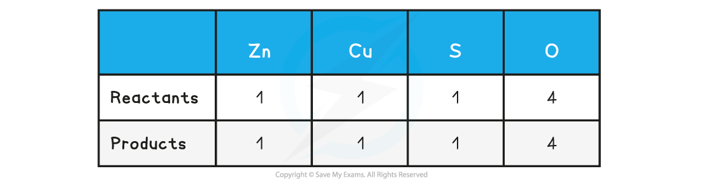

## Writing Balanced Equations

* A **symbol** equation is a shorthand way of describing a chemical reaction using **chemical symbols** to show the number and type of each atom in the reactants and products
* A **word** equation is a longer way of describing a chemical reaction using only **words** to show the reactants and products

#### Balancing equations

* During chemical reactions, atoms cannot be **created** or **destroyed**
* The number of each atom on each side of the reaction must therefore be the **same**

  + E.g. the reaction needs to be **balanced**
* When balancing equations remember:

  + Not to change any of the formulae
  + To put the numbers used to balance the equation **in front** of the formulae
  + To balance firstly the carbon, then the hydrogen and finally the oxygen in **combustion reactions** of organic compounds
* When balancing equations follow the following the steps:

  + Write the formulae of the reactants and products
  + Count the numbers of atoms in each reactant and product
  + Balance the atoms one at a time until all the atoms are balanced
  + Use appropriate state symbols in the equation
* The **physical state** of reactants and products in a chemical reaction is specified by using **state symbols**

  + **(s)** solid
  + **(l)** liquid
  + **(g)** gas
  + **(aq)** aqueous

#### Worked Example

Balance the following equation:

magnesium + oxygen **→** magnesium oxide

**Answer:**

**Step 1:** Write out the symbol equation showing reactants and products

**Mg + O****2** **→ MgO**

**Step 2:** Count the numbers of atoms in each reactant and product

**Step 3:** Balance the atoms one at a time until all the atoms are balanced

**2Mg + O****2** **→ 2MgO**

This is now showing that 2 moles of magnesium react with 1 mole of oxygen to form 2 moles of magnesium oxide

**Step 4:** Use appropriate **state symbols** in the fully balanced equation

**2Mg (s) + O****2** **(g) → 2MgO (s)**

#### Ionic equations

* In aqueous solutions ionic compounds **dissociate** into their ions
* Many chemical reactions in aqueous solutions involve ionic compounds, however only some of the ions in solution take part in the reactions
* The ions that do **not** take part in the reaction are called **spectator ions**
* An **ionic equation** shows **only** the ions or other particles taking part in a reaction, and not the spectator ions

#### Worked Example

1. Balance the following equation

zinc + copper(II) sulfate → zinc sulfate + copper

2. Write down the ionic equation for the above reaction

**Answer 1:**

**Step 1:** To balance the equation, write out the symbol equation showing reactants and products

**Zn  + CuSO****4****→ ZnSO****4** **+ Cu**

**Step 2:** Count the numbers of atoms in each reactant and product. The equation is already balanced

**Step 3:** Use appropriate **state symbols** in the equation

**Zn (s)  + CuSO****4** **(aq)  → ZnSO****4** **(aq) + Cu (s)**

**Answer 2:**

**Step 1:**  The full chemical equation for the reaction is

**Zn (s)  + CuSO****4** **(aq)  → ZnSO****4** **(aq) + Cu (s)**

**Step 2:**  Break down reactants into their respective ions

**Zn (s)  + Cu****2+** **+  SO****4****2-** **(aq)  → Zn****2+****+ SO****4****2-** **(aq) + Cu (s)**

**Step 3:**  Cancel the spectator ions on both sides to give the ionic equation

**Zn (s)  + Cu****2+****+** ~~**SO**~~~~**4**~~~~**2-**~~ **(aq)  → Zn****2+****+** ~~**SO**~~~~**4**~~~~**2-**~~ **(aq) + Cu (s)**

**Zn (s)  + Cu****2+****(aq)  → Zn****2+** **(aq) + Cu (s)**