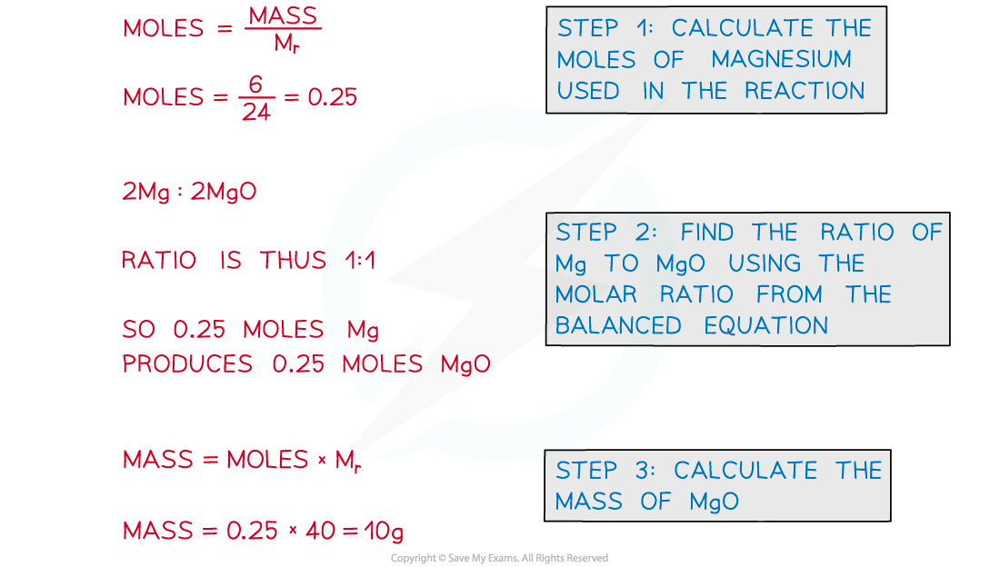
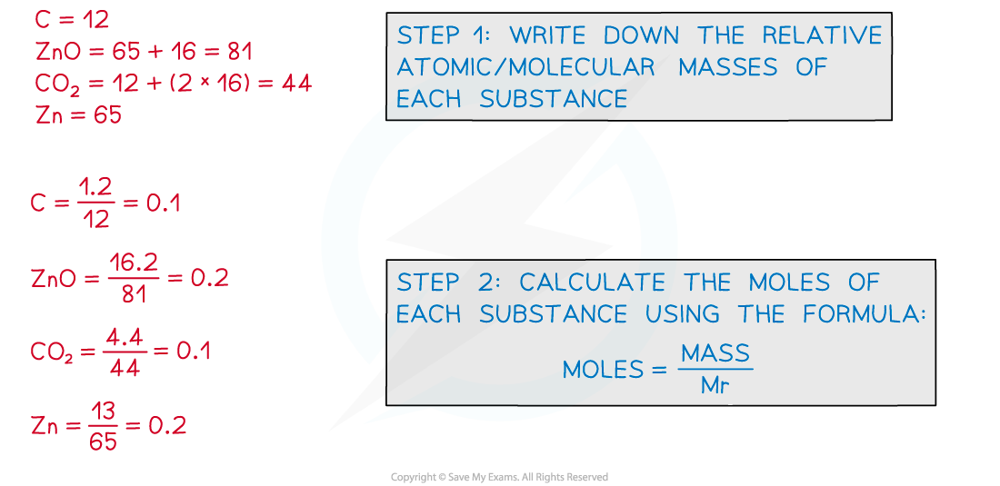
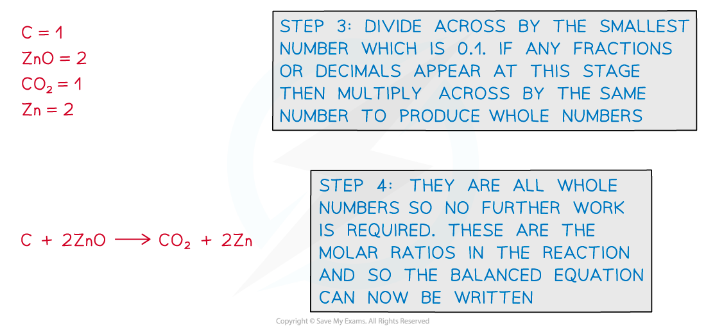

Amount of Substance Calculations
--------------------------------

* As previously discussed, the amount of substance can be defined as the number of particles in a substance, *n*, measured in moles (often abbreviated to mol)
* In reality, amount of substance is used as a blanket term to cover most chemical calculations, especially those that involve moles
* The two main calculations for amount of substance are:

Moles, *n* = ![fraction numerator m a s s comma space m over denominator m o l a r space m a s s comma space M end fraction](data:image/svg+xml;charset=utf8,%3Csvg%20xmlns%3D%22http%3A%2F%2Fwww.w3.org%2F2000%2Fsvg%22%20xmlns%3Awrs%3D%22http%3A%2F%2Fwww.wiris.com%2Fxml%2Fmathml-extension%22%20height%3D%2247%22%20width%3D%22119%22%20wrs%3Abaseline%3D%2230%22%3E%3C!--MathML%3A%20%3Cmath%20xmlns%3D%22http%3A%2F%2Fwww.w3.org%2F1998%2FMath%2FMathML%22%3E%3Cmfrac%3E%3Cmrow%3E%3Cmi%3Em%3C%2Fmi%3E%3Cmi%3Ea%3C%2Fmi%3E%3Cmi%3Es%3C%2Fmi%3E%3Cmi%3Es%3C%2Fmi%3E%3Cmo%3E%2C%3C%2Fmo%3E%3Cmo%3E%26%23xA0%3B%3C%2Fmo%3E%3Cmi%3Em%3C%2Fmi%3E%3C%2Fmrow%3E%3Cmrow%3E%3Cmi%3Em%3C%2Fmi%3E%3Cmi%3Eo%3C%2Fmi%3E%3Cmi%3El%3C%2Fmi%3E%3Cmi%3Ea%3C%2Fmi%3E%3Cmi%3Er%3C%2Fmi%3E%3Cmo%3E%26%23xA0%3B%3C%2Fmo%3E%3Cmi%3Em%3C%2Fmi%3E%3Cmi%3Ea%3C%2Fmi%3E%3Cmi%3Es%3C%2Fmi%3E%3Cmi%3Es%3C%2Fmi%3E%3Cmo%3E%2C%3C%2Fmo%3E%3Cmo%3E%26%23xA0%3B%3C%2Fmo%3E%3Cmi%3EM%3C%2Fmi%3E%3C%2Fmrow%3E%3C%2Fmfrac%3E%3C%2Fmath%3E--%3E%3Cdefs%3E%3Cstyle%20type%3D%22text%2Fcss%22%3E%40font-face%7Bfont-family%3A'math1f7177163c833dff4b38fc8d287'%3Bsrc%3Aurl(data%3Afont%2Ftruetype%3Bcharset%3Dutf-8%3Bbase64%2CAAEAAAAMAIAAAwBAT1MvMi7iBBMAAADMAAAATmNtYXDEvmKUAAABHAAAADRjdnQgDVUNBwAAAVAAAAA6Z2x5ZoPi2VsAAAGMAAAAUmhlYWQQC2qxAAAB4AAAADZoaGVhCGsXSAAAAhgAAAAkaG10eE2rRkcAAAI8AAAACGxvY2EAHTwYAAACRAAAAAxtYXhwBT0FPgAAAlAAAAAgbmFtZaBxlY4AAAJwAAABn3Bvc3QB9wD6AAAEEAAAACBwcmVwa1uragAABDAAAAAUAAADSwGQAAUAAAQABAAAAAAABAAEAAAAAAAAAQEAAAAAAAAAAAAAAAAAAAAAAAAAAAAAAAAAAAAAACAgICAAAAAg1UADev96AAAD6ACWAAAAAAACAAEAAQAAABQAAwABAAAAFAAEACAAAAAEAAQAAQAAACz%2F%2FwAAACz%2F%2F%2F%2FVAAEAAAAAAAABVAMsAIABAABWACoCWAIeAQ4BLAIsAFoBgAKAAKAA1ACAAAAAAAAAACsAVQCAAKsA1QEAASsABwAAAAIAVQAAAwADqwADAAcAADMRIRElIREhVQKr%2FasCAP4AA6v8VVUDAAABAFX%2FZADVAIAACgAAMzUzFRQGByc%2BATdVgC8vGx4eAYB6PVEUKQ40MQAAAAEAAAABAADVeM5BXw889QADBAD%2F%2F%2F%2F%2F1joTc%2F%2F%2F%2F%2F%2FWOhNzAAD%2FIASAA6sAAAAKAAIAAQAAAAAAAQAAA%2Bj%2FagAAF3AAAP%2B2BIAAAQAAAAAAAAAAAAAAAAAAAAIDUgBVATMAVQAAAAAAAAAoAAAAUgABAAAAAgBeAAUAAAAAAAIAgAQAAAAAAAQAAN4AAAAAAAAAFQECAAAAAAAAAAEAEgAAAAAAAAAAAAIADgASAAAAAAAAAAMAMAAgAAAAAAAAAAQAEgBQAAAAAAAAAAUAFgBiAAAAAAAAAAYACQB4AAAAAAAAAAgAHACBAAEAAAAAAAEAEgAAAAEAAAAAAAIADgASAAEAAAAAAAMAMAAgAAEAAAAAAAQAEgBQAAEAAAAAAAUAFgBiAAEAAAAAAAYACQB4AAEAAAAAAAgAHACBAAMAAQQJAAEAEgAAAAMAAQQJAAIADgASAAMAAQQJAAMAMAAgAAMAAQQJAAQAEgBQAAMAAQQJAAUAFgBiAAMAAQQJAAYACQB4AAMAAQQJAAgAHACBAE0AYQB0AGgAIABGAG8AbgB0AFIAZQBnAHUAbABhAHIATQBhAHQAaABzACAARgBvAHIAIABNAG8AcgBlACAATQBhAHQAaAAgAEYAbwBuAHQATQBhAHQAaAAgAEYAbwBuAHQAVgBlAHIAcwBpAG8AbgAgADEALgAwTWF0aF9Gb250AE0AYQB0AGgAcwAgAEYAbwByACAATQBvAHIAZQAAAwAAAAAAAAH0APoAAAAAAAAAAAAAAAAAAAAAAAAAALkHEQAAjYUYALIAAAAVFBOxAAE%2F)format('truetype')%3Bfont-weight%3Anormal%3Bfont-style%3Anormal%3B%7D%3C%2Fstyle%3E%3C%2Fdefs%3E%3Cline%20stroke%3D%22%23000%22%20stroke-linecap%3D%22square%22%20stroke-width%3D%221%22%20x1%3D%222.5%22%20x2%3D%22115.5%22%20y1%3D%2223.5%22%20y2%3D%2223.5%22%2F%3E%3Ctext%20font-family%3D%22Times%20New%20Roman%22%20font-size%3D%2218%22%20font-style%3D%22italic%22%20text-anchor%3D%22middle%22%20x%3D%2236.5%22%20y%3D%2216%22%3Em%3C%2Ftext%3E%3Ctext%20font-family%3D%22Times%20New%20Roman%22%20font-size%3D%2218%22%20font-style%3D%22italic%22%20text-anchor%3D%22middle%22%20x%3D%2247.5%22%20y%3D%2216%22%3Ea%3C%2Ftext%3E%3Ctext%20font-family%3D%22Times%20New%20Roman%22%20font-size%3D%2218%22%20font-style%3D%22italic%22%20text-anchor%3D%22middle%22%20x%3D%2254.5%22%20y%3D%2216%22%3Es%3C%2Ftext%3E%3Ctext%20font-family%3D%22Times%20New%20Roman%22%20font-size%3D%2218%22%20font-style%3D%22italic%22%20text-anchor%3D%22middle%22%20x%3D%2261.5%22%20y%3D%2216%22%3Es%3C%2Ftext%3E%3Ctext%20font-family%3D%22math1f7177163c833dff4b38fc8d287%22%20font-size%3D%2216%22%20text-anchor%3D%22middle%22%20x%3D%2268.5%22%20y%3D%2216%22%3E%2C%3C%2Ftext%3E%3Ctext%20font-family%3D%22Times%20New%20Roman%22%20font-size%3D%2218%22%20font-style%3D%22italic%22%20text-anchor%3D%22middle%22%20x%3D%2282.5%22%20y%3D%2216%22%3Em%3C%2Ftext%3E%3Ctext%20font-family%3D%22Times%20New%20Roman%22%20font-size%3D%2218%22%20font-style%3D%22italic%22%20text-anchor%3D%22middle%22%20x%3D%2211.5%22%20y%3D%2241%22%3Em%3C%2Ftext%3E%3Ctext%20font-family%3D%22Times%20New%20Roman%22%20font-size%3D%2218%22%20font-style%3D%22italic%22%20text-anchor%3D%22middle%22%20x%3D%2222.5%22%20y%3D%2241%22%3Eo%3C%2Ftext%3E%3Ctext%20font-family%3D%22Times%20New%20Roman%22%20font-size%3D%2218%22%20font-style%3D%22italic%22%20text-anchor%3D%22middle%22%20x%3D%2229.5%22%20y%3D%2241%22%3El%3C%2Ftext%3E%3Ctext%20font-family%3D%22Times%20New%20Roman%22%20font-size%3D%2218%22%20font-style%3D%22italic%22%20text-anchor%3D%22middle%22%20x%3D%2236.5%22%20y%3D%2241%22%3Ea%3C%2Ftext%3E%3Ctext%20font-family%3D%22Times%20New%20Roman%22%20font-size%3D%2218%22%20font-style%3D%22italic%22%20text-anchor%3D%22middle%22%20x%3D%2243.5%22%20y%3D%2241%22%3Er%3C%2Ftext%3E%3Ctext%20font-family%3D%22Times%20New%20Roman%22%20font-size%3D%2218%22%20font-style%3D%22italic%22%20text-anchor%3D%22middle%22%20x%3D%2258.5%22%20y%3D%2241%22%3Em%3C%2Ftext%3E%3Ctext%20font-family%3D%22Times%20New%20Roman%22%20font-size%3D%2218%22%20font-style%3D%22italic%22%20text-anchor%3D%22middle%22%20x%3D%2269.5%22%20y%3D%2241%22%3Ea%3C%2Ftext%3E%3Ctext%20font-family%3D%22Times%20New%20Roman%22%20font-size%3D%2218%22%20font-style%3D%22italic%22%20text-anchor%3D%22middle%22%20x%3D%2276.5%22%20y%3D%2241%22%3Es%3C%2Ftext%3E%3Ctext%20font-family%3D%22Times%20New%20Roman%22%20font-size%3D%2218%22%20font-style%3D%22italic%22%20text-anchor%3D%22middle%22%20x%3D%2283.5%22%20y%3D%2241%22%3Es%3C%2Ftext%3E%3Ctext%20font-family%3D%22math1f7177163c833dff4b38fc8d287%22%20font-size%3D%2216%22%20text-anchor%3D%22middle%22%20x%3D%2290.5%22%20y%3D%2241%22%3E%2C%3C%2Ftext%3E%3Ctext%20font-family%3D%22Times%20New%20Roman%22%20font-size%3D%2218%22%20font-style%3D%22italic%22%20text-anchor%3D%22middle%22%20x%3D%22105.5%22%20y%3D%2241%22%3EM%3C%2Ftext%3E%3C%2Fsvg%3E)

Moles, *n* = concentration x volume

* Other common calculations for amount of substance include:

Moles, *n* = ![fraction numerator n u m b e r space o f space p a r t i c l e s over denominator A v o g a d r o apostrophe s space c o n s t a n t end fraction](data:image/svg+xml;charset=utf8,%3Csvg%20xmlns%3D%22http%3A%2F%2Fwww.w3.org%2F2000%2Fsvg%22%20xmlns%3Awrs%3D%22http%3A%2F%2Fwww.wiris.com%2Fxml%2Fmathml-extension%22%20height%3D%2249%22%20width%3D%22160%22%20wrs%3Abaseline%3D%2230%22%3E%3C!--MathML%3A%20%3Cmath%20xmlns%3D%22http%3A%2F%2Fwww.w3.org%2F1998%2FMath%2FMathML%22%3E%3Cmfrac%3E%3Cmrow%3E%3Cmi%3En%3C%2Fmi%3E%3Cmi%3Eu%3C%2Fmi%3E%3Cmi%3Em%3C%2Fmi%3E%3Cmi%3Eb%3C%2Fmi%3E%3Cmi%3Ee%3C%2Fmi%3E%3Cmi%3Er%3C%2Fmi%3E%3Cmo%3E%26%23xA0%3B%3C%2Fmo%3E%3Cmi%3Eo%3C%2Fmi%3E%3Cmi%3Ef%3C%2Fmi%3E%3Cmo%3E%26%23xA0%3B%3C%2Fmo%3E%3Cmi%3Ep%3C%2Fmi%3E%3Cmi%3Ea%3C%2Fmi%3E%3Cmi%3Er%3C%2Fmi%3E%3Cmi%3Et%3C%2Fmi%3E%3Cmi%3Ei%3C%2Fmi%3E%3Cmi%3Ec%3C%2Fmi%3E%3Cmi%3El%3C%2Fmi%3E%3Cmi%3Ee%3C%2Fmi%3E%3Cmi%3Es%3C%2Fmi%3E%3C%2Fmrow%3E%3Cmrow%3E%3Cmi%3EA%3C%2Fmi%3E%3Cmi%3Ev%3C%2Fmi%3E%3Cmi%3Eo%3C%2Fmi%3E%3Cmi%3Eg%3C%2Fmi%3E%3Cmi%3Ea%3C%2Fmi%3E%3Cmi%3Ed%3C%2Fmi%3E%3Cmi%3Er%3C%2Fmi%3E%3Cmi%3Eo%3C%2Fmi%3E%3Cmo%3E'%3C%2Fmo%3E%3Cmi%3Es%3C%2Fmi%3E%3Cmo%3E%26%23xA0%3B%3C%2Fmo%3E%3Cmi%3Ec%3C%2Fmi%3E%3Cmi%3Eo%3C%2Fmi%3E%3Cmi%3En%3C%2Fmi%3E%3Cmi%3Es%3C%2Fmi%3E%3Cmi%3Et%3C%2Fmi%3E%3Cmi%3Ea%3C%2Fmi%3E%3Cmi%3En%3C%2Fmi%3E%3Cmi%3Et%3C%2Fmi%3E%3C%2Fmrow%3E%3C%2Fmfrac%3E%3C%2Fmath%3E--%3E%3Cdefs%3E%3Cstyle%20type%3D%22text%2Fcss%22%3E%40font-face%7Bfont-family%3A'math1d67d8ab4f4c10bf22aa353e278'%3Bsrc%3Aurl(data%3Afont%2Ftruetype%3Bcharset%3Dutf-8%3Bbase64%2CAAEAAAAMAIAAAwBAT1MvMi7iBBMAAADMAAAATmNtYXDEvmKUAAABHAAAADRjdnQgDVUNBwAAAVAAAAA6Z2x5ZoPi2VsAAAGMAAAAXWhlYWQQC2qxAAAB7AAAADZoaGVhCGsXSAAAAiQAAAAkaG10eE2rRkcAAAJIAAAACGxvY2EAHTwYAAACUAAAAAxtYXhwBT0FPgAAAlwAAAAgbmFtZaBxlY4AAAJ8AAABn3Bvc3QB9wD6AAAEHAAAACBwcmVwa1uragAABDwAAAAUAAADSwGQAAUAAAQABAAAAAAABAAEAAAAAAAAAQEAAAAAAAAAAAAAAAAAAAAAAAAAAAAAAAAAAAAAACAgICAAAAAg1UADev96AAAD6ACWAAAAAAACAAEAAQAAABQAAwABAAAAFAAEACAAAAAEAAQAAQAAACf%2F%2FwAAACf%2F%2F%2F%2FaAAEAAAAAAAABVAMsAIABAABWACoCWAIeAQ4BLAIsAFoBgAKAAKAA1ACAAAAAAAAAACsAVQCAAKsA1QEAASsABwAAAAIAVQAAAwADqwADAAcAADMRIRElIREhVQKr%2FasCAP4AA6v8VVUDAAABAFUB1QDVAysAAwAbGAGwBBCxAAX0sQED9LEFBfQAsAQQsQAC9DAxEzMDI1WAVioDK%2F6qAAAAAAEAAAABAADVeM5BXw889QADBAD%2F%2F%2F%2F%2F1joTc%2F%2F%2F%2F%2F%2FWOhNzAAD%2FIASAA6sAAAAKAAIAAQAAAAAAAQAAA%2Bj%2FagAAF3AAAP%2B2BIAAAQAAAAAAAAAAAAAAAAAAAAIDUgBVASsAVQAAAAAAAAAoAAAAXQABAAAAAgBeAAUAAAAAAAIAgAQAAAAAAAQAAN4AAAAAAAAAFQECAAAAAAAAAAEAEgAAAAAAAAAAAAIADgASAAAAAAAAAAMAMAAgAAAAAAAAAAQAEgBQAAAAAAAAAAUAFgBiAAAAAAAAAAYACQB4AAAAAAAAAAgAHACBAAEAAAAAAAEAEgAAAAEAAAAAAAIADgASAAEAAAAAAAMAMAAgAAEAAAAAAAQAEgBQAAEAAAAAAAUAFgBiAAEAAAAAAAYACQB4AAEAAAAAAAgAHACBAAMAAQQJAAEAEgAAAAMAAQQJAAIADgASAAMAAQQJAAMAMAAgAAMAAQQJAAQAEgBQAAMAAQQJAAUAFgBiAAMAAQQJAAYACQB4AAMAAQQJAAgAHACBAE0AYQB0AGgAIABGAG8AbgB0AFIAZQBnAHUAbABhAHIATQBhAHQAaABzACAARgBvAHIAIABNAG8AcgBlACAATQBhAHQAaAAgAEYAbwBuAHQATQBhAHQAaAAgAEYAbwBuAHQAVgBlAHIAcwBpAG8AbgAgADEALgAwTWF0aF9Gb250AE0AYQB0AGgAcwAgAEYAbwByACAATQBvAHIAZQAAAwAAAAAAAAH0APoAAAAAAAAAAAAAAAAAAAAAAAAAALkHEQAAjYUYALIAAAAVFBOxAAE%2F)format('truetype')%3Bfont-weight%3Anormal%3Bfont-style%3Anormal%3B%7D%3C%2Fstyle%3E%3C%2Fdefs%3E%3Cline%20stroke%3D%22%23000%22%20stroke-linecap%3D%22square%22%20stroke-width%3D%221%22%20x1%3D%222.5%22%20x2%3D%22156.5%22%20y1%3D%2223.5%22%20y2%3D%2223.5%22%2F%3E%3Ctext%20font-family%3D%22Times%20New%20Roman%22%20font-size%3D%2218%22%20font-style%3D%22italic%22%20text-anchor%3D%22middle%22%20x%3D%2212.5%22%20y%3D%2216%22%3En%3C%2Ftext%3E%3Ctext%20font-family%3D%22Times%20New%20Roman%22%20font-size%3D%2218%22%20font-style%3D%22italic%22%20text-anchor%3D%22middle%22%20x%3D%2221.5%22%20y%3D%2216%22%3Eu%3C%2Ftext%3E%3Ctext%20font-family%3D%22Times%20New%20Roman%22%20font-size%3D%2218%22%20font-style%3D%22italic%22%20text-anchor%3D%22middle%22%20x%3D%2233.5%22%20y%3D%2216%22%3Em%3C%2Ftext%3E%3Ctext%20font-family%3D%22Times%20New%20Roman%22%20font-size%3D%2218%22%20font-style%3D%22italic%22%20text-anchor%3D%22middle%22%20x%3D%2244.5%22%20y%3D%2216%22%3Eb%3C%2Ftext%3E%3Ctext%20font-family%3D%22Times%20New%20Roman%22%20font-size%3D%2218%22%20font-style%3D%22italic%22%20text-anchor%3D%22middle%22%20x%3D%2253.5%22%20y%3D%2216%22%3Ee%3C%2Ftext%3E%3Ctext%20font-family%3D%22Times%20New%20Roman%22%20font-size%3D%2218%22%20font-style%3D%22italic%22%20text-anchor%3D%22middle%22%20x%3D%2260.5%22%20y%3D%2216%22%3Er%3C%2Ftext%3E%3Ctext%20font-family%3D%22Times%20New%20Roman%22%20font-size%3D%2218%22%20font-style%3D%22italic%22%20text-anchor%3D%22middle%22%20x%3D%2272.5%22%20y%3D%2216%22%3Eo%3C%2Ftext%3E%3Ctext%20font-family%3D%22Times%20New%20Roman%22%20font-size%3D%2218%22%20font-style%3D%22italic%22%20text-anchor%3D%22middle%22%20x%3D%2280.5%22%20y%3D%2216%22%3Ef%3C%2Ftext%3E%3Ctext%20font-family%3D%22Times%20New%20Roman%22%20font-size%3D%2218%22%20font-style%3D%22italic%22%20text-anchor%3D%22middle%22%20x%3D%2294.5%22%20y%3D%2216%22%3Ep%3C%2Ftext%3E%3Ctext%20font-family%3D%22Times%20New%20Roman%22%20font-size%3D%2218%22%20font-style%3D%22italic%22%20text-anchor%3D%22middle%22%20x%3D%22103.5%22%20y%3D%2216%22%3Ea%3C%2Ftext%3E%3Ctext%20font-family%3D%22Times%20New%20Roman%22%20font-size%3D%2218%22%20font-style%3D%22italic%22%20text-anchor%3D%22middle%22%20x%3D%22110.5%22%20y%3D%2216%22%3Er%3C%2Ftext%3E%3Ctext%20font-family%3D%22Times%20New%20Roman%22%20font-size%3D%2218%22%20font-style%3D%22italic%22%20text-anchor%3D%22middle%22%20x%3D%22115.5%22%20y%3D%2216%22%3Et%3C%2Ftext%3E%3Ctext%20font-family%3D%22Times%20New%20Roman%22%20font-size%3D%2218%22%20font-style%3D%22italic%22%20text-anchor%3D%22middle%22%20x%3D%22120.5%22%20y%3D%2216%22%3Ei%3C%2Ftext%3E%3Ctext%20font-family%3D%22Times%20New%20Roman%22%20font-size%3D%2218%22%20font-style%3D%22italic%22%20text-anchor%3D%22middle%22%20x%3D%22127.5%22%20y%3D%2216%22%3Ec%3C%2Ftext%3E%3Ctext%20font-family%3D%22Times%20New%20Roman%22%20font-size%3D%2218%22%20font-style%3D%22italic%22%20text-anchor%3D%22middle%22%20x%3D%22133.5%22%20y%3D%2216%22%3El%3C%2Ftext%3E%3Ctext%20font-family%3D%22Times%20New%20Roman%22%20font-size%3D%2218%22%20font-style%3D%22italic%22%20text-anchor%3D%22middle%22%20x%3D%22140.5%22%20y%3D%2216%22%3Ee%3C%2Ftext%3E%3Ctext%20font-family%3D%22Times%20New%20Roman%22%20font-size%3D%2218%22%20font-style%3D%22italic%22%20text-anchor%3D%22middle%22%20x%3D%22147.5%22%20y%3D%2216%22%3Es%3C%2Ftext%3E%3Ctext%20font-family%3D%22Times%20New%20Roman%22%20font-size%3D%2218%22%20font-style%3D%22italic%22%20text-anchor%3D%22middle%22%20x%3D%2210.5%22%20y%3D%2243%22%3EA%3C%2Ftext%3E%3Ctext%20font-family%3D%22Times%20New%20Roman%22%20font-size%3D%2218%22%20font-style%3D%22italic%22%20text-anchor%3D%22middle%22%20x%3D%2221.5%22%20y%3D%2243%22%3Ev%3C%2Ftext%3E%3Ctext%20font-family%3D%22Times%20New%20Roman%22%20font-size%3D%2218%22%20font-style%3D%22italic%22%20text-anchor%3D%22middle%22%20x%3D%2230.5%22%20y%3D%2243%22%3Eo%3C%2Ftext%3E%3Ctext%20font-family%3D%22Times%20New%20Roman%22%20font-size%3D%2218%22%20font-style%3D%22italic%22%20text-anchor%3D%22middle%22%20x%3D%2239.5%22%20y%3D%2243%22%3Eg%3C%2Ftext%3E%3Ctext%20font-family%3D%22Times%20New%20Roman%22%20font-size%3D%2218%22%20font-style%3D%22italic%22%20text-anchor%3D%22middle%22%20x%3D%2248.5%22%20y%3D%2243%22%3Ea%3C%2Ftext%3E%3Ctext%20font-family%3D%22Times%20New%20Roman%22%20font-size%3D%2218%22%20font-style%3D%22italic%22%20text-anchor%3D%22middle%22%20x%3D%2256.5%22%20y%3D%2243%22%3Ed%3C%2Ftext%3E%3Ctext%20font-family%3D%22Times%20New%20Roman%22%20font-size%3D%2218%22%20font-style%3D%22italic%22%20text-anchor%3D%22middle%22%20x%3D%2264.5%22%20y%3D%2243%22%3Er%3C%2Ftext%3E%3Ctext%20font-family%3D%22Times%20New%20Roman%22%20font-size%3D%2218%22%20font-style%3D%22italic%22%20text-anchor%3D%22middle%22%20x%3D%2271.5%22%20y%3D%2243%22%3Eo%3C%2Ftext%3E%3Ctext%20font-family%3D%22math1d67d8ab4f4c10bf22aa353e278%22%20font-size%3D%2218%22%20text-anchor%3D%22middle%22%20x%3D%2279.5%22%20y%3D%2243%22%3E'%3C%2Ftext%3E%3Ctext%20font-family%3D%22Times%20New%20Roman%22%20font-size%3D%2218%22%20font-style%3D%22italic%22%20text-anchor%3D%22middle%22%20x%3D%2285.5%22%20y%3D%2243%22%3Es%3C%2Ftext%3E%3Ctext%20font-family%3D%22Times%20New%20Roman%22%20font-size%3D%2218%22%20font-style%3D%22italic%22%20text-anchor%3D%22middle%22%20x%3D%2298.5%22%20y%3D%2243%22%3Ec%3C%2Ftext%3E%3Ctext%20font-family%3D%22Times%20New%20Roman%22%20font-size%3D%2218%22%20font-style%3D%22italic%22%20text-anchor%3D%22middle%22%20x%3D%22106.5%22%20y%3D%2243%22%3Eo%3C%2Ftext%3E%3Ctext%20font-family%3D%22Times%20New%20Roman%22%20font-size%3D%2218%22%20font-style%3D%22italic%22%20text-anchor%3D%22middle%22%20x%3D%22115.5%22%20y%3D%2243%22%3En%3C%2Ftext%3E%3Ctext%20font-family%3D%22Times%20New%20Roman%22%20font-size%3D%2218%22%20font-style%3D%22italic%22%20text-anchor%3D%22middle%22%20x%3D%22123.5%22%20y%3D%2243%22%3Es%3C%2Ftext%3E%3Ctext%20font-family%3D%22Times%20New%20Roman%22%20font-size%3D%2218%22%20font-style%3D%22italic%22%20text-anchor%3D%22middle%22%20x%3D%22129.5%22%20y%3D%2243%22%3Et%3C%2Ftext%3E%3Ctext%20font-family%3D%22Times%20New%20Roman%22%20font-size%3D%2218%22%20font-style%3D%22italic%22%20text-anchor%3D%22middle%22%20x%3D%22136.5%22%20y%3D%2243%22%3Ea%3C%2Ftext%3E%3Ctext%20font-family%3D%22Times%20New%20Roman%22%20font-size%3D%2218%22%20font-style%3D%22italic%22%20text-anchor%3D%22middle%22%20x%3D%22144.5%22%20y%3D%2243%22%3En%3C%2Ftext%3E%3Ctext%20font-family%3D%22Times%20New%20Roman%22%20font-size%3D%2218%22%20font-style%3D%22italic%22%20text-anchor%3D%22middle%22%20x%3D%22151.5%22%20y%3D%2243%22%3Et%3C%2Ftext%3E%3C%2Fsvg%3E)

Moles, *n* =![fraction numerator P V over denominator R T end fraction](data:image/svg+xml;charset=utf8,%3Csvg%20xmlns%3D%22http%3A%2F%2Fwww.w3.org%2F2000%2Fsvg%22%20xmlns%3Awrs%3D%22http%3A%2F%2Fwww.wiris.com%2Fxml%2Fmathml-extension%22%20height%3D%2247%22%20width%3D%2233%22%20wrs%3Abaseline%3D%2230%22%3E%3C!--MathML%3A%20%3Cmath%20xmlns%3D%22http%3A%2F%2Fwww.w3.org%2F1998%2FMath%2FMathML%22%3E%3Cmfrac%3E%3Cmrow%3E%3Cmi%3EP%3C%2Fmi%3E%3Cmi%3EV%3C%2Fmi%3E%3C%2Fmrow%3E%3Cmrow%3E%3Cmi%3ER%3C%2Fmi%3E%3Cmi%3ET%3C%2Fmi%3E%3C%2Fmrow%3E%3C%2Fmfrac%3E%3C%2Fmath%3E--%3E%3Cdefs%3E%3Cstyle%20type%3D%22text%2Fcss%22%2F%3E%3C%2Fdefs%3E%3Cline%20stroke%3D%22%23000%22%20stroke-linecap%3D%22square%22%20stroke-width%3D%221%22%20x1%3D%222.5%22%20x2%3D%2229.5%22%20y1%3D%2223.5%22%20y2%3D%2223.5%22%2F%3E%3Ctext%20font-family%3D%22Times%20New%20Roman%22%20font-size%3D%2218%22%20font-style%3D%22italic%22%20text-anchor%3D%22middle%22%20x%3D%229.5%22%20y%3D%2216%22%3EP%3C%2Ftext%3E%3Ctext%20font-family%3D%22Times%20New%20Roman%22%20font-size%3D%2218%22%20font-style%3D%22italic%22%20text-anchor%3D%22middle%22%20x%3D%2220.5%22%20y%3D%2216%22%3EV%3C%2Ftext%3E%3Ctext%20font-family%3D%22Times%20New%20Roman%22%20font-size%3D%2218%22%20font-style%3D%22italic%22%20text-anchor%3D%22middle%22%20x%3D%2210.5%22%20y%3D%2241%22%3ER%3C%2Ftext%3E%3Ctext%20font-family%3D%22Times%20New%20Roman%22%20font-size%3D%2218%22%20font-style%3D%22italic%22%20text-anchor%3D%22middle%22%20x%3D%2221.5%22%20y%3D%2241%22%3ET%3C%2Ftext%3E%3C%2Fsvg%3E)from the ideal gas equation (*PV = nRT*)

Reacting Mass Calculations
--------------------------

* Chemical equations can be used to calculate the<b> moles</b> or <b>masses</b> of reactants and products
* To do this, information given in the question is used to find the amount in moles of the substances being considered
* Then, the <b>ratio</b> between the substances is identified using the balanced chemical equation
* Once the moles have been determined they can then be converted into grams using the relative atomic or relative formula masses

#### Worked Example

<b>Example 1</b>

Calculate the mass of magnesium oxide that can be made by completely burning 6.0 g of magnesium in oxygen in the following reaction:

<b>2Mg (s)</b> <b>+</b> <b>O</b><b>2</b><b> (g)  ⟶ 2 MgO (s) </b>

<b>Answer:</b>

#### Worked Example

<b>Example 2</b>

Calculate the mass of aluminium, in tonnes, that can be produced from 51 tonnes of aluminium oxide. The equation for the reaction is:

<b>2Al</b><b>2</b><b>O</b><b>3</b><b>  ⟶  4Al +  3O</b><b>2</b><b> </b>

<b>Answer:</b>

#### Examiner Tips and Tricks

As long as you are consistent it doesn't matter whether you work in grams or tonnes or any other mass unit as the reacting masses will always be in proportion to the balanced equation.

#### Balancing Equations using Reacting Masses

* If the masses of reactants and products of a reaction are known then we can use them to write a balanced equation for that reaction
* This is done by converting the <b>masses </b>to <b>moles</b> and simplifying to find the <b>molar ratios</b>

#### Worked Example

<b>Example 3</b>

A student reacts 1.2 g of carbon with 16.2 g of zinc oxide. The resulting products are 4.4 g of carbon dioxide and 13 g of zinc. Determine the balanced equation for the reaction.

<b>Answer:</b>

#### Examiner Tips and Tricks

These questions look hard but they are actually quite easy to do, as long as you follow the steps and organise your work neatly.

Remember the molar ratio of a balanced equation gives you the ratio of the amounts of each substance in the reaction.