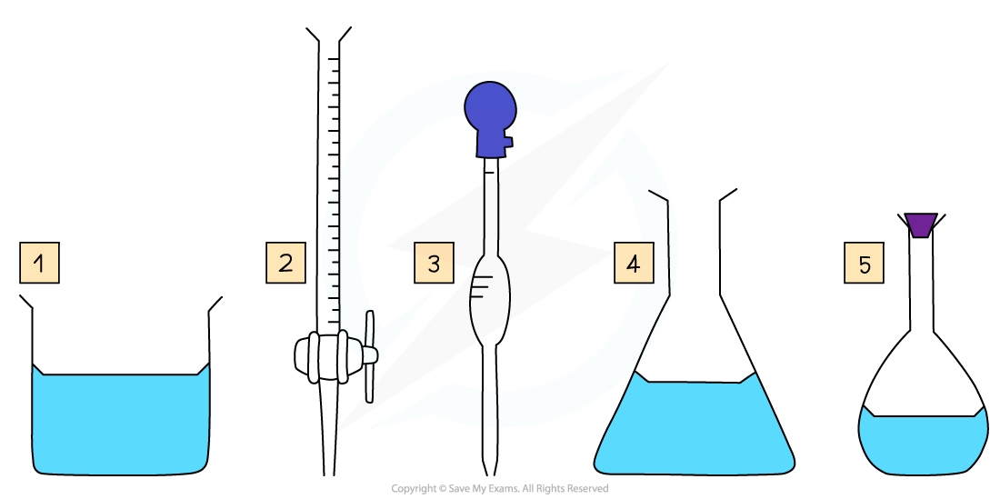
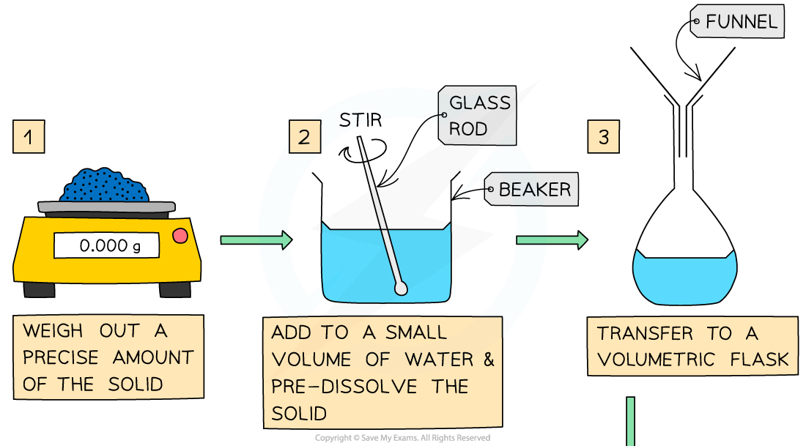
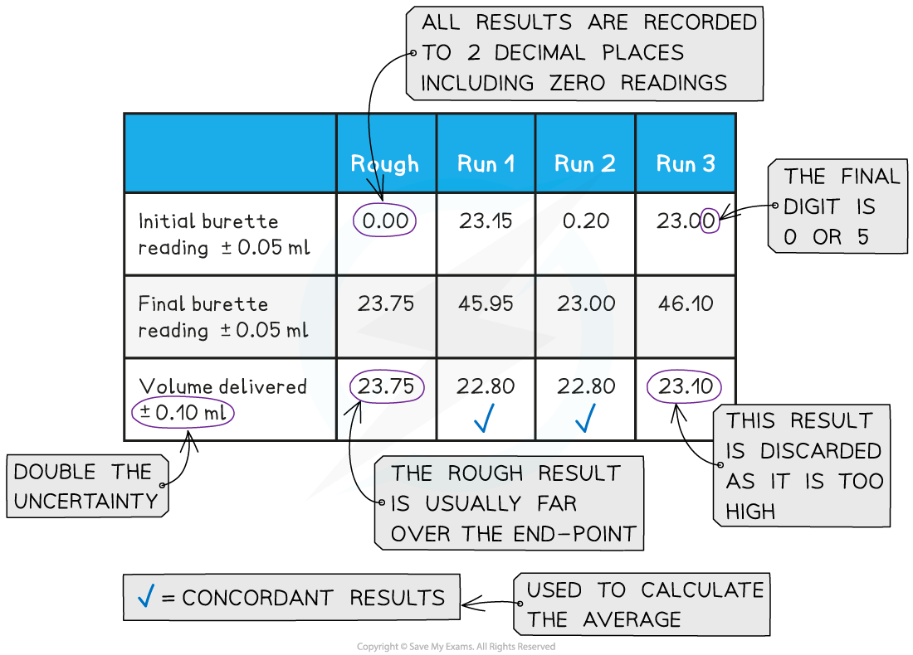

## Titration Calculations

#### Volumetric Analysis

* Volumetric analysis is a process that uses the volume and concentration of one chemical reactant (**standard solution**) to determine the concentration of another unknown solution
* The technique most commonly used is a **titration**
* The volumes are measured using two precise pieces of equipment, a **volumetric**or**graduated pipette**and a **burette**
* Before the titration can be done, the standard solution must be prepared
* Specific apparatus must be used both when preparing the standard solution and when completing the titration, to ensure that volumes are measured precisely

***Some key pieces of apparatus used to prepare a volumetric solution and perform a simple titration***

1. Beaker
2. Burette
3. Volumetric Pipette
4. Conical Flask
5. Volumetric Flask

#### Making a Standard Solution

* Chemists routinely prepare solutions needed for analysis, whose concentrations are known precisely
* These solutions are termed **volumetric solutions** or **standard solutions**
* They are made as accurately and precisely as possible using three decimal place balances and volumetric flasks to reduce the impact of measurement uncertainties
* The steps are:

#### Performing the Titration

* The key piece of equipment used in the titration is the burette
* **Burettes** are usually marked to a precision of 0.10 cm3

  + Since they are analogue instruments, the uncertainty is recorded to **half** the smallest marking, in other words to ±0.05 cm3
* The **end point** or **equivalence point** occurs when the two solutions have reacted completely and is shown with the use of an **indicator**

***The steps in a titration***

* A white tile is placed under the conical flask while the titration is performed, to make it easier to see the colour change

***The steps in a titration***

* The steps in a titration are:

  + Measuring a known volume (usually 20 or 25 cm3) of one of the solutions with a volumetric pipette and placing it into a conical flask
  + The other solution is placed in the burette

    - To start with, the burette will usually be filled to 0.00 cm3
  + A few drops of the indicator are added to the solution in the conical flask
  + The tap on the burette is carefully opened and the solution added, portion by portion, to the conical flask until the indicator starts to change colour
  + As you start getting near to the end point, the flow of the burette should be slowed right down so that the solution is added dropwise

    - You should be able to close the tap on the burette after one drop has caused the colour change
  + Multiple runs are carried out until **concordant** results are obtained

    - Concordant results are within 0.1 cm3 of each other

#### Recording and processing titration results

* Both the initial and final burette readings should be recorded and shown to a precision of  ±0.05 cm3, the same as the uncertainty

***A typical layout and set of titration results***

* The volume delivered (titre) is calculated and recorded to an uncertainty of ±0.10 cm3

  + The uncertainty is doubled, because two burette readings are made to obtain the titre (V final – V initial), following the rules for propagation of uncertainties
* **Concordant**results are then averaged, and non-concordant results are discarded
* The appropriate calculations are then done

#### Volumes & concentrations of solutions

* The **concentration** of a solution is the amount of **solute** dissolved in a **solvent** to make 1 dm3 of  **solution**

  + The solute is the substance that dissolves in a solvent to form a solution
  + The solvent is often water

Concentration (mol dm-3) = %3C%2Fmo%3E%3C%2Fmrow%3E%3Cmrow%3E%3Cmi%3Evolume%3C%2Fmi%3E%3Cmo%3E%26%23xA0%3B%3C%2Fmo%3E%3Cmi%3Eof%3C%2Fmi%3E%3Cmo%3E%26%23xA0%3B%3C%2Fmo%3E%3Cmi%3Esolution%3C%2Fmi%3E%3Cmo%3E%26%23xA0%3B%3C%2Fmo%3E%3Cmo%3E(%3C%2Fmo%3E%3Cmsup%3E%3Cmi%3Edm%3C%2Fmi%3E%3Cmn%3E3%3C%2Fmn%3E%3C%2Fmsup%3E%3Cmo%3E)%3C%2Fmo%3E%3C%2Fmrow%3E%3C%2Fmfrac%3E%3C%2Fmath%3E--%3E%3Cdefs%3E%3Cstyle%20type%3D%22text%2Fcss%22%3E%40font-face%7Bfont-family%3A'round_brackets18549f92a457f2409'%3Bsrc%3Aurl(data%3Afont%2Ftruetype%3Bcharset%3Dutf-8%3Bbase64%2CAAEAAAAMAIAAAwBAT1MvMjwHLFQAAADMAAAATmNtYXDf7xCrAAABHAAAADxjdnQgBAkDLgAAAVgAAAASZ2x5ZmAOz2cAAAFsAAABJGhlYWQOKih8AAACkAAAADZoaGVhCvgVwgAAAsgAAAAkaG10eCA6AAIAAALsAAAADGxvY2EAAARLAAAC%2BAAAABBtYXhwBIgEWQAAAwgAAAAgbmFtZXHR30MAAAMoAAACOXBvc3QDogHPAAAFZAAAACBwcmVwupWEAAAABYQAAAAHAAAGcgGQAAUAAAgACAAAAAAACAAIAAAAAAAAAQIAAAAAAAAAAAAAAAAAAAAAAAAAAAAAAAAAAAAAACAgICAAAAAo8AMGe%2F57AAAHPgGyAAAAAAACAAEAAQAAABQAAwABAAAAFAAEACgAAAAGAAQAAQACACgAKf%2F%2FAAAAKAAp%2F%2F%2F%2F2f%2FZAAEAAAAAAAAAAAFUAFYBAAAsAKgDgAAyAAcAAAACAAAAKgDVA1UAAwAHAAA1MxEjEyMRM9XVq4CAKgMr%2FQAC1QABAAD%2B0AIgBtAACQBNGAGwChCwA9SwAxCwAtSwChCwBdSwBRCwANSwAxCwBzywAhCwCDwAsAoQsAPUsAMQsAfUsAoQsAXUsAoQsADUsAMQsAI8sAcQsAg8MTAREAEzABEQASMAAZCQ%2FnABkJD%2BcALQ%2FZD%2BcAGQAnACcAGQ%2FnAAAQAA%2FtACIAbQAAkATRgBsAoQsAPUsAMQsALUsAoQsAXUsAUQsADUsAMQsAc8sAIQsAg8ALAKELAD1LADELAH1LAKELAF1LAKELAA1LADELACPLAHELAIPDEwARABIwAREAEzAAIg%2FnCQAZD%2BcJABkALQ%2FZD%2BcAGQAnACcAGQ%2FnAAAQAAAAEAAPW2NYFfDzz1AAMIAP%2F%2F%2F%2F%2FVre7u%2F%2F%2F%2F%2F9Wt7u4AAP7QA7cG0AAAAAoAAgABAAAAAAABAAAHPv5OAAAXcAAA%2F%2F4DtwABAAAAAAAAAAAAAAAAAAAAAwDVAAACIAAAAiAAAAAAAAAAAAAkAAAAowAAASQAAQAAAAMACgACAAAAAAACAIAEAAAAAAAEAABNAAAAAAAAABUBAgAAAAAAAAABAD4AAAAAAAAAAAACAA4APgAAAAAAAAADAFwATAAAAAAAAAAEAD4AqAAAAAAAAAAFABYA5gAAAAAAAAAGAB8A%2FAAAAAAAAAAIABwBGwABAAAAAAABAD4AAAABAAAAAAACAA4APgABAAAAAAADAFwATAABAAAAAAAEAD4AqAABAAAAAAAFABYA5gABAAAAAAAGAB8A%2FAABAAAAAAAIABwBGwADAAEECQABAD4AAAADAAEECQACAA4APgADAAEECQADAFwATAADAAEECQAEAD4AqAADAAEECQAFABYA5gADAAEECQAGAB8A%2FAADAAEECQAIABwBGwBSAG8AdQBuAGQAIABiAHIAYQBjAGsAZQB0AHMAIAB3AGkAdABoACAAYQBzAGMAZQBuAHQAIAAxADgANQA0AFIAZQBnAHUAbABhAHIATQBhAHQAaABzACAARgBvAHIAIABNAG8AcgBlACAAUgBvAHUAbgBkACAAYgByAGEAYwBrAGUAdABzACAAdwBpAHQAaAAgAGEAcwBjAGUAbgB0ACAAMQA4ADUANABSAG8AdQBuAGQAIABiAHIAYQBjAGsAZQB0AHMAIAB3AGkAdABoACAAYQBzAGMAZQBuAHQAIAAxADgANQA0AFYAZQByAHMAaQBvAG4AIAAyAC4AMFJvdW5kX2JyYWNrZXRzX3dpdGhfYXNjZW50XzE4NTQATQBhAHQAaABzACAARgBvAHIAIABNAG8AcgBlAAAAAAMAAAAAAAADnwHPAAAAAAAAAAAAAAAAAAAAAAAAAAC5B%2F8AAY2FAA%3D%3D)format('truetype')%3Bfont-weight%3Anormal%3Bfont-style%3Anormal%3B%7D%3C%2Fstyle%3E%3C%2Fdefs%3E%3Cline%20stroke%3D%22%23000%22%20stroke-linecap%3D%22square%22%20stroke-width%3D%221%22%20x1%3D%222.5%22%20x2%3D%22236.5%22%20y1%3D%2223.5%22%20y2%3D%2223.5%22%2F%3E%3Ctext%20font-family%3D%22Times%20New%20Roman%22%20font-size%3D%2218%22%20text-anchor%3D%22middle%22%20x%3D%2231.5%22%20y%3D%2216%22%3Enumber%3C%2Ftext%3E%3Ctext%20font-family%3D%22Times%20New%20Roman%22%20font-size%3D%2218%22%20text-anchor%3D%22middle%22%20x%3D%2270.5%22%20y%3D%2216%22%3Eof%3C%2Ftext%3E%3Ctext%20font-family%3D%22Times%20New%20Roman%22%20font-size%3D%2218%22%20text-anchor%3D%22middle%22%20x%3D%22103.5%22%20y%3D%2216%22%3Emoles%3C%2Ftext%3E%3Ctext%20font-family%3D%22Times%20New%20Roman%22%20font-size%3D%2218%22%20text-anchor%3D%22middle%22%20x%3D%22136.5%22%20y%3D%2216%22%3Eof%3C%2Ftext%3E%3Ctext%20font-family%3D%22Times%20New%20Roman%22%20font-size%3D%2218%22%20text-anchor%3D%22middle%22%20x%3D%22169.5%22%20y%3D%2216%22%3Esolute%3C%2Ftext%3E%3Ctext%20font-family%3D%22round_brackets18549f92a457f2409%22%20font-size%3D%2218%22%20text-anchor%3D%22middle%22%20x%3D%22198.5%22%20y%3D%2216%22%3E(%3C%2Ftext%3E%3Ctext%20font-family%3D%22Times%20New%20Roman%22%20font-size%3D%2218%22%20text-anchor%3D%22middle%22%20x%3D%22215.5%22%20y%3D%2216%22%3Emol%3C%2Ftext%3E%3Ctext%20font-family%3D%22round_brackets18549f92a457f2409%22%20font-size%3D%2218%22%20text-anchor%3D%22middle%22%20x%3D%22231.5%22%20y%3D%2216%22%3E)%3C%2Ftext%3E%3Ctext%20font-family%3D%22Times%20New%20Roman%22%20font-size%3D%2218%22%20text-anchor%3D%22middle%22%20x%3D%2256.5%22%20y%3D%2242%22%3Evolume%3C%2Ftext%3E%3Ctext%20font-family%3D%22Times%20New%20Roman%22%20font-size%3D%2218%22%20text-anchor%3D%22middle%22%20x%3D%2294.5%22%20y%3D%2242%22%3Eof%3C%2Ftext%3E%3Ctext%20font-family%3D%22Times%20New%20Roman%22%20font-size%3D%2218%22%20text-anchor%3D%22middle%22%20x%3D%22135.5%22%20y%3D%2242%22%3Esolution%3C%2Ftext%3E%3Ctext%20font-family%3D%22round_brackets18549f92a457f2409%22%20font-size%3D%2218%22%20text-anchor%3D%22middle%22%20x%3D%22171.5%22%20y%3D%2242%22%3E(%3C%2Ftext%3E%3Ctext%20font-family%3D%22Times%20New%20Roman%22%20font-size%3D%2218%22%20text-anchor%3D%22middle%22%20x%3D%22185.5%22%20y%3D%2242%22%3Edm%3C%2Ftext%3E%3Ctext%20font-family%3D%22Times%20New%20Roman%22%20font-size%3D%2213%22%20text-anchor%3D%22middle%22%20x%3D%22200.5%22%20y%3D%2237%22%3E3%3C%2Ftext%3E%3Ctext%20font-family%3D%22round_brackets18549f92a457f2409%22%20font-size%3D%2218%22%20text-anchor%3D%22middle%22%20x%3D%22206.5%22%20y%3D%2242%22%3E)%3C%2Ftext%3E%3C%2Fsvg%3E)

* A **concentrated** solution is a solution that has a **high** concentration of solute
* A **dilute** solution is a solution with a **low** concentration of solute
* When carrying out calculations involve concentrations in mol dm-3 the following points need to be considered:

  + Change mass in grams to **moles**
  + Change cm3 to dm3
* To calculate the **mass** of a substance present in solution of known **concentration and volume**:

  + Rearrange the concentration equation

**number of moles (mol) = concentration (mol dm****-3****) x volume (dm****3****)**

* Multiply the moles of solute by its molar mass

**mass of solute (g) = number of moles (mol) x molar mass (g mol****-1****)**

#### Worked Example

**Neutralisation calculation** 25.0 cm3 of 0.050 mol dm-3 sodium carbonate was completely neutralised by 20.00 cm3  of dilute hydrochloric acid.Calculate the concentration in mol dm-3 of hydrochloric acid.

**Answer**

**Step 1:** Write the balanced symbol equation

**Na****2****CO****3** **+  2HCl  →  2NaCl  +  H****2****O  +  CO****2**

**Step 2:** Calculate the amount, in moles, of sodium carbonate reacted by rearranging the equation for amount of substance (mol) and dividing the volume by 1000 to convert cm3 to dm3

* Amount (Na2CO3) = 0.025 dm3 x 0.050 mol dm-3 = 0.00125 mol

**Step 3:** Calculate the moles of hydrochloric acid required using the reaction’s stoichiometry

* 1 mol of Na2CO3 reacts with 2 mol of HCl, so the molar ratio is 1 : 2

  + Therefore 0.00125 moles of Na2CO3 react with 0.00250 moles of HCl

**Step 4:** Calculate the concentration, in mol dm-3, of hydrochloric acid

* [HCl] %3C%2Fmo%3E%3C%2Fmrow%3E%3Cmrow%3E%3Cmi%3Evolume%3C%2Fmi%3E%3Cmo%3E%26%23xA0%3B%3C%2Fmo%3E%3Cmo%3E(%3C%2Fmo%3E%3Cmsup%3E%3Cmi%3Edm%3C%2Fmi%3E%3Cmn%3E3%3C%2Fmn%3E%3C%2Fmsup%3E%3Cmo%3E)%3C%2Fmo%3E%3C%2Fmrow%3E%3C%2Fmfrac%3E%3Cmo%3E%3D%3C%2Fmo%3E%3Cmfrac%3E%3Cmrow%3E%3Cmn%3E0%3C%2Fmn%3E%3Cmo%3E.%3C%2Fmo%3E%3Cmn%3E00250%3C%2Fmn%3E%3C%2Fmrow%3E%3Cmrow%3E%3Cmn%3E0%3C%2Fmn%3E%3Cmo%3E.%3C%2Fmo%3E%3Cmn%3E0200%3C%2Fmn%3E%3C%2Fmrow%3E%3C%2Fmfrac%3E%3Cmo%3E%3D%3C%2Fmo%3E%3Cmn%3E0%3C%2Fmn%3E%3Cmo%3E.%3C%2Fmo%3E%3Cmn%3E125%3C%2Fmn%3E%3Cmo%3E%26%23xA0%3B%3C%2Fmo%3E%3Cmi%3Emol%3C%2Fmi%3E%3Cmo%3E%26%23xA0%3B%3C%2Fmo%3E%3Cmsup%3E%3Cmi%3Edm%3C%2Fmi%3E%3Cmrow%3E%3Cmo%3E-%3C%2Fmo%3E%3Cmn%3E3%3C%2Fmn%3E%3C%2Fmrow%3E%3C%2Fmsup%3E%3C%2Fmath%3E--%3E%3Cdefs%3E%3Cstyle%20type%3D%22text%2Fcss%22%3E%40font-face%7Bfont-family%3A'math19df71cc037e14b064558084cb4'%3Bsrc%3Aurl(data%3Afont%2Ftruetype%3Bcharset%3Dutf-8%3Bbase64%2CAAEAAAAMAIAAAwBAT1MvMi7iBBMAAADMAAAATmNtYXDEvmKUAAABHAAAAERjdnQgDVUNBwAAAWAAAAA6Z2x5ZoPi2VsAAAGcAAABQmhlYWQQC2qxAAAC4AAAADZoaGVhCGsXSAAAAxgAAAAkaG10eE2rRkcAAAM8AAAAEGxvY2EAHTwYAAADTAAAABRtYXhwBT0FPgAAA2AAAAAgbmFtZaBxlY4AAAOAAAABn3Bvc3QB9wD6AAAFIAAAACBwcmVwa1uragAABUAAAAAUAAADSwGQAAUAAAQABAAAAAAABAAEAAAAAAAAAQEAAAAAAAAAAAAAAAAAAAAAAAAAAAAAAAAAAAAAACAgICAAAAAg1UADev96AAAD6ACWAAAAAAACAAEAAQAAABQAAwABAAAAFAAEADAAAAAIAAgAAgAAAC4APSIS%2F%2F8AAAAuAD0iEv%2F%2F%2F9P%2Fxd3xAAEAAAAAAAAAAAAAAVQDLACAAQAAVgAqAlgCHgEOASwCLABaAYACgACgANQAgAAAAAAAAAArAFUAgACrANUBAAErAAcAAAACAFUAAAMAA6sAAwAHAAAzESERJSERIVUCq%2F2rAgD%2BAAOr%2FFVVAwAAAQAgAAAAoACAAAMALxgBsAQQsAPUsAMQsALUsAMQsAA8sAIQsAE8ALAEELAD1LADELACPLAAELABPDAxNzMVIyCAgICAAAIAgADrAtUCFQADAAcAZRgBsAgQsAbUsAYQsAXUsAgQsAHUsAEQsADUsAYQsAc8sAUQsAQ8sAEQsAI8sAAQsAM8ALAIELAG1LAGELAH1LAHELAB1LABELAC1LAGELAFPLAHELAEPLABELAAPLACELADPDEwEyE1IR0BITWAAlX9qwJVAcBV1VVVAAEAgAFVAtUBqwADADAYAbAEELEAA%2FawAzyxAgf1sAE8sQUD5gCxAAATELEABuWxAAETELABPLEDBfWwAjwTIRUhgAJV%2FasBq1YAAAABAAAAAQAA1XjOQV8PPPUAAwQA%2F%2F%2F%2F%2F9Y6E3P%2F%2F%2F%2F%2F1joTcwAA%2FyAEgAOrAAAACgACAAEAAAAAAAEAAAPo%2F2oAABdwAAD%2FtgSAAAEAAAAAAAAAAAAAAAAAAAAEA1IAVQDIACADVgCAA1YAgAAAAAAAAAAoAAAAbgAAAPgAAAFCAAEAAAAEAF4ABQAAAAAAAgCABAAAAAAABAAA3gAAAAAAAAAVAQIAAAAAAAAAAQASAAAAAAAAAAAAAgAOABIAAAAAAAAAAwAwACAAAAAAAAAABAASAFAAAAAAAAAABQAWAGIAAAAAAAAABgAJAHgAAAAAAAAACAAcAIEAAQAAAAAAAQASAAAAAQAAAAAAAgAOABIAAQAAAAAAAwAwACAAAQAAAAAABAASAFAAAQAAAAAABQAWAGIAAQAAAAAABgAJAHgAAQAAAAAACAAcAIEAAwABBAkAAQASAAAAAwABBAkAAgAOABIAAwABBAkAAwAwACAAAwABBAkABAASAFAAAwABBAkABQAWAGIAAwABBAkABgAJAHgAAwABBAkACAAcAIEATQBhAHQAaAAgAEYAbwBuAHQAUgBlAGcAdQBsAGEAcgBNAGEAdABoAHMAIABGAG8AcgAgAE0AbwByAGUAIABNAGEAdABoACAARgBvAG4AdABNAGEAdABoACAARgBvAG4AdABWAGUAcgBzAGkAbwBuACAAMQAuADBNYXRoX0ZvbnQATQBhAHQAaABzACAARgBvAHIAIABNAG8AcgBlAAADAAAAAAAAAfQA%2BgAAAAAAAAAAAAAAAAAAAAAAAAAAuQcRAACNhRgAsgAAABUUE7EAAT8%3D)format('truetype')%3Bfont-weight%3Anormal%3Bfont-style%3Anormal%3B%7D%40font-face%7Bfont-family%3A'round_brackets18549f92a457f2409'%3Bsrc%3Aurl(data%3Afont%2Ftruetype%3Bcharset%3Dutf-8%3Bbase64%2CAAEAAAAMAIAAAwBAT1MvMjwHLFQAAADMAAAATmNtYXDf7xCrAAABHAAAADxjdnQgBAkDLgAAAVgAAAASZ2x5ZmAOz2cAAAFsAAABJGhlYWQOKih8AAACkAAAADZoaGVhCvgVwgAAAsgAAAAkaG10eCA6AAIAAALsAAAADGxvY2EAAARLAAAC%2BAAAABBtYXhwBIgEWQAAAwgAAAAgbmFtZXHR30MAAAMoAAACOXBvc3QDogHPAAAFZAAAACBwcmVwupWEAAAABYQAAAAHAAAGcgGQAAUAAAgACAAAAAAACAAIAAAAAAAAAQIAAAAAAAAAAAAAAAAAAAAAAAAAAAAAAAAAAAAAACAgICAAAAAo8AMGe%2F57AAAHPgGyAAAAAAACAAEAAQAAABQAAwABAAAAFAAEACgAAAAGAAQAAQACACgAKf%2F%2FAAAAKAAp%2F%2F%2F%2F2f%2FZAAEAAAAAAAAAAAFUAFYBAAAsAKgDgAAyAAcAAAACAAAAKgDVA1UAAwAHAAA1MxEjEyMRM9XVq4CAKgMr%2FQAC1QABAAD%2B0AIgBtAACQBNGAGwChCwA9SwAxCwAtSwChCwBdSwBRCwANSwAxCwBzywAhCwCDwAsAoQsAPUsAMQsAfUsAoQsAXUsAoQsADUsAMQsAI8sAcQsAg8MTAREAEzABEQASMAAZCQ%2FnABkJD%2BcALQ%2FZD%2BcAGQAnACcAGQ%2FnAAAQAA%2FtACIAbQAAkATRgBsAoQsAPUsAMQsALUsAoQsAXUsAUQsADUsAMQsAc8sAIQsAg8ALAKELAD1LADELAH1LAKELAF1LAKELAA1LADELACPLAHELAIPDEwARABIwAREAEzAAIg%2FnCQAZD%2BcJABkALQ%2FZD%2BcAGQAnACcAGQ%2FnAAAQAAAAEAAPW2NYFfDzz1AAMIAP%2F%2F%2F%2F%2FVre7u%2F%2F%2F%2F%2F9Wt7u4AAP7QA7cG0AAAAAoAAgABAAAAAAABAAAHPv5OAAAXcAAA%2F%2F4DtwABAAAAAAAAAAAAAAAAAAAAAwDVAAACIAAAAiAAAAAAAAAAAAAkAAAAowAAASQAAQAAAAMACgACAAAAAAACAIAEAAAAAAAEAABNAAAAAAAAABUBAgAAAAAAAAABAD4AAAAAAAAAAAACAA4APgAAAAAAAAADAFwATAAAAAAAAAAEAD4AqAAAAAAAAAAFABYA5gAAAAAAAAAGAB8A%2FAAAAAAAAAAIABwBGwABAAAAAAABAD4AAAABAAAAAAACAA4APgABAAAAAAADAFwATAABAAAAAAAEAD4AqAABAAAAAAAFABYA5gABAAAAAAAGAB8A%2FAABAAAAAAAIABwBGwADAAEECQABAD4AAAADAAEECQACAA4APgADAAEECQADAFwATAADAAEECQAEAD4AqAADAAEECQAFABYA5gADAAEECQAGAB8A%2FAADAAEECQAIABwBGwBSAG8AdQBuAGQAIABiAHIAYQBjAGsAZQB0AHMAIAB3AGkAdABoACAAYQBzAGMAZQBuAHQAIAAxADgANQA0AFIAZQBnAHUAbABhAHIATQBhAHQAaABzACAARgBvAHIAIABNAG8AcgBlACAAUgBvAHUAbgBkACAAYgByAGEAYwBrAGUAdABzACAAdwBpAHQAaAAgAGEAcwBjAGUAbgB0ACAAMQA4ADUANABSAG8AdQBuAGQAIABiAHIAYQBjAGsAZQB0AHMAIAB3AGkAdABoACAAYQBzAGMAZQBuAHQAIAAxADgANQA0AFYAZQByAHMAaQBvAG4AIAAyAC4AMFJvdW5kX2JyYWNrZXRzX3dpdGhfYXNjZW50XzE4NTQATQBhAHQAaABzACAARgBvAHIAIABNAG8AcgBlAAAAAAMAAAAAAAADnwHPAAAAAAAAAAAAAAAAAAAAAAAAAAC5B%2F8AAY2FAA%3D%3D)format('truetype')%3Bfont-weight%3Anormal%3Bfont-style%3Anormal%3B%7D%3C%2Fstyle%3E%3C%2Fdefs%3E%3Ctext%20font-family%3D%22math19df71cc037e14b064558084cb4%22%20font-size%3D%2216%22%20text-anchor%3D%22middle%22%20x%3D%228.5%22%20y%3D%2230%22%3E%3D%3C%2Ftext%3E%3Cline%20stroke%3D%22%23000%22%20stroke-linecap%3D%22square%22%20stroke-width%3D%221%22%20x1%3D%2219.5%22%20x2%3D%22122.5%22%20y1%3D%2223.5%22%20y2%3D%2223.5%22%2F%3E%3Ctext%20font-family%3D%22Times%20New%20Roman%22%20font-size%3D%2218%22%20text-anchor%3D%22middle%22%20x%3D%2249.5%22%20y%3D%2216%22%3Eamount%3C%2Ftext%3E%3Ctext%20font-family%3D%22round_brackets18549f92a457f2409%22%20font-size%3D%2218%22%20text-anchor%3D%22middle%22%20x%3D%2283.5%22%20y%3D%2216%22%3E(%3C%2Ftext%3E%3Ctext%20font-family%3D%22Times%20New%20Roman%22%20font-size%3D%2218%22%20text-anchor%3D%22middle%22%20x%3D%22100.5%22%20y%3D%2216%22%3Emol%3C%2Ftext%3E%3Ctext%20font-family%3D%22round_brackets18549f92a457f2409%22%20font-size%3D%2218%22%20text-anchor%3D%22middle%22%20x%3D%22116.5%22%20y%3D%2216%22%3E)%3C%2Ftext%3E%3Ctext%20font-family%3D%22Times%20New%20Roman%22%20font-size%3D%2218%22%20text-anchor%3D%22middle%22%20x%3D%2248.5%22%20y%3D%2242%22%3Evolume%3C%2Ftext%3E%3Ctext%20font-family%3D%22round_brackets18549f92a457f2409%22%20font-size%3D%2218%22%20text-anchor%3D%22middle%22%20x%3D%2282.5%22%20y%3D%2242%22%3E(%3C%2Ftext%3E%3Ctext%20font-family%3D%22Times%20New%20Roman%22%20font-size%3D%2218%22%20text-anchor%3D%22middle%22%20x%3D%2296.5%22%20y%3D%2242%22%3Edm%3C%2Ftext%3E%3Ctext%20font-family%3D%22Times%20New%20Roman%22%20font-size%3D%2213%22%20text-anchor%3D%22middle%22%20x%3D%22111.5%22%20y%3D%2237%22%3E3%3C%2Ftext%3E%3Ctext%20font-family%3D%22round_brackets18549f92a457f2409%22%20font-size%3D%2218%22%20text-anchor%3D%22middle%22%20x%3D%22117.5%22%20y%3D%2242%22%3E)%3C%2Ftext%3E%3Ctext%20font-family%3D%22math19df71cc037e14b064558084cb4%22%20font-size%3D%2216%22%20text-anchor%3D%22middle%22%20x%3D%22133.5%22%20y%3D%2230%22%3E%3D%3C%2Ftext%3E%3Cline%20stroke%3D%22%23000%22%20stroke-linecap%3D%22square%22%20stroke-width%3D%221%22%20x1%3D%22144.5%22%20x2%3D%22206.5%22%20y1%3D%2223.5%22%20y2%3D%2223.5%22%2F%3E%3Ctext%20font-family%3D%22Times%20New%20Roman%22%20font-size%3D%2218%22%20text-anchor%3D%22middle%22%20x%3D%22150.5%22%20y%3D%2216%22%3E0%3C%2Ftext%3E%3Ctext%20font-family%3D%22math19df71cc037e14b064558084cb4%22%20font-size%3D%2216%22%20text-anchor%3D%22middle%22%20x%3D%22157.5%22%20y%3D%2216%22%3E.%3C%2Ftext%3E%3Ctext%20font-family%3D%22Times%20New%20Roman%22%20font-size%3D%2218%22%20text-anchor%3D%22middle%22%20x%3D%22182.5%22%20y%3D%2216%22%3E00250%3C%2Ftext%3E%3Ctext%20font-family%3D%22Times%20New%20Roman%22%20font-size%3D%2218%22%20text-anchor%3D%22middle%22%20x%3D%22155.5%22%20y%3D%2241%22%3E0%3C%2Ftext%3E%3Ctext%20font-family%3D%22math19df71cc037e14b064558084cb4%22%20font-size%3D%2216%22%20text-anchor%3D%22middle%22%20x%3D%22162.5%22%20y%3D%2241%22%3E.%3C%2Ftext%3E%3Ctext%20font-family%3D%22Times%20New%20Roman%22%20font-size%3D%2218%22%20text-anchor%3D%22middle%22%20x%3D%22183.5%22%20y%3D%2241%22%3E0200%3C%2Ftext%3E%3Ctext%20font-family%3D%22math19df71cc037e14b064558084cb4%22%20font-size%3D%2216%22%20text-anchor%3D%22middle%22%20x%3D%22217.5%22%20y%3D%2230%22%3E%3D%3C%2Ftext%3E%3Ctext%20font-family%3D%22Times%20New%20Roman%22%20font-size%3D%2218%22%20text-anchor%3D%22middle%22%20x%3D%22230.5%22%20y%3D%2230%22%3E0%3C%2Ftext%3E%3Ctext%20font-family%3D%22math19df71cc037e14b064558084cb4%22%20font-size%3D%2216%22%20text-anchor%3D%22middle%22%20x%3D%22237.5%22%20y%3D%2230%22%3E.%3C%2Ftext%3E%3Ctext%20font-family%3D%22Times%20New%20Roman%22%20font-size%3D%2218%22%20text-anchor%3D%22middle%22%20x%3D%22253.5%22%20y%3D%2230%22%3E125%3C%2Ftext%3E%3Ctext%20font-family%3D%22Times%20New%20Roman%22%20font-size%3D%2218%22%20text-anchor%3D%22middle%22%20x%3D%22285.5%22%20y%3D%2230%22%3Emol%3C%2Ftext%3E%3Ctext%20font-family%3D%22Times%20New%20Roman%22%20font-size%3D%2218%22%20text-anchor%3D%22middle%22%20x%3D%22314.5%22%20y%3D%2230%22%3Edm%3C%2Ftext%3E%3Ctext%20font-family%3D%22math19df71cc037e14b064558084cb4%22%20font-size%3D%2212%22%20text-anchor%3D%22middle%22%20x%3D%22331.5%22%20y%3D%2225%22%3E%26%23x2212%3B%3C%2Ftext%3E%3Ctext%20font-family%3D%22Times%20New%20Roman%22%20font-size%3D%2213%22%20text-anchor%3D%22middle%22%20x%3D%22339.5%22%20y%3D%2225%22%3E3%3C%2Ftext%3E%3C%2Fsvg%3E)