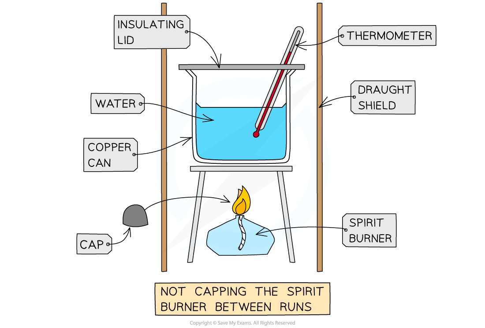

Error & Uncertainty
-------------------

* An error is the difference between a value or quantity obtained in an experiment and an accepted or literature value for an experiment
* There are two types of errors in experiments, <b>random errors</b> and<b> systematic errors</b>

#### Random Errors

* When you are reading an instrument and estimate the final digit, there is an equal chance that you may read it slightly too high or slightly too low

  + This is a<b> random error</b>
* <b>Random errors</b> are can be affected by:

  + How easily the instrument or scale is to read
  + The person reading the scale poorly
  + Changes in the environment, for example

    - fluctuations in the temperature of the lab
    - air currents in the room
* <b>Random errors</b> will pull a result away from an accepted value in either direction (either too high or too low)
* Repeating the experiment and working with the mean average of the results can help to reduce the effects of random errors

#### Systematic Errors

* <b>Systematic errors</b> are errors that occur as a result of a faulty or poorly designed experimental procedure
* <b>Systematic errors</b> will always pull the result away from the accepted value in the <b>same</b> direction (always too high or always too low)
* For example,

  + If you forget to zero an electronic balance (using the tare button) the mass weighings will always be higher than they should be
  + If you don't read the volume in a burette at eye level, the volumes will always be smaller than they should be due to a parallax error
  + If you fail to keep a cap on a spirit burner in a calorimetry experiment, the alcohol will evaporate and give you a larger mass loss
* Repeating the experiment and working with the average value will not remove any systematic errors

*<b>Systematic errors</b>*

#### Percentage Uncertainties

* <b>Percentage uncertainties</b> are a way to compare the significance of an <b>absolute uncertainty</b> on a measurement
* This is not to be confused with <b>percentage error</b>, which is a comparison of a result to a literature value
* The formula for calculating percentage uncertainty is as follows:

Percentage uncertainty = ![fraction numerator absolute space uncertainty over denominator measured space value end fraction cross times 100](data:image/svg+xml;charset=utf8,%3Csvg%20xmlns%3D%22http%3A%2F%2Fwww.w3.org%2F2000%2Fsvg%22%20xmlns%3Awrs%3D%22http%3A%2F%2Fwww.wiris.com%2Fxml%2Fmathml-extension%22%20height%3D%2239%22%20width%3D%22170%22%20wrs%3Abaseline%3D%2224%22%3E%3C!--MathML%3A%20%3Cmath%20xmlns%3D%22http%3A%2F%2Fwww.w3.org%2F1998%2FMath%2FMathML%22%20style%3D%22font-family%3AArial%22%3E%3Cmstyle%20mathsize%3D%2214px%22%3E%3Cmfrac%3E%3Cmrow%3E%3Cmi%3Eabsolute%3C%2Fmi%3E%3Cmo%3E%26%23xA0%3B%3C%2Fmo%3E%3Cmi%3Euncertainty%3C%2Fmi%3E%3C%2Fmrow%3E%3Cmrow%3E%3Cmi%3Emeasured%3C%2Fmi%3E%3Cmo%3E%26%23xA0%3B%3C%2Fmo%3E%3Cmi%3Evalue%3C%2Fmi%3E%3C%2Fmrow%3E%3C%2Fmfrac%3E%3Cmo%3E%26%23xD7%3B%3C%2Fmo%3E%3Cmn%3E100%3C%2Fmn%3E%3C%2Fmstyle%3E%3C%2Fmath%3E--%3E%3Cdefs%3E%3Cstyle%20type%3D%22text%2Fcss%22%3E%40font-face%7Bfont-family%3A'math13b8a614226a953a8cd9526fca6'%3Bsrc%3Aurl(data%3Afont%2Ftruetype%3Bcharset%3Dutf-8%3Bbase64%2CAAEAAAAMAIAAAwBAT1MvMi7iBBMAAADMAAAATmNtYXDEvmKUAAABHAAAADRjdnQgDVUNBwAAAVAAAAA6Z2x5ZoPi2VsAAAGMAAAAl2hlYWQQC2qxAAACJAAAADZoaGVhCGsXSAAAAlwAAAAkaG10eE2rRkcAAAKAAAAACGxvY2EAHTwYAAACiAAAAAxtYXhwBT0FPgAAApQAAAAgbmFtZaBxlY4AAAK0AAABn3Bvc3QB9wD6AAAEVAAAACBwcmVwa1uragAABHQAAAAUAAADSwGQAAUAAAQABAAAAAAABAAEAAAAAAAAAQEAAAAAAAAAAAAAAAAAAAAAAAAAAAAAAAAAAAAAACAgICAAAAAg1UADev96AAAD6ACWAAAAAAACAAEAAQAAABQAAwABAAAAFAAEACAAAAAEAAQAAQAAANf%2F%2FwAAANf%2F%2F%2F8qAAEAAAAAAAABVAMsAIABAABWACoCWAIeAQ4BLAIsAFoBgAKAAKAA1ACAAAAAAAAAACsAVQCAAKsA1QEAASsABwAAAAIAVQAAAwADqwADAAcAADMRIRElIREhVQKr%2FasCAP4AA6v8VVUDAAACAIAAVQLVAoAAAwAHAEYYsAEUALEAABMQsQAJ5LEAARMQsAQ8sQYI9LACPDABsQgBExCxAAP2sAc8sQEF9bAGPLIFBwAQ9LACPLEJA%2BaxBAX1sAM8EzMBIxEzASOAVQIAVVX%2BAFUCgP3VAiv91QAAAQAAAAEAANV4zkFfDzz1AAMEAP%2F%2F%2F%2F%2FWOhNz%2F%2F%2F%2F%2F9Y6E3MAAP8gBIADqwAAAAoAAgABAAAAAAABAAAD6P9qAAAXcAAA%2F7YEgAABAAAAAAAAAAAAAAAAAAAAAgNSAFUDVgCAAAAAAAAAACgAAACXAAEAAAACAF4ABQAAAAAAAgCABAAAAAAABAAA3gAAAAAAAAAVAQIAAAAAAAAAAQASAAAAAAAAAAAAAgAOABIAAAAAAAAAAwAwACAAAAAAAAAABAASAFAAAAAAAAAABQAWAGIAAAAAAAAABgAJAHgAAAAAAAAACAAcAIEAAQAAAAAAAQASAAAAAQAAAAAAAgAOABIAAQAAAAAAAwAwACAAAQAAAAAABAASAFAAAQAAAAAABQAWAGIAAQAAAAAABgAJAHgAAQAAAAAACAAcAIEAAwABBAkAAQASAAAAAwABBAkAAgAOABIAAwABBAkAAwAwACAAAwABBAkABAASAFAAAwABBAkABQAWAGIAAwABBAkABgAJAHgAAwABBAkACAAcAIEATQBhAHQAaAAgAEYAbwBuAHQAUgBlAGcAdQBsAGEAcgBNAGEAdABoAHMAIABGAG8AcgAgAE0AbwByAGUAIABNAGEAdABoACAARgBvAG4AdABNAGEAdABoACAARgBvAG4AdABWAGUAcgBzAGkAbwBuACAAMQAuADBNYXRoX0ZvbnQATQBhAHQAaABzACAARgBvAHIAIABNAG8AcgBlAAADAAAAAAAAAfQA%2BgAAAAAAAAAAAAAAAAAAAAAAAAAAuQcRAACNhRgAsgAAABUUE7EAAT8%3D)format('truetype')%3Bfont-weight%3Anormal%3Bfont-style%3Anormal%3B%7D%3C%2Fstyle%3E%3C%2Fdefs%3E%3Cline%20stroke%3D%22%23000%22%20stroke-linecap%3D%22square%22%20stroke-width%3D%221%22%20x1%3D%222.5%22%20x2%3D%22128.5%22%20y1%3D%2219.5%22%20y2%3D%2219.5%22%2F%3E%3Ctext%20font-family%3D%22Arial%22%20font-size%3D%2214%22%20text-anchor%3D%22middle%22%20x%3D%2229.5%22%20y%3D%2214%22%3Eabsolute%3C%2Ftext%3E%3Ctext%20font-family%3D%22Arial%22%20font-size%3D%2214%22%20text-anchor%3D%22middle%22%20x%3D%2294.5%22%20y%3D%2214%22%3Euncertainty%3C%2Ftext%3E%3Ctext%20font-family%3D%22Arial%22%20font-size%3D%2214%22%20text-anchor%3D%22middle%22%20x%3D%2247.5%22%20y%3D%2235%22%3Emeasured%3C%2Ftext%3E%3Ctext%20font-family%3D%22Arial%22%20font-size%3D%2214%22%20text-anchor%3D%22middle%22%20x%3D%2298.5%22%20y%3D%2235%22%3Evalue%3C%2Ftext%3E%3Ctext%20font-family%3D%22math13b8a614226a953a8cd9526fca6%22%20font-size%3D%2214%22%20text-anchor%3D%22middle%22%20x%3D%22138.5%22%20y%3D%2224%22%3E%26%23xD7%3B%3C%2Ftext%3E%3Ctext%20font-family%3D%22Arial%22%20font-size%3D%2214%22%20text-anchor%3D%22middle%22%20x%3D%22156.5%22%20y%3D%2224%22%3E100%3C%2Ftext%3E%3C%2Fsvg%3E)

* Some examples of percentage uncertainty calculations for common laboratory apparatus:

*<b>Calculating Percentage Uncertainty</b>*

<b>Adding or subtracting measurements</b>

* When you are adding or subtracting two measurements then you add together the <b>absolute</b> measurement uncertainties
* For example,

  + Using a balance to measure the initial and final mass of a container
  + Using a thermometer for the measurement of the temperature at the start and the end
  + Using a burette to find the initial reading and final reading
* In all these examples you have to read the instrument <b>twice</b> to obtain the quantity
* If each you time you read the instrument the measurement is 'out' by the stated uncertainty, then your final quantity is potentially 'out' by <b>twice</b> the uncertainty

<b>Multiplying or dividing measurements</b>

* When you multiply or divide experimental measurements then you <b>add</b> together the <b>percentage</b> <b>uncertainties</b>
* You can then calculate the <b>absolute uncertainty</b> from the sum of the percentage uncertainties

#### Examiner Tips and Tricks

If you are multiplying or dividing data you should quote the answer to the same number of significant figures as the least precise data.

When you add or subtract data you should use the same number of decimal places as the least precise data value