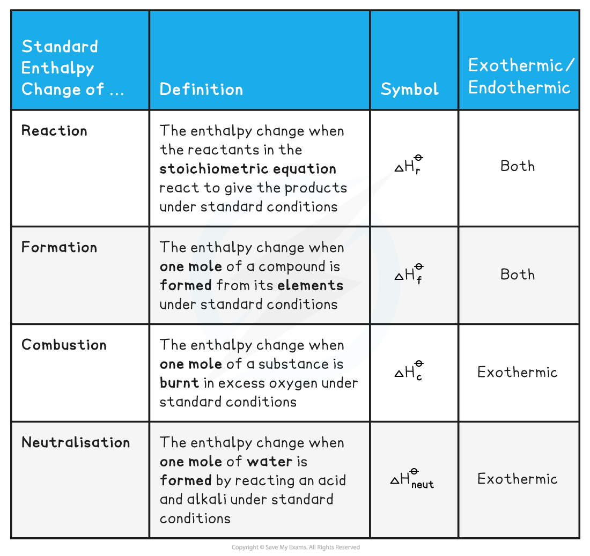

## Enthalpy Change Definitions

* To be able to compare the changes in enthalpy between reactions, all thermodynamic measurements are carried out under standard conditions
* These standard conditions are:

  + A **pressure** of 100 kPa (you may see some older exam questions that use a figure of 101 kPa; the exact figure is 101 325 Pa, but it has been simplified in the current syllabus for problem-solving purposes)
  + A **temperature** of 298 K (25 oC)
  + Each substance involved in the reaction is in its **standard physical state** (solid, liquid or gas)
* To show that a reaction has been carried out under standard conditions, the symbol Ꝋ is used

  + Δ*H*Ꝋ = the standard enthalpy change
* There are a number of key definitions relating to enthalpy changes that you need to know

**Enthalpy Definitions Table**

#### Examiner Tips and Tricks

You will see various enthalpy change symbols used with subtle changes, e.g.

Δ*H*cꝊ or Δc*H*Ꝋ for enthalpy of combustion

Whichever symbol you use must have the following basic points:

* Δ to represent change
* *H* to represent enthlalpy
* Ꝋ to respresent standard conditions
* A symbol to represent the type of enthalpy change occurring, e.g.

  + c for combustion
  + f for formation
  + neut for neutralisation
  + r for reaction

#### Worked Example

**Calculating the enthalpy change of reaction**

One mole water is formed from hydrogen and oxygen, releasing 286 kJ of energy

H2 (g) + ½O2 (g) **→** H2O (I)      Δ*H**r*Ꝋ = -286 kJ mol-1

Calculate Δ*H**r*Ꝋ for the reaction below:

2H2 (g) + O2 (g) **→** 2H2O (I)

**Answer**

* Since two moles of water molecules are formed in the question above, the energy released is simply:

* Δ*H**r*Ꝋ = 2 mol x (-286 kJ mol-1) = -572 kJ mol-1

#### Worked Example

**Calculating the enthalpy change**

Calculate ΔHfꝋ for the reaction below, given that ΔHfꝋ [Fe2O3(s)] = -824.2 kJ mol-1

4Fe(s) + 3 O2(g) → 2 Fe2O3(s)

**Answer**

* Since two moles of Fe2O3 (s) are formed the total change in enthalpy for the reaction above is:

  + Δ*H**f*Ꝋ =  2 x ( -824.2 kJ mol-1) = - 1648 kJ

#### Worked Example

**Calculating enthalpy changes**

Identify each of the following as Δ*H**r*Ꝋ, Δ*H**f*Ꝋ, ΔHcꝊ or ΔHneutꝊ

1. MgCO3 (s) **→** MgO (s) + CO2 (g)
2. C (graphite) + O2 (g) **→**CO2 (g)
3. HCl (aq) + NaOH (aq) **→** NaCl (aq) + H2O (I)

**Answer**

**Answer 1:** Δ*H**r*Ꝋ

**Answer 2:** Δ*H**f*Ꝋ as one mole of CO2 is formed from its elements in standard state *and* Δ*H**c*Ꝋ as one mole of carbon is burnt in oxygen

**Answer 3:** Δ*H**neut*Ꝋ as one mole of water is formed from the reaction between an acid and an alkali

#### Examiner Tips and Tricks

The Δ*H**f*Ꝋ of an **element** in its standard state is zero.

For example, Δ*H**f*Ꝋ of O2(g) is 0 kJ mol-1