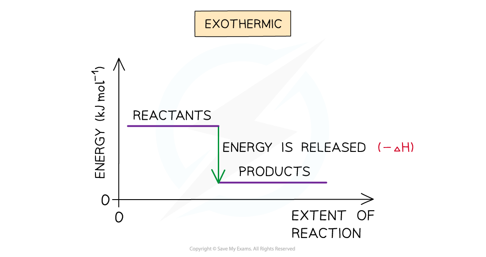

## Enthalpy Level Diagrams

* The total chemical energy inside a substance is called the **enthalpy** (or heat content)
* When chemical reactions take place, changes in chemical energy take place and therefore the enthalpy changes
* An **enthalpy change** is represented by the symbol Δ*H* (Δ= change; *H* = enthalpy)
* An enthalpy change can be positive or negative

#### Examiner Tips and Tricks

Activation energy is not shown in enthalpy level diagrams

Activation is shown in reaction profile diagrams

#### Exothermic reactions

* A reaction is exothermic when the products have less energy than the reactants
* Heat energy is **given off** by the reaction **to the** **surroundings**

  + The **temperature** of the **environment increases** - this can be measured with a thermometer
  + The **energy** of the **system decreases**
* There is an enthalpy decrease during the reaction so Δ*H* is negative
* Exothermic reactions are **thermodynamically** possible (because the enthalpy of the reactants is **higher** than that of the products)
* However, if the rate is too slow, the reaction may not occur

  + In this case the reaction is **kinetically** controlled

***The enthalpy change during an exothermic reaction***

#### Endothermic reactions

* A reaction is endothermic when the products have more energy than the reactants
* Heat energy is **absorbed** **by** the reaction **from** the **surroundings**

  + The **temperature** of the **environment decreases** - this can be measured with a thermometer
  + The **energy**of the **system increases**
* There is an enthalpy increase during the reaction so Δ*H* is positive

***The enthalpy change during an endothermic reaction***

#### Examiner Tips and Tricks

It is important to specify the physical states of each species in an equation when dealing with enthalpy changes as any changes in state can cause very large changes of enthalpy. For example:

**NaCl (s) → Na****+** **(aq) + Cl****-** **(aq)   Δ*****H*** **= +4 kJ mol****-1**

**NaCl (g) → Na****+** **(g) + Cl****-** **(g)   Δ*****H*** **= +500 kJ mol****-1**

Also, remember that the **system** is the substances**that are reacting** (i.e. the reaction itself) and the **surroundings is everything else** (e.g. the flask the reaction is taking place in).