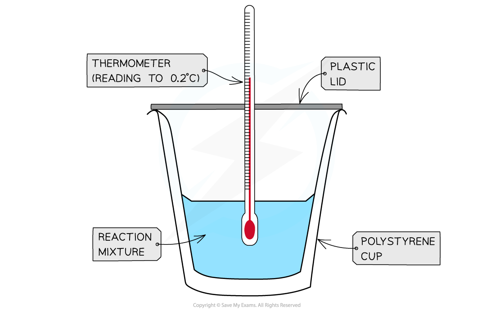
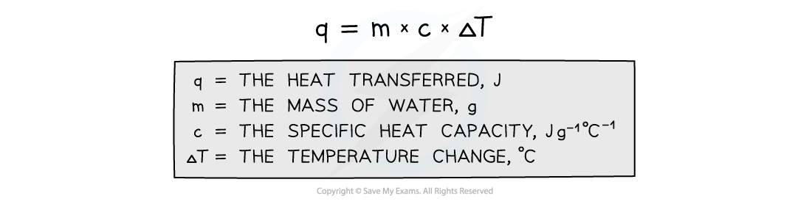

## Calculating Energy Transferred, Q

#### Measuring enthalpy changes

* **Calorimetry** is the measurement enthalpy changes in chemical reactions
* A simple **calorimeter** can be made from a **polystyrene drinking cup**, a **vacuum flask** or **metal can**

  

**A polystyrene cup can act as a calorimeter to find enthalpy changes in a chemical reaction**

* The energy needed to increase the temperature of 1 g of a substance by 1 oC is called the **specific heat capacity**(*c* ) of the liquid
* The specific heat capacity of water is 4.18 J g-1 K-1
* The energy transferred as heat can be calculated by:

  

***Equation for calculating energy transferred in a calorimeter***

#### Worked Example

**Specific heat capacity calculations**

In a calorimetry experiment 2.50 g of methane is burnt in excess oxygen.

30% of the energy released during the combustion is absorbed by 500 g of water, the temperature of which rises from 25 °C to 68 °C.

The specific heat capacity of water is 4.18 J g-1 K−1

What is the total energy released per gram of methane burnt?

**Answer**

**Step 1:**

* *q* = *m* x *c* x Δ*T*

  + *m* (of water) = 500 g
  + *c* (of water) = 4.18 J g-1 oC-1
  + Δ*T* (of water) = 68 oC - 25 oC = 43 oC

**Step 2:**

* *q* = 500 x 4.18 x 43 = 89 870 J

**Step 3:**

* This is only 30% of the total energy released by methane

  + Total energy x 0.3 = 89 870 J
  + Total energy = 299 567 J

**Step 4:**

* This is released by 2.50 g of methane

  + Energy released by 1.00 g of methane = 299 567 ÷ 2.50 = 120 000 J g-1 (to 3 s.f.) or 120 kJ g-1

## Calculating Enthalpy Changes

* Aqueous solutions of acid, alkalis and salts are assumed to be largely water so you can just use the m and c values of water when calculating the energy transferred.
* To calculate any changes in enthalpy per mole of a reactant or product the following relationship can be used:

Δ*H* = ![q over n space or space fraction numerator m space cross times space c space cross times straight capital delta T over denominator n end fraction](data:image/svg+xml;charset=utf8,%3Csvg%20xmlns%3D%22http%3A%2F%2Fwww.w3.org%2F2000%2Fsvg%22%20xmlns%3Awrs%3D%22http%3A%2F%2Fwww.wiris.com%2Fxml%2Fmathml-extension%22%20height%3D%2247%22%20width%3D%22144%22%20wrs%3Abaseline%3D%2230%22%3E%3C!--MathML%3A%20%3Cmath%20xmlns%3D%22http%3A%2F%2Fwww.w3.org%2F1998%2FMath%2FMathML%22%3E%3Cmfrac%3E%3Cmi%3Eq%3C%2Fmi%3E%3Cmi%3En%3C%2Fmi%3E%3C%2Fmfrac%3E%3Cmo%3E%26%23xA0%3B%3C%2Fmo%3E%3Cmi%3Eor%3C%2Fmi%3E%3Cmo%3E%26%23xA0%3B%3C%2Fmo%3E%3Cmfrac%3E%3Cmrow%3E%3Cmi%3Em%3C%2Fmi%3E%3Cmo%3E%26%23xA0%3B%3C%2Fmo%3E%3Cmo%3E%26%23xD7%3B%3C%2Fmo%3E%3Cmo%3E%26%23xA0%3B%3C%2Fmo%3E%3Cmi%3Ec%3C%2Fmi%3E%3Cmo%3E%26%23xA0%3B%3C%2Fmo%3E%3Cmo%3E%26%23xD7%3B%3C%2Fmo%3E%3Cmi%20mathvariant%3D%22normal%22%3E%26%23x394%3B%3C%2Fmi%3E%3Cmi%3ET%3C%2Fmi%3E%3C%2Fmrow%3E%3Cmi%3En%3C%2Fmi%3E%3C%2Fmfrac%3E%3C%2Fmath%3E--%3E%3Cdefs%3E%3Cstyle%20type%3D%22text%2Fcss%22%3E%40font-face%7Bfont-family%3A'math13b8a614226a953a8cd9526fca6'%3Bsrc%3Aurl(data%3Afont%2Ftruetype%3Bcharset%3Dutf-8%3Bbase64%2CAAEAAAAMAIAAAwBAT1MvMi7iBBMAAADMAAAATmNtYXDEvmKUAAABHAAAADRjdnQgDVUNBwAAAVAAAAA6Z2x5ZoPi2VsAAAGMAAAAl2hlYWQQC2qxAAACJAAAADZoaGVhCGsXSAAAAlwAAAAkaG10eE2rRkcAAAKAAAAACGxvY2EAHTwYAAACiAAAAAxtYXhwBT0FPgAAApQAAAAgbmFtZaBxlY4AAAK0AAABn3Bvc3QB9wD6AAAEVAAAACBwcmVwa1uragAABHQAAAAUAAADSwGQAAUAAAQABAAAAAAABAAEAAAAAAAAAQEAAAAAAAAAAAAAAAAAAAAAAAAAAAAAAAAAAAAAACAgICAAAAAg1UADev96AAAD6ACWAAAAAAACAAEAAQAAABQAAwABAAAAFAAEACAAAAAEAAQAAQAAANf%2F%2FwAAANf%2F%2F%2F8qAAEAAAAAAAABVAMsAIABAABWACoCWAIeAQ4BLAIsAFoBgAKAAKAA1ACAAAAAAAAAACsAVQCAAKsA1QEAASsABwAAAAIAVQAAAwADqwADAAcAADMRIRElIREhVQKr%2FasCAP4AA6v8VVUDAAACAIAAVQLVAoAAAwAHAEYYsAEUALEAABMQsQAJ5LEAARMQsAQ8sQYI9LACPDABsQgBExCxAAP2sAc8sQEF9bAGPLIFBwAQ9LACPLEJA%2BaxBAX1sAM8EzMBIxEzASOAVQIAVVX%2BAFUCgP3VAiv91QAAAQAAAAEAANV4zkFfDzz1AAMEAP%2F%2F%2F%2F%2FWOhNz%2F%2F%2F%2F%2F9Y6E3MAAP8gBIADqwAAAAoAAgABAAAAAAABAAAD6P9qAAAXcAAA%2F7YEgAABAAAAAAAAAAAAAAAAAAAAAgNSAFUDVgCAAAAAAAAAACgAAACXAAEAAAACAF4ABQAAAAAAAgCABAAAAAAABAAA3gAAAAAAAAAVAQIAAAAAAAAAAQASAAAAAAAAAAAAAgAOABIAAAAAAAAAAwAwACAAAAAAAAAABAASAFAAAAAAAAAABQAWAGIAAAAAAAAABgAJAHgAAAAAAAAACAAcAIEAAQAAAAAAAQASAAAAAQAAAAAAAgAOABIAAQAAAAAAAwAwACAAAQAAAAAABAASAFAAAQAAAAAABQAWAGIAAQAAAAAABgAJAHgAAQAAAAAACAAcAIEAAwABBAkAAQASAAAAAwABBAkAAgAOABIAAwABBAkAAwAwACAAAwABBAkABAASAFAAAwABBAkABQAWAGIAAwABBAkABgAJAHgAAwABBAkACAAcAIEATQBhAHQAaAAgAEYAbwBuAHQAUgBlAGcAdQBsAGEAcgBNAGEAdABoAHMAIABGAG8AcgAgAE0AbwByAGUAIABNAGEAdABoACAARgBvAG4AdABNAGEAdABoACAARgBvAG4AdABWAGUAcgBzAGkAbwBuACAAMQAuADBNYXRoX0ZvbnQATQBhAHQAaABzACAARgBvAHIAIABNAG8AcgBlAAADAAAAAAAAAfQA%2BgAAAAAAAAAAAAAAAAAAAAAAAAAAuQcRAACNhRgAsgAAABUUE7EAAT8%3D)format('truetype')%3Bfont-weight%3Anormal%3Bfont-style%3Anormal%3B%7D%3C%2Fstyle%3E%3C%2Fdefs%3E%3Cline%20stroke%3D%22%23000%22%20stroke-linecap%3D%22square%22%20stroke-width%3D%221%22%20x1%3D%222.5%22%20x2%3D%2215.5%22%20y1%3D%2223.5%22%20y2%3D%2223.5%22%2F%3E%3Ctext%20font-family%3D%22Times%20New%20Roman%22%20font-size%3D%2218%22%20font-style%3D%22italic%22%20text-anchor%3D%22middle%22%20x%3D%228.5%22%20y%3D%2216%22%3Eq%3C%2Ftext%3E%3Ctext%20font-family%3D%22Times%20New%20Roman%22%20font-size%3D%2218%22%20font-style%3D%22italic%22%20text-anchor%3D%22middle%22%20x%3D%228.5%22%20y%3D%2241%22%3En%3C%2Ftext%3E%3Ctext%20font-family%3D%22Times%20New%20Roman%22%20font-size%3D%2218%22%20text-anchor%3D%22middle%22%20x%3D%2229.5%22%20y%3D%2230%22%3Eor%3C%2Ftext%3E%3Cline%20stroke%3D%22%23000%22%20stroke-linecap%3D%22square%22%20stroke-width%3D%221%22%20x1%3D%2243.5%22%20x2%3D%22140.5%22%20y1%3D%2223.5%22%20y2%3D%2223.5%22%2F%3E%3Ctext%20font-family%3D%22Times%20New%20Roman%22%20font-size%3D%2218%22%20font-style%3D%22italic%22%20text-anchor%3D%22middle%22%20x%3D%2252.5%22%20y%3D%2216%22%3Em%3C%2Ftext%3E%3Ctext%20font-family%3D%22math13b8a614226a953a8cd9526fca6%22%20font-size%3D%2216%22%20text-anchor%3D%22middle%22%20x%3D%2272.5%22%20y%3D%2216%22%3E%26%23xD7%3B%3C%2Ftext%3E%3Ctext%20font-family%3D%22Times%20New%20Roman%22%20font-size%3D%2218%22%20font-style%3D%22italic%22%20text-anchor%3D%22middle%22%20x%3D%2289.5%22%20y%3D%2216%22%3Ec%3C%2Ftext%3E%3Ctext%20font-family%3D%22math13b8a614226a953a8cd9526fca6%22%20font-size%3D%2216%22%20text-anchor%3D%22middle%22%20x%3D%22106.5%22%20y%3D%2216%22%3E%26%23xD7%3B%3C%2Ftext%3E%3Ctext%20font-family%3D%22Times%20New%20Roman%22%20font-size%3D%2218%22%20text-anchor%3D%22middle%22%20x%3D%22121.5%22%20y%3D%2216%22%3E%26%23x394%3B%3C%2Ftext%3E%3Ctext%20font-family%3D%22Times%20New%20Roman%22%20font-size%3D%2218%22%20font-style%3D%22italic%22%20text-anchor%3D%22middle%22%20x%3D%22132.5%22%20y%3D%2216%22%3ET%3C%2Ftext%3E%3Ctext%20font-family%3D%22Times%20New%20Roman%22%20font-size%3D%2218%22%20font-style%3D%22italic%22%20text-anchor%3D%22middle%22%20x%3D%2291.5%22%20y%3D%2241%22%3En%3C%2Ftext%3E%3C%2Fsvg%3E)

* When there is a rise in temperature, the value for Δ*H* becomes negative suggesting that the reaction is exothermic

  + This means that your value should be negative for an exothermic reaction, e.g. combustion
* When the temperature falls, the value for Δ*H* becomes positive suggesting that the reaction is endothermic

  + This means that your value should be positive for an endothermic reaction, e.g. combustion

#### Worked Example

1.50 g of an organic liquid (*M*r = 58.0) underwent complete combustion. The heat formed raised the temperature of 100 g of water from 20 oC to 75 oC.

Calculate the enthalpy of combustion for the organic liquid

**Answer**

**Step 1:**Calculate the energy released by the organic liquid

* *Q*= *mc*Δ*T*

  + *Q*= 100 x 4.18 x (75 - 20)
  + *Q* = 22990 J
  + *Q* = 22.99 kJ

**Step 2:** Calculate the number of moles of the organic liquid

* Number of moles = ![equals fraction numerator m a s s over denominator m o l a r space m a s s end fraction equals fraction numerator 1.50 over denominator 58.0 end fraction equals](data:image/svg+xml;charset=utf8,%3Csvg%20xmlns%3D%22http%3A%2F%2Fwww.w3.org%2F2000%2Fsvg%22%20xmlns%3Awrs%3D%22http%3A%2F%2Fwww.wiris.com%2Fxml%2Fmathml-extension%22%20height%3D%2247%22%20width%3D%22184%22%20wrs%3Abaseline%3D%2230%22%3E%3C!--MathML%3A%20%3Cmath%20xmlns%3D%22http%3A%2F%2Fwww.w3.org%2F1998%2FMath%2FMathML%22%3E%3Cmo%3E%3D%3C%2Fmo%3E%3Cmfrac%3E%3Cmrow%3E%3Cmi%3Em%3C%2Fmi%3E%3Cmi%3Ea%3C%2Fmi%3E%3Cmi%3Es%3C%2Fmi%3E%3Cmi%3Es%3C%2Fmi%3E%3C%2Fmrow%3E%3Cmrow%3E%3Cmi%3Em%3C%2Fmi%3E%3Cmi%3Eo%3C%2Fmi%3E%3Cmi%3El%3C%2Fmi%3E%3Cmi%3Ea%3C%2Fmi%3E%3Cmi%3Er%3C%2Fmi%3E%3Cmo%3E%26%23xA0%3B%3C%2Fmo%3E%3Cmi%3Em%3C%2Fmi%3E%3Cmi%3Ea%3C%2Fmi%3E%3Cmi%3Es%3C%2Fmi%3E%3Cmi%3Es%3C%2Fmi%3E%3C%2Fmrow%3E%3C%2Fmfrac%3E%3Cmo%3E%3D%3C%2Fmo%3E%3Cmfrac%3E%3Cmrow%3E%3Cmn%3E1%3C%2Fmn%3E%3Cmo%3E.%3C%2Fmo%3E%3Cmn%3E50%3C%2Fmn%3E%3C%2Fmrow%3E%3Cmrow%3E%3Cmn%3E58%3C%2Fmn%3E%3Cmo%3E.%3C%2Fmo%3E%3Cmn%3E0%3C%2Fmn%3E%3C%2Fmrow%3E%3C%2Fmfrac%3E%3Cmo%3E%3D%3C%2Fmo%3E%3C%2Fmath%3E--%3E%3Cdefs%3E%3Cstyle%20type%3D%22text%2Fcss%22%3E%40font-face%7Bfont-family%3A'math11824c643d1feb4da18b28ed527'%3Bsrc%3Aurl(data%3Afont%2Ftruetype%3Bcharset%3Dutf-8%3Bbase64%2CAAEAAAAMAIAAAwBAT1MvMi7iBBMAAADMAAAATmNtYXDEvmKUAAABHAAAADxjdnQgDVUNBwAAAVgAAAA6Z2x5ZoPi2VsAAAGUAAAA%2BGhlYWQQC2qxAAACjAAAADZoaGVhCGsXSAAAAsQAAAAkaG10eE2rRkcAAALoAAAADGxvY2EAHTwYAAAC9AAAABBtYXhwBT0FPgAAAwQAAAAgbmFtZaBxlY4AAAMkAAABn3Bvc3QB9wD6AAAExAAAACBwcmVwa1uragAABOQAAAAUAAADSwGQAAUAAAQABAAAAAAABAAEAAAAAAAAAQEAAAAAAAAAAAAAAAAAAAAAAAAAAAAAAAAAAAAAACAgICAAAAAg1UADev96AAAD6ACWAAAAAAACAAEAAQAAABQAAwABAAAAFAAEACgAAAAGAAQAAQACAC4APf%2F%2FAAAALgA9%2F%2F%2F%2F0%2F%2FFAAEAAAAAAAAAAAFUAywAgAEAAFYAKgJYAh4BDgEsAiwAWgGAAoAAoADUAIAAAAAAAAAAKwBVAIAAqwDVAQABKwAHAAAAAgBVAAADAAOrAAMABwAAMxEhESUhESFVAqv9qwIA%2FgADq%2FxVVQMAAAEAIAAAAKAAgAADAC8YAbAEELAD1LADELAC1LADELAAPLACELABPACwBBCwA9SwAxCwAjywABCwATwwMTczFSMggICAgAACAIAA6wLVAhUAAwAHAGUYAbAIELAG1LAGELAF1LAIELAB1LABELAA1LAGELAHPLAFELAEPLABELACPLAAELADPACwCBCwBtSwBhCwB9SwBxCwAdSwARCwAtSwBhCwBTywBxCwBDywARCwADywAhCwAzwxMBMhNSEdASE1gAJV%2FasCVQHAVdVVVQABAAAAAQAA1XjOQV8PPPUAAwQA%2F%2F%2F%2F%2F9Y6E3P%2F%2F%2F%2F%2F1joTcwAA%2FyAEgAOrAAAACgACAAEAAAAAAAEAAAPo%2F2oAABdwAAD%2FtgSAAAEAAAAAAAAAAAAAAAAAAAADA1IAVQDIACADVgCAAAAAAAAAACgAAABuAAAA%2BAABAAAAAwBeAAUAAAAAAAIAgAQAAAAAAAQAAN4AAAAAAAAAFQECAAAAAAAAAAEAEgAAAAAAAAAAAAIADgASAAAAAAAAAAMAMAAgAAAAAAAAAAQAEgBQAAAAAAAAAAUAFgBiAAAAAAAAAAYACQB4AAAAAAAAAAgAHACBAAEAAAAAAAEAEgAAAAEAAAAAAAIADgASAAEAAAAAAAMAMAAgAAEAAAAAAAQAEgBQAAEAAAAAAAUAFgBiAAEAAAAAAAYACQB4AAEAAAAAAAgAHACBAAMAAQQJAAEAEgAAAAMAAQQJAAIADgASAAMAAQQJAAMAMAAgAAMAAQQJAAQAEgBQAAMAAQQJAAUAFgBiAAMAAQQJAAYACQB4AAMAAQQJAAgAHACBAE0AYQB0AGgAIABGAG8AbgB0AFIAZQBnAHUAbABhAHIATQBhAHQAaABzACAARgBvAHIAIABNAG8AcgBlACAATQBhAHQAaAAgAEYAbwBuAHQATQBhAHQAaAAgAEYAbwBuAHQAVgBlAHIAcwBpAG8AbgAgADEALgAwTWF0aF9Gb250AE0AYQB0AGgAcwAgAEYAbwByACAATQBvAHIAZQAAAwAAAAAAAAH0APoAAAAAAAAAAAAAAAAAAAAAAAAAALkHEQAAjYUYALIAAAAVFBOxAAE%2F)format('truetype')%3Bfont-weight%3Anormal%3Bfont-style%3Anormal%3B%7D%3C%2Fstyle%3E%3C%2Fdefs%3E%3Ctext%20font-family%3D%22math11824c643d1feb4da18b28ed527%22%20font-size%3D%2216%22%20text-anchor%3D%22middle%22%20x%3D%228.5%22%20y%3D%2230%22%3E%3D%3C%2Ftext%3E%3Cline%20stroke%3D%22%23000%22%20stroke-linecap%3D%22square%22%20stroke-width%3D%221%22%20x1%3D%2219.5%22%20x2%3D%22106.5%22%20y1%3D%2223.5%22%20y2%3D%2223.5%22%2F%3E%3Ctext%20font-family%3D%22Times%20New%20Roman%22%20font-size%3D%2218%22%20font-style%3D%22italic%22%20text-anchor%3D%22middle%22%20x%3D%2252.5%22%20y%3D%2216%22%3Em%3C%2Ftext%3E%3Ctext%20font-family%3D%22Times%20New%20Roman%22%20font-size%3D%2218%22%20font-style%3D%22italic%22%20text-anchor%3D%22middle%22%20x%3D%2263.5%22%20y%3D%2216%22%3Ea%3C%2Ftext%3E%3Ctext%20font-family%3D%22Times%20New%20Roman%22%20font-size%3D%2218%22%20font-style%3D%22italic%22%20text-anchor%3D%22middle%22%20x%3D%2270.5%22%20y%3D%2216%22%3Es%3C%2Ftext%3E%3Ctext%20font-family%3D%22Times%20New%20Roman%22%20font-size%3D%2218%22%20font-style%3D%22italic%22%20text-anchor%3D%22middle%22%20x%3D%2277.5%22%20y%3D%2216%22%3Es%3C%2Ftext%3E%3Ctext%20font-family%3D%22Times%20New%20Roman%22%20font-size%3D%2218%22%20font-style%3D%22italic%22%20text-anchor%3D%22middle%22%20x%3D%2228.5%22%20y%3D%2241%22%3Em%3C%2Ftext%3E%3Ctext%20font-family%3D%22Times%20New%20Roman%22%20font-size%3D%2218%22%20font-style%3D%22italic%22%20text-anchor%3D%22middle%22%20x%3D%2239.5%22%20y%3D%2241%22%3Eo%3C%2Ftext%3E%3Ctext%20font-family%3D%22Times%20New%20Roman%22%20font-size%3D%2218%22%20font-style%3D%22italic%22%20text-anchor%3D%22middle%22%20x%3D%2246.5%22%20y%3D%2241%22%3El%3C%2Ftext%3E%3Ctext%20font-family%3D%22Times%20New%20Roman%22%20font-size%3D%2218%22%20font-style%3D%22italic%22%20text-anchor%3D%22middle%22%20x%3D%2253.5%22%20y%3D%2241%22%3Ea%3C%2Ftext%3E%3Ctext%20font-family%3D%22Times%20New%20Roman%22%20font-size%3D%2218%22%20font-style%3D%22italic%22%20text-anchor%3D%22middle%22%20x%3D%2260.5%22%20y%3D%2241%22%3Er%3C%2Ftext%3E%3Ctext%20font-family%3D%22Times%20New%20Roman%22%20font-size%3D%2218%22%20font-style%3D%22italic%22%20text-anchor%3D%22middle%22%20x%3D%2275.5%22%20y%3D%2241%22%3Em%3C%2Ftext%3E%3Ctext%20font-family%3D%22Times%20New%20Roman%22%20font-size%3D%2218%22%20font-style%3D%22italic%22%20text-anchor%3D%22middle%22%20x%3D%2286.5%22%20y%3D%2241%22%3Ea%3C%2Ftext%3E%3Ctext%20font-family%3D%22Times%20New%20Roman%22%20font-size%3D%2218%22%20font-style%3D%22italic%22%20text-anchor%3D%22middle%22%20x%3D%2293.5%22%20y%3D%2241%22%3Es%3C%2Ftext%3E%3Ctext%20font-family%3D%22Times%20New%20Roman%22%20font-size%3D%2218%22%20font-style%3D%22italic%22%20text-anchor%3D%22middle%22%20x%3D%22100.5%22%20y%3D%2241%22%3Es%3C%2Ftext%3E%3Ctext%20font-family%3D%22math11824c643d1feb4da18b28ed527%22%20font-size%3D%2216%22%20text-anchor%3D%22middle%22%20x%3D%22117.5%22%20y%3D%2230%22%3E%3D%3C%2Ftext%3E%3Cline%20stroke%3D%22%23000%22%20stroke-linecap%3D%22square%22%20stroke-width%3D%221%22%20x1%3D%22128.5%22%20x2%3D%22163.5%22%20y1%3D%2223.5%22%20y2%3D%2223.5%22%2F%3E%3Ctext%20font-family%3D%22Times%20New%20Roman%22%20font-size%3D%2218%22%20text-anchor%3D%22middle%22%20x%3D%22134.5%22%20y%3D%2216%22%3E1%3C%2Ftext%3E%3Ctext%20font-family%3D%22math11824c643d1feb4da18b28ed527%22%20font-size%3D%2216%22%20text-anchor%3D%22middle%22%20x%3D%22141.5%22%20y%3D%2216%22%3E.%3C%2Ftext%3E%3Ctext%20font-family%3D%22Times%20New%20Roman%22%20font-size%3D%2218%22%20text-anchor%3D%22middle%22%20x%3D%22153.5%22%20y%3D%2216%22%3E50%3C%2Ftext%3E%3Ctext%20font-family%3D%22Times%20New%20Roman%22%20font-size%3D%2218%22%20text-anchor%3D%22middle%22%20x%3D%22139.5%22%20y%3D%2241%22%3E58%3C%2Ftext%3E%3Ctext%20font-family%3D%22math11824c643d1feb4da18b28ed527%22%20font-size%3D%2216%22%20text-anchor%3D%22middle%22%20x%3D%22150.5%22%20y%3D%2241%22%3E.%3C%2Ftext%3E%3Ctext%20font-family%3D%22Times%20New%20Roman%22%20font-size%3D%2218%22%20text-anchor%3D%22middle%22%20x%3D%22157.5%22%20y%3D%2241%22%3E0%3C%2Ftext%3E%3Ctext%20font-family%3D%22math11824c643d1feb4da18b28ed527%22%20font-size%3D%2216%22%20text-anchor%3D%22middle%22%20x%3D%22174.5%22%20y%3D%2230%22%3E%3D%3C%2Ftext%3E%3C%2Fsvg%3E)0.0259 moles (to 3s.f.)

**Step 3:** Calculate the enthalpy change of combustion

* Δc*H*θ ![equals Q over n equals fraction numerator 22.99 over denominator 0.0259 end fraction equals](data:image/svg+xml;charset=utf8,%3Csvg%20xmlns%3D%22http%3A%2F%2Fwww.w3.org%2F2000%2Fsvg%22%20xmlns%3Awrs%3D%22http%3A%2F%2Fwww.wiris.com%2Fxml%2Fmathml-extension%22%20height%3D%2247%22%20width%3D%22132%22%20wrs%3Abaseline%3D%2230%22%3E%3C!--MathML%3A%20%3Cmath%20xmlns%3D%22http%3A%2F%2Fwww.w3.org%2F1998%2FMath%2FMathML%22%3E%3Cmo%3E%3D%3C%2Fmo%3E%3Cmfrac%3E%3Cmi%3EQ%3C%2Fmi%3E%3Cmi%3En%3C%2Fmi%3E%3C%2Fmfrac%3E%3Cmo%3E%3D%3C%2Fmo%3E%3Cmfrac%3E%3Cmrow%3E%3Cmn%3E22%3C%2Fmn%3E%3Cmo%3E.%3C%2Fmo%3E%3Cmn%3E99%3C%2Fmn%3E%3C%2Fmrow%3E%3Cmrow%3E%3Cmn%3E0%3C%2Fmn%3E%3Cmo%3E.%3C%2Fmo%3E%3Cmn%3E0259%3C%2Fmn%3E%3C%2Fmrow%3E%3C%2Fmfrac%3E%3Cmo%3E%3D%3C%2Fmo%3E%3C%2Fmath%3E--%3E%3Cdefs%3E%3Cstyle%20type%3D%22text%2Fcss%22%3E%40font-face%7Bfont-family%3A'math11824c643d1feb4da18b28ed527'%3Bsrc%3Aurl(data%3Afont%2Ftruetype%3Bcharset%3Dutf-8%3Bbase64%2CAAEAAAAMAIAAAwBAT1MvMi7iBBMAAADMAAAATmNtYXDEvmKUAAABHAAAADxjdnQgDVUNBwAAAVgAAAA6Z2x5ZoPi2VsAAAGUAAAA%2BGhlYWQQC2qxAAACjAAAADZoaGVhCGsXSAAAAsQAAAAkaG10eE2rRkcAAALoAAAADGxvY2EAHTwYAAAC9AAAABBtYXhwBT0FPgAAAwQAAAAgbmFtZaBxlY4AAAMkAAABn3Bvc3QB9wD6AAAExAAAACBwcmVwa1uragAABOQAAAAUAAADSwGQAAUAAAQABAAAAAAABAAEAAAAAAAAAQEAAAAAAAAAAAAAAAAAAAAAAAAAAAAAAAAAAAAAACAgICAAAAAg1UADev96AAAD6ACWAAAAAAACAAEAAQAAABQAAwABAAAAFAAEACgAAAAGAAQAAQACAC4APf%2F%2FAAAALgA9%2F%2F%2F%2F0%2F%2FFAAEAAAAAAAAAAAFUAywAgAEAAFYAKgJYAh4BDgEsAiwAWgGAAoAAoADUAIAAAAAAAAAAKwBVAIAAqwDVAQABKwAHAAAAAgBVAAADAAOrAAMABwAAMxEhESUhESFVAqv9qwIA%2FgADq%2FxVVQMAAAEAIAAAAKAAgAADAC8YAbAEELAD1LADELAC1LADELAAPLACELABPACwBBCwA9SwAxCwAjywABCwATwwMTczFSMggICAgAACAIAA6wLVAhUAAwAHAGUYAbAIELAG1LAGELAF1LAIELAB1LABELAA1LAGELAHPLAFELAEPLABELACPLAAELADPACwCBCwBtSwBhCwB9SwBxCwAdSwARCwAtSwBhCwBTywBxCwBDywARCwADywAhCwAzwxMBMhNSEdASE1gAJV%2FasCVQHAVdVVVQABAAAAAQAA1XjOQV8PPPUAAwQA%2F%2F%2F%2F%2F9Y6E3P%2F%2F%2F%2F%2F1joTcwAA%2FyAEgAOrAAAACgACAAEAAAAAAAEAAAPo%2F2oAABdwAAD%2FtgSAAAEAAAAAAAAAAAAAAAAAAAADA1IAVQDIACADVgCAAAAAAAAAACgAAABuAAAA%2BAABAAAAAwBeAAUAAAAAAAIAgAQAAAAAAAQAAN4AAAAAAAAAFQECAAAAAAAAAAEAEgAAAAAAAAAAAAIADgASAAAAAAAAAAMAMAAgAAAAAAAAAAQAEgBQAAAAAAAAAAUAFgBiAAAAAAAAAAYACQB4AAAAAAAAAAgAHACBAAEAAAAAAAEAEgAAAAEAAAAAAAIADgASAAEAAAAAAAMAMAAgAAEAAAAAAAQAEgBQAAEAAAAAAAUAFgBiAAEAAAAAAAYACQB4AAEAAAAAAAgAHACBAAMAAQQJAAEAEgAAAAMAAQQJAAIADgASAAMAAQQJAAMAMAAgAAMAAQQJAAQAEgBQAAMAAQQJAAUAFgBiAAMAAQQJAAYACQB4AAMAAQQJAAgAHACBAE0AYQB0AGgAIABGAG8AbgB0AFIAZQBnAHUAbABhAHIATQBhAHQAaABzACAARgBvAHIAIABNAG8AcgBlACAATQBhAHQAaAAgAEYAbwBuAHQATQBhAHQAaAAgAEYAbwBuAHQAVgBlAHIAcwBpAG8AbgAgADEALgAwTWF0aF9Gb250AE0AYQB0AGgAcwAgAEYAbwByACAATQBvAHIAZQAAAwAAAAAAAAH0APoAAAAAAAAAAAAAAAAAAAAAAAAAALkHEQAAjYUYALIAAAAVFBOxAAE%2F)format('truetype')%3Bfont-weight%3Anormal%3Bfont-style%3Anormal%3B%7D%3C%2Fstyle%3E%3C%2Fdefs%3E%3Ctext%20font-family%3D%22math11824c643d1feb4da18b28ed527%22%20font-size%3D%2216%22%20text-anchor%3D%22middle%22%20x%3D%228.5%22%20y%3D%2230%22%3E%3D%3C%2Ftext%3E%3Cline%20stroke%3D%22%23000%22%20stroke-linecap%3D%22square%22%20stroke-width%3D%221%22%20x1%3D%2219.5%22%20x2%3D%2236.5%22%20y1%3D%2223.5%22%20y2%3D%2223.5%22%2F%3E%3Ctext%20font-family%3D%22Times%20New%20Roman%22%20font-size%3D%2218%22%20font-style%3D%22italic%22%20text-anchor%3D%22middle%22%20x%3D%2227.5%22%20y%3D%2216%22%3EQ%3C%2Ftext%3E%3Ctext%20font-family%3D%22Times%20New%20Roman%22%20font-size%3D%2218%22%20font-style%3D%22italic%22%20text-anchor%3D%22middle%22%20x%3D%2227.5%22%20y%3D%2241%22%3En%3C%2Ftext%3E%3Ctext%20font-family%3D%22math11824c643d1feb4da18b28ed527%22%20font-size%3D%2216%22%20text-anchor%3D%22middle%22%20x%3D%2247.5%22%20y%3D%2230%22%3E%3D%3C%2Ftext%3E%3Cline%20stroke%3D%22%23000%22%20stroke-linecap%3D%22square%22%20stroke-width%3D%221%22%20x1%3D%2258.5%22%20x2%3D%22111.5%22%20y1%3D%2223.5%22%20y2%3D%2223.5%22%2F%3E%3Ctext%20font-family%3D%22Times%20New%20Roman%22%20font-size%3D%2218%22%20text-anchor%3D%22middle%22%20x%3D%2274.5%22%20y%3D%2216%22%3E22%3C%2Ftext%3E%3Ctext%20font-family%3D%22math11824c643d1feb4da18b28ed527%22%20font-size%3D%2216%22%20text-anchor%3D%22middle%22%20x%3D%2285.5%22%20y%3D%2216%22%3E.%3C%2Ftext%3E%3Ctext%20font-family%3D%22Times%20New%20Roman%22%20font-size%3D%2218%22%20text-anchor%3D%22middle%22%20x%3D%2297.5%22%20y%3D%2216%22%3E99%3C%2Ftext%3E%3Ctext%20font-family%3D%22Times%20New%20Roman%22%20font-size%3D%2218%22%20text-anchor%3D%22middle%22%20x%3D%2264.5%22%20y%3D%2241%22%3E0%3C%2Ftext%3E%3Ctext%20font-family%3D%22math11824c643d1feb4da18b28ed527%22%20font-size%3D%2216%22%20text-anchor%3D%22middle%22%20x%3D%2271.5%22%20y%3D%2241%22%3E.%3C%2Ftext%3E%3Ctext%20font-family%3D%22Times%20New%20Roman%22%20font-size%3D%2218%22%20text-anchor%3D%22middle%22%20x%3D%2292.5%22%20y%3D%2241%22%3E0259%3C%2Ftext%3E%3Ctext%20font-family%3D%22math11824c643d1feb4da18b28ed527%22%20font-size%3D%2216%22%20text-anchor%3D%22middle%22%20x%3D%22122.5%22%20y%3D%2230%22%3E%3D%3C%2Ftext%3E%3C%2Fsvg%3E)-887 kJ mol-1 (to 3s.f.)

  + Remember, combustion is an exothermic process and will, therefore, be a negative enthalpy change value