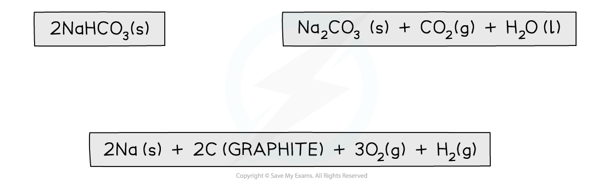

## Constructing Hess Cycles

* In 1840, the Russian chemist Germain Hess formulated a law which went on to be known as **Hess’s Law**
* This went on to form the basis of one of the laws of thermodynamics. The first law of thermodynamics relates to the **Law of Conservation of Energy**
* It is sometimes expressed in the following form:

***Energy cannot be created or destroyed, it can only change form***

* This means that in a **closed system**, the total amount of energy present is always constant
* Hess’s law can be used to calculate the standard enthalpy change of a reaction from known standard enthalpy changes
* Hess’s Lawstates that:

**"The total enthalpy change in a chemical reaction is independent of the route by which the chemical reaction takes place as long as the initial and final conditions are the same."**

* This means that whether the reaction takes place in one or two steps, the total enthalpy change of the reaction will still be the same

***The diagram above illustrates Hess’ Law: the enthalpy change of the direct route, going from reactants (A+B) to product (C) is equal to the enthalpy change of the indirect routes***

* Hess’ Law is used to calculate enthalpy changes which can’t be found experimentally using **calorimetry**, e.g.:

**3C (s) + 4H****2** **(g) → C****3****H****8****(g)**

* Δf*H* (propane) can’t be found experimentally as hydrogen and carbon don’t react under standard conditions

#### Calculating ΔrHfrom ΔfH using Hess’s Law energy cycles

* You can see the relationships on the following diagram:

  

***The enthalpy change from elements to products (direct route) is equal to the enthalpy change of elements forming reactants and then products (indirect route)***

* The products can be directly formed from the elements = **ΔH****2**

**OR**

* The products can be indirectly formed from the elements = **ΔH****1** **+ ΔH****r**

* **Equation**

**ΔH****2** **= ΔH****1** **+ ΔH****r**

Therefore for energy to be conserved,

**ΔH****r** **= ΔH****2** **– ΔH****1**

#### Examiner Tips and Tricks

You do not need to learn Hess's Law word for word as it is not a syllabus requirement, but you do need to understand the principle as it provides the foundation for all the problem solving in Chemical Energetics

## Hess Cycle Calculations

* Hess cycles can be used to calculate various enthalpy changes as long as sufficient information about the other sides of the cycle is known

#### Worked Example

**Calculating the enthalpy change of reaction**

Calculate the ΔHf for the following reaction:

2NaHCO3 (s)  **→** Na2CO3 (s) + CO2 (g) + H2O (I)

The table below shows the standard enthalpy of formations (ΔHfꝋ) relevant to this reaction:

**Answer**

**Step 1:** Write the balanced equation at the top

**Step 2:** Draw the cycle with the elements at the bottom

**Step 3:** Draw in all arrows, making sure they go in the correct directions. **Remember:** You are working with enthalpies of formation which means that the arrows go up to show the compounds being made from the elements. Write the standard enthalpy of formations

**Step 4:** Apply Hess’s Law

* Δr*H* = Δ*H**2* *-*Δ*H**1*

  + It is minus Δ*H**1* because you have to go in the opposite direction of the arrow
  + Δ*H**2* is Δf*H* [Na2CO3 (s)] + Δf*H* [CO2 (g)] + Δf*H* [H2O (l)]
  + ΔH1 is 2 x Δf*H* [NaHCO3 (s)]
  + Δr*H* = (Δf*H* [Na2CO3 (s)] + Δf*H* [CO2 (g)] + Δf*H* [H2O (l)]) - (2Δf*H* [NaHCO3 (s)])
  + Δr*H* = ((-1130.7) + (-393.5) + (-285.8)) - (2 x (-950.8))
  + Δr*H* = +91.6 kJ mol-1

#### Examiner Tips and Tricks

Keep your enthalpy values inside their own brackets so that you don't accidentally lose a minus sign