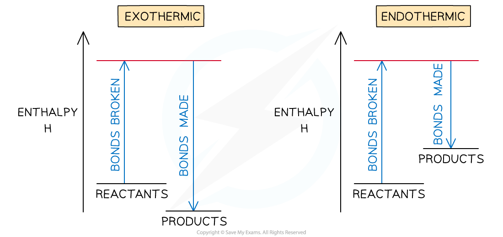
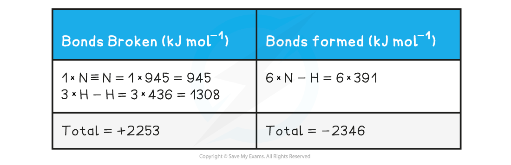

## Bond Enthalpy Definitions

* When bonds are broken or made **enthalpy changes** take place

  + A chemical bond is a force of attraction between two atoms
  + Breaking the bond requires the input of energy it is therefore an **endothermic** process
* The energy change required to break the bond depends on the atoms that form the bond

  + The energy required to break a particular bond is called the **bond dissociation enthalpy**
  + This is usually just shortened to **bond enthalpy** or **bond energy**
* Bond formation is the opposite of bond breaking and so energy is released when bonds are formed

  + It is therefore an **exothermic** process

***To break bonds energy is required from the surroundings and to make new bonds energy is released from the reaction to the surroundings***

* The amount of energy released when a particular bond is formed has the same magnitude as the energy taken in when the bond is broken but has the opposite sign

**Overall enthalpy changes**

* If more energy is released when new bonds are formed than energy is required to break bonds, the reaction is **exothermic**

  + The products are **more stable** than the reactants
* If more energy is required to break bonds than energy is released when new bonds are formed, the reaction is **endothermic**

  + The products are **less stable** than the reactants
* The relationship between bond breaking and bond making can be shown graphically like this:

***Bond enthalpy profiles***

#### Average bond energy

* Bond energies are affected by other atoms in the molecule (the environment)
* Therefore, an average of a number of the **same type of bond** but in different environments is calculated
* This bond energy is known as the **average bond energ**y and is defined as

**'The energy needed to break one mole of bonds in a gaseous molecule averaged over similar compounds'**

***Average bond enthalpy of C-H in methane***

* The **average bond enthalpy** of C-H is found by taking the **bond dissociation enthalpy** for the whole molecule and dividing it by the number of C-H bonds
* The first C-H bond is easier to break than the second as the remaining hydrogens are pulled more closely to the carbon
* However, since it is impossible to measure the energy of each C-H bond an average is taken
* This value is also compared with a range of similar compounds to obtain an accepted value for the **average bond enthalpy**

#### Examiner Tips and Tricks

A lot of students mix up endothermic / exothermic and bond breaking / bond making.

An easy way to remember is that **ENDOTHERMIC** leads to the poetic phrase the **'end o' the bond'**

## Calculating Bond Enthalpies

* Bond energies are used to find the Δ*H*rꝋ of a reaction when this cannot be done experimentally
* The process is a step-by-step summation of the bond enthalpies of the all the molecules present finishing with this formula:

Δr*H*θ = enthalpy change for bonds broken + enthalpy change for bonds formed

* These two worked examples show how to lay out your calculation

#### Worked Example

Calculate the enthalpy of reaction for the Haber process reaction. The relevant bond energies are given in the table below:

**Answer:**

**Step 1:** The chemical equation for the Haber process is:

**N****2** **(g) + 3H****2** **(g) ⇌ 2NH****3** **(g)**

**N≡N       3 H-H         6 N-H**

**Step 2:** Set out the calculation as a balance sheet as shown below:

Note! Values for bonds broken are positive (endothermic) and values for bonds formed are negative (exothermic)

**Step 3:** Calculate the standard enthalpy of reaction

* Δr*H**θ* = enthalpy change for bonds broken + enthalpy change for bonds formed

  + Δr*H**θ* = (+2253 kJ mol-1) + (-2346 kJ mol-1)
  + Δr*H**θ* = -93 kJ mol-1

#### Worked Example

The complete combustion of ethyne, C2H2 , is shown in the equation below:

2C2H2 (g)  + 5 O2 (g)   **→**   2H2O (g) + 4CO2 (g)

Using the average bond enthalpies given in the table, what is the enthalpy of combustion of ethyne?

**Answer:**

**Step 1:** The enthalpy of combustion is the enthalpy change when **one mole** of a substance reacts in excess oxygen to produce water and carbon dioxide

The chemical reaction should therefore be simplified such that only **one mole** of **ethyne** reacts in excess oxygen:

**H-C≡C-H + 2 ½ O=O → H-O-H + 2O=C=O**

**Step 2:** Set out the calculation as a balance sheet as shown below:

* Δr*H**θ* = enthalpy change for bonds broken + enthalpy change for bonds formed

  + Δr*H**θ* = (+2912 kJ mol-1) + (- 4142 kJ mol-1)
  + Δr*H**θ* = -1230 kJ mol-1

#### Examiner Tips and Tricks

The key to success in bond enthalpy calculations is to be very careful when accounting for every bond present. Always draw out the full displayed structures of the molecules so you don't miss any of the bonds.

Watch out for coefficients in the balanced equations as students often miss those, forget to multiply them by the bond enthalpies and get the answer wrong!

It is super important to show your steps because bond enthalpy calculations often carry 3 marks, 2 of which could be for workings if you get the final answer wrong