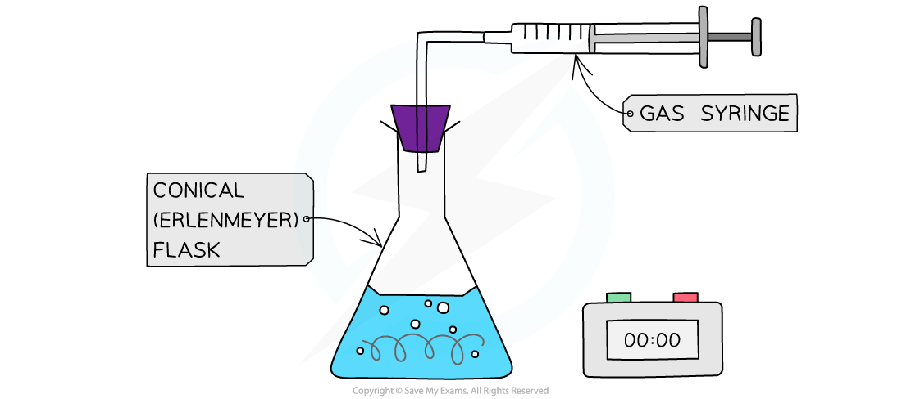
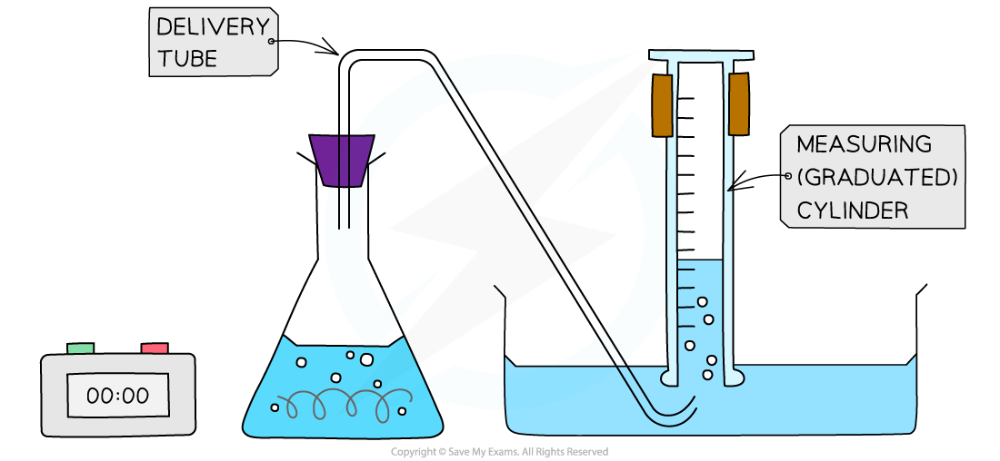
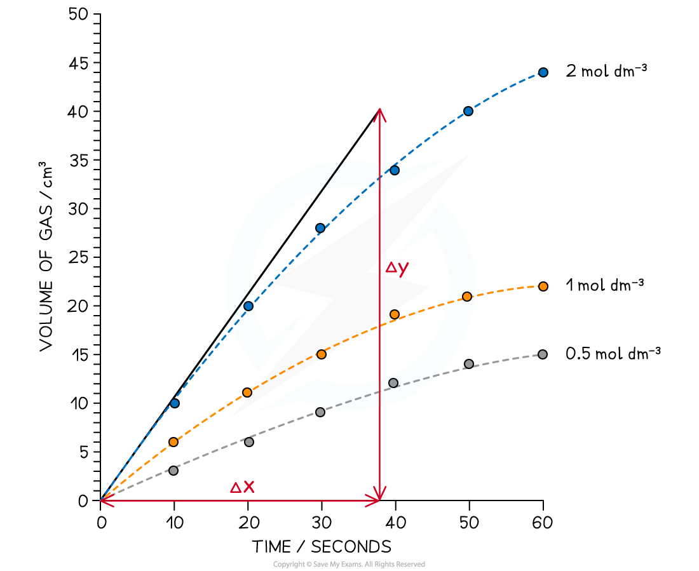

Calculating Rates of Reaction
-----------------------------

* To measure the <b>rate of a reaction</b>, we need to be able to measure either how quickly the reactants are used up or how quickly the products are formed
* The method used for measuring depends on the substances involved
* There are a number of ways to measure a reaction rate in the lab; they all depend on some property that changes during the course of the reaction
* That property is taken to be <b>proportional</b> to the concentration of the reactant or product, e.g., colour, mass, volume
* Some reaction rates can be measured as the reaction proceeds (this generates more data);

  + faster reactions can be easier to measure when the reaction is over, by averaging a collected measurement over the course of the reaction
* Commonly used techniques are:

  + <b>mass loss</b>
  + <b>gas production</b>

#### Changes in mass

* When a gas is produced in a reaction it usually escapes from the reaction vessel, so the mass decreases

  + This can be used to measure the rate of reaction
  + For example, the reaction of calcium carbonate with hydrochloric acid produces CO2
  + The mass is measured every few seconds and change in mass over time is plotted as the CO2 escapes

*<b>Measuring changes in mass using a balance</b>*

* The mass loss provides a measure of the amount of reactant, so the graph is the same as a graph of amount of reactant against time

*<b>Mass loss of a product against time</b>*

* However, one limitation of this method is the gas must be sufficiently dense or the change in mass is too small to measure on a 2 or 3 d.p. balance

  + So carbon dioxide would be suitable (*M*r = 44.0) but hydrogen would not (*M*r = 2.0)

#### Volumes of gases

* When a gas is produced in a reaction, it can be trapped and its volume measured over time

  + This can be used to measure the rate of reaction.
  + For example, the reaction of magnesium with hydrochloric acid produces hydrogen

*<b>Collecting gases experimental set up</b>*

* An alternative gas collection set up involves collecting a gas through water using an inverted measuring cylinder (as long as the gas is not water soluble)

*<b>Alternative gas collection set up</b>*

* The volume can be measured every few seconds and plotted to show how the volume of gas varies with time
* The volume provides a measure of the amount of product, so the graph is a graph of amount of product against time

*<b> Graph of gas volume evolved against time</b>*

#### Measuring concentration changes

* Measuring concentration changes during a reaction is not easy; the act of taking a sample and analysing it by <b>titration</b> can affect the rate of reaction (unless the reaction is deliberately stopped- this is called <b>quenching</b>).
* Often it is more convenient to ‘stop the clock’ when a specific (visible) point in the reaction is reached

  + For example when a piece of magnesium dissolves completely in hydrochloric acid
  + Another common rate experiment is the reaction between sodium thiosulfate and hydrochloric acid which slowly produces a yellow precipitate of sulfur that obscures a cross when viewed through the solution:

Na2S2O3 (aq) + 2HCl (aq)   →  2NaCl aq) + SO2 (g) + H2O (l) + S(s)

*<b>The disappearing cross experiment</b>*

* The main limitation here is that often it only generates one piece of data for analysis

#### Worked Example

Using the results shown below, calculate the initial rate of reaction for the reaction using 2.0 mol dm-3 HCl (aq)

Mg (s) + 2HCl (aq) → MgCl2 (aq) + H2 (g)

<b>Answer</b>

<b>Step 1:</b> Draw a graph of the results

* The gradient can be used to give the rate of reaction, however, the graph has produced a curve

<b>Step 2:</b> Draw a tangent to the curve at time = 0 seconds

<b>Step 3: </b>Calculate the gradient

* Gradient ![equals space fraction numerator straight capital delta y over denominator straight capital delta x end fraction space equals space 40 over 38 space equals space](data:image/svg+xml;charset=utf8,%3Csvg%20xmlns%3D%22http%3A%2F%2Fwww.w3.org%2F2000%2Fsvg%22%20xmlns%3Awrs%3D%22http%3A%2F%2Fwww.wiris.com%2Fxml%2Fmathml-extension%22%20height%3D%2247%22%20width%3D%22128%22%20wrs%3Abaseline%3D%2230%22%3E%3C!--MathML%3A%20%3Cmath%20xmlns%3D%22http%3A%2F%2Fwww.w3.org%2F1998%2FMath%2FMathML%22%3E%3Cmo%3E%3D%3C%2Fmo%3E%3Cmo%3E%26%23xA0%3B%3C%2Fmo%3E%3Cmfrac%3E%3Cmrow%3E%3Cmi%20mathvariant%3D%22normal%22%3E%26%23x394%3B%3C%2Fmi%3E%3Cmi%3Ey%3C%2Fmi%3E%3C%2Fmrow%3E%3Cmrow%3E%3Cmi%20mathvariant%3D%22normal%22%3E%26%23x394%3B%3C%2Fmi%3E%3Cmi%3Ex%3C%2Fmi%3E%3C%2Fmrow%3E%3C%2Fmfrac%3E%3Cmo%3E%26%23xA0%3B%3C%2Fmo%3E%3Cmo%3E%3D%3C%2Fmo%3E%3Cmo%3E%26%23xA0%3B%3C%2Fmo%3E%3Cmfrac%3E%3Cmn%3E40%3C%2Fmn%3E%3Cmn%3E38%3C%2Fmn%3E%3C%2Fmfrac%3E%3Cmo%3E%26%23xA0%3B%3C%2Fmo%3E%3Cmo%3E%3D%3C%2Fmo%3E%3Cmo%3E%26%23xA0%3B%3C%2Fmo%3E%3C%2Fmath%3E--%3E%3Cdefs%3E%3Cstyle%20type%3D%22text%2Fcss%22%3E%40font-face%7Bfont-family%3A'math17f39f8317fbdb1988ef4c628eb'%3Bsrc%3Aurl(data%3Afont%2Ftruetype%3Bcharset%3Dutf-8%3Bbase64%2CAAEAAAAMAIAAAwBAT1MvMi7iBBMAAADMAAAATmNtYXDEvmKUAAABHAAAADRjdnQgDVUNBwAAAVAAAAA6Z2x5ZoPi2VsAAAGMAAAAsmhlYWQQC2qxAAACQAAAADZoaGVhCGsXSAAAAngAAAAkaG10eE2rRkcAAAKcAAAACGxvY2EAHTwYAAACpAAAAAxtYXhwBT0FPgAAArAAAAAgbmFtZaBxlY4AAALQAAABn3Bvc3QB9wD6AAAEcAAAACBwcmVwa1uragAABJAAAAAUAAADSwGQAAUAAAQABAAAAAAABAAEAAAAAAAAAQEAAAAAAAAAAAAAAAAAAAAAAAAAAAAAAAAAAAAAACAgICAAAAAg1UADev96AAAD6ACWAAAAAAACAAEAAQAAABQAAwABAAAAFAAEACAAAAAEAAQAAQAAAD3%2F%2FwAAAD3%2F%2F%2F%2FEAAEAAAAAAAABVAMsAIABAABWACoCWAIeAQ4BLAIsAFoBgAKAAKAA1ACAAAAAAAAAACsAVQCAAKsA1QEAASsABwAAAAIAVQAAAwADqwADAAcAADMRIRElIREhVQKr%2FasCAP4AA6v8VVUDAAACAIAA6wLVAhUAAwAHAGUYAbAIELAG1LAGELAF1LAIELAB1LABELAA1LAGELAHPLAFELAEPLABELACPLAAELADPACwCBCwBtSwBhCwB9SwBxCwAdSwARCwAtSwBhCwBTywBxCwBDywARCwADywAhCwAzwxMBMhNSEdASE1gAJV%2FasCVQHAVdVVVQAAAAEAAAABAADVeM5BXw889QADBAD%2F%2F%2F%2F%2F1joTc%2F%2F%2F%2F%2F%2FWOhNzAAD%2FIASAA6sAAAAKAAIAAQAAAAAAAQAAA%2Bj%2FagAAF3AAAP%2B2BIAAAQAAAAAAAAAAAAAAAAAAAAIDUgBVA1YAgAAAAAAAAAAoAAAAsgABAAAAAgBeAAUAAAAAAAIAgAQAAAAAAAQAAN4AAAAAAAAAFQECAAAAAAAAAAEAEgAAAAAAAAAAAAIADgASAAAAAAAAAAMAMAAgAAAAAAAAAAQAEgBQAAAAAAAAAAUAFgBiAAAAAAAAAAYACQB4AAAAAAAAAAgAHACBAAEAAAAAAAEAEgAAAAEAAAAAAAIADgASAAEAAAAAAAMAMAAgAAEAAAAAAAQAEgBQAAEAAAAAAAUAFgBiAAEAAAAAAAYACQB4AAEAAAAAAAgAHACBAAMAAQQJAAEAEgAAAAMAAQQJAAIADgASAAMAAQQJAAMAMAAgAAMAAQQJAAQAEgBQAAMAAQQJAAUAFgBiAAMAAQQJAAYACQB4AAMAAQQJAAgAHACBAE0AYQB0AGgAIABGAG8AbgB0AFIAZQBnAHUAbABhAHIATQBhAHQAaABzACAARgBvAHIAIABNAG8AcgBlACAATQBhAHQAaAAgAEYAbwBuAHQATQBhAHQAaAAgAEYAbwBuAHQAVgBlAHIAcwBpAG8AbgAgADEALgAwTWF0aF9Gb250AE0AYQB0AGgAcwAgAEYAbwByACAATQBvAHIAZQAAAwAAAAAAAAH0APoAAAAAAAAAAAAAAAAAAAAAAAAAALkHEQAAjYUYALIAAAAVFBOxAAE%2F)format('truetype')%3Bfont-weight%3Anormal%3Bfont-style%3Anormal%3B%7D%3C%2Fstyle%3E%3C%2Fdefs%3E%3Ctext%20font-family%3D%22math17f39f8317fbdb1988ef4c628eb%22%20font-size%3D%2216%22%20text-anchor%3D%22middle%22%20x%3D%228.5%22%20y%3D%2230%22%3E%3D%3C%2Ftext%3E%3Cline%20stroke%3D%22%23000%22%20stroke-linecap%3D%22square%22%20stroke-width%3D%221%22%20x1%3D%2223.5%22%20x2%3D%2248.5%22%20y1%3D%2223.5%22%20y2%3D%2223.5%22%2F%3E%3Ctext%20font-family%3D%22Times%20New%20Roman%22%20font-size%3D%2218%22%20text-anchor%3D%22middle%22%20x%3D%2231.5%22%20y%3D%2216%22%3E%26%23x394%3B%3C%2Ftext%3E%3Ctext%20font-family%3D%22Times%20New%20Roman%22%20font-size%3D%2218%22%20font-style%3D%22italic%22%20text-anchor%3D%22middle%22%20x%3D%2241.5%22%20y%3D%2216%22%3Ey%3C%2Ftext%3E%3Ctext%20font-family%3D%22Times%20New%20Roman%22%20font-size%3D%2218%22%20text-anchor%3D%22middle%22%20x%3D%2231.5%22%20y%3D%2241%22%3E%26%23x394%3B%3C%2Ftext%3E%3Ctext%20font-family%3D%22Times%20New%20Roman%22%20font-size%3D%2218%22%20font-style%3D%22italic%22%20text-anchor%3D%22middle%22%20x%3D%2241.5%22%20y%3D%2241%22%3Ex%3C%2Ftext%3E%3Ctext%20font-family%3D%22math17f39f8317fbdb1988ef4c628eb%22%20font-size%3D%2216%22%20text-anchor%3D%22middle%22%20x%3D%2263.5%22%20y%3D%2230%22%3E%3D%3C%2Ftext%3E%3Cline%20stroke%3D%22%23000%22%20stroke-linecap%3D%22square%22%20stroke-width%3D%221%22%20x1%3D%2278.5%22%20x2%3D%2299.5%22%20y1%3D%2223.5%22%20y2%3D%2223.5%22%2F%3E%3Ctext%20font-family%3D%22Times%20New%20Roman%22%20font-size%3D%2218%22%20text-anchor%3D%22middle%22%20x%3D%2289.5%22%20y%3D%2216%22%3E40%3C%2Ftext%3E%3Ctext%20font-family%3D%22Times%20New%20Roman%22%20font-size%3D%2218%22%20text-anchor%3D%22middle%22%20x%3D%2289.5%22%20y%3D%2241%22%3E38%3C%2Ftext%3E%3Ctext%20font-family%3D%22math17f39f8317fbdb1988ef4c628eb%22%20font-size%3D%2216%22%20text-anchor%3D%22middle%22%20x%3D%22114.5%22%20y%3D%2230%22%3E%3D%3C%2Ftext%3E%3C%2Fsvg%3E)1.05 mol dm-3 s-1

#### Examiner Tips and Tricks

You should be familiar with the interpretation of graphs of changes in concentration, volume or mass against time and be able to calculate a rate from a tangent to the graph