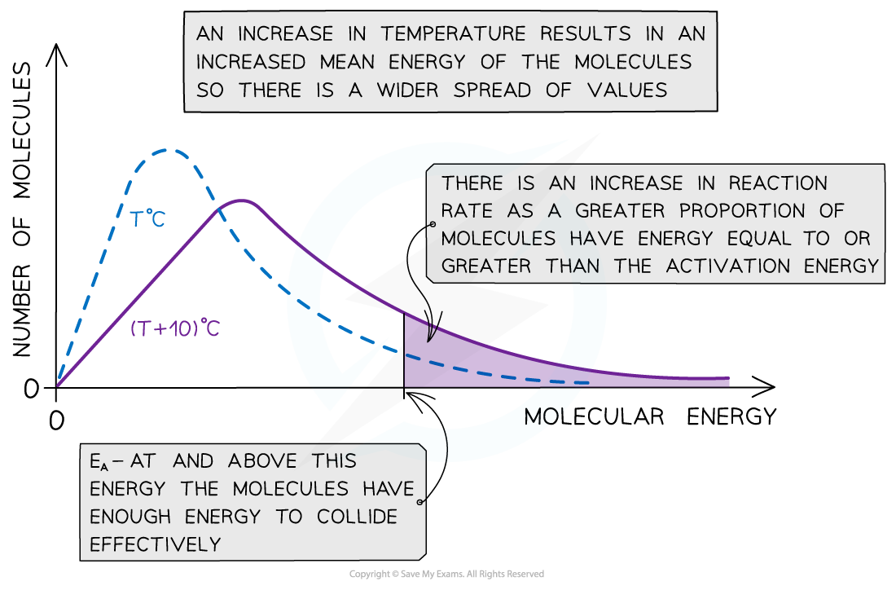
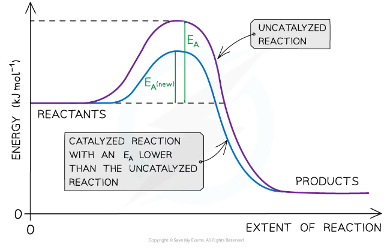
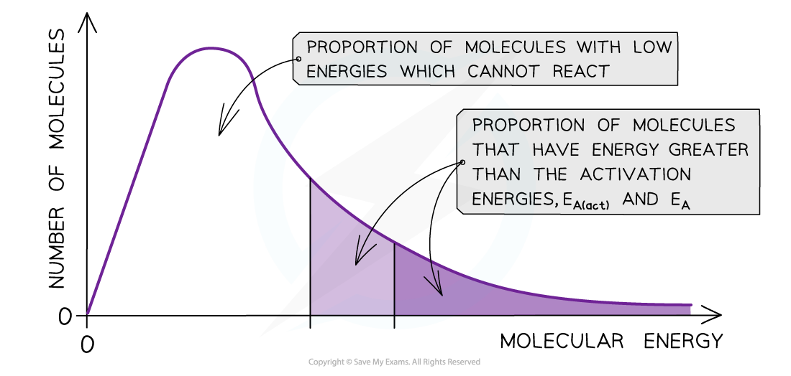

## Temperature Effects

#### Maxwell-Boltzmann distribution curve

* A **Maxwell-Boltzmann distribution curve** is a graph that shows the distribution of **energies** at a certain **temperature**
* In a sample of a gas, a few particles will have very low energy, a few particles will have very high energy, but most particles will have energy in between

***The Maxwell-Boltzmann distribution curve shows the distribution of the energies and the activation energy***

* The graph shows that only a small proportion of molecules in the sample have enough energy for an **effective collision** and for a **chemical reaction** to take place

#### Changes in temperature

* When the temperature of a reaction mixture is increased, the particles gain more kinetic energy
* This causes the particles to move around faster resulting in more **frequent collisions**
* Furthermore, the proportion of **successful collisions** increases, meaning a higher **proportion** of the particles possess the minimum amount of energy (activation energy) to cause a chemical reaction
* With higher temperatures, the Boltzmann distribution curve **flattens** and the peak **shifts** to the right

***The Maxwell-Boltzmann distribution curve at T*** ***o******C and when the temperature is increased by 10*** ***o******C***

* Therefore, an increase in temperature causes an increased rate of reaction due to:

  + There being **more effective collisions** as the particles have **more kinetic energy**, making them move around faster
  + A **greater proportion** of the molecules having **kinetic energy** greater than the **activation energy**

#### Examiner Tips and Tricks

The increase in proportion of molecules having kinetic energy greater than the activation has a greater effect on the rate of reaction than the increase in effective collisions

## Effects of Adding a Catalyst

* **Catalysis** is the process in which the rate of a chemical reaction is increased, by adding a **catalyst**
* A catalyst increases the rate of a reaction by providing the reactants with an **alternative reaction pathway** which is **lower in activation energy** than the uncatalysed reaction
* Catalysts can be divided into two types:

  + Homogeneous catalysts
  + Heterogeneous catalysts
* **Homogeneous** means that the catalyst is in the **same phase** as the reactants

  + For example, the reactants and the catalysts are all in solution
* **Heterogeneous** means that the catalyst is in a **different phase** to the reactants

  + For example, the reactants are gases but the catalyst used is a solid

***The diagram shows that the catalyst allows the reaction to take place through a different mechanism, which has a lower activation energy than the original reaction***

#### Maxwell-Boltzmann distribution curve

* **Catalysts** provide the reactants another pathway which has a lower activation energy
* On the graph below, the original number of successfully reacting particles is shown by the dark shaded area
* By lowering *E**a**,*a **greater proportion**of molecules in the reaction mixture have the activation energy, and therefore have sufficient energy for an **effective collision**

  + This is shown by the combined number of particles in the light and dark shaded areas
* As a result of this, the rate of the catalysed reaction is increased compared to the uncatalysed reaction

***The diagram shows that the total shaded area (both dark and light shading) under the curve shows the number of particles with energy greater than the E******a*** ***when a catalyst is present. This area is much larger than the dark shaded area which shows the number of particles with energy greater than the E******a*** ***without a catalyst***