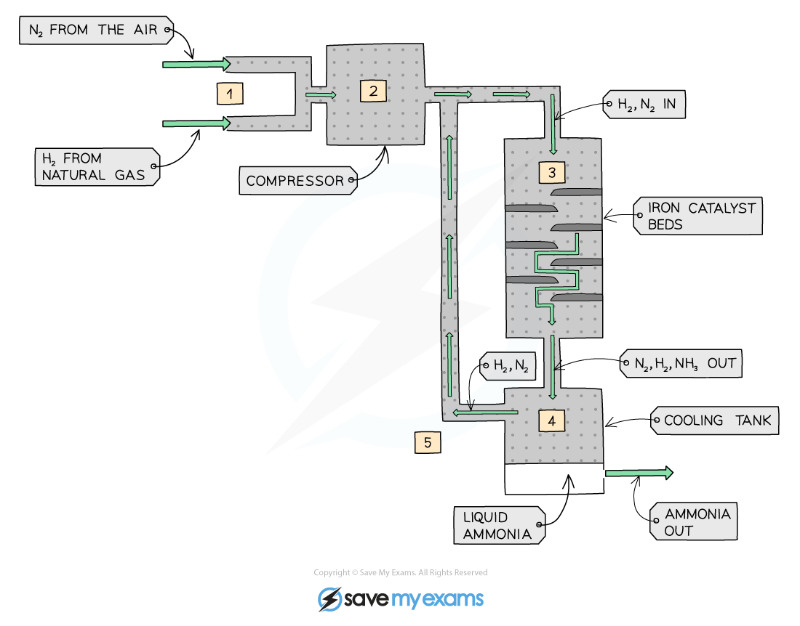

## Catalysts in Industry

* Catalysts can be divided into two types:

  + **Homogeneous** catalysts
  + **Heterogeneous** catalysts
* **Homogeneous** means that the catalyst is in the **same phase** as the reactants

  + For example, the reactants and the catalysts are all in solution
* **Heterogeneous** means that the catalyst is in a **different phase** to the reactants

  + For example, the reactants are gases, but the catalyst used is a solid

* Ammonia production via the **Haber Process** is a classic example of the use of a **heterogeneous catalyst**

**N****2** **(g) + 3H****2** **(g) ⇌ 2NH****3** **(g)**

* The Haber Process occurs in five stages

1. Hydrogen and nitrogen are obtained from natural gas and air respectively and pumped into the compressor

   * The gases are compressed to about 200 atmospheres
   * The pressurised gases, at around 450 oC, are pumped into a tank containing beds of solid **iron** which is a heterogeneouscatalyst, where some of the hydrogen and nitrogen react to form ammonia
   * Unreacted hydrogen, nitrogen and the ammonia product pass into a cooling tank where the ammonia is liquefied and removed
   * The unreacted hydrogen and nitrogen are recycled back into the system and start over again

***The production of ammonia by the Haber Process***

#### Conditions

**Temperature: 450ºC**

* A **higher** temperature favours the reverse reaction as it is endothermic (takes in heat) so a higher yield of **reactants** would be made
* **Lower** temperature favours the forward reaction as it is exothermic (releases heat) so a higher yield of **products** will be made

  + However, at a lower temperature the rate of reaction is very **slow**
* So 450ºC is a compromise temperature between having a **lower yield** of products but being made more quickly

**Pressure: Approximately 20 MPa**

* **Lower** pressure favours the reverse reaction as the system will try to increase the pressure by creating more molecules (4 molecules of gaseous reactants) so a higher yield of **reactants** will be made
* **Higher** pressure favours the forward reaction as it will try to decrease the pressure by creating less molecules (2 molecules of gaseous products) so a higher yield of **products** will be made
* However, high pressures can be dangerous and very expensive equipment is needed
* So, 20 MPa is a **compromise** pressure between a lower yield of products being made **safely** and **economically**

**Catalyst**

* A catalyst of iron is used to speed up the reaction
* Without a catalyst, the required temperature and pressure for the Haber Process would be much higher, more dangerous, more expensive and less environmentally friendly

The mode of action of the iron catalyst is as follows:

* Diffusion of the nitrogen and hydrogen gas to the iron surface
* **Ad**sorption of the reactant molecules onto the iron surface by forming bonds between the iron and reactant atoms

  + These bonds are so strong that they weaken the covalent bonds between the nitrogen atoms in N2 and hydrogen atoms in H2
  + But they are weak enough to break when the catalysis has been completed
* The reaction takes place between the adsorbed nitrogen and hydrogen atoms which react with each other on the iron surface to form NH3
* Desorption occurs when the bonds between the NH3 and iron surface are weakened and eventually broken
* The formed NH3 diffuses away from the iron surface

#### Benefits of catalysts

* Catalysts speed up the rate of reaction, meaning the use of a catalyst may mean lower temperatures and pressures can be used

  + This can save energy costs as there is reduced energy demand for providing high temperatures and less electrical pumping costs for producing the high pressures usually required
  + This can mean fewer CO2 emissions from burning fossil fuels
* Catalysts can also enable different reactions to be used, with better atom economy and with reduced waste, or fewer undesired products or less use of hazardous solvents and reactants
* Catalysts are often enzymes, generating very specific products, and operating effectively close to room temperature and pressure

#### Examiner Tips and Tricks

You should be able to apply the arguments shown above to any potential reaction with supporting information to explain the overall effects of changing reaction conditions as well as the benefits of using a catalyst

The effectiveness of a heterogenous catalyst can be decreased by the presence of impurities in the gas involved in the reaction.

The impurities can:

* Adsorb onto catalyst surface and occupy active sites
* Prevent bond weakening in the reactants
* 'Take up' the surface area of catalyst by forming strong bonds to surface of catalyst so are less likely to desorb from surface of catalyst