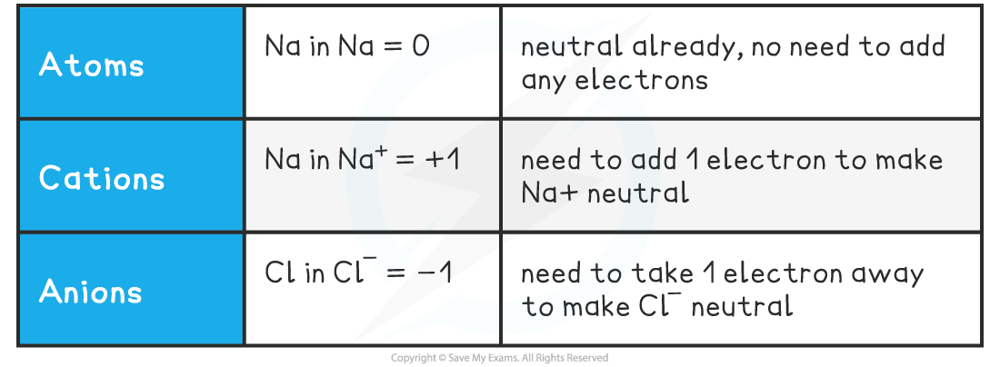
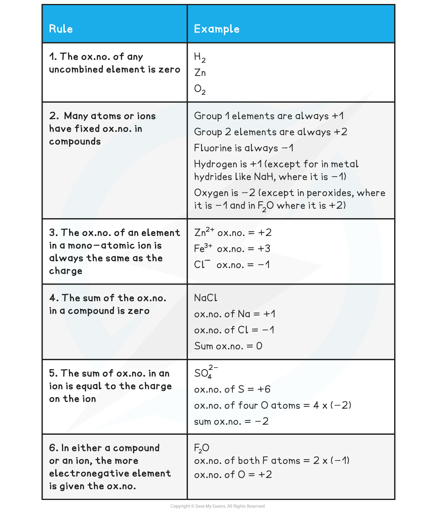
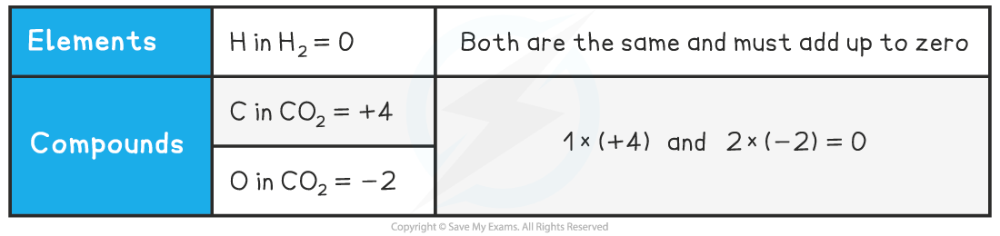
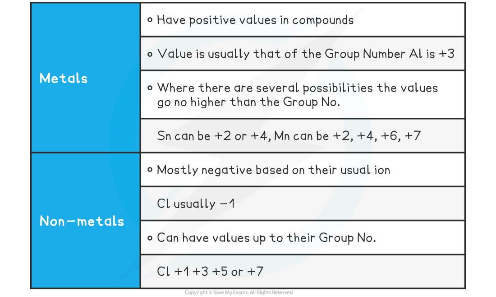

## Defining Oxidation Number

* There are three definitions of **oxidation** and **reduction**  used in different branches of chemistry
* **Oxidation** and **reduction** can be used to describe any of the following processes

**Definitions and Examples of Oxidation & Reduction**

***Use the acronym "Oil Rig" to help you remember the definitions of oxidation and reduction***

#### Oxidation Number

* Theoxidation number of an atom is the charge that would exist on an individual atom if the bonding were completely ionic
* It is like the electronic ‘status’ of an element
* Oxidation numbers are used to

  + Tell if oxidation or reduction has taken place
  + Work out what has been oxidised and/or reduced
  + Construct half equations and balance redox equations

**Oxidation Numbers of Simple Ions**

#### Worked Example

What are the oxidation numbers of the elements in the following species?

a) C                b)  Fe3+                       c)  Fe2+

d) O2-             e)  He                          f)  Al3+

**Answers:**

a) 0     b) +3    c) +2

d) -2    e) 0      f) +3

* So, in simple ions, the oxidation numbers of the atom is the charge on the ion:

  + Na+, K+, H+ all have an oxidation number of +1
  + Mg2+, Ca2+, Pb2+ all have an oxidation number of +2
  + Cl–, Br–, I– all have an oxidation number of -1
  + O2-, S2- all have an oxidation number of -2

* Roman numerals are also used to indicate the oxidation state of ions

  + Iron(II) sulfate implies that the iron is in a +2 oxidation state, i.e. Fe2+
  + Iron(III) sulfate implies that the iron is in a +3 oxidation state, i.e. Fe3+
* More complicated examples include other atoms / ions as part of the formula

  + Potassium manganate(VII) implies that the manganese is in a +7 oxidation
  + Potassium manganate(VII) contains the potassium ion K+ and the manganate ion MnO4–

    - Since the oxygen in the manganate ion is in the -2 oxidation state, there is a total of -8 from the oxygen
    - The manganate ion has an overall -1 charge, which means that the manganese ion must be in the +7 oxidation state

## Calculating Oxidation Numbers

#### Oxidation Number Rules

* A few simple rules help guide you through the process of determining the oxidation number of any element
* Remember, you are determining the oxidation number of a *single* atom
* The oxidation number (ox.no.) refers to a *single* atom in a compound

**Oxidation Number Rules Table**

Molecules or Compounds In molecules or compounds, the sum of the oxidation numbers on the atoms is zero

**Oxidation Number in Molecules or Compounds**

* Because CO2 is a neutral molecule, the sum of the oxidation numbers must be zero
* For this, one element must have a positive oxidation number and the other must be negative

**How do you determine which is the positive one?**

* The more electronegative species will have the negative value
* Electronegativity increases across a period and decreases down a group
* O is further to the right than C in the periodic table so it has the negative value

**How do you determine the value of an element’s oxidation number?**

* From its position in the periodic table and / or
* The other element(s) present in the formula
* The oxidation numbers of all other atoms in their compounds can vary
* By following the oxidation number rules, the oxidation number of any atom in a compound or ion can be deduced
* The position of an element in the periodic table can act as a guide to the oxidation number

**Oxidation Numbers & the Periodic Table**

