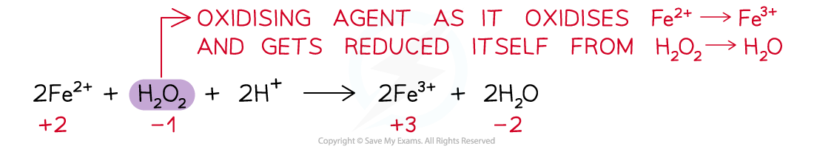

## Electron Transfer & Change in Oxidation Number

* Oxidation and reduction in a reaction can be demonstrated in terms of electron transfer

  + For example:

**2NH****3** **+ 3Br****2** **→ N****2** **+ 6HBr**

* The oxidation number of N in NH3 has changed from -3 to 0

  + As the oxidation number has increased, nitrogen has been oxidised
* The oxidation number of Br has changed from 0 to -1

  + As the oxidation number has decreased, bromine has been reduced
* Overall, nitrogen has reduced bromine by donating electrons

## Oxidising & Reducing Agents

#### Oxidising agent

* **An oxidising agent** is a substance that **oxidises** another atom or ion by causing it to lose electrons
* An oxidising agent itself gets **reduced – gains electrons**
* Therefore, the **ox. no.** of the oxidising agent **decreases**

***Example of an oxidising agent in a chemical reaction***

#### Reducing agent

* **A reducing agent** is a substance that **reduces** another atom or ion by causing it to gain electrons
* A reducing agent itself gets **oxidised – loses / donates electrons**
* Therefore, the **ox.** **no.** of the reducing agent **increases**

***Example of a reducing agent in a chemical reaction***

* For a reaction to be recognised as a redox reaction, there must be both an oxidising and reducing agent
* Some substances can act both as oxidising and reducing agents
* Their nature is dependent upon what they are reacting with and the reaction conditions

#### Worked Example

Four reactions are shown.

In which reaction is the species in bold acting as an oxidising agent?

1. Cr2O72- + 8H+ + **3SO****3****2-** → 2Cr3+ + 4H2O + 3SO42-
2. Mg + **Fe****2+**→ Mg2+ + Fe
3. Cl2 + **2Br****-** → 2Cl- + Br2
4. Fe2O3 + **3CO** → 2Fe + 3CO2

**Answer:**

* The correct option is 2

  + Oxidising agents are substances that oxidise other species, gain electrons and are themselves reduced.
  + Write down the oxidation numbers of each species in the reaction

|  |  |  |  |  |  |  |
| --- | --- | --- | --- | --- | --- | --- |
| 0 |  | +2 |  | +2 |  | 0 |
| Mg | + | Fe2+ | → | Mg2+ | + | Fe |

* In equation 2, Fe2+ oxidises Mg(0) to Mg2+(+2) and is itself reduced from Fe2+(+2) to Fe(0)

#### Examiner Tips and Tricks

* Some exam questions will ask for the strongest or weakest reducing / oxidising agent
* The strongest reducing agent comes from the equation with the most negative electrode potential

  + **Remember:** A reducing agent is itself oxidised
  + So, it will lose electrons / increase in oxidation number
* The strongest oxidising agent comes from the equation with the most positive electrode potential

  + **Remember:** An oxidising agent is itself reduced
  + So, it will gain electrons / decrease in oxidation number