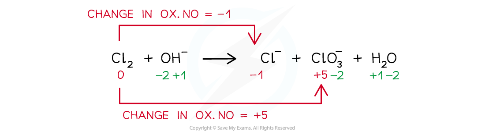

## Disproportionation

#### Disproportionation reactions

* A **disproportionation** **reaction** is a reaction in which the same species is simultaneously oxidised and reduced

***Example of a disproportion reaction in which the same species (chlorine in this case) has been both oxidised and reduced***

## Using Oxidation Numbers

#### Worked Example

**Balancing disproportionation reactions**

Balance the disproportionation reaction which takes place when chlorine is added to hot concentrated aqueous sodium hydroxide. The products are Cl- and ClO3- ions and water

**Answer**

**Step 1:** Write the unbalanced equation and identify the atoms that change in oxidation number:

**Step 2:** Deduce the oxidation number changes:

**Step 3:** Balance the oxidation number changes:

**Step 4:** Balance the charges

**Step 5:** Balance the atoms

#### Worked Example

**Oxidation and reduction**

In each of the following equations, state which reactant has been oxidised and which has been reduced.

1. **Na****+****+ Cl****-** **→  NaCl**
2. **Mg + Fe****2+****→  Mg****2+** **+ Fe**
3. **CO + Ag****2****O  →  2Ag + CO****2**

**Answer 1:**

* Oxidised: Cl- as the oxidation state has increased by 1

  + Reduced: Na+ as the oxidation state has decreased by 1

**Answer 2:**

* Oxidised: Mg as the oxidation state has increased by 2

  + Reduced: Fe2+ as the oxidation state has decreased by 2

**Answer 3:**

* Oxidised: C as it has gained oxygen

  + Reduced: Ag as it has lost oxygen