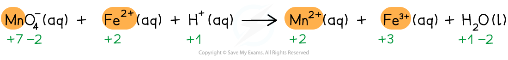

## Writing Chemical Formulae

* Oxidation numbers are a useful tool for naming compounds as some elements can exist with more than one oxidation number
* For compound with two elements it is straight forward to name the compound
* For example

  + PCl3 is phosphorus(III) chloride or phosphorus trichloride
  + PCl5 is phosphorus(V) chloride or phosphorus pentachloride
  + OF2is oxygen difluoride
  + O2F2 is dioxygen difluoride
* In order to name a more complete compound we use Roman numerals for the element that has a variable oxidation number

  + K2CrO4 potassium chromate(VI)

#### Worked Example

Can you name these metal compounds?

1. Cu2O
2. MnSO4
3. Na2CrO4
4. KMnO4
5. Na2Cr2O7

**Answer:**

**Answer 1: copper(I) oxide**:

The ox. no. of 1 O atom is -2 and Cu2O has overall no charge so the ox. no. of Cu is +1

**Answer 2:** **manganese(II) sulfate**:

The charge on the sulfate ion is -2, so the charge on Mn and ox. no. is +2

**Answer 3: sodium chromate(VI)**:

The ox. no. of 2 Na atoms is +2 so CrO4 has an overall -2 charge, so the ox. no. of Cr is +6

**Answer 4:** **potassium manganate(VII)**:

The ox. no. of a K atom is +1 so MnO4 has overall -1 charge, so the ox. no. of Mn is +7

**Answer 5: sodium dichromate(VI)**:

The ox. no. of 2 Na atoms is +2 so Cr2O7 has an overall -2 charge, so the ox. no. of Cr is +6. To distinguish it from CrO4 we use the prefix di in front of the anion

## Ionic Half-Equations

#### Balancing full ionic equations

* Balancing equations using redox principles is a useful skill and is best illustrated by following an example
* It is important to follow a methodical step-by-step approach so that you don't get lost:

#### Worked Example

**Writing overall redox reactions**

Manganate(VII) ions (MnO4- ) react with Fe2+ ions in the presence of acid (H+) to form Mn2+ ions, Fe3+ ions and water

Write the overall redox equation for this reaction

**Answer**

**Step 1:** Write the unbalanced equation and identify the atoms which change in oxidation number

**Step 2:** Deduce the oxidation number changes

**Step 3:** Balance the oxidation number changes

**Step 4:** Balance the charges

**Step 5:** Finally, balance the atoms

## Metals & Non-metals

#### Metals

* Metals, in general, will form positive ions by losing electrons
* Therefore, they are **oxidised** and the oxidation number **increases**
* Example 1:

  + When sodium reacts with water, sodium hydroxide and hydrogen gas is formed

**2Na (s) + H****2****O (l) → 2NaOH (aq) + H****2****(g)**

* The oxidation number of sodium changes from 0 to +1
* Example 2:

  + When magnesium reacts with hydrochloric acid, magnesium chloride and hydrogen gas is formed

**Mg (s) + 2HCl (l) → MgCl****2** **(aq) + H****2****(g)**

* The oxidation number of magnesium changed from 0 to +2

#### Non-metals

* Non-metals, in general, will form negative ions by gaining electrons
* Therefore, they are **reduced** and the oxidation number **decreases**
* Example:

  + When sodium reacts with oxygen, sodium oxide is formed

**4Na (s) + O****2** **(g) → Na****2****O (s)**

* The oxidation number of oxygen changes from 0 to -2