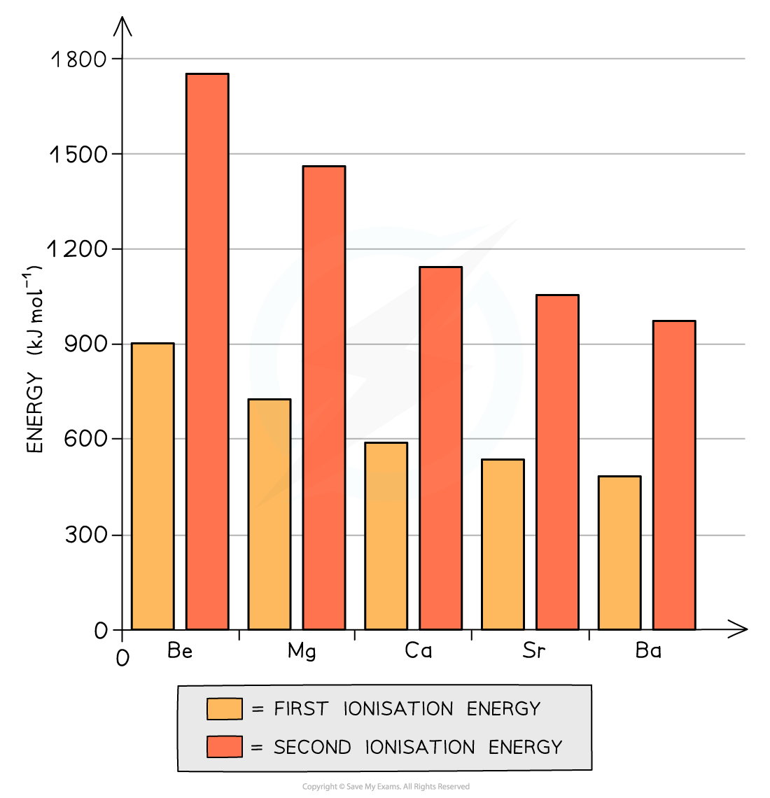

## Ionisation Energy

#### Chemical trends

* All elements in Group 2 (also called **alkali earth metals)** have two electrons in their **outermost principal quantum shell**
* All Group 2 metals can form **ionic** **compounds** in which they donate these **two outermost electrons** (so they act as **reducing agents)** to become an ion with +2 charge (so they themselves become **oxidised)**
* Going down the group, the metals become more **reactive**
* This can be explained by looking at the Group 2 ionisation energies:

***The graph shows that both the first and second ionization energies decrease going down the group***

* The **first ionisation energy** is the energy needed to remove the first outer electron of an atom
* The **second ionisation energy** is the energy needed to remove the second outer electron of an atom
* The graph above shows that going down the group, it becomes easier to remove the outer two electrons of the metals
* Though the **nuclear charge** increases going down the group (because there are more protons), factors such as an **increased shielding effect** and a **larger distance** between the outermost electrons and nucleus outweigh the attraction of the higher nuclear charge

## Group 2 Reactivity

* As a result of the deceases in ionisation energy, the elements become **more reactive** going down the group as it gets easier for the atoms to lose two electrons and become 2+ ions
* This trend is shown by looking at reactions of the Group 2 metals:

  + With dilute hydrochloric acid: **bubbles** of **hydrogen gas** are given off much faster indicating that the reactions become more vigorous
  + For example:

**Mg (s) + 2HCl (aq) → MgCl****2****(aq) + H****2****(g)**

* With oxygen: the metals get more reactive with oxygen down the group (Ba is so reactive, that it must be stored in oil to prevent it from reacting with oxygen in air)

**2Mg (s) + O****2** **(g) → 2MgO (s)**