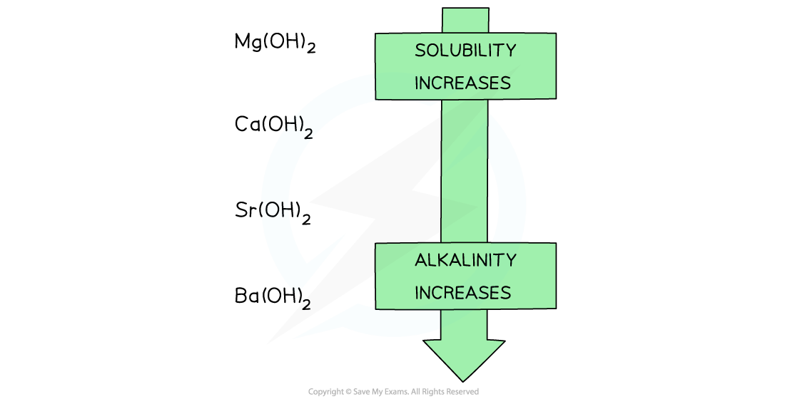
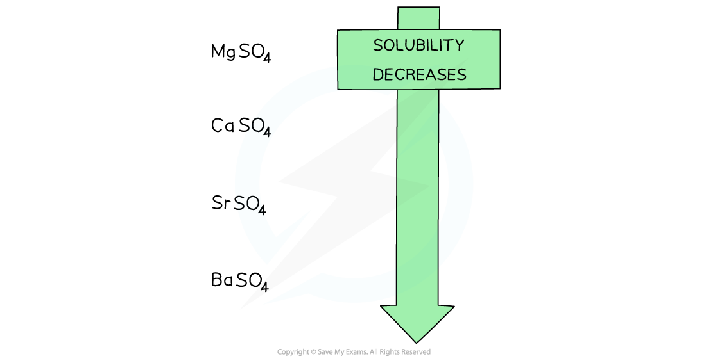

## Group 2 Hydroxides & Sulfates

#### Group 2 hydroxides

* Going down the group, the solutions formed from the reaction of Group 2 oxides with water become more **alkaline**
* When the oxides are dissolved in water, the following ionic reaction takes place:

**O****2-** **(aq) + H****2****O(l) → 2OH****-** **(aq)**

* The higher the **concentration** of OH- ions formed, the more **alkaline** the solution
* The **alkalinity** of the formed solution can therefore be explained by the **solubility** of the Group 2 **hydroxides**

**Solubility of the Group 2 hydroxides table**

| **Group 2 hydroxide** | **Solubility at 298 K** **(mol / 100 g of water)** |
| --- | --- |
| **Mg(OH)****2** | 2.0 x 10–5 |
| **Ca(OH)****2** | 1.5 x 10–3 |
| **Sr(OH)****2** | 3.4 x 10–3 |
| **Ba(OH)****2** | 1.5 x 10–2 |

* The hydroxides dissolve in water as follows:

**X(OH)****2** **(aq) → X(aq) + 2OH****-** **(aq)**

Where X is the Group 2 element

* When the metal oxides react with water, a Group 2 hydroxide is formed
* Going down the group, the **solubility** of these hydroxides **increases**
* This means that the **concentration** of OH- ions **increases,** increasing the pH of the solution
* As a result, going down the group, the **alkalinity** of the solution formed increases when Group 2 oxides react with water

***Going down the group, the solubility of the hydroxides increases which means that the solutions formed from the reactions of the Group 2 metal oxides and water become more alkaline going down the group***

#### Group 2 sulfates

* The solubility of the Group 2 sulfates decreasing going down the group

***Going down the group, the solubility of the sulfates decreases***

#### Worked Example

**Predicting properties of radium**

Radium (Ra) is a radioactive element found below barium at the bottom of group 2.

Applying your knowledge of the group 2 elements, predict:

1. The formula of the ion formed by Ra.
2. The formulae of its oxide and hydroxide
3. Its first ionisation energy
4. Its reactivity compared with barium
5. The relative pH of its saturated hydroxide solution compared with a saturated solution of calcium hydroxide
6. The solubility of its sulfate compared to strontium sulfate
7. The equation for the reaction of its solid oxide with dilute hydrochloric acid
8. What would you expect to see if you mixed radium hydroxide solution with dilute sulfuric acid?

**Answers:**

1. The formula of the ion formed by Ra.

   * Since, Ra is in group 2, it will form an ion with +2 charge to give Ra2+
2. The formulae of its oxide and hydroxide.

   * The group 2 oxides and hydroxides have general formula XO and X(OH)2 respectively where X is the group 2 element.
   * Therefore, radium oxide is RaO and radium hydroxide is Ra(OH)2
3. Its first ionisation energy.

   * Radium is below barium so its atomic radius is larger than the atomic radius of barium.
   * This means that radium’s outermost electrons are even further away and are therefore even more easily removed than barium’s outermost electron pair.
   * The first ionization energy is between 450-480 kJ mol-1
4. Its reactivity compared with barium.

   * Radium’s outermost electrons are even further away than in barium and are therefore more easily removed making radium more reactive than barium.
5. The relative pH of its saturated hydroxide solution compared with a saturated solution of calcium hydroxide.

   * The group 2 hydroxides become more soluble going down the group.
   * Radium hydroxide will therefore be more soluble than calcium hydroxide. Since more hydroxide ions will be present in solution the pH should be higher than the pH of calcium hydroxide
6. The solubility of its sulfate compared to strontium sulfate.

   * The Group 2 sulfates become less soluble going down the group.
   * Radium sulfate will therefore be less soluble than strontium sulfate.
7. The equation for the reaction of its solid oxide with dilute hydrochloric acid.

   * The general equation for the reaction of group 2 oxides with dilute hydrochloric acid is:

     + **XO (s) + 2HCl (aq) → XCl****2** **(aq) + H****2****O (l)**
   * The reaction of radium oxide with dilute hydrochloric acid is therefore:

     + **RaO (s) + 2HCl (aq) → RaCl****2****(aq) + H****2****O (l)**
8. What would you expect to see if you mixed radium hydroxide solution with dilute sulfuric acid?

* Radium sulfate will be formed in this reaction, however the solubility of group 2 sulfates decreases going down the group, therefore a white precipitate of radium sulfate will be formed in this reaction

#### Examiner Tips and Tricks

You may be wondering why there are no trends here for the solubility of Group 1 hydroxides and sulfates. You should recall from GCSE that Group 1 compounds are all soluble in water. They will therefore not produce any precipitates when testing for cations, so to identify them you need to use flame tests.

Group 1 hydroxides will be more soluble than Group 2 hydroxides. Even though we say the solubility of the Group 2 hydroxides increases down the group barium hydroxide is less soluble than a Group 1 hydroxide such as potassium hydroxide.

At 25 °C the solubility of **Ba(OH)****2** is 4.68 g / 100 cm3

At 25 °C the solubility of **KOH** is 121 g / 100 cm3