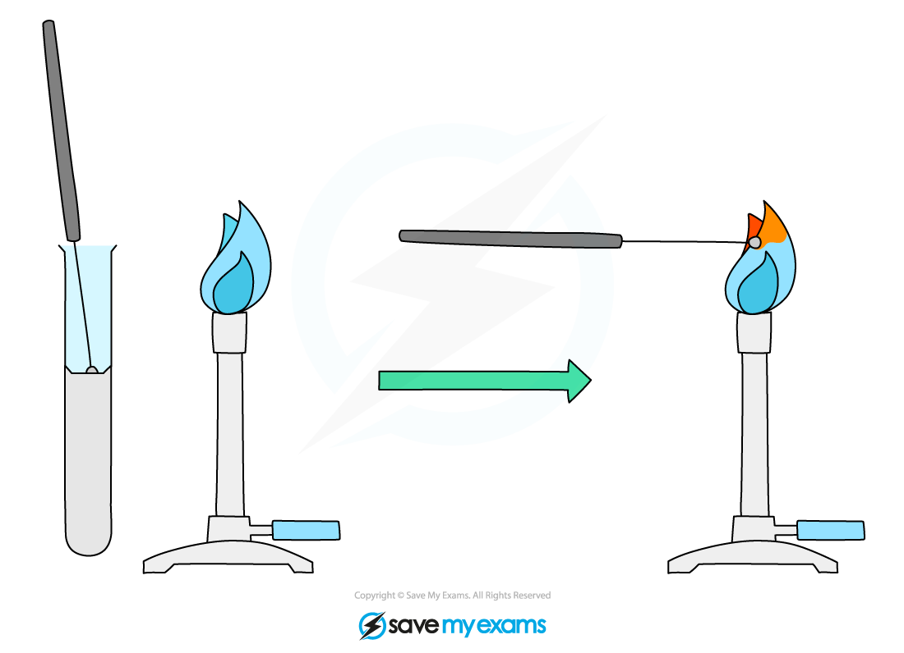
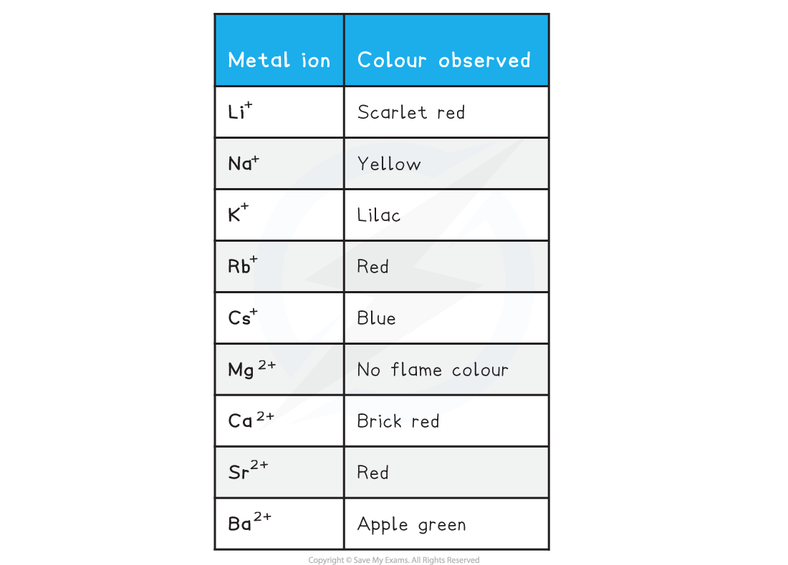

## Flame Tests

* Metal ions produce a **colour** if heated strongly in a flame
* Ions from **different** metals produce **different** **colours**
* The flame test is thus used to identify metal ions by the colour of the flame they produce
* Dip the loop of an **unreactive** metal wire such as nichrome or platinum in concentrated acid, and then hold it in the blue flame of a Bunsen burner until there is no colour change
* This cleans the wire loop and avoids **contamination**

  + This is an important step as the test will only work if there is just **one type** of ion present
  + Two or more ions means the colours will mix, making identification erroneous
* Dip the loop into the solid sample and place it in the edge of the **blue** Bunsen flame
* Avoid letting the wire get so hot that it glows red otherwise this can be confused with a flame colour

***Diagram showing the technique for carrying out a flame test***

#### Explanation for the occurrence of the flame

* In a flame test the heat causes the electron to move to a higher energy level
* The electron is unstable at this energy level so falls back down
* As it drops back down from the higher to a lower energy level, energy is emitted in the form of visible light energy with the wavelength of the observed light

**Colours observed in flame tests**

* Why does Mg2+not have an observed colour?

  + The energy emitted during a flame test involving magnesium is outside the visible spectrum