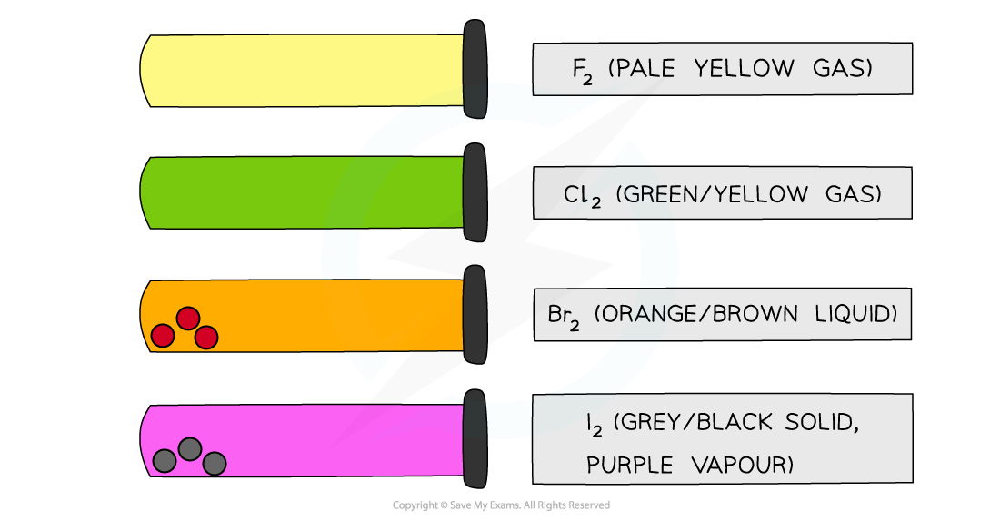
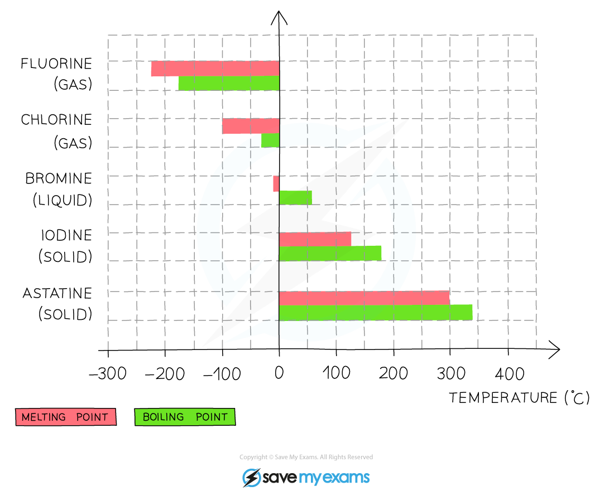
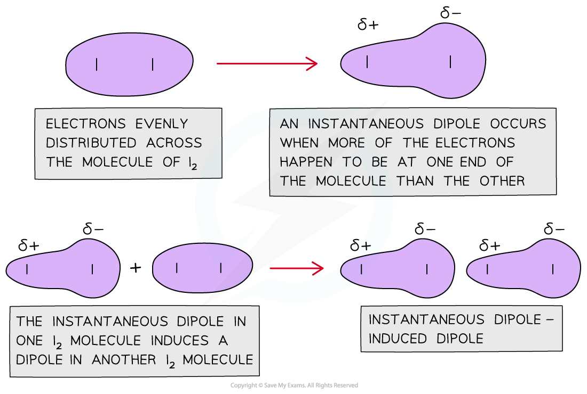
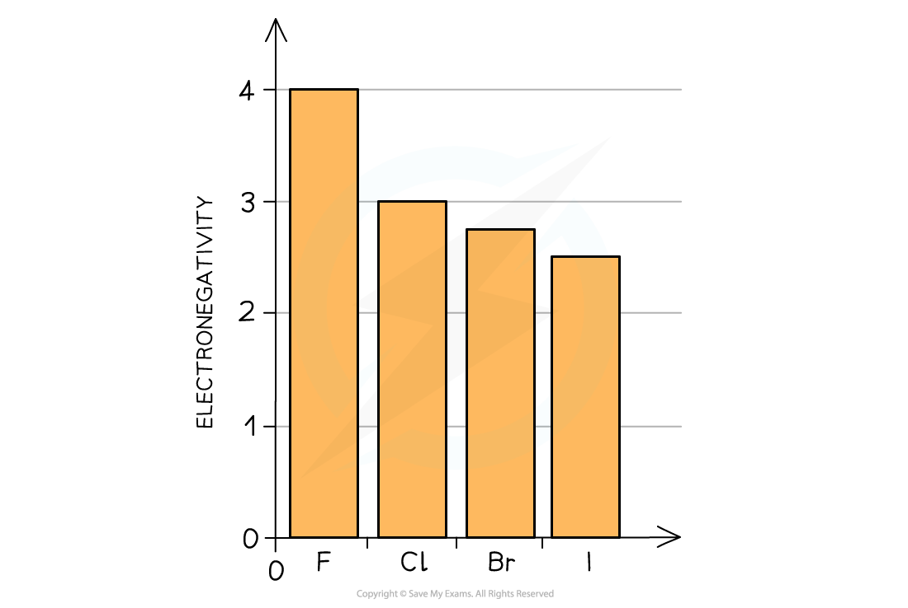
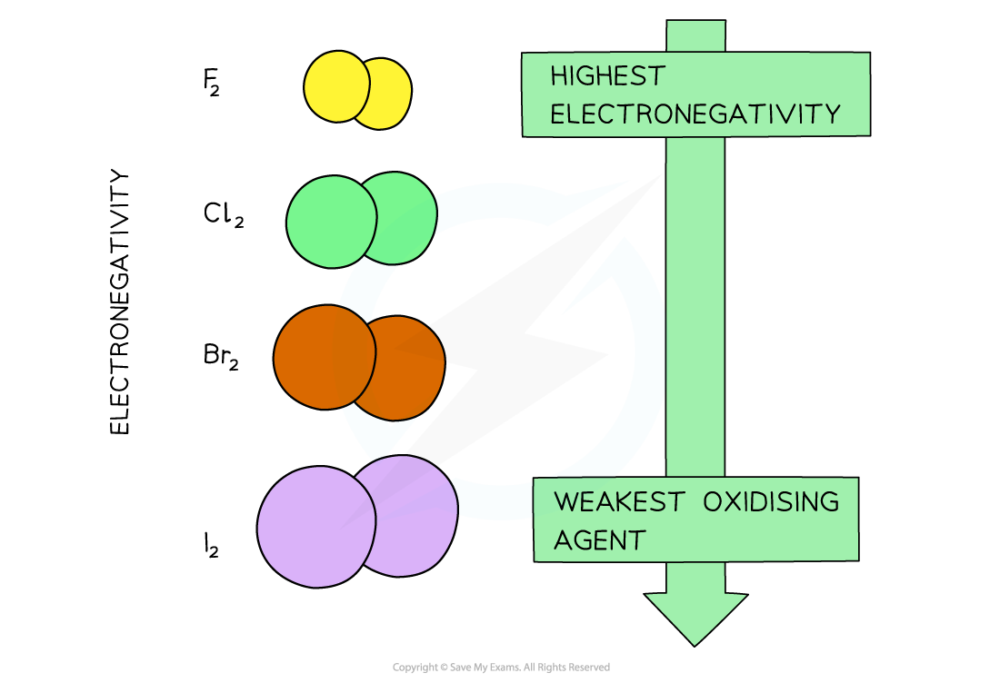
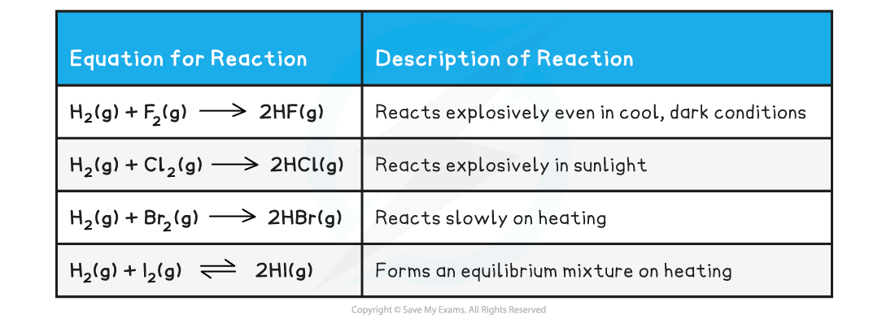
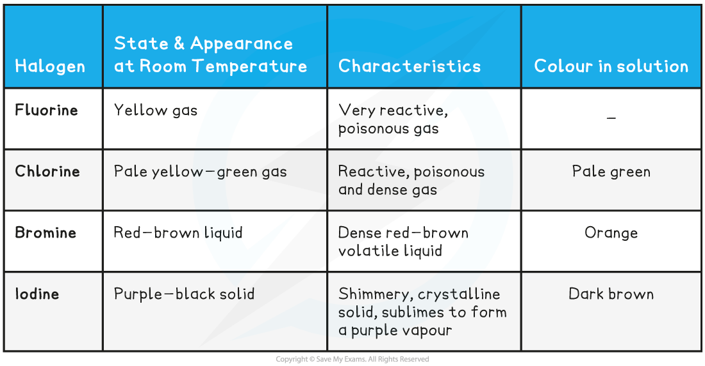

## Physical Properties

* The Group 7 elements are called **halogens**
* The halogens have uses in water purification and as bleaching agents (chlorine), as flame-retardants and fire extinguishers (bromine) and as antiseptic and disinfectant agents (iodine)

#### Colours

* All halogens have distinct **colours** which get **darker** going down the group

***The colours of the Group 7 elements get darker going down the group***

#### Volatility

* **Volatility** refers to how easily a substance can evaporate

  + A volatile substance will have a low boiling point

***The melting and boiling points of the Group 7 elements increase going down the group which indicates that the elements become less volatile***

* Going down the group, the **boiling point** of the elements increases which means that the **volatility** of the halogens decreases

  + This means that fluorine is the most volatile and iodine the least volatile

#### Trend in melting and boiling points

* Halogens are non-metals and are **diatomic molecules** at room temperature

  + This means that they exist as molecules which are made up of two similar atoms, such as F2
* The halogens are **simple molecular structures** with **weak** London dispersion forces between the diatomic molecules caused by instantaneous dipole-induced dipole forces

***The diagram shows that a sudden imbalance of electrons in a nonpolar molecule can cause an instantaneous dipole. When this molecule gets close to another non-polar molecule it can induce a dipole as the cloud of electrons repel the electrons in the neighbouring molecule to the other side***

* The more **electrons** there are in a molecule, the greater the instantaneous dipole-induced dipole forces
* Therefore, the **larger** the molecule the **stronger** the London dispersion forces between molecules
* This is why as you go down the group, it gets more difficult to separate the molecules and the **melting** and **boiling points** increase
* As it gets more difficult to separate the molecules, the **volatility** of the halogens **decreases** going down the group

#### Trend in electronegativity

* The electronegativity of the halogens decreases down the group

  

***The electronegativity of the halogens decreases going down the group***

* The **electronegativity** of an atom refers to how strongly it attracts electrons towards itself in a covalent bond
* The decrease in electronegativity is linked to the size of the halogens
* Going down the group, the atomic radii of the elements increase which means that the outer shells get further away from the nucleus
* An ‘incoming’ electron will therefore experience more **shielding** from the attraction of the positive nuclear charge
* The halogens’ ability to accept an electron (their **oxidising power**) therefore decreases going down the group

***With increasing atomic size of the halogens (going down the group) their electronegativity, and therefore oxidising power, decreases***

## Group 7 Reactivity

#### Reactivity

* When a halogen atom reacts it will usually gain an electron, to form a **1-** ion (X + e- → X-)
* The oxidation number has decreased from 0 to -1, therefore reduction has occurred
* Therefore, halogens will act as oxidising agents
* Down Group 7 we have seen that the atoms become larger so the outer electrons are further away and are therefore more shielded from the positive nucleus
* Larger halogen atoms such as iodine will find it more difficult to attract incoming electrons needed to form the 1- ion
* Therefore the reactivity decreases down Group 7

**Reaction with hydrogen**

* To demonstrate the decrease in the reactivity we can look a the reaction with hydrogen gas
* The table outlines the trend in the reactivity of the halogens with hydrogen gas
* As we can see the reaction becomes less vigorous down the group

**Reaction between Halogen & Hydrogen Gas**

## Making Predictions

#### Making Predictions

* **Boiling and melting point**

  + Increases down the group
* **Colour**

  + Appear darker in colour down the group

**The Appearance, Characteristics and Colour in Solution of the Halogens**

